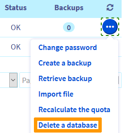
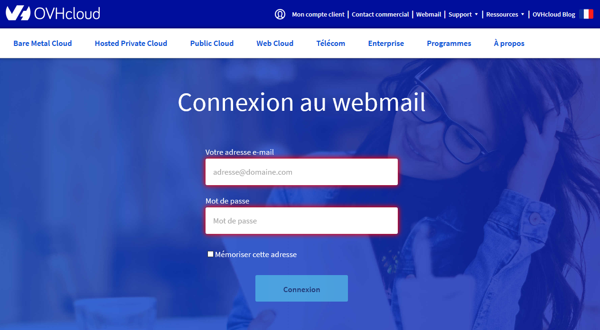
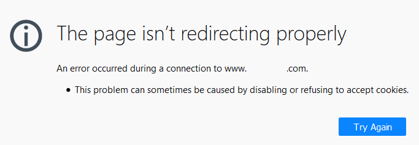

> [!primary]
> Tłumaczenie zostało wygenerowane automatycznie przez system naszego partnera SYSTRAN. W niektórych przypadkach mogą wystąpić nieprecyzyjne sformułowania, na przykład w tłumaczeniu nazw przycisków lub szczegółów technicznych. W przypadku jakichkolwiek wątpliwości zalecamy zapoznanie się z angielską/francuską wersją przewodnika. Jeśli chcesz przyczynić się do ulepszenia tłumaczenia, kliknij przycisk „Zaproponuj zmianę” na tej stronie.
>

**Ostatnia aktualizacja z dnia 07-04-2022**

## Zarządzanie usługą

### W jaki sposób skonfigurować moją usługę hostingu?

W celu skonfigurowania Twojej usługi hostingu, udaj się najpierw do Twojego [panelu klienta OVHcloud](https://www.ovh.com/auth/?action=gotomanager&from=https://www.ovh.pl/&ovhSubsidiary=pl). W sekcji `Hosting` możesz zarządzać certyfikatami SSL, wersjami PHP, opcją CDN, stronami podpiętymi w opcji MultiSite, bazami danych, itp.

**Wskazówki i porady**: Aby pomóc Ci w skonfigurowaniu Twojego hostingu, zapoznaj się z sekcją "*Pierwsze kroki*", którą zobaczysz [tutaj](https://docs.ovh.com/pl/hosting/).

### Jak zarządzać swoimi hasłami?

Aby zarządzać swoimi hasłami, musisz najpierw zalogować się do Twojego [panelu klienta OVHcloud](https://www.ovh.com/auth/?action=gotomanager&from=https://www.ovh.pl/&ovhSubsidiary=pl). Jeżeli nie pamiętasz swojego loginu lub hasła, kliknij opcję `Nie pamiętasz identyfikatora klienta lub hasła?`{.action} znajdującą się pod okienkiem logowania. Zostanie do Ciebie wysłana wiadomość e-mail z procedurą przywracania danych.

Zapoznaj się również z przewodnikiem [Tworzenie i zarządzanie hasłem do konta](https://docs.ovh.com/pl/customer/zarzadzanie-haslem/).

Po zalogowaniu się do Panelu klienta:

- Aby zmienić hasło do przestrzeni FTP, zapoznaj się z instrukcjami zawartymi w [tym przewodniku](https://docs.ovh.com/pl/hosting/zmiana-hasla-konto-ftp/).
- Aby zmienić hasło do bazy danych, zapoznaj się z instrukcjami zawartymi w [tym przewodniku](https://docs.ovh.com/pl/hosting/zmiana-hasla-do-bazy-danych/).
- Aby zmienić hasło do Twojego konta e-mail MX Plan, postępuj zgodnie z instrukcjami zawartymi w [tym przewodniku](https://docs.ovh.com/pl/emails/zmiana-hasla-do-konta-email/).

### Jak umieścić moją stronę w internecie? 

Aby uruchomić Twoją stronę WWW w Internecie, musisz posiadać [Domeny](https://www.ovhcloud.com/pl/domains/) odpowiadającą adresowi WWW, z którego będzie ona dostępna (na przykład: *mojadomena.com*). Będziesz również potrzebował [hostingu](https://www.ovhcloud.com/pl/web-hosting/), na którym będziesz mógł zainstalować Twoją stronę.

Aby dowiedzieć się, jak budować Twoją stronę, zapoznaj się z tym [przewodnikiem](https://www.ovhcloud.com/pl/web-hosting/uc-website/), a następnie postępuj zgodnie z instrukcjami zawartymi w przewodniku [Uruchomienie strony WWW na hostingu](https://docs.ovh.com/pl/hosting/hosting_www_umieszczenie_strony_w_internecie/).

**Wskazówki i porady**: OVHcloud, aby pomóc Ci w zbudowaniu strony WWW, modułu PrestaShop, Joomla! i Drupal, pozwala na zainstalowanie na Twoim hostingu oprogramowania do wspomagania tworzenia stron WordPress, PrestaShop, Joomla! i Drupal. Jest to możliwe dzięki funkcji [Moduły za 1 kliknięciem](https://docs.ovh.com/pl/hosting/hosting_www_przewodniki_dotyczace_modulow_na_hostingu_www/).

### Jak mogę przenieść moją stronę WWW i konta e-mail na serwery OVHcloud? 

Zapoznaj się z przewodnikiem [Przeniesienie strony WWW i kont e-mail do OVHcloud](https://docs.ovh.com/pl/hosting/przeniesienie-strony-www-do-ovh/).

### Jak zainstalować kilka stron WWW na tym samym hostingu?

Zapoznaj się z przewodnikiem [Instalacja kilku stron WWW na jednym hostingu](https://docs.ovh.com/pl/hosting/konfiguracja-multisite-na-hostingu/) na jednym hostingu.

### Jak zmienić formułę hostingu?

> [!primary]
>
> Aby zamówić ofertę hostingu WWW dostosowaną do Twoich potrzeb, sprawdź [tę stronę](https://www.ovhcloud.com/pl/web-hosting/).
>

Aby zmienić [ofertę hostingu](https://www.ovhcloud.com/pl/web-hosting/) w [Panelu klienta OVHcloud](https://www.ovh.com/auth/?action=gotomanager&from=https://www.ovh.pl/&ovhSubsidiary=pl), kliknij `Web Cloud`{.action}, a następnie `Hosting`{.action}. Wybierz odpowiedni hosting, a następnie w sekcji `Abonament` kliknij przycisk `...`{.action} w sekcji `Usługa`, a następnie `Zmień ofertę`{.action}.

Następnie wybierz nową ofertę hostingu oraz czas trwania nowego abonamentu. Zapoznaj się z odpowiednimi regulaminami i kliknij `Wyślij`{.action}.

> [!warning]
>
> Przed przejściem na ofertę niższą (na przykład przed przejściem z oferty [Pro](https://www.ovhcloud.com/pl/web-hosting/professional-offer/) na ofertę [Perso](https://www.ovhcloud.com/pl/web-hosting/personal-offer/)) sprawdź, czy korzystanie z hostingu jest kompatybilne z Twoją nową formułą:
>
> - Jeśli utworzyłeś zbyt wiele kont e-mail, aby przejść na niższą ofertę, wykonaj kopię zapasową, a następnie usuń mniej używane konta e-mail;
>
> - Jeśli limit nowej oferty hostingowej jest niewystarczający, zaloguj się przez [FTP](https://docs.ovh.com/pl/hosting/logowanie-przestrzen-dyskowa-ftp-hosting-web/) do hostingu, wykonaj kopię zapasową, a następnie usuń niepotrzebne pliki i katalogi;
>
> - Jeśli Twój nowy hosting zawiera niewystarczającą liczbę baz danych lub przestrzeń dyskową, wykonaj kopie zapasowe, a następnie usuń niewykorzystane dane lub bazy danych. Możesz również zamówić [ofertę serwera baz danych](https://www.ovh.pl/cloud/cloud-databases/);
>
> - Jeśli utworzyłeś [listy mailingowe](https://docs.ovh.com/pl/emails/hosting_www_listy_mailingowe/) wraz z hostingiem, sprawdź, czy nowa oferta zawiera tę funkcjonalność.
>
> W przypadku wątpliwości dotyczących sposobu postępowania skontaktuj się z [partnerami OVHcloud](https://partner.ovhcloud.com/pl/directory/) lub naszą [społecznością użytkowników ](https://community.ovh.com/en/).
>

### Jak zachować konto e-mail powiązane z hostingiem podczas rezygnacji z usługi?

Jeśli zrezygnujesz z hostingu lub usuniesz go z hostingu, powiązana z nim oferta e-mail zostanie również usunięta. Aby zachować konta e-mail, należy odłączyć usługę e-mail przed rezygnacją z hostingu. 

W tym celu przejdź do zakładki `Informacje ogólne`{.action} na Twoim hostingu. W sekcji **Konfiguracja** kliknij przycisk `...`{.action} po prawej stronie `Adresy e-mail`. Kliknij polecenie `Odłącz opcję e-mail`{.action} i postępuj zgodnie z instrukcjami, aby zamówić niezależną ofertę e-mail, która pozwoli Ci zachować utworzone konta e-mail.

## Diagnostyka

> [!warning]
>
> Jeśli zauważysz anomalię niewymienioną w tym FAQ, zapoznaj się z sekcjami "*Diagnostyka*" w [naszej dokumentacji](https://docs.ovh.com/pl/hosting/).
>

### Co zrobić w przypadku awarii mojej strony www? 

Istnieje kilka powodów, dla których Twoja strona WWW nie działa. Aby zidentyfikować przyczynę takiej sytuacji, sprawdź, czy żaden z subskrypcji nie musi zostać **odnowiony** po zalogowaniu się do [Panelu klienta OVHcloud](https://www.ovh.com/auth/?action=gotomanager&from=https://www.ovh.pl/&ovhSubsidiary=pl).

Następnie sprawdź bieżące [wydarzenia na naszej infrastrukturze](https://www.status-ovhcloud.com/). Jeśli wszystkie Twoje usługi są aktywne i nie mają wpływu na jakiekolwiek incydenty lub prace konserwacyjne, wykonaj dokładniejszą diagnostykę.

### Co zrobić, jeśli po uruchomieniu strony WWW OVHcloud strona w budowie pozostanie wyświetlona?

{.thumbnail}

Po zainstalowaniu hostingu OVHcloud umieszcza tę stronę oczekiwania w formie pliku **index.html** zawartego w folderze `www` Twojego serwera FTP.

Ten plik jest automatycznie wyłączany podczas tworzenia [modułu za pomocą 1 kliknięcia](https://docs.ovh.com/pl/hosting/hosting_www_przewodniki_dotyczace_modulow_na_hostingu_www/).

Jeśli wybrałeś ręczną [instalację Twojej strony WWW](https://docs.ovh.com/pl/hosting/hosting_www_reczna_instalacja_modulu_cms/), [zaloguj się do przestrzeni FTP](https://docs.ovh.com/pl/hosting/logowanie-przestrzen-dyskowa-ftp-hosting-web/) i zmień nazwę strony **index.html.old**.

### Co zrobić, jeśli moja strona wyświetla się na stronie "xxxxx.cluster0xx.hosting.ovh.net"?

{.thumbnail}

Możliwe są dwa scenariusze. Twoja strona WWW została utworzona z tego adresu lub pojawiła się po zmianie.

#### Scenariusz 1: twoja strona została stworzona z adresem www typu "xxxxx.cluster0xx.hosting.ovh.net"

> [!warning]
>
> Usunięcie bazy danych, np. modułu za 1 kliknięciem, jest nieodwracalne. Prowadzi to również do **usunięcia kopii zapasowych** danych, których dotyczy operacja. Zanim usuniesz Twoją stronę WWW z hostingu OVHcloud, **upewnij się, że jesteś w stanie odtworzyć ją w identyczny** sposób. Jeśli nie masz pewności co do przeprowadzenia czynności, skontaktuj się z Webmasterem lub jednym z [naszych partnerów](https://partner.ovhcloud.com/pl/directory/).
>

W pierwszym przypadku, po wykonaniu wszystkich niezbędnych kopii zapasowych, usuń moduł z części `Hosting` w Panelu klienta:

{.thumbnail}

Następnie usuń bazę danych w zakładce z tej samej nazwy po prawej stronie ekranu, w części `Hosting`:

{.thumbnail}
 
Następnie uruchom ponownie instalację dla wybranej domeny, korzystając z funkcji [Module za 1 kliknięciem](https://docs.ovh.com/pl/hosting/1-click-module-management/).

#### Scenariusz 2: twoja strona wyświetla się z adresem www typu "xxxxx.cluster0xx.hosting.ovh.net" po zmianie

Jeśli Twoja strona WWW wyświetla się z tym adresem URL po operacji, przywróć ją do poprzedniego stanu.

> [!alert]
>
> Przywrócenie hostingu OVHcloud spowoduje przywrócenie **wszystkich stron**, które on zawiera.
>
> Podczas przywracania zawartość Twojej przestrzeni FTP lub bazy danych zostaje zastąpiona kopią zapasową. Nie będziesz mógł zatem pobrać danych z serwera FTP lub z bazy danych przed przywróceniem danych.
>

Aby przywrócić kod źródłowy Twojej strony, zapoznaj się z naszym przewodnikiem [Przywracanie plików z kopii zapasowej OVHcloud](https://docs.ovh.com/pl/hosting/hosting_przywrocenie_kopii_zawartosci_ftp_w_aplikacji_filezilla/).

Jeśli Twoja strona WWW zawiera bazę danych, zapoznaj się z naszym przewodnikiem [Import kopii zapasowej do bazy danych hostingu](https://docs.ovh.com/pl/hosting/hosting_www_importowanie_bazy_danych_mysql/#przywracanie-kopii-zapasowej-w-panelu-klienta).

### Co zrobić, jeśli moja strona przekieruje się na webmail OVHcloud?

{.thumbnail}

Ta nieprawidłowość wskazuje na nieprawidłową konfigurację [serwery DNS](https://docs.ovh.com/pl/domains/hosting_www_informacje_na_temat_serwerow_dns/) lub [strefa DNS](https://docs.ovh.com/pl/domains/hosting_www_jak_edytowac_strefe_dns/) przypisanych do Twojej domeny.

Najczęstszym przypadkiem jest: zamówiłeś oddzielnie domenę i hosting, więc nie są one ze sobą połączone za pomocą strefy DNS.

Przejdź do sekcji `Domeny`{.action} w Twoim [Panelu klienta OVHcloud](https://www.ovh.com/auth/?action=gotomanager&from=https://www.ovh.pl/&ovhSubsidiary=pl). Kliknij odpowiednią domenę, a następnie zakładkę `Serwery DNS`{.action}.

Następnie zapisz wskazane serwery DNS i przejdź do zakładki `Strefa DNS`{.action}.

Porównaj `Adres docelowy` wpisów typu `NS` w zakładce `Strefa DNS`{.action} z `Serwery DNS` w zakładce o tej samej nazwie:

- Jeśli elementy są identyczne, zamień cel `213.186.33.5` na czterocyfrowy kod zapisany w zakładce `Informacje ogólne` pod nagłówkiem `IPv4` (aby uzyskać więcej informacji na temat czynności, jakie należy wykonać, postępuj zgodnie z instrukcjami zawartymi w [tym przewodniku](https://docs.ovh.com/pl/domains/hosting_www_jak_edytowac_strefe_dns/#w-praktyce)).

- Jeśli elementy nie są identyczne, ale `Serwery DNS` wskazane w zakładce tej samej nazwy wyświetlają się na [tej liście](https://docs.ovh.com/pl/hosting/lista-adresow-ip-klastrow-i-hostingow-www/), zresetuj zawartość zgodnie z instrukcjami zawartymi w [tym przewodniku](https://docs.ovh.com/pl/domains/hosting_www_informacje_na_temat_serwerow_dns/#zresetuj-serwery-dns).

- Jeśli elementy nie są identyczne i `serwery DNS` wskazane w zakładce o tej samej nazwie nie figurują na [tej liście](https://docs.ovh.com/pl/hosting/lista-adresow-ip-klastrow-i-hostingow-www/), skontaktuj się z Webmasterem lub poszukaj [wyspecjalizowanego usługodawcy](https://partner.ovhcloud.com/pl/directory/) na stronie [partnerów OVHcloud](https://partner.ovhcloud.com/pl/directory/).

### Co zrobić, jeśli moja strona wyświetla błąd "Strona nie przekierowuje się poprawnie"?

{.thumbnail}

> [!alert]
>
> Przywrócenie Twojego hostingu OVHcloud spowoduje przywrócenie wszystkich stron WWW, które on zawiera.
>
> Podczas przywracania zawartość Twojej przestrzeni FTP lub bazy danych zostaje zastąpiona kopią zapasową. Następnie nie będziesz mógł pobrać danych z serwera FTP lub z bazy danych bezpośrednio przed przywróceniem danych.
>

Przywróć zawartość Twojej strony WWW do poprzedniego stanu:

- Aby przywrócić kod źródłowy Twojej strony, zapoznaj się z naszym przewodnikiem [Przywracanie plików z kopii zapasowej OVHcloud](https://docs.ovh.com/pl/hosting/hosting_przywrocenie_kopii_zawartosci_ftp_w_aplikacji_filezilla/);

- Jeśli Twoja strona WWW zawiera bazę danych, zapoznaj się z naszym przewodnikiem [Przywrócenie kopii zapasowej bazy danych](https://docs.ovh.com/pl/hosting/hosting_www_importowanie_bazy_danych_mysql/#przywracanie-kopii-zapasowej-w-panelu-klienta).

W przypadku braku możliwości przywrócenia dostępu do strony WWW, skontaktuj się z Webmasterem lub poszukaj wyspecjalizowanego webmastera na stronie [partnerów OVHcloud](https://partner.ovhcloud.com/pl/directory/).

### Co zrobić, jeśli moja strona wyświetla błąd "503 error Backend fetch failed (Varnish cache)"?

{.thumbnail}

Jeśli włączyłeś [opcję CDN](https://docs.ovh.com/pl/hosting/przewodnik_dotyczacy_uslugi_geocache_na_hostingu_www/) hostingu, wyłącz tryb *Maintenance* na swojej stronie WordPress lub PrestaShop.

Jeśli nie włączyłeś tej opcji lub nie korzystałeś z trybu *konserwacji*, skontaktuj się z Webmasterem lub poszukaj specjalistycznego dostawcy na stronie [partnerów OVHcloud](https://partner.ovhcloud.com/pl/directory/).

### Co zrobić, jeśli moja strona wyświetla błąd "Your request has been blocked"?

{.thumbnail}

Wiadomość ta wskazuje, że rodzaj zapytania HTTP, które chcesz wykonać na Twojej stronie WWW jest zabroniony na ograniczony czas. W takiej sytuacji [sprawdź logi](https://docs.ovh.com/pl/hosting/hosting_statystyki_i_logi_strony/) strony, aby określić, które zapytania spowodowały blokadę.

W celu usunięcia nieprawidłowości skontaktuj się z Biurem Webmasterem lub jednym z naszych [partnerów](https://partner.ovhcloud.com/pl/directory/).

### Co zrobić, jeśli moja strona wyświetla błąd "Your IP has been banned"?

{.thumbnail}

Wiadomość ta wskazuje, że adres IP, którego używasz do logowania się do Twojej strony, jest zablokowany na ograniczony czas. 

W tej sytuacji [sprawdź logi](https://docs.ovh.com/pl/hosting/hosting_statystyki_i_logi_strony/), aby określić, które zapytania spowodowały blokadę Twojej strony. 
Sprawdź również, czy komputer nie jest zainfekowany wirusem. 
Możesz również skontaktować się z [naszymi partnerami] (https://partner.ovhcloud.com/pl/directory/), aby sprawdzić kod informatyczny Twojej strony.

### Zamówiłem domenę z akcentami i wyświetla się ona w moim panelu klienta w bardzo dziwny sposób. Co mam zrobić?

{.thumbnail}

Nie musisz podejmować żadnych działań w tej sytuacji. Nawet jeśli Twoja domena wyświetla się w [ratingu międzynarodowym (IDN)](https://pl.wikipedia.org/wiki/Internationalized_Domain_Name){.external} w Panelu klienta, będzie działać i wyświetlać się w sposób całkowicie normalny gdzie indziej. Adres Twojej strony WWW zostanie wyświetlony w żądanym przez Ciebie formacie. Twoje konta e-mail będą się wyświetlały w wybranym przez Ciebie formacie.

> [!warning]
>
> Korzystanie z konta e-mail z domeną IDN w programie pocztowym (Outlook, Mail macOS, etc.) nie jest zalecane i może powodować niezgodności.
>

## Sprawdź również 

[FAQ - E-maile na hostingu MX Plan](https://docs.ovh.com/pl/emails/faq-konta-email/)

Jeśli chcesz otrzymywać wsparcie w zakresie konfiguracji i korzystania z rozwiązań OVHcloud, sprawdź naszą [ofertę wsparcia](https://www.ovhcloud.com/pl/support-levels/).

Dołącz do społeczności naszych użytkowników na stronie <https://community.ovh.com/en/>.
