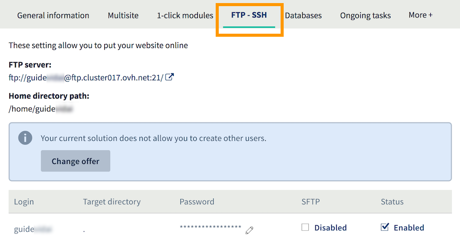

**Last updated 5th May 2020**

## Objective

OVHcloud Web Hosting plans provide you with access to a storage space you can use to put your website’s files online. You can access this storage space using a FTP user account, and the password associated with it.

**Find out how to change the password for a FTP user created on your OVHcloud Web Hosting plan.**

## Requirements

- You must have an [OVHcloud Web Hosting plan](https://www.ovh.com.au/web-hosting/).
- You must be logged in to your [OVHcloud Control Panel](https://www.ovh.com/auth/?action=gotomanager){.external}.

## Instructions

### Step 1: Access the FTP user management interface

Log in to your [OVHcloud Control Panel](https://www.ovh.com/auth/?action=gotomanager){.external}, click `Web hosting`{.action} in the services bar on the left-hand side, then choose the appropriate Web Hosting plan. Go to the `FTP - SSH`{.action} tab.

The table will provide you with a list of FTP user accounts created on your Web Hosting plan. You can use these user accounts to access your storage space and put your website’s files online. A user account will be created automatically when you set up your Web Hosting plan.

{.thumbnail}

### Step 2: Modify the FTP user password

There are two ways you can modify an FTP user's password, depending on which [OVHcloud Web Hosting plan](https://www.ovh.com.au/web-hosting/) you are using:

- **For Web Hosting plans that can only have one FTP user** (Start 10M and Personal): Click on the pencil icon in the `Password`{.action} column of the table, enter the new password in the field, and confirm the change.

- **For Web Hosting plans that can have several FTP users** (Professional and Performance): click on the cogwheel icon to the right of the user you have selected, then click `Change password`{.action}. Enter your new password in the window that opens, and click `Confirm`{.action}.

The password change will require a few minutes to take effect.

> [!primary]
>
> For security reasons, please follow the required conditions when you choose a new password. We also recommend:
>
> - Not using the same password twice.
>
> - Setting a password that does not contain any personal information (don’t include your surname, first name, or date of birth, for example).
>
> - Renewing your password regularly.
>
> - Not keeping any written records of your password, and not sending passwords to other people via email.
>
> - Not saving your passwords in your browser, even if your browser offers to do so.
>

### Step 3: Access your storage space

Once you have modified the FTP user password, you can then access your storage space.

There are several ways of doing this, depending on which [OVHcloud Web Hosting plan](https://www.ovh.com.au/web-hosting/) you are using:

- **Using FTP Explorer:** Enables you to access your storage space via your browser. To use it, stay in the `FTP - SSH`{.action} tab, and click `FTP Explorer`{.action}.

- **Using FTP-compatible software:** You will need to install an FTP-compatible program on your computer (e.g. FileZilla).

- **Using SSH access:** You will need to use commands from a terminal to interact with your storage space. This access type will require more advanced technical knowledge.

## Go further

[To find out more about password security, refer to this comprehensive advice page published by Get Safe Online](https://www.getsafeonline.org/protecting-yourself/passwords/)

[FileZilla user guide](../web_hosting_filezilla_user_guide/)

[SSH on web hosting packages](../web_hosting_ssh_on_web_hosting_packages/)

Join our community of users on <https://community.ovh.com/en/>.
