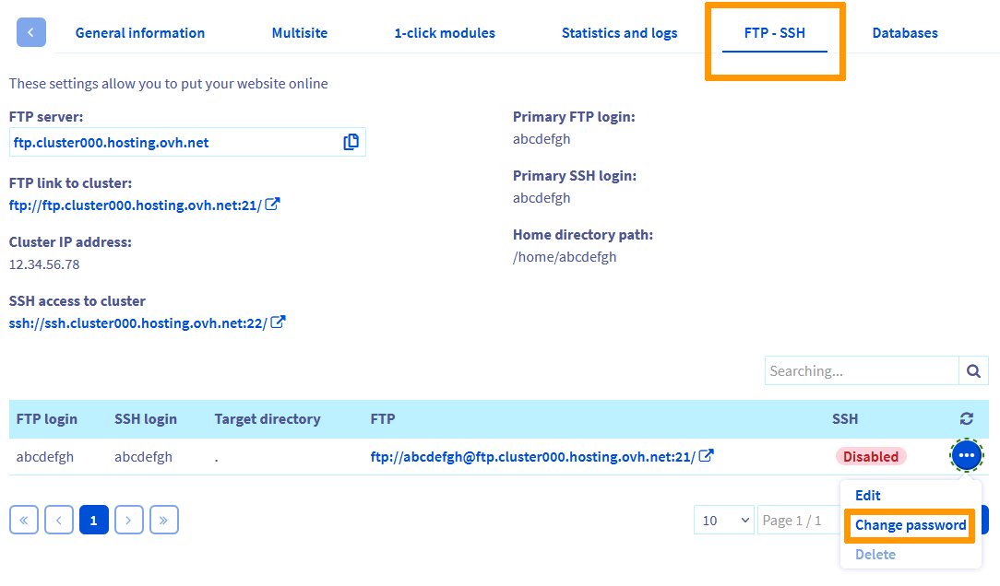

> [!primary]
> Tłumaczenie zostało wygenerowane automatycznie przez system naszego partnera SYSTRAN. W niektórych przypadkach mogą wystąpić nieprecyzyjne sformułowania, na przykład w tłumaczeniu nazw przycisków lub szczegółów technicznych. W przypadku jakichkolwiek wątpliwości zalecamy zapoznanie się z angielską/francuską wersją przewodnika. Jeśli chcesz przyczynić się do ulepszenia tłumaczenia, kliknij przycisk „Zaproponuj zmianę” na tej stronie.
>

**Ostatnia aktualizacja z dnia 18-08-2022**

## Wprowadzenie

Wraz z pakietami hostingowymi OVHcloud zyskujesz dostęp do przestrzeni dyskowej plików online, z której możesz korzystać przy użyciu protokołu **FTP**. Dostęp do przestrzeni dyskowej jest możliwy przez użytkownika FTP i powiązane z nim hasło.
 W ten sposób będziesz mógł umieścić [Twoją stronę WWW w Internecie](https://docs.ovh.com/pl/hosting/hosting_www_umieszczenie_strony_w_internecie/#3-zapisanie-plikow-na-przestrzeni-dyskowej).

**Dowiedz się, jak zmienić hasło do konta FTP utworzonego na Twoim hostingu.**

> [!warning]
>
> OVHcloud udostępnia różnorodne usługi, jednak to Ty odpowiadasz za ich konfigurację i zarządzanie nimi. Ponosisz więc odpowiedzialność za ich prawidłowe funkcjonowanie.
>
> Oddajemy w Twoje ręce niniejszy przewodnik, którego celem jest pomoc w wykonywaniu bieżących zadań. W przypadku trudności zalecamy skorzystanie z pomocy wyspecjalizowanego webmastera lub kontakt z producentem oprogramowania. Niestety firma OVH nie będzie mogła udzielić wsparcia w tym zakresie. Więcej informacji znajduje się w sekcji [Sprawdź również](#gofurther) ten przewodnik.
>

## Wymagania początkowe

- Posiadanie [hostingu OVHcloud](https://www.ovhcloud.com/pl/web-hosting/).
- Dostęp do [Panelu klienta OVHcloud](https://www.ovh.com/auth/?action=gotomanager&from=https://www.ovh.pl/&ovhSubsidiary=pl).

## W praktyce

### Etap 1: dostęp do zarządzania użytkownikami FTP

Zaloguj się do [Panelu klienta OVHcloud](https://www.ovh.com/auth/?action=gotomanager&from=https://www.ovh.pl/&ovhSubsidiary=pl), przejdź do sekcji `Web Cloud`{.action}, kliknij `Hosting`{.action}, a następnie wybierz odpowiednią nazwę hostingu. Wybierz kartę `FTP-SSH`{.action}.

W tabeli wyświetlają się nazwy użytkowników FTP utworzone na Twoim hostingu. Użytkownicy ci umożliwiają dostęp do Twojej przestrzeni dyskowej FTP, aby umieścić w Internecie pliki z Twojej strony WWW. Pierwszy użytkownik (login) tworzony jest automatycznie podczas instalacji hostingu.

### Etap 2: zmiana hasła użytkownika FTP

> [!primary]
>
> Aby uzyskać więcej informacji na temat dobrych praktyk w zakresie zarządzania hasłami, zapoznaj się z instrukcjami zawartymi w tym [przewodniku](https://docs.ovh.com/pl/customer/zarzadzanie-haslem/).
>

W zależności od pakietu [hostingowego OVHcloud](https://www.ovhcloud.com/pl/web-hosting/) zmiana hasła do konta FTP w zakładce `FTP-SSH`{.action} zostanie wykonana na dwie różne sposoby:

- **w przypadku pakietów, które nie pozwalają na utworzenie drugiego użytkownika FTP** (oferty Start 10M, Kimsufi Web i Perso): kliknij ikonkę ołówka w kolumnie `Hasło`{.action}, wprowadź nowe hasło, a następnie potwierdź zmianę, klikając zielony przycisk.

{.thumbnail}

- **w przypadku pakietów umożliwiających utworzenie kilku użytkowników FTP** (oferty Pro i Performance): kliknij trzy kropki po prawej stronie wybranego użytkownika FTP, a następnie `Zmień hasło`{.action}. W oknie, które się wyświetla wprowadź nowe hasło i kliknij je dwukrotnie, a następnie kliknij przycisk `Zatwierdź`{.action}.

{.thumbnail}

Wybierz nowe hasło do bazy danych i zapisz je. W obu przypadkach musi on spełniać następujące warunki:

- Minimum 8 znaki;
- Maksymalnie 30 znaków;
- Przynajmniej jedna wielka litera;
- Przynajmniej jedna mała litera;
- Przynajmniej jedną cyfrę;
- Składać się wyłącznie z cyfr i liter.

Następnie przejdź do zakładki `Zadania w realizacji`{.action} i odśwież stronę regularnie. Efekty modyfikacji to zaledwie kilka minut.

### Etap 3: dostęp do Twojej przestrzeni dyskowej

Możesz łączyć pliki z przestrzenią dyskową na kilka sposobów:

- **FTP Explorer**: program ten jest dostępny w [Panelu klienta OVHcloud](https://www.ovh.com/auth/?action=gotomanager&from=https://www.ovh.pl/&ovhSubsidiary=pl). Aby z niego korzystać, w zakładce `FTP-SSH`{.action} kliknij przycisk `FTP Explorer`{.action};

> [!warning]
>
> FTP Explorer nie jest dostępny w ofercie Cloud Web. Konieczne będzie zastosowanie jednej z następujących metod.

- **Program FTP**: zainstaluj na Twoim komputerze program kompatybilny z protokołem FTP (np. [FileZilla](https://docs.ovh.com/pl/hosting/hosting_www_przewodnik_dotyczacy_korzystania_z_programu_filezilla/));

- **Dostęp SSH** (tylko w ofercie Pro i Performance): zapoznaj się z przewodnikiem "[Korzystanie z dostępu SSH do hostingu](https://docs.ovh.com/pl/hosting/hosting_www_ssh_na_hostingu/)", aby korzystać z tego protokołu.

> [!primary]
>
> Aby uzyskać więcej informacji, zapoznaj się z przewodnikiem "[Logowanie do przestrzeni dyskowej Twojego hostingu](https://docs.ovh.com/fr/hosting/connexion-espace-stockage-ftp-hebergement-web/)".
>

## Sprawdź również 

[Tworzenie i zarządzanie hasłem do konta](https://docs.ovh.com/pl/customer/zarzadzanie-haslem/)

[Krajowy system cyberbezpieczeństwa](https://www.gov.pl/web/cyfryzacja/krajowy-system-cyberbezpieczenstwa-){.external}

Jeśli chcesz otrzymywać wsparcie w zakresie konfiguracji i użytkowania Twoich rozwiązań OVHcloud, sprawdź naszą [ofertę pomocy](https://www.ovhcloud.com/pl/support-levels/).

Dołącz do społeczności naszych użytkowników na stronie<https://community.ovh.com/en/>.
