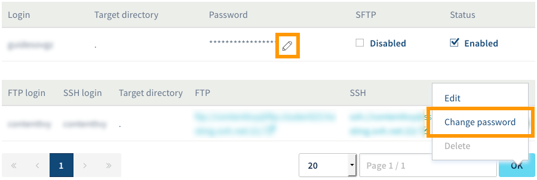
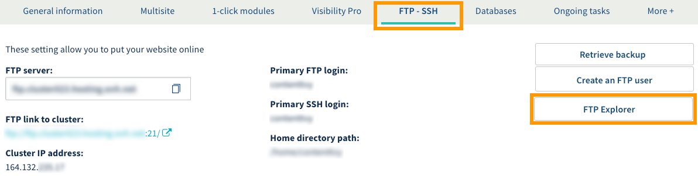
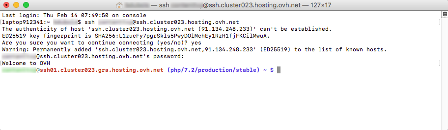

**Last updated 17th April 2019**

## Objective

OVH Web Hosting plans provide you with access to a storage space you can use to put your website and application files online. You can access this space using an FTP or SSH user account and password.

**Find out how to log in to your OVH Web Hosting plan’s storage space.**

## Requirements

- an [OVH Web Hosting plan]({ovh_www}/web-hosting/){.external}
- access to the `Web`{.action} section of the [OVH Control Panel](https://www.ovh.com/auth/?action=gotomanager){.external}

## Instructions

### Step 1: Retrieve your login information.

To log in to your storage space, you will need the following:

- an active FTP or SSH user account
- the FTP or SSH user password
- the server address
- the server connection port

> [!primary]
>
> This information is contained in the email confirming that your Web Hosting plan has been set up, and can be accessed via the OVH Control Panel.
>
> **If you already have this information**, you can continue directly to step 2: "[Access your storage space](./#step-2-access-your-storage-space)".
> 

If you don’t have this information, log in to the [OVH Control Panel](https://www.ovh.com/auth/?action=gotomanager){.external}, go to the `Web`{.action} section, then click on `Hosting`{.action} in the services bar on the left-hand side. Select the name of the Web Hosting plan concerned, and click on the `FTP - SSH`{.action} tab. 

The information about your storage space will appear, along with a table listing the FTP and SSH users created on your Web Hosting plan.

{.thumbnail}

With this information, you should be able to find the items you need to log in to the storage space. If you are having trouble identifying this information, you can use the table below. Please note that some information may not appear, depending on which [OVH Web Hosting plan]({ovh_www}/web-hosting/){.external} you are using.

|Information|Description|
|---|---|
|FTP server|This is the server address for accessing your storage space. You can use it to log in via an FTP program.<br><br> The standard connection port is "21". You will need to use port "22" for a connection via SFTP (if it is enabled).|
|SSH access to the cluster|You can retrieve two pieces of information with what appears: <br>**\- the server address**: starts with ‘ssh://’ and ends before ‘:’<br> **\- the connection port**: the number is included after ‘:’. <br><br>For example, you could see: ssh://`ssh.cluster023.hosting.ovh.net`:`22`/, so ‘ssh.cluster023.hosting.ovh.net’ as the server address and ‘22’ as the connection port.|
|Primary FTP login|This is the primary FTP user created on your hosting plan. You can find all of your Web Hosting plan’s FTP users in the "FTP login" column of the table.|
|Primary SSH login|This is the primary SSH user created on your Web Hosting plan. You can find all of the SSH users on your Web Hosting plan in the "SSH login" column of the table.|

If you have forgotten the password for an FTP or SSH user, depending on which Web Hosting plan you have, click either the pencil icon or the `...`{.action} button, then `Change password`{.action}. For further support, please refer to our guide to [Modifying a FTP user password](../modify-ftp-user-password/).

{.thumbnail}

You should now have everything you need to log in to your storage space.

### Step 2: Access your storage space.

There are several ways you can access your storage space. We recommend reading this guide, and focusing on the method you wish to follow.

[1. Log in via FTP Explorer](./#1-log-in-via-ftp-explorer): Gives you access to your storage space via your web browser.

[2. Log in via an FTP program](./#2-log-in-via-an-ftp-program): Gives you access to your storage space via a program (e.g. FileZilla or Cyberduck). You will need to install the program on your computer beforehand.

[3. Log in via SSH](./#3-log-in-via-ssh): Gives you access to your storage space via SSH. More advanced knowledge and a specific [OVH web hosting plan](https://www.ovh.co.uk/web-hosting/){.external} are required to use this method.

#### 1. Log in via FTP Explorer.

To log in to the storage space via FTP Explorer, log in to the [OVH Control Panel](https://www.ovh.com/auth/?action=gotomanager){.external}, then go to the ‘Web’ section and click on `Hosting`{.action} in the services bar on the left-hand side, click on the name of the Web Hosting plan concerned. 

Go to the `FTP - SSH`{.action} tab, and click `FTP Explorer`{.action}. 

{.thumbnail}

On the new page that opens, enter the FTP username and password, then log in. If the information you provide is correct, you can now interact with your storage space.

{.thumbnail}

#### 2. Log in via an FTP program.

After you have installed the FTP program you want to use (e.g. FileZilla or Cyberduck), open it. 

You should be able to enter your login details. Since the method and layout will vary depending on which program and version you are using, we cannot detail all of them in this documentation.

As a reminder, you will need to enter the following information:

|Information to enter|Details|
|---|---|
|FTP server|This is the server address that gives you access to your storage space.<br><br> Depending on the software you are using, the name may look like this: "Server", "Server address", "Host", or "Host name".|
|FTP login|This is the username for accessing your storage space.<br><br> Depending on which software you are using, the field may be labelled as: "User", "Username", "ID", or "Login".|
|FTP user password|This is the password associated with the FTP login.<br><br> Depending on which software you are using, the field should be labelled as "Password".|
|Connection port|This is usually entered automatically by the program. If you need to enter it manually:<br><br>\- use port "21" for a connection using FTP protocol<br>\- use port "22" for a connection using SFTP (if it is enabled)|

If the information is correct, the program you are using should display the contents of your storage space. A message (also called "status") may appear to confirm that the content has been successfully listed by your program.

#### 3. Log in via SSH.

To log in via SSH, use a terminal to interact directly with your storage space via command lines. 

This tool is installed by default on macOS or Linux. For a Windows environment, you will need to install a program like PuTTY, or add the "OpenSSH" feature. Since this method will vary, depending on the operating system you are using, we cannot cover it in this guide.

Once the SSH connection has been established using your chosen method, there are two ways of logging in: 

- **Via a program.** You will need to enter your login details in to the text fields.
- **Via a command line.** You will need to use a specific syntax.

If you are logging in via the command line, the commands you will need to use are listed below. You will need to replace "sshlogin", "sshserver" and "connectionport" with your own SSH login details. Once the command has been sent, you will be prompted to enter the SSH user password.

```ssh
ssh sshlogin@sshserver -p connectionport
```

If the information you have entered is correct, then you can interact with your storage space. If you need further support in this regard, please refer to the following guide: [Web Hosting: SSH on web hosting packages](../web_hosting_ssh_on_web_hosting_packages/).

{.thumbnail}

## Go further

[Modifying an FTP user password](../modify-ftp-user-password/){.external}.

[Web hosting: SSH on web hosting packages](../web_hosting_ssh_on_web_hosting_packages/).

Join our community of users on <https://community.ovh.com/en/>.