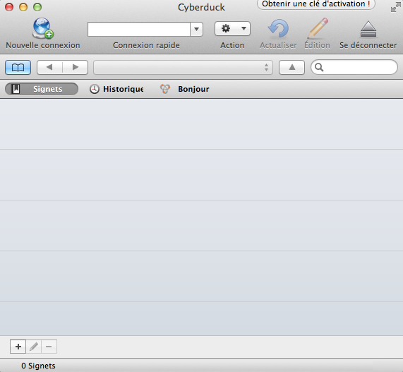
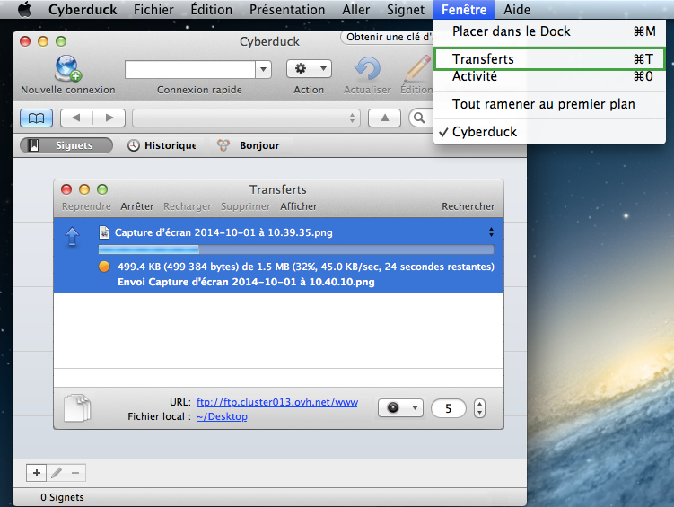
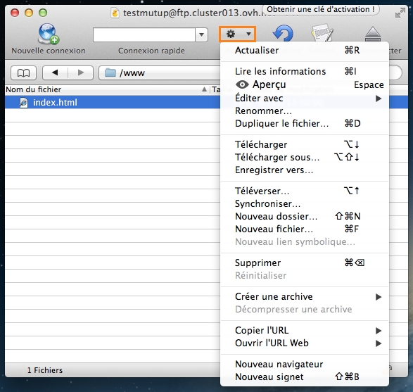
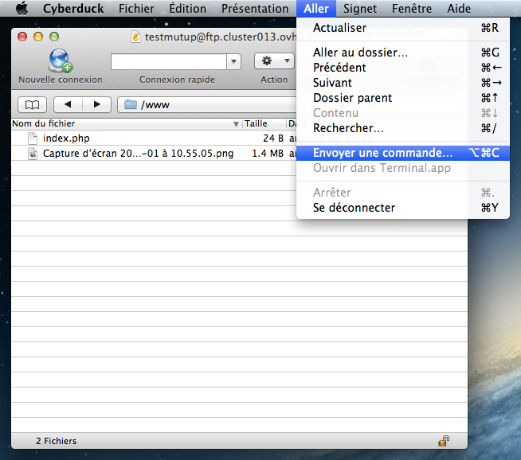
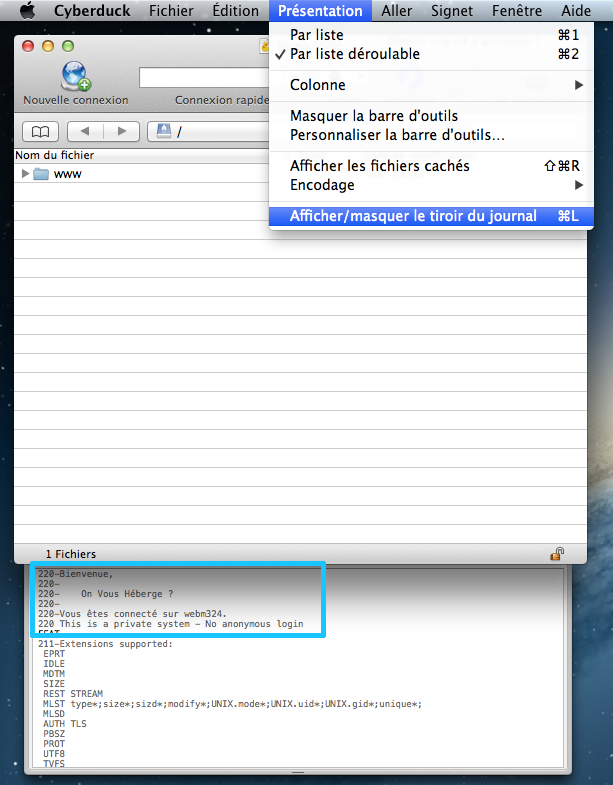

**Dernière mise à jour le 05/05/2020**

Ce guide a été réalisé avec une version gratuite de l'applicatif en version 4.5.2 téléchargée depuis le site officiel.

Retrouvez nos [différents guides mutualisés/hébergement Web](https://www.ovh.com/ca/fr/hebergement-web/guides/){.external} disponibles.

> [!warning]
>
> OVHcloud met à votre disposition des services dont la configuration, la gestion et la responsabilité vous incombent. Il vous revient de ce fait d'en assurer le bon fonctionnement.
> 
> Nous mettons à votre disposition ce guide afin de vous accompagner au mieux sur des tâches courantes. Néanmoins, nous vous recommandons de faire appel à un prestataire spécialisé et/ou de contacter l'éditeur du service si vous éprouvez des difficultés. En effet, nous ne serons pas en mesure de vous fournir une assistance. Plus d'informations dans la section « Aller plus loin » de ce guide.
> 

## Généralités

### Presentation
Cyberduck est un applicatif disponible sur MAC.

Ce dernier vous donne notamment la possibilité de mettre en ligne votre site internet en vous permettant de vous connecter à votre espace d'hébergement (FTP).

Pour en bénéficier, veuillez vous reporter au site officiel de l'application :

- Site officiel Cyberduck (site non OVHcloud) : [cyberduck.io](https://cyberduck.io/){.external}

{.thumbnail}

> [!success]
>
> Cyberduck est un applicatif pour les utilisateurs bénéficiant d'un MAC. Si vous possédez une machine utilisant Windows, préférez l'utilisation de FileZilla : <legacy:1380>
> 

### Interface
Lors du premier démarrage de l'application, vous pourrez apercevoir la fenêtre ci-contre.

- La zone du dessus vous permet notamment d'établir une nouvelle connexion rapide ainsi que d'accéder à différentes actions une fois que vous serez connecté à votre espace FTP (renommer, édition, etc.).
- La zone du milieu vous permet par exemple de voir les signets que vous avez ajoutés (vos connexions FTP pré-enregistrées), et une fois connecté le contenu de votre espace d'hébergement.
- La zone basse vous permet notamment d'avoir des informations sur une action en cours (connexion vers le serveur FTP) ainsi que quelques logos pour ajouter un nouveau signet par exemple.

{.thumbnail}

**Personnaliser l'affichage de Cyberduck** Il est possible de personnaliser l'affichage de Cyberduck afin de le rendre plus efficace et plus personnel.

Pour effectuer cette manipulation, cliquez sur Présentation puis sur Personnaliser la barre d'outils....

Sur le cadre qui apparaît, faites glisser les éléments souhaités vers la barre d'outils. Pour valider vos modifications, cliquez sur Terminé

{.thumbnail}

## Utiliser Cyberduck

### Connexion FTP
Afin de pouvoir vous connecter à votre espace d'hébergement (FTP), suivez les étapes ci-dessous :

**1.**  Cliquez sur Nouvelle connexion en haut à gauche

**2.**  Renseignez dans la nouvelle fenêtre vos informations de connexion à votre espace FTP :

- Serveur FTP
- Nom d'utilisateur
- Mot de passe
- Port (21)

{.thumbnail}

> [!success]
>
> - 
> Vous avez la possibilité d'enregistrer votre mot de passe dans
> Cyberduck en cochant Ajouter au trousseau d'accès . Ce choix n'est
> pas obligatoire ; en ne cochant pas le case, vous devrez renseigner
> le mot de passe afin de vous reconnecter à votre espace
> d'hébergement.
> - 
> Si vous ne connaissez pas vos identifiants FTP, reportez-vous au
> guide ci-contre : Récupérer mes identifiants
> FTP
> .
> 
> 

Un message d'avertissement devrait apparaître vous informant que le serveur supporte les connexions encryptées (SSL).

- Notre serveur n'étant pas compatible avec le FTP-SSL , vous devez cochez Ne plus afficher et sélectionner impérativement le choix Continuer .
- Si vous souhaitez utiliser une connexion sécurisée, vous devrez utiliser une [connexion SFTP](#utiliser_cyberduck_connexion_sftp){.external} .

{.thumbnail}

> [!alert]
>
> - 
> Si vous ne savez pas si l'accès SSH est compris dans votre offre,
> reportez-vous aux descriptifs de nos
> offres .
> - 
> Si vous n'êtes toujours pas sûr de votre choix, préférez par défaut
> Continuer . Le serveur refusera la connexion si vous ne bénéficiez
> pas de l'accès SSH dans votre offre.
> 
> 

> [!success]
>
> - 
> Nous vous conseillons d'enregistrer vos informations de connexion via
> un Signet . Ceci vous permettra de garder en mémoire certaines
> informations de connexion.
> - 
> Consultez cette partie du guide si besoin : Qu'est-ce qu'un Signet
> ? .
> 
> 

### Connexion SFTP
Si votre offre est compatible avec un accès SSH, vous avez dès lors la possibilité de vous connecter en SFTP. Il est impératif de bénéficier de cet accès pour que la connexion SFTP puisse fonctionner.

> [!alert]
>
> - 
> Si vous ne savez pas si l'accès SSH est compris dans votre offre,
> reportez-vous aux descriptifs de nos
> offres .
> - 
> Si vous n'êtes toujours pas sûr de votre choix, préférez une
> Connexion FTP plutôt que SFTP.
> Le serveur refusera la connexion si vous ne bénéficiez pas de l'accès
> SSH dans votre offre.
> 
> 

Afin de pouvoir vous connecter à votre espace d'hébergement, suivez les étapes ci-dessous :

**1.**  Cliquez sur Nouvelle connexion en haut à gauche

**2.**  Sélectionnez dans le menu déroulant SFTP (Protocole de transfert de fichiers via SSH) (cadre orange de l'image)

**3.**  Renseignez vos informations de connexion à votre espace FTP :

- Serveur FTP
- Nom d'utilisateur
- Mot de passe
- Port (22)

{.thumbnail}

> [!success]
>
> - 
> Vous avez la possibilité d'enregistrer votre mot de passe dans
> Cyberduck en cochant Ajouter au trousseau d'accès . Ce choix n'est
> pas obligatoire ; en ne cochant pas le case, vous devrez renseigner
> le mot de passe afin de vous reconnecter à votre espace
> d'hébergement.
> - 
> Si vous ne connaissez pas vos identifiants FTP, reportez-vous au
> guide ci-contre : Récupérer mes identifiants
> FTP
> .
> 
> 

Lorsque vous effectuez une première connexion vers votre espace d'hébergement, une fenêtre Lhôte est actuellement inconnu du système apparaîtra.

- Cochez la case Toujours puis cliquez sur Permettre . Ceci vous permettra de certifier définitivement l'hôte de connexion (qui est OVHcloud).

{.thumbnail}

> [!success]
>
> - 
> Nous vous conseillons d'enregistrer vos informations de connexion via
> un Signet . Ceci vous permettra de garder en mémoire certaines
> informations de connexion.
> - 
> Consultez cette partie du guide si besoin : Qu'est-ce qu'un Signet
> ? .
> 
> 

### Erreurs de connexion
Lors d'une tentative de connexion à votre espace d'hébergement, il est possible qu'une erreur apparaisse dans Cyberduck. Vous trouverez ci-dessous les 2 erreurs les plus fréquentes que vous pourrez rencontrer. **Ouverture de session échouée** Ce message est également accompagné de la mention 530 Login authentification failed. Dans la majorité des cas, cette erreur est liée aux identifiants que vous avez renseignés : ces derniers sont sûrement erronés.

- Vous devez par conséquent vérifier les informations de connexion que vous avez renseignées
- Si nécessaire, vous devrez également modifier le Signet que vous avez créé (en le sélectionnant et en cliquant sur le logo en forme de crayon)

{.thumbnail}

> [!success]
>
> - 
> Si vous ne connaissez pas vos identifiants FTP, reportez-vous au
> guide ci-contre : Récupérer mes identifiants
> FTP
> .
> 
> 

**Échec de la connexion** Ce message est également accompagné de la mention Timed out waiting for initial connect reply. Ce message signifie dans la grande majorité des cas que l'hôte n'est pas joignable : ce dernier est sûrement erroné ou non joignable.

- Vous devrez par conséquent vérifier les informations de connexion que vous avez renseignées
- Si nécessaire, vous devrez également modifier le Signet que vous avez créé (en le sélectionnant et en cliquant sur le logo en forme de crayon)

Ceci peut également provenir d'un parefeu ou du réseau local bloquant le port 21 ou 22 qui sont utilisés pour se connecter au FTP. Vous devrez vérifier votre configuration personnelle dans ce cas.

{.thumbnail}

> [!success]
>
> - 
> Pour rappel, l'hôte de connexion pour votre espace d'hébergement est
> ftp.votre-domaine.tld (remplacez par votre domaine) ou
> ftp.cluster0XX.hosting.ovh.net (remplacez les XXX par votre numéro de
> cluster).
> - 
> Si besoin, vous pouvez vous reporter au guide ci-contre : Récupérer
> mes identifiants
> FTP
> .
> 
> 

### Qu'est-ce qu'un Signet ?
Pour faciliter l'accès à votre espace d'hébergement (FTP), nous vous conseillons d'utiliser le système des Signets. Ceci permet de pré-enregistrer vos informations de connexion.

Pour effectuer cet ajout :

- Connectez-vous à votre espace d'hébergement (FTP ou SFTP)
- Placez-vous sur l'affichage des Signets (cadre bleu puis cadre vert de l'image)
- Cliquez sur le logo en forme de [+] (cadre orange) sur le bas à gauche de la fenêtre

{.thumbnail}

Une nouvelle fenêtre s'affiche contenant vos informations de connexion. Au prochain démarrage de Cyberduck, vous pourrez double-cliquer sur le signet pour vous connecter plus rapidement.

### Transferer des fichiers
Le transfert de fichiers vous permet de déposer sur votre espace d'hébergement votre site internet. Par défaut, vous devez déposer sur cet espace vos fichiers dans le répertoire (dossier) www.

Vous pouvez transférer vos fichiers via plusieurs moyens. **Via glissé-déposé** Pour réaliser le transfert de vos fichiers en FTP, vous pouvez simplement les sélectionner et réaliser un glissé-déposé de la fenêtre du dossier local (vos fichiers sur votre machine) vers la fenêtre de Cyberduck (votre espace d'hébergement).

- Une fois cette action réalisée, vos fichiers vont automatiquement se mettre en file d'attente pour être déposés sur le serveur. Une fenêtre s'affichera en conséquence.

{.thumbnail}

**Via l'interface Transférer** Vous avez la possibilité d'utiliser l'interface Transférer qui ouvrira une fenêtre et vous permettra d'explorer vos fichiers. Vous devrez sélectionner les fichiers souhaités puis cliquer sur Transférer.

- Une fois cette action réalisée, vos fichiers vont automatiquement se mettre en file d'attente pour être déposés sur le serveur. Une fenêtre s'affichera en conséquence.

{.thumbnail}

**Visionner les transferts en cours** Vous avez la possibilité de visionner l'historique des transferts vers votre espace d'hébergement. Vous pourrez ainsi retrouver :

- les fichiers en attente d'être déposés sur le serveur distant encore présents dans la file d'attente (ou en cours d'envoi)
- les fichiers pour lesquels le transfert a échoué
- les fichiers pour lesquels le transfert est réussi sur l'hébergement distant

Cette fenêtre s'affiche de deux manières différentes :

- automatiquement lorsqu'un transfert est initié
- en cliquant sur Fenêtre puis Transferts

{.thumbnail}

### Actions possibles sur un fichier/dossier
En sélectionnant un fichier ou un dossier présent sur votre espace d'hébergement (dans la fenêtre de Cyberduck), vous aurez la possibilité d'effectuer diverses Actions.

Ces dernières vous permettront notamment de :

- Lire les informations d'un fichier ou d'un dossier et d'en modifier les droits (CHMOD)
- Éditer le fichier avec l'application de votre choix
- Renommer le fichier ou le dossier
- Supprimer le fichier ou le dossier
- Télécharger le ou les éléments sélectionné(s)
- Créer un nouveau dossier ou fichier

La liste ci-dessus n'est pas exhaustive, il existe d'autres actions possibles. Rapprochez-vous du site officiel de Cyberduck en cas de besoin.

{.thumbnail}

## Informations utiles

### Droits des fichiers et dossiers
Vous avez la possibilité de modifier les droits (CHMOD) de vos fichiers et de vos dossiers présents sur l'hébergement.

Ces derniers se répartissent en 3 familles :

- Propriétaire
- Groupe
- Publiques (autres).

Afin d'accéder à cette interface, sélectionnez le(s) fichier(s) ou dossier(s) souhaité(s) puis dans Actions, cliquez sur "Lire les informations".

Sur la nouvelle fenêtre, cliquez sur Permissions puis effectuez les modifications souhaitées :

- Permissions UNIX : la valeur mettra à jour automatiquement les cases des 3 familles du dessous
- Cochez les cases souhaitées : la valeur se mettra à jour automatiquement pour les Permissions UNIX

{.thumbnail}

### Reouverture du site
Vous avez la possibilité d'effectuer la réouverture de votre site en utilisant une commande personnalisée.

Dans la plupart des cas, cette manipulation fait suite à une fermeture par sécurité de votre espace d'hébergement par OVHcloud suite à un hack.

Pour utiliser une commande :

- Cliquez sur Aller
- Cliquez sur Envoyer une commande...

{.thumbnail}

Sur la nouvelle fenêtre, insérez la commande :

- CHMOD 705 /
- Cliquez sur Envoyer

En confirmation, le message 200 Permissions changed on / devrait apparaître dans l'encadré du dessous.

- Pour vérifier que la réouverture est bien effective, testez tout simplement votre site depuis un navigateur Internet.

{.thumbnail}

> [!alert]
>
> - 
> Cette commande n'est pas fonctionnelle en SFTP. Pour l'effectuer,
> utilisez une connexion FTP .
> - 
> Pour rappel, veillez à tester l'affichage après 3 heures maximum. En
> effet, nos robots passent toutes les 3 heures pour vérifier les
> changements d'état. En fonction du moment où la manipulation
> ci-dessus sera réalisée, le rétablissement de l'affichage de votre
> site pourra donc être plus ou moins rapide.
> - 
> Si le délai des 3 heures est passé et que votre site n'est toujours
> pas en ligne, veuillez contacter notre support.
> 
> 

### Connaitre le serveur de connexion
Dans certains cas, notre support peut être amené à vous demander le serveur sur lequel s'est connecté Cyberduck.

Cette vérification peut par exemple intervenir si vous constatez des lenteurs ou des anomalies diverses avec votre espace FTP.

Pour cela, vous devez au préalable activer le journal :

- Cliquez sur Présentation
- Cliquez sur Afficher/masquer le tiroir du journal

Un cadre devrait apparaître en dessous de la fenêtre de Cyberduck. Par la suite :

- Connectez-vous à votre espace FTP
- Remontez tout en haut du cadre du journal
- Relevez le webmXXX

{.thumbnail}

## Aller plus loin

Échangez avec notre communauté d'utilisateurs sur <https://community.ovh.com>.
