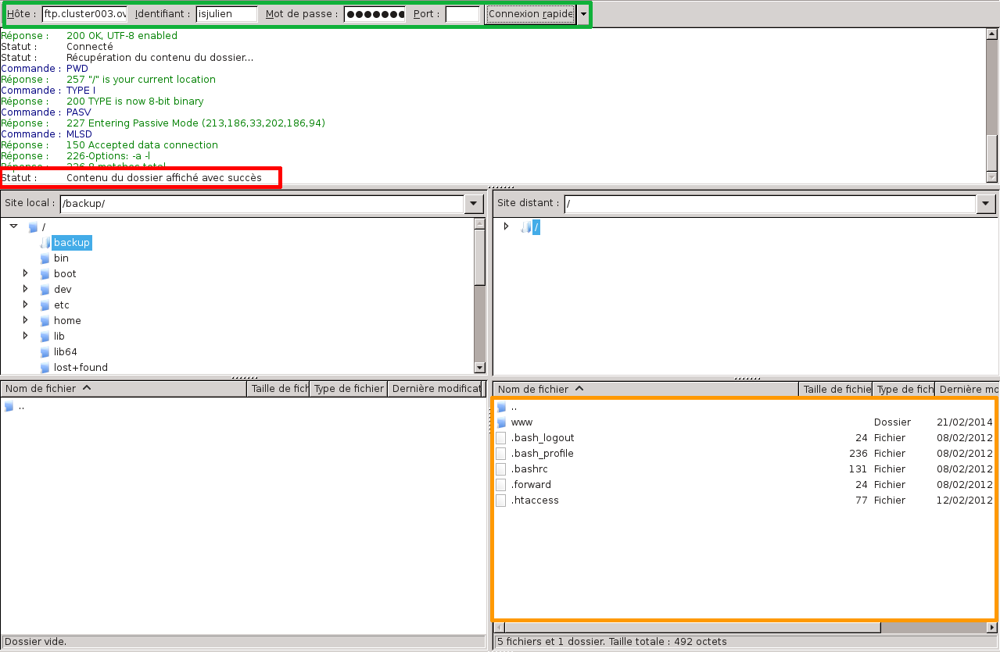
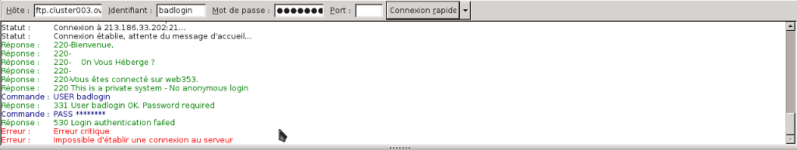
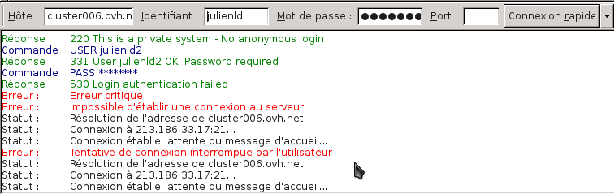
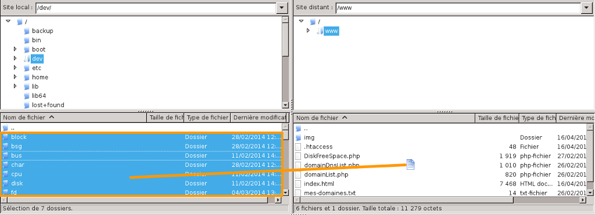
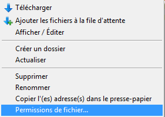
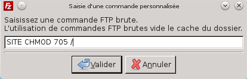
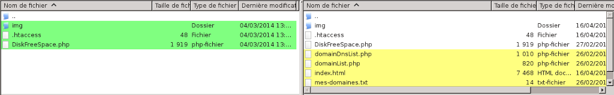
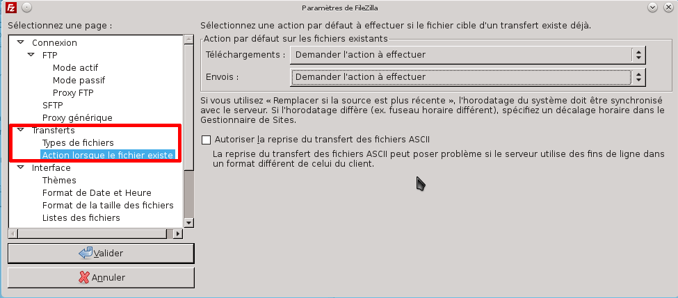
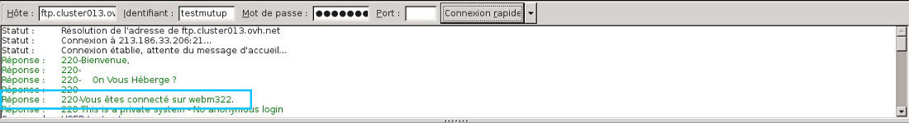

## Presentation
FileZilla is a program available on several operating systems (Windows, MacOS, etc.).

It lets you get your website online by enabling you to connect to your webspace (FTP).

Go to the [FileZilla](https://filezilla-project.org/) website to download it.

{.thumbnail}


## Interface

## The [b][red]Zone 1[/red][/b] provides information on the status of the connection, transfers, connection errors, etc..
Generally the information is not important.

Zone 2 shows the path of the site folder on your computer.

Zone 3 shows the path of the site folder where you are currently on the remote server.

Zone 4 list the directory that you open on your computer, including the name, size, type and modification date of the files.

Zone 5 list the directory that you open on the server, including the name, size, type, modification date, and the rights and owner of the files.

Zone 6 indicates the transfer list of files to be transferred (or being transferred) to the server or on the computer.

The part at the top of the interface (under the green box) contains the host name (the server you are connected to), and the FTP username, password and the port used.

{.thumbnail}

## Main bar
The main bar contains useful icons for the basic operation of the software. We do not use all the buttons for the transfer of files. Here is a brief description of the icons below.

 Open the site manager
 Show or hide the message log (1)
 Show or hide the folder tree (2)
 Show or hide the tree view remote files(3)
 Show or hide the transfer queue (6)
 Update the list of folders and files
 Start or stop the processing of the queue
 Cancel the current operation
 Disconnect from the currently visible server
 Reconnect to last server used
 Display the dialogue box for filter management
 Enable or disable file comparison
 Enable or disable synchronized navigation
 Recursive file search


## FTP connection
In the green box at the top, in order to establish the connection to the remote server, you will be asked for:

|Information to enter|Details|
|---|---|
|FTP server|This is the server address that gives you access to your storage space.<br><br> Depending on the software you are using, the name may look like this: "Server", "Server address", "Host", or "Host name".|
|FTP login|This is the username for accessing your storage space.<br><br> Depending on which software you are using, the field may be labelled as: "User", "Username", "ID", or "Login".|
|FTP user password|This is the password associated with the FTP login.<br><br> Depending on which software you are using, the field should be labelled as "Password".|
|Connection port|This is usually entered automatically by the program. If you need to enter it manually:<br><br>\- use port "21" for a connection using FTP protocol<br>\- use port "22" for a connection using SFTP (if it is enabled)|

If you don’t have this information, log in to the [OVH Control Panel](https://www.ovh.com/auth/?action=gotomanager){.external}, go to the `Web`{.action} section, then click on `Hosting`{.action} in the services bar on the left-hand side. Select the name of the Web Hosting plan concerned, and click on the `FTP - SSH`{.action} tab. The information about your storage space will appear, along with a table listing the FTP and SSH users created on your Web Hosting plan.


Once everything is entered correctly, clickQuickconnect to connect to the server.

{.thumbnail}


## SFTP connection
The SFTP (for SSH File Transfer Protocol) is an FTP connection on port 22 and therefore provides a secure connection.
Be careful, this type of connection is only valid from the [Professional](https://www.ovh.co.uk/web-hosting/) hosting package and upwards.
It allows you to change file permissions that you cannot run while logged in FTP on port 21 for example.

In the green box at the top this time to connect to the remote server, you will be asked:

- Host: ftp.your-domain.tld or 

ftp.cluster0XX.ovh.net or 
newftp.cluster0XX.ovh.net

- Username: your FTP login 
- Password: the FTP password associated with the login
- Port: 22 this time


After clicking the Quickconnect button, a dialog box opens (see above) to certify the connection to the host which you are signing on to. As you are connected to an OVH host, you can tick "Always trust this host, add this key to the cache" so that it does not ask you this in the future.

{.thumbnail}


## Connection errors
This message is caused by an identification error on FTP connection to the hosting package.

This type of message is caused by a login/password error

Please check that your login details are correct. Failing this, you can change the FTP access password of your hosting package directly via the customer account. 

A guide is available on how to change your FTP password on your hosting package:[]({legacy}1374)

{.thumbnail}
In this instance errors are generated by an incorrect host name.

{.thumbnail}


## File transfers
To transfer files using FTP, you can simply select and drag and drop files from the left window (your local files) to the right window (your hosting space).


- Be careful to select the target folder in the right window.


Once this is done, your files will automatically get queued to be placed on the server.

{.thumbnail}


## The queue
You can view the queue

Here you can find:


- Files waiting to be deposited on the remote server still in the queue.

- Files whose transfer failed.

- Files whose transfer to remote hosting was successful.


{.thumbnail}


## Server context menu
If you right-click on one of the files (see Section 5).

A shortcut menu appears, and you have several choices:

Download: download the file in to the local open folder.

Add the files to the queue:  adds the file to the queue, so you can postpone downloading data, for example

View/Edit: allows you to view or edit a file directly on your hosting package, however, you must have software that can read the file installed on your computer.

Create a folder: allows you to create a new folder directly on the remote hosting.

Refresh: updates the displayed data to display new files correctly.

Delete: allows you to delete the selected file.

Rename: allows you to rename the selected file.

Copy the address(es) in the clipboard: allows you to automatically copy the direct link to the selected file.
Example URL that can be generated: ftp://loginftp@ftp.cluster0XX.ovh.net/www/website1/image.jpg

File permissions: gives you the ability to change the file permissions(CHMOD)

{.thumbnail}


## File and folder permissions
To access this interface, right-click on one of the files on the server, then select "File permissions".

In this interface, you can change the permissions (CHMOD) of your files and folders on the hosting package.

Enter the permissions you want to assign and the CHMOD value will be automatically updated.

You can tick the "Recursion in the sub-folders".

This will modify the rights of the folder in question, as well as the files and folders that may be located here.

{.thumbnail}


## Reopening a website
Open FileZilla, click on "Server" then select "Enter custom command".

In FileZilla, you can have "Enter an FTP command" instead of "Enter custom command".

Enter the command:


```
SITE CHMOD 705 /
```


If you get the following error:

550 would not chance perms on /. not such file or directory

You should use this command:


```
SITE CHMOD 705 .
```


To test that the website has reopened just test your website from an internet browser

This command does not work in SFTP.

{.thumbnail}
As a reminder, please test the display after three hours max. Our robots pass every three hours to check status changes. Depending on when the above operations are carried out, your site will display again some time sooner or later. 

If three hours have passed and your website is still not online, please contact our support team.


## Transferring binary files
For binary files, such as CGI files, it may be useful to select the way that the transfer will be carried out.

To modify this, select "Transfer" in the main menu then "Type of transfer".

{.thumbnail}


## Comparing folders
This option displays colours in zones 3 and 4 to compare the differences between the local files and folders and the server.
By clicking on , you change the comparison mode.
You can then enable or disable the option, and you can also: 

- Compare the size of files
- Compare the timestamping
- Hide identical files


Colours:

- Yellow: the file only exists on one side
- Green: the file is more recent than the unmarked file on the other side
- Red: the files are different sizes


{.thumbnail}


## Preferences

## Connections
You can change the reconnection settings on the server.

However, it could be considered as abuse by some servers and could lead to your IP address being banned.

To modify these rules, please go to "???" then "???" and finally "???".

{.thumbnail}

## Transfers
You can modify the preferences on default actions to be executed on modifying an existing file. 

To modify these rules, please go to "???" then "???" and finally "Transfers".

{.thumbnail}


## Find out which server FileZilla is connected to
In some instances, our support team might need to ask which server FileZilla is connected to. 

This might be because you report that your FTP is slow or experiencing various other issues.

- Refer to the part below your credentials
- Go back to the top of the logs
- Look for the webmXXX server.


{.thumbnail}

