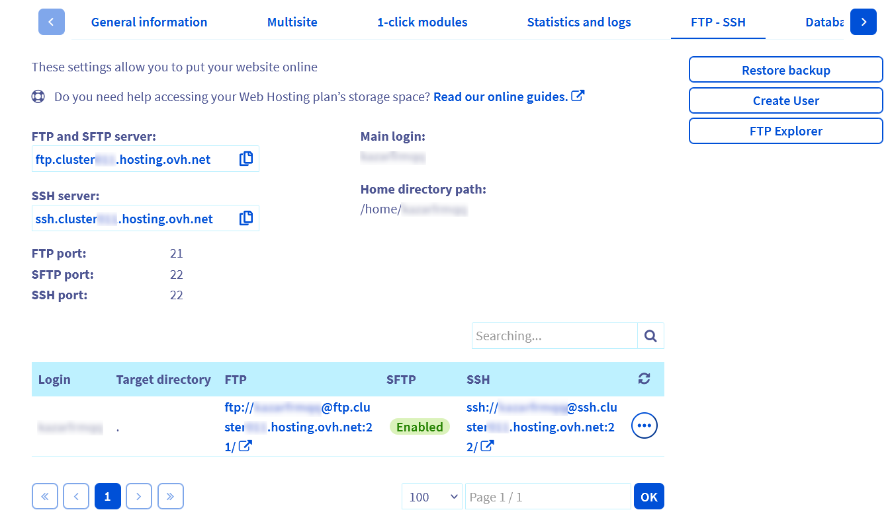

**Dernière mise à jour le 13/09/2022**

## Objectif

FileZilla est un logiciel disponible gratuitement sur plusieurs systèmes d'exploitations (Windows, macOS, etc).
Il permet de mettre en ligne des fichiers ou votre site internet en vous [connectant à l'espace FTP](https://docs.ovh.com/fr/hosting/connexion-espace-stockage-ftp-hebergement-web/) de votre hébergement.

**Découvrez comment utiliser le logiciel Filezilla avec votre hébergement mutualisé.**

> [!warning]
>
> OVHcloud met à votre disposition des services dont la configuration, la gestion et la responsabilité vous incombent. Il vous revient de ce fait d'en assurer le bon fonctionnement.
> 
> Nous mettons à votre disposition ce tutoriel afin de vous accompagner au mieux sur des tâches courantes. Néanmoins, nous vous recommandons de faire appel à un [prestataire spécialisé](https://partner.ovhcloud.com/fr/) et/ou de contacter l'éditeur du logiciel si vous éprouvez des difficultés. En effet, nous ne serons pas en mesure de vous fournir une assistance. Plus d'informations dans la section [« Aller plus loin »](#go-further) de ce tutoriel.
> 

## Prérequis

- Être connecté à votre [espace client OVHcloud](https://www.ovh.com/auth/?action=gotomanager&from=https://www.ovh.com/fr/&ovhSubsidiary=fr).
- Posséder une [offre d'hébergement web](https://www.ovhcloud.com/fr/web-hosting/){.external}.
- Avoir installé le logiciel Filezilla sur votre ordinateur. Celui-ci est disponible gratuitement depuis la page [filezilla-project.org](https://filezilla-project.org/download.php){.external}

## Présentation de l'interface <a name="interface"></a>

{.thumbnail}

- La partie supérieure **encadrée** permet une connexion rapide à votre hébergement en y renseignant son nom d’**hôte**, le nom d’**utilisateur**, son **mot de passe** associé et le numéro de **port** utilisé.
- **zone 1** : détails sur l’historique des opérations, la connexion à l’espace FTP, les transferts de fichiers, les erreurs, etc. Pour en savoir plus, rendez-vous sur la [documentation officielle de Filezilla](https://filezilla-project.org/){.external}.
- **zone 2** : arborescence des répertoires/fichiers locaux sur votre ordinateur.
- **zone 3** : arborescence des répertoires/fichiers distants lorsque vous êtes connecté à votre hébergement.
- **zone 4** : liste des répertoires/fichiers dans le répertoire sélectionné en local sur votre ordinateur.
- **zone 5** : liste des répertoires/fichiers distants dans le répertoire sélectionné sur votre hébergement.
- **zone 6** : liste des opérations de transfert en cours, en attente ou en erreur entre votre ordinateur et votre hébergement.

## En pratique

### Connexion avec Filezilla en FTP

{.thumbnail}

Depuis la barre de connexion rapide, complétez les informations en vous aidant du tableau ci-dessous :

|Information à renseigner|Détails|
|---|---|
|Hôte| Adresse du serveur permettant d'accéder à l'espace de stockage de votre hébergement.<br><br> Pour les hébergements mutualisés, il a généralement cette forme : `ftp.clusterXXX.hosting.ovh.net` (les `XXX` représentent le numéro de cluster où se trouve votre hébergement)|
|Utilisateur|Identifiant vous permettant d'accéder à l'espace de stockage de votre hébergement.|
|Mot de passe|Mot de passe associé à l'utilisateur.|
|Port|Il est généralement complété automatiquement par le logiciel. Sinon, renseignez :<br><br>- le port « 21 » pour une connexion FTP ;<br>- le port « 22 » pour une connexion SFTP (dans le cas où celui-ci est activé). Retrouvez plus d'informations sur le SFTP dans [la partie dédidée de ce tutoriel](#sftp).|

Si vous n’êtes pas en possession de ces éléments, connectez-vous à votre [espace client OVHcloud](https://www.ovh.com/auth/?action=gotomanager&from=https://www.ovh.com/fr/&ovhSubsidiary=fr){.external} dans la partie « Web Cloud », puis cliquez sur `Hébergements`{.action}. Choisissez alors le nom de l'hébergement concerné, puis positionnez-vous sur l'onglet `FTP - SSH`{.action}. Les informations liées à votre espace de stockage apparaissent alors :

{.thumbnail}

> [!warning]
>
> Certaines offres OVHcloud n'utilisent pas le port 22 pour les connexions en SFTP et/ou SSH. Utilisez donc bien les ports qui s'affichent dans votre [espace client OVHcloud](https://www.ovh.com/auth/?action=gotomanager&from=https://www.ovh.com/fr/&ovhSubsidiary=fr){.external}
>

Une fois que tout est correctement saisi dans l'encadré **1** de l'image ci-dessous, cliquez sur `Connexion rapide`{.action}.

{.thumbnail}

Si la connexion s'est bien effectuée avec succès, vous en serez informé via le statut présent dans l'encadré **2** de l'image ci-dessus. Vous pouvez ainsi voir vos répertoires/dossiers et fichiers déjà présents sur votre hébergement (encadré **3**).

### Connexion avec Filezilla en SFTP <a name="sftp"></a>

Le **SFTP** (pour **S**ecure **F**ile **T**ransfer **P**rotocol) est un protocole similaire au **FTP**. Il utilise, comme le SSH, le port 22 par défaut au lieu du port 21. Si vous utilisez une offre d'hébergement Cloud Web, vous devez utiliser le port qui s'affiche dans votre [espace client OVHcloud](https://www.ovh.com/auth/?action=gotomanager&from=https://www.ovh.com/fr/&ovhSubsidiary=fr){.external}. Le port 22 est par sécurité désactivé en SSH et en SFTP pour les hébergements Cloud Web.

> [!success]
>
> SFTP est activable gratuitement pour toutes les offres d'hébergements OVHcloud (sauf les anciennes offres 60free/demo1g).
> 

#### Verifier l'activation de SFTP

Vérifiez tout d'abord que le SFTP est activé pour votre **Login FTP**.

Rendez-vous dans votre [espace client OVHcloud](https://www.ovh.com/auth/?action=gotomanager&from=https://www.ovh.com/fr/&ovhSubsidiary=fr){.external}, dans la partie « Web Cloud », puis cliquez sur `Hébergements`{.action}. Choisissez alors le nom de l'hébergement concerné, puis positionnez-vous sur l'onglet `FTP - SSH`{.action}.

Vérifiez ensuite si le **SFTP** est actif dans le tableau en bas de page.

{.thumbnail}

S'il n'est pas actif :

- Cliquez sur le bouton `...`{.action} à droite du tableau puis sur `Editer`{.action}.

{.thumbnail}

- Dans la fenêtre qui s'affiche, vérifiez alors que l'une des 2 options suivantes est activée :
    - **FTP et SFTP** : pour activer uniquement le SFTP en plus du FTP.
    - **FTP, SFTP et SSH** : pour activer le FTP, le SFTP et le SSH.

{.thumbnail}

- Cliquez ensuite sur `Suivant`{.action} puis sur `Valider`{.action}

#### Lancer la connexion SFTP

{.thumbnail}

Dans la partie haute de Filezilla et afin d'établir la connexion au serveur distant (hébergement), renseignez les éléments ci-après :

- Hôte : `ftp.clusterXXX.hosting.ovh.net` (n'oubliez pas de remplacer les `X` par ceux de votre cluster d'hébergement)
- Identifiant : votre login FTP
- Mot de passe : le mot de passe FTP associé au login
- Port : 22

Après avoir cliqué sur le bouton `Connexion rapide`{.action}, une boîte de dialogue s'ouvre (voir l'image ci-dessous) afin de certifier la connexion à l'hôte sur lequel vous vous apprêtez à vous connecter. En étant connecté sur un hôte OVHcloud, vous pouvez cocher la case *Toujours faire confiance à cet hôte, ajouter cette clé au cache* afin que le logiciel ne vous le redemande plus à l'avenir.

{.thumbnail}

### Erreurs de connexion

Le message affiché ci-dessous indique une erreur d'identification lors de la connexion en FTP ou SFTP à l'hébergement mutualisé :

{.thumbnail}

Ce type de message est généré par une erreur dans le couple Login/Mot de passe.

Vérifiez vos identifiants afin de vous assurer qu'aucune erreur ne soit renseignée. Le cas échéant, vous pouvez modifier le mot de passe de l'accès FTP de votre hébergement directement dans l'[espace client OVHcloud](https://www.ovh.com/auth/?action=gotomanager&from=https://www.ovh.com/fr/&ovhSubsidiary=fr){.external}.

> [!success]
> Un guide est disponible concernant la [modification du mot de passe FTP](https://docs.ovh.com/fr/hosting/modifier-mot-de-passe-utilisateur-ftp/) sur les offres mutualisées.

Dans le cas ci-dessous, l'erreur est générée par un nom d'hôte incorrect :

{.thumbnail}

Vérifiez alors ce dernier par rapport au nom d'hôte déclaré dans votre [espace client OVHcloud](https://www.ovh.com/auth/?action=gotomanager&from=https://www.ovh.com/fr/&ovhSubsidiary=fr){.external}.

### Transfert des fichiers

Pour réaliser le transfert de vos fichiers en FTP, vous pouvez les sélectionner puis réaliser un glisser-déposer des répertoires/fichiers depuis la fenêtre de gauche *(ordinateur)* vers la fenêtre de droite *(hébergement)* (**zones 4 et 5** décrites dans la section de ce tutoriel relative à [l'interface](#interface) de Filezilla).

Faites attention à bien sélectionner le répertoire cible dans la fenêtre de droite.

Une fois cette action réalisée, vos fichiers vont automatiquement se mettre en file d'attente pour être déposés sur le serveur.

{.thumbnail}

### Vue sur la file d'attente

Une vue sur la file d'attente est disponible (**zone 6** décrite dans la section de ce tutoriel relative à [l'interface](#interface) de Filezilla).

Dans cete zone, vous retrouvez :

- les fichiers en attente d'être déposés sur le serveur distant encore présents dans la file d'attente ;
- les fichiers pour lesquels le transfert à échoué ;
- les fichiers pour lesquels le transfert est réussi sur l'hébergement distant.

{.thumbnail}

### Menu contextuel Serveur

Faites un clic-droit sur l'un des fichiers présents dans la **zone 5** (décrite dans la section de ce tutoriel relative à [l'interface](#interface) de Filezilla).

Un menu contextuel apparait, et plusieurs choix vous sont proposés :

- Télécharger : télécharge le fichier dans le dossier local ouvert.
- Ajouter les fichiers à la file d'attente : ajoute le fichier à la file d'attente, vous permet par exemple de différer le téléchargement des données.
- Afficher/Éditer : vous permet d'afficher ou d'éditer directement un fichier présent sur votre hébergement. Vous devez cependant avoir un logiciel capable de lire le fichier installé sur votre poste.
- Créer un dossier : vous permet de créer un nouveau dossier directement sur l'hébergement distant.
- Actualiser : actualise l'affichage des données afin d'afficher correctement les différents fichiers présents.
- Supprimer : vous permet de supprimer le fichier sélectionné.
- Renommer : vous permet de renommer le fichier sélectionné.
- Copier l'(es) adresse(s) dans le presse-papier : vous permet de copier automatiquement le lien direct vers le fichier sélectionné. Exemple d'URL qui peut être générée : `ftp://loginftp@ftp.cluster0XX.hosting.ovh.net/www/mondossier1/monfichier.jpg`
- Permissions de fichier : vous donne la possibilité de modifier les droits des fichiers (Chmod)

{.thumbnail}

## Informations utiles

### Droits d'accès (Chmod) sur les fichiers et les dossiers

Faites un clic-droit sur l'un des fichiers présents sur le serveur, puis sélectionnez `Permissions de fichier ...`{.action}.

Vous pouvez modifier les droits d'accès (Chmod) de vos fichiers et de vos dossiers présents sur l'hébergement.

Généralement, il est plus facile de gérer les droits Chmod avec la valeur chiffrée `XXX` (composée de 3 chiffres pouvant aller de 0 à 7). Le panel de permissions peut alors aller de `000` (aucun droit) à `777` (tous les droits).

> [!alert]
>
> Attention, il n'est pas recommandé de mettre les droits Chmod 000 sur vos dossiers ou vos fichiers. En effet, vous n'aurez plus la possibilité (du moins en FTP) de gérer cet élément (y compris en tant qu'administrateur FTP).
>
> Il en va de même pour les droits Chmod 777 car, à l'inverse du Chmod 000, tout le monde peut agir sur le dossier ou le fichier, ce qui présente une faille de sécurité conséquente pour vos données hébergées.
>

Le premier des trois chiffres `XXX` définissant le Chmod correspond aux droits du propriétaire/administrateur, le deuxième aux droits de groupes (rarement utilisé et généralement égal à 0) et le troisième aux visiteurs de votre site sur votre hébergement.

Par défaut, nous recommandons de ne pas dépasser les droits Chmod **705** pour les dossiers et les droits Chmod **604** pour les fichiers.

Plus le chiffre est élevé, plus les permissions sont importantes.

{.thumbnail}

Renseignez les permissions que vous souhaitez attribuer, la valeur Chmod sera automatiquement mise à jour.

Vous pouvez cocher la case « Récursion dans les sous-dossiers ».

Cela aura pour effet de modifier les droits du dossier en question, ainsi que des dossiers et des fichiers qui pourraient être présents dans celui-ci.

### Réouverture de site

> [!primary]
>
> Indépendamment d'une action de votre part, votre hébergement peut être désactivé suite à la détection de fichiers malveillants ou non autorisés sur votre hébergement par nos systèmes de sécurité.
>
> Vous devez alors [sécuriser vos solutions](https://docs.ovh.com/fr/hosting/diagnostic-403-forbidden/#etape-2-securiser-vos-solutions) tout en corrigeant les failles de sécurité évoquées dans la notification de blocage reçue par e-mail.
>

Cliquez ensuite sur `Serveur`{.action} puis sélectionnez `Saisir une commande personnalisée`{.action} (cette option peut aussi s'appeler `Entrez une commande FTP`{.action}).

Renseignez la commande suivante :

```bash
SITE CHMOD 705 /
```

> [!warning]
>
> Cette commande n'est pas fonctionnelle en SFTP.
>

{.thumbnail}

Si vous obtenez l'erreur `550 would not change perms on /. not such file or directory`, utilisez la commande suivante :

```bash
SITE CHMOD 705 .
```

> [!primary]
>
> Pour vérifier que la réouverture est bien effective, testez votre site depuis un navigateur Internet au bout de quelques minutes.
>

> [!warning]
>
> Veillez à tester l'affichage après 3 heures maximum.<br>
> En effet, nos robots passent toutes les 3 heures minimum pour vérifier les changements d'état.<br>
> En fonction du moment où la manipulation ci-dessus sera réalisée, le rétablissement de l'affichage de votre site pourra donc être plus ou moins rapide.<br>
> Si le délai des 3 heures est passé et que votre site n'est toujours pas en ligne, vérifiez que la commande renseignée est bien passée en réitérant l'opération.<br>
> Si cela ne fonctionne toujours pas, veuillez contacter notre support.
> 

### Transfert de fichiers binaires

Pour les fichiers de type binaire, comme par exemple les fichiers de type **CGI**, il peut être intéressant de choisir la manière dont le transfert sera réalisé.

Pour modifier le type de transfert, sélectionnez `Transfert`{.action} dans le menu principal puis `Type de transfert`{.action}.

{.thumbnail}

### Comparaison de dossiers

{.thumbnail}

L'option de comparaison de fichiers affiche des couleurs dans les  **zones 4** et **5** (présentées dans la section de ce tutoriel relative à [l'interface](#interface) de Filezilla). Cette option permet de mettre en évidence les différences entre les fichiers et dossiers locaux et ceux sur le serveur. 

En effectuant un clic-droit sur l'icône, vous pouvez changer le mode de comparaison. Il vous sera alors proposé d'activer ou de désactiver l'option, mais également de :

- comparer la taille des fichiers ;
- comparer l'horodatage ;
- masquer les fichiers identiques.

**Signification des couleurs** : 

- Jaune : le fichier existe uniquement d'un seul côté.
- Vert : le fichier est plus récent que le fichier non coloré de l'autre côté.
- Rouge : les tailles des fichiers sont différentes.

## Aller plus loin <a name="go-further"></a>

Vous trouverez ci-après le lien vers notre documentation pour [résoudre les erreurs récurrentes lors de l'utilisation d'un logiciel FTP](https://docs.ovh.com/fr/hosting/mutualise-les-problemes-ftp-recurrents/).

Plus généralement, retrouvez [l'ensemble de nos guides relatifs aux hébergements mutualisés](https://docs.ovh.com/fr/hosting/).

N'hésitez pas à consulter la [page officielle de Filezilla](https://filezilla-project.org/).

Pour des prestations spécialisées (référencement, développement, etc), contactez les [partenaires OVHcloud](https://partner.ovhcloud.com/fr/).

Si vous souhaitez bénéficier d'une assistance à l'usage et à la configuration de vos solutions OVHcloud, nous vous proposons de consulter nos différentes [offres de support](https://www.ovhcloud.com/fr/support-levels/).

Échangez avec notre communauté d'utilisateurs sur <https://community.ovh.com>.
