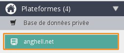
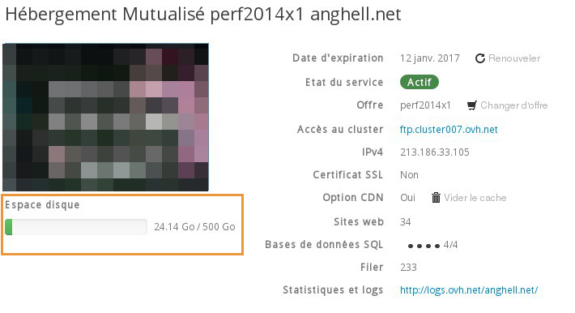

## I have uploaded my files through FTP software, but they are not showing

- Make sure you copy your files to the WWW folder on your web server or they may not be visible.
- If you have changed your DNS zone, it can take between 4 and 24 hours for those updates to propagate throughout the Internet.

## My FTP codes do not work
Make sure you have copied your password correctly. It is best to copy and paste it (Ctrl-C Ctrl-V on windows).
Make sure you do not confuse l (L) with 1 (one) or O (the letter O) with 0 (zero).
If it still doesn't work, your credentials are probably incorrect.

## How much space do I have left on my wesite?
If you are running out of space on your website this could cause problems when you want to upload new files. 

- To check this, log in to your [customer account](https://www.ovh.com/manager/web/login/).
- Select your hosting platform

{.thumbnail}
You will be met with a summary including your FTP quota.

{.thumbnail}

## I cannot upload my files to the ftp server.
You have to connect in passive mode (configuration mode that allows the FTP server to define the connection port) in your ftp client. For example, in FileZilla, click Edit -> Settings -> Connections -> then FTP on the left-hand side - > Passive mode.

## What is the "cgi-bin" directory used for?
The "cgi-bin" directory is parallel to the "www" folder and it cannot be read directly from a web server. It has the following characteristics:

- None of the files you place in the directory can be read. They will only be "run" by the server instead of displayed normally. For example you cannot place gif or jpeg images here
- Because none of the files in this directory can be read, you can use it, for example, for storing text format files from databases you want to protect
- An alias of your site is used to run cgi scripts from cgi-bin. You cannot run scripts other than with your domain.

