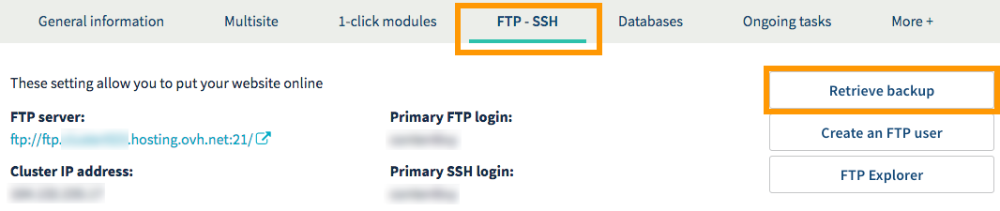
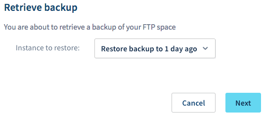
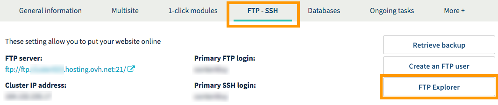
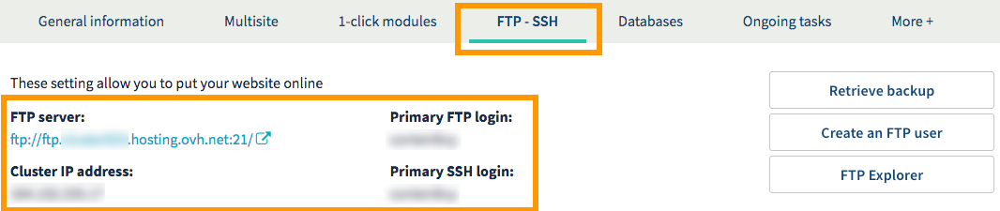
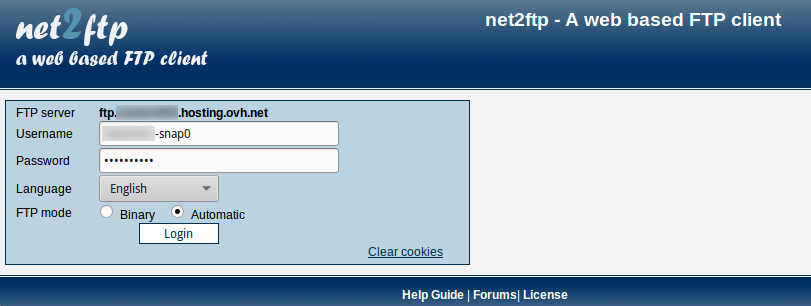

**Last updated 25th September 2018**

## Objective

With an OVH Web Hosting plan, you get a storage space to host your websites on. A range of actions (e.g. deleting or editing a file) could make your website inaccessible. As a result, you may find that you need to restore all of the data stored on your storage space, or simply a file stored on it.

**Find out how to restore a file or an entire storage space from your Web Hosting plan.**

## Requirements

- a [Web Hosting plan](https://www.ovh.co.uk/web-hosting/){.external} (please note that this does not work with Cloud Web)
- Depending on which method you use, you must be able to manage the Web Hosting plan from the [OVH Control Panel](https://www.ovh.com/auth/?action=gotomanager){.external}, or have the FTP user password required to access your storage space. 

## Instructions

Before you begin, ensure that you can use the restore dates offered to restore your Web Hosting plan’s storage space back to your chosen date:

- same day, at 00:01 (UTC+1)
- one day ago, at 00:01 (UTC+1)
- two days ago, at 00:01 (UTC+1)
- Sunday, at 01:00 (UTC+1)
- Sunday two weeks ago, at 01:00 (UTC+1)

If you want to retrieve a backup from an earlier period, OVH will not be able to provide you with this. We advise taking personal backups of your website in advance, and using those if you would like an earlier backup. 

You also need to decide which restore method you will use:

|Restore method|Description|
|---|---|
|Restoring via the OVH Control Panel|Restores the entire content of your storage space. The current content will be fully replaced by the content of the backup you have selected.|
|Restoring via software or an interface|Gives you read-only access to a backup of the storage space. Although this method is more technical, you can use it to recover one or more files from a previous date, without having to overwrite the entire contents of the storage space.|

Once you are ready to do so, carry on reading the section of this guide that is relevant to the restore method you have chosen.

- [Restore the storage space via the OVH Control Panel](https://docs.ovh.com/gb/en/hosting/restoring-ftp-filezilla-control-panel/#restore-the-storage-space-via-the-ovh-control-panel){.external}.

- [Restore a file using a software program or interface](https://docs.ovh.com/gb/en/hosting/restoring-ftp-filezilla-control-panel/#restore-a-file-using-a-software-program-or-interface){.external}.

### Restore the storage space via the OVH Control Panel.

First of all, log in to the [OVH Control Panel](https://www.ovh.com/auth/?action=gotomanager){.external}, click `Web Hosting`{.action} in the services bar on the left-hand side, then select the plan concerned. Go to the `FTP - SSH`{.action} tab, and click `Retrieve backup`{.action}.

{.thumbnail}

In the popup window that appears, select the restore date you want in the dropdown menu, using the information below:

|Date shown|Technical backup date|
|---|---|
|D-1|The same day, at 00:01 (UTC+1)|
|D-2|One day ago, at 00:01 (UTC+1)|
|D-3|Two days ago, at 00:01 (UTC+1)|
|1 week|Last Sunday, at 01:00 (UTC+1)|
|2 weeks|Sunday, 2 weeks ago, at 01:00 (UTC+1)|

Once you have selected a date, click `Next`{.action}. 

{.thumbnail}

Take a few minutes to check that none of your files will be lost after the restoration, e.g. any files saved on your storage space after the restore date you have selected. As a reminder, the restoration will effectively overwrite all of your current data, and replace it with the backup data.

Once you are ready to start restoring the backup, click `Confirm`{.action}.

### Restore a file using a software program or interface.

There are several stages to this procedure. Ensure that you have your FTP user password, which provides you with access to yout storage space. 

> [!warning]
>
> This solution requires knowledge of the software or interface you would like to use. We have provided general information below on how to proceed. We recommend contacting a specialist provider and/or getting in touch with the publisher of the interface or software if you encounter any difficulties. We will not be able to assist you ourselves.
>

#### Step 1: Decide on the software or interface you want to use.

First of all, decide which software or interface you would like to use in order to connect to your storage space backup.  If you have already decided on one, you can move straight to step 2. Otherwise, we recommend using one of the following three solutions:

- **Using FileZilla software.** You will need to download the software in advance, from the publisher’s website. You can learn how to use it by reading our guide on [Using FileZilla](https://docs.ovh.com/gb/en/hosting/web_hosting_filezilla_user_guide/){.external}. Please note that our guides cannot be used as a substitute for the publisher’s official documentation.

- **Using Cyberduck software.** You will need to download the software in advance, from the publisher’s website. You can learn how to use it by reading our guide on [Using Cyberduck](https://docs.ovh.com/gb/en/hosting/web_hosting_cyberduck_user_guide_on_mac/){.external}. Please note that our guides cannot be used as a substitute for the publisher’s official documentation.

- **Using the FTP Explorer interface.** To use this method, you will need to log in to the [OVH Control Panel](https://www.ovh.com/auth/?action=gotomanager){.external}. Once you have logged in, click `Web hosting`{.action} in the services bar on the left-hand side, then choose the Web Hosting plan concerned. Go to the `FTP - SSH`{.action} tab, and click `FTP Explorer`{.action}.

Once you are ready to start making changes, continue to the next step.

{.thumbnail}

#### Step 2: Connect to your backup.

To access the backup data you would like to restore, you will need to log in to your storage space via the interface or software you have selected. To do this, you will need to have the FTP username, its password and your FTP server’s host name.

You can find this information in the `FTP - SSH`{.action} tab of your Web Hosting plan. If you no longer have the FTP user password, please refer to our guide on instructions set out in our documentation on [Modifying a FTP user password](https://docs.ovh.com/gb/en/hosting/modify-ftp-user-password/){.external}.

{.thumbnail}

You will need to enter your primary username (or FTP login) with a suffix determining the backup you want to connect to. Please use the information below to find out how to access the backup you want:

|Backup date|Suffix to add|Example of filled-in username|
|---|---|---|
|The same day, at 00:01 (UTC+1)|-snap0|ftpuser**-snap0**|
|One day ago, at 00:01 (UTC+1)|-snap1|ftpuser**-snap1**|
|Two days ago, at 00:01 (UTC+1)|-snap2|ftpuser**-snap2**|
|Last Sunday, at 01:00 (UTC+1)|-snap3|ftpuser**-snap3**|
|Sunday, 2 weeks ago, at 01:00|-snap4|ftpuser**-snap4**|

Please ensure that you replace ‘ftpuser’ with with your own primary FTP username in the above examples. Keep the suffix defining the backup date you would like to access.

The method for connecting to your storage space will differ depending on the interface or software you are using. Below, we have included an image showing how to connect via the FTP Explorer interface.

{.thumbnail}

#### Step 3: Gather the files you want to restore.

Once you have connected, gather the files you want to restore. To do this, explore the content until you find them, then retrieve them. The method you need to use will differ depending on the software or interface you are using.

Before you move on to the next step, ensure that you have gathered all the files you would like to restore, then disconnect from your storage space.

#### Step 4: Restore the files.

Once you have got the files you need to restore, connect to your storage space again. This time, however, do not add your FTP username to connect. By not entering this suffix, you will connect to the current content on your storage space, and not a backup from an earlier date.

Once you have connected, you can now restore the files you want. To do this, explore the content of your storage space until you find them, then download them, overwriting the old files.

## Go further

[Using FileZilla software with your Web Hosting plan](https://docs.ovh.com/gb/en/hosting/web_hosting_filezilla_user_guide/){.external}

Join our community of users on <https://community.ovh.com/en/>.