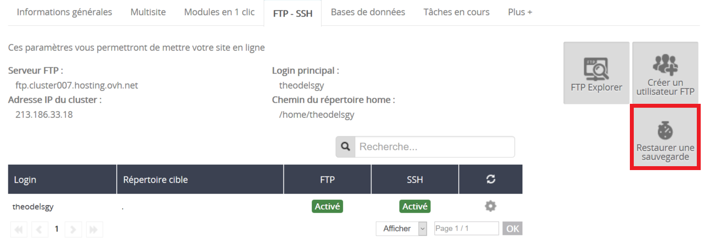
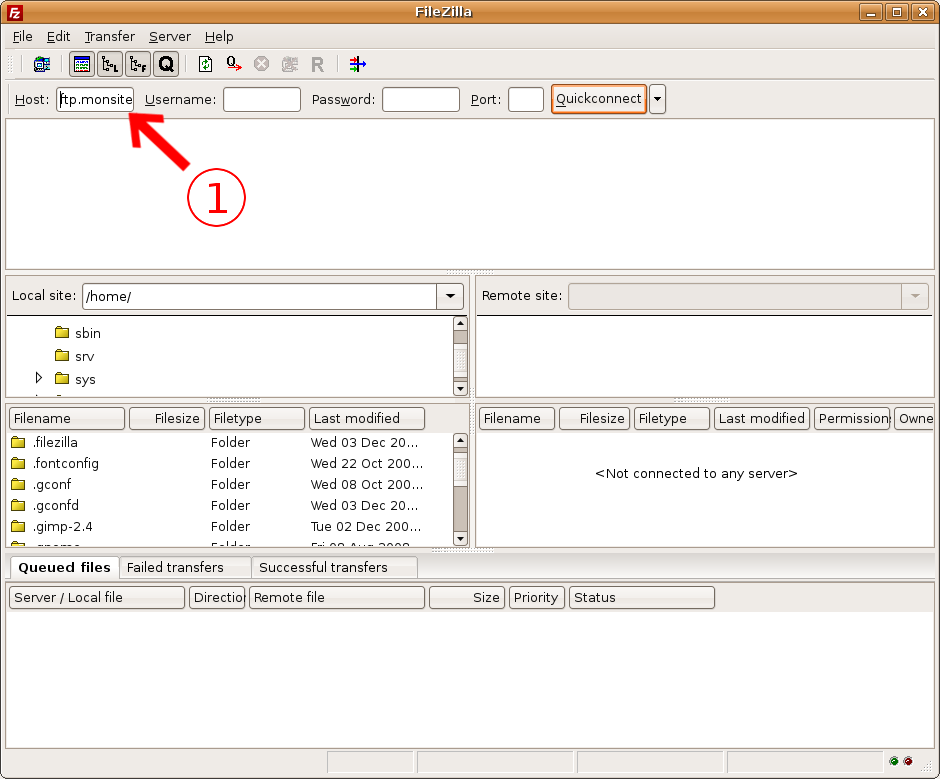

Vous avez supprimé un fichier par mégarde ? Des scripts ont été modifiés et votre site ne fonctionne plus ?

OVH met à votre disposition 5 sauvegardes de vos données, suivant la date désirée.

Ce guide vous explique comment restaurer la partie FTP.

## Recuperation via l'espace client
Depuis l'espace client, il vous est possible de restaurer automatiquement votre espace FTP à une date antérieure.

Pour cela dans l'espace client, sélectionnez l'hébergement concerné dans la section Hébergement.

Rendez-vous dans "**FTP-SSH**" puis "Restaurer une sauvegarde".

{.thumbnail}

Il vous est ensuite possible de choisir la date de restauration voulue via le menu déroulant.

Attention les données restaurées viendront remplacer les données actuelles de l'hébergement.

Cliquez sur "Suivant" pour confirmer l'opération. La totalité du FTP est restaurée avec ce système contrairement à la récupération de sauvegarde via FileZilla.

> [!primary]
>
> La restauration via l'espace client peut prendre quelques heures avant d'être finalisée.
> Suivez l'opération dans l'onglet "Tâches en cours".
> 

## Recuperation via FileZilla

### Nom d'hote
Connectez-vous à votre client FTP (dans notre exemple FileZilla : [https://www.ovh.com/fr/hosting/guides/g1380.mutualise_guide_utilisation_filezilla](https://www.ovh.com/fr/hosting/guides/g1380.mutualise_guide_utilisation_filezilla){.external} ).

Renseignez votre nom d'hôte dans le champ correspondant. Généralement *ftp.votre_nom_de_domaine.com* ou *ftp.votrecluster.hosting.ovh.net*.

Exemple : Avec votre domaine monsite.com Votre nom d'hôte sera : ftp.monsite.com ou ftp.cluster0XX.hosting.ovh.net (remplacez les "XX" par votre cluster)

[Retrouver vos identifiants FTP ?]({legacy}1374){.ref}

- Vous devez utiliser votre mot de passe FTP habituel.
- Le port à renseigner est le port 21.

{.thumbnail}

### Login Ftp
Renseignez le login FTP suivant la sauvegarde que vous souhaitez récupérer. A savoir :

- **MonIdentifiantFtp-snap0** : sauvegarde à J-0 (le jour même à 00H01 du matin)
- **MonIdentifiantFtp-snap1** : sauvegarde à J-1 (la veille à 00h01 du matin)
- **MonIdentifiantFtp-snap2** : sauvegarde à J-2 (l'avant-veille à 00H01 du matin)
- **MonIdentifiantFtp-snap3** : sauvegarde à S-1 (le dimanche précédent, à 01h00 du matin)
- **MonIdentifiantFtp-snap4** : sauvegarde à S-2 (le dimanche 2 semaines avant, à 01h00 du matin)

Par exemple, votre login FTP pour récupérer une sauvegarde de l'avant-veille sera :

- toto-snap2

{.thumbnail}

### Mot de passe FTP
Renseignez votre mot de passe FTP habituel.

Il s'agit du même mot de passe que votre accès FTP classique, modifiable dans votre espace client, section Hébergement.

Validez ensuite vos informations afin d'établir la connexion.

{.thumbnail}

### Recuperation de la sauvegarde des fichiers
Récupérez les fichiers et dossiers de votre choix, les fichiers présents correspondront à la sauvegarde demandée.

Un simple glissé-déposé de la partie "Site distant" vers "Site local" vous permet de récupérer vos données directement sur votre ordinateur.

Retrouvez le guide sur FileZilla si besoin : [https://www.ovh.com/fr/hosting/guides/g1380.mutualise_guide_utilisation_filezilla](https://www.ovh.com/fr/hosting/guides/g1380.mutualise_guide_utilisation_filezilla){.external}

{.thumbnail}

### Connexion a l'hebergement web actuel
Connectez-vous désormais avec vos identifiants FTP classiques afin de vous connecter sur votre hébergement web actuel, et plus à l'espace de sauvegarde.

{.thumbnail}

### Mise en place des fichiers de sauvegarde
Transférez enfin les données récupérées au préalable sur votre ordinateur vers le site distant.

De la même façon, un simple glissé-déposé de gauche à droite vous permettra de copier vos fichiers et dossiers en quelques instants.

{.thumbnail}