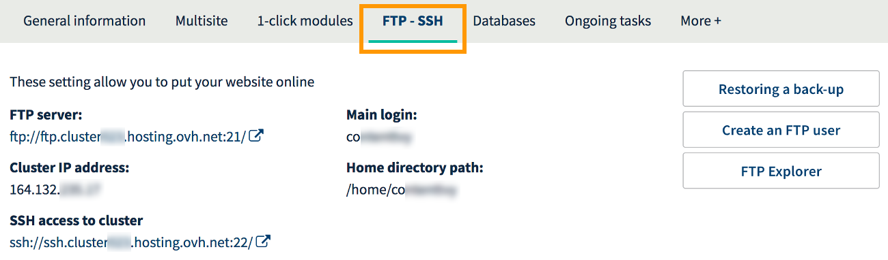

**Last updated May 29th, 2018**

## Objective

There are a multitude of different websites on the internet. Whether you are creating a blog or an online store, sharing your hobby or promoting your work, your [OVH Web Hosting space](https://www.ovh.co.uk/web-hosting/){.external} lets you host the site you want, provided it is compatible with the [configuration of our infrastructures](http://pro.ovh.net/infos/){.external}.

**Learn how to publish a website on your OVH Web Hosting space.**

## Requirements

- You must have an [OVH Web Hosting plan](https://www.ovh.co.uk/web-hosting/){.external}.
- You must have received an email confirming that your Web Hosting plan has been set up.
- You must have a [domain name](https://www.ovh.co.uk/domains/){.external} that can be used to access your website.
- You must be logged in to your [OVH Control Panel](https://www.ovh.com/auth/?action=gotomanager){.external}.

## Instructions

### Step 1: define your project

Having a clear idea of your objective is essential if your project is to be a success. What do you want to do with your website? How will you publish it? There are several potential ways to make your project become a reality with your OVH Web Hosting plan:

- **Use a turn-key site, with OVH’s 1-click modules.** This solution offers the benefits of a ready-made structure for your website that you can then customise (themes, text, etc.). OVH offers four such 1-click modules, compatible with our infrastructures, on the [“Create a website with 1-click modules”](https://www.ovh.co.uk/web-hosting/website/){.external} page.

- **Use a turn-key website that you install manually.** This solution gives you the benefit of a ready-made website structure that you can customise (themes, text, etc.), which you install yourself on your OVH Web Hosting space.

- **Create your website yourself.** This is a more technical solution that requires programming skills, but it does give you the option of creating a tailor-made project.

- **Migrate an existing website to OVH.** This solution may prove complicated if an interruption in service for the website concerned is not an option. To guide you through this process, you should consult the following guide: [“Migrating your website and emails to OVH”](https://docs.ovh.com/gb/en/hosting/migrating-website-to-ovh/){.external}.

Once you have examined these various possibilities, you can choose one of two options:

- **You wish to use our 1-click modules.** Refer to the instructions set out in our [“Install your website with 1-click modules”](https://docs.ovh.com/gb/en/hosting/web_hosting_web_hosting_modules/){.external} guide;

- **You do not wish to use our 1-click modules.** You will have to manually install your website on your hosting space. You may find the information set out in this documentation helpful, but it is no substitute for the assistance of a webmaster.
 
> [!warning]
>
> OVH is providing you with services for which you are responsible, including with regard to their configuration and management. You are therefore responsible for ensuring they function correctly.
> 
> This guide is designed to assist you in common tasks as much as possible. Nevertheless, we recommend that you enlist the services of a specialist provider and/or contact the service's software publisher if you encounter any difficulties. We will not be able to assist you ourselves. You can find more information in the “Go further” section of this guide.
>

### Step 2: putting your website files online in your storage space

There are several steps involved in manually publishing a website on a hosting space. Some of these steps will be optional, depending on which site you install, and there may be multiple ways of carrying them out. For most existing projects, however, there are two major steps involved in publishing a website, the first of which is uploading the website’s files to the relevant storage space.

Publication takes place in several sub-steps:

#### 1. Gather the files for the website

Make sure you have all the files for the website that you are looking to publish. If you are migrating an existing website, you can obtain these files from your former hosting provider.

#### 2. Log in to your storage space

If you have an FTP username, a password and a server address, you will be able to log in to your storage space. These elements were sent to you in the email informing you that your OVH Web Hosting plan had been set up. If you are no longer in possession of the password, refer to the instructions set out in this guide: [“Changing the password for an FTP user”](https://docs.ovh.com/gb/en/hosting/modify-ftp-user-password/){.external}.

To obtain the server address or username to allow you to access your storage space, log in to your [OVH Control Panel](https://www.ovh.com/auth/?action=gotomanager){.external}, then click on `Hosting Plans`{.action} in the service bar on the left. Select the name of the hosting plan concerned and click on the `FTP - SSH`{.action} tab.

{.thumbnail}

Once you are in possession of all the elements, you have three different options for connecting to your storage space:

- **Use OVH’s FTP Explorer.** This enables you to access your storage space via your browser. To use it, stay in the `FTP - SSH`{.action} tab, and click `FTP Explorer`{.action}.

- **Use FTP-compatible software.** You will need to install an FTP-compatible program on your computer (e.g. FileZilla). Since OVH did not create the software package you have installed, please contact its publisher if you encounter any difficulties when using it.

- **Using SSH access.** You will need to use commands from a terminal to interact with your storage space. More advanced knowledge and a specific [OVH Web Hosting plan](https://www.ovh.co.uk/web-hosting/){.external} are required to use this type of access.

#### 3. Uploading the files to the storage space

Once you have logged in to your storage space, all you need to do is place the files for your website online. **We urge you to exercise particular care when selecting the folder to which you upload the files.** For conventional websites, the files should be uploaded to the “www” folder. However, if you host several websites on your hosting space, you have almost certainly registered several **Multisites**.

To identify the folder from which the website should be published, go to the `Multisite`{.action} tab in your OVH Control Panel. In the table shown, check the `Root folder`{.action} stated for the domain in question. This is the folder in which you should publish the files for your website.

You may find a file called “index.html” in your storage space. This file may have been created by OVH during the installation of your Web Hosting plan in order to show a default page for your website. If this is the case, remember to delete it when you are putting your files online.

{.thumbnail}

### Step 3: connecting your website to a database

> [!primary]
>
> This step is optional if your website does not need to be connected to a database.
>

Today, virtually all content management systems (CMSs), such as WordPress or Joomla!, use a database for storing dynamic elements, such as comments or articles. It is therefore essential for the files of the website and the database to be connected if the website is to function correctly. To establish this connection, a configuration file that contains the database’s information is used.

Depending on the website used, this connection may need to be established manually, or via an interface generated by the site itself. This is done through several sub-steps, some of which may be optional.

#### 1. Recover the existing database (optional)

If you are migrating an existing website, you can recover your existing database from your former hosting provider. If it is a new website, you can move on to the next step.

#### 2. Create the database with OVH (optional)

If you already have a database and wish to use it (from an [OVH Web Hosting plan](https://www.ovh.co.uk/web-hosting/){.external}, a [Private SQL](https://www.ovh.co.uk/web-hosting/sql-options.xml){.external}, or a [Cloud DB](https://www.ovh.co.uk/cloud/cloud-databases/){.external}) you will need your username and password, the name of the database and the address of the server. You can now proceed to the next step.

If you want to create a new database with OVH, log in to your [OVH Control Panel](https://www.ovh.com/auth/?action=gotomanager){.external}, then click on `Hosting plans`{.action} in the services bar on the left. Select the name of the hosting plan concerned and click on the `Database`{.action} tab.

Now click the `Create a database`{.action} button, or, if this button is not shown, click on `Actions`{.action}, then on `Create a database`{.action}. Follow the instructions shown.

{.thumbnail}

#### 3. Import the existing database (optional)

If you are migrating an existing website, you can import your existing database into the newly created one. If it is a new website, you can move on to the next step.

There are several methods for importing a database. OVH offers one such method in your Control Panel. Once you are on the list of databases created for your services in your OVH Control Panel, click on the three dots to the right of the newly-created database, then on `Import file`{.action}. Now follow the instructions shown.

{.thumbnail}

#### 4. Connect your website to the database

Once your database is available and you have uploaded your files to your storage space, all you need to do is connect them. To do this, you will need the following information: a username, the associated password, the name of the database and the address of the server.

How this connection is created will depend on the type of website you are publishing. This process is dictated by how your website is configured and has nothing to do with OVH. We therefore recommend that you contact your website’s editor or a similar professional (such as a specialist service provider) if you need assistance with this procedure.

### Step 4: access your website

Once you have uploaded your files to your storage space and you have connected your database to it (if your website uses one), you can now access your website. Your site should display properly in your web browser.

If it does not display properly, we recommend that you:

- **Check the configuration of the domain name.** The DNS configuration of your domain name may be preventing the website you have just uploaded to your OVH Web Hosting space from displaying correctly. Make sure that the A record currently configured in the DNS zone for your domain corresponds to the IP address of your OVH Web Hosting plan.

- **Make sure that no files are missing.** When uploading your files to your OVH Web Hosting space, you may have forgotten to transfer some files, or an error may have occurred. Be careful during this process, however, to avoid breaking any links between the website’s files and the database (if the website uses one).

- **Check that there are no errors in the site's code.** This is definitely the most technical check to carry out, but the files you have uploaded may contain errors, which are preventing the server from displaying your website correctly.

As a reminder, if you encounter difficulties when publishing your website, we recommend that you contact a specialist and/or the publisher of the service (the CMS installed, for example).

## Go further

[Migrating your website and emails to OVH](https://docs.ovh.com/gb/en/hosting/migrating-website-to-ovh/){.external}

[Install your website with 1-click modules](https://docs.ovh.com/gb/en/hosting/web_hosting_web_hosting_modules/){.external}

[Modifying an FTP user password](https://docs.ovh.com/gb/en/hosting/modify-ftp-user-password/){.external}

Join our community of users on <https://community.ovh.com/en/>.