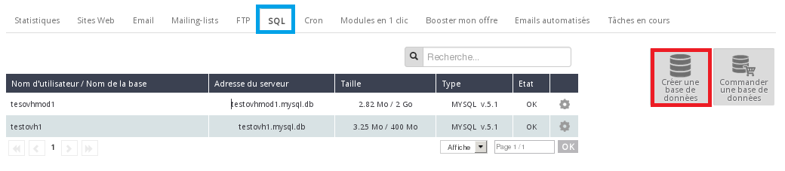
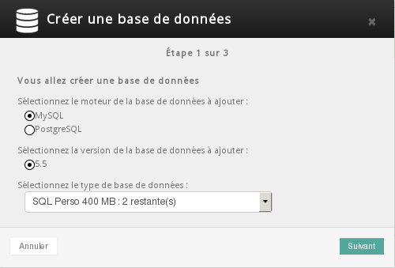
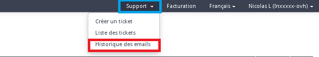
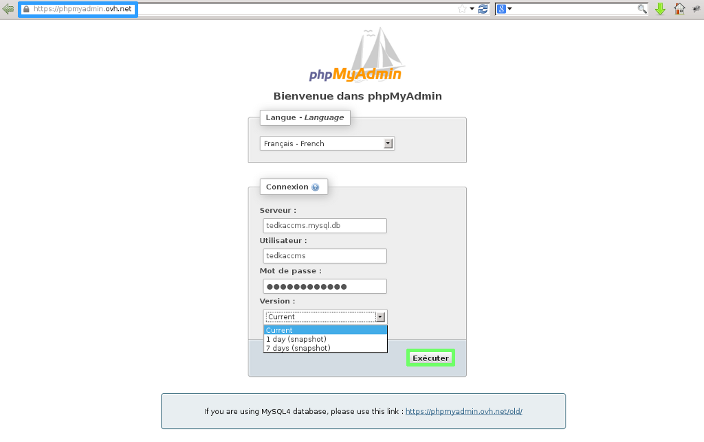
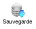
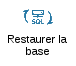
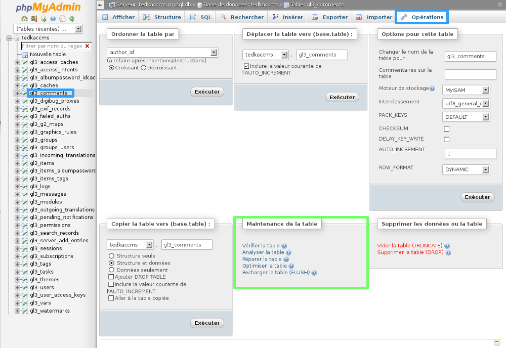
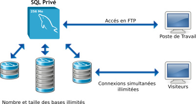
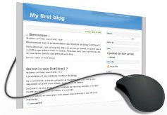

## Déposer mes fichiers en FTP

### Généralités

Un site Internet est fonctionnel et s'affiche correctement, uniquement s'il est placé dans le répertoire adéquat. Considérant la norme standard, vous devez placer les fichiers de votre site Internet dans le répertoire "www" de votre hébergement mutualisé afin qu'il s'affiche. Pour cela, il est nécessaire de passer par une étape de transfert de fichiers sur votre hébergement. Il faudra donc utiliser un logiciel utilisant ce protocole de transfert de fichiers ( **F** ile  **T** ransfert  **P** rotocol). 

Nous utiliserons [FileZilla](http://www.filezilla.fr){.external}, qui est un logiciel gratuit (gratuiciel).


### Récupérer mes identifiants FTP

Lors de la souscription à votre offre d'hébergement mutualisé OVH, vous avez reçu un e-mail suite à l'installation de vos services. Cet e-mail contient - entre autres - les identifiants FTP nécessaires. En fonction de votre offre et de votre domaine rattaché à l'hébergement, le sujet de l'e-mail se présente comme suit :

```bash
cas d'une offre Perso commandée pour le domaine "votre-domaine.tld"

[OVH-perso] votre-domaine.tld installé
```

Contenu :


```bash
[...]
VOS CODES FTP
-------------

Ces codes vous permettront de mettre votre site en ligne
(Attention: Vos données doivent être mises en place dans le répertoire www)

Serveur ftp          : ftp.cluster0XX.hosting.ovh.net
Login ou utilisateur : loginftp
Mot de passe         : mDpFtP

[...]
```

C'est donc ce couple login et mot de passe dont vous aurez besoin pour vous connecter.

Si depuis l'installation, le mot de passe FTP a été modifié, récupérer le mot de passe dans cet e-mail ne servira à rien. Cela voudrait dire que vous l'avez modifié depuis l'espace client. Le login quant à lui est immuable, conservez-le.


### Dans l'espace client

Une fois connecté à votre espace client, sélectionnez votre hébergement concerné dans la section "Hébergement". Cliquez sur l'onglet  **"FTP"** . Cliquez sur la roue crantée à droite de votre login puis "changer le mot de passe". Le login associé est rappelé à ce niveau. Saisissez le nouveau mot de passe souhaité, confirmez-le et cliquez sur "Valider". Ce mot de passe doit faire entre 8 et 12 caractères alphanumériques.

Il faudra patienter quelques minutes le temps de sa prise en compte.


### Utiliser FileZilla

*Un guide est disponible concernant l'utilisation de FileZilla :* [Utilisation du logiciel FileZilla avec votre hébergement](https://docs.ovh.com/fr/hosting/mutualise-guide-utilisation-filezilla/){.external}

Les éléments que vous devez déjà avoir en votre possession :

- les fichiers de votre site internet
- le fichier de sauvegarde de votre base de données (si nécessaire)

Vos identifiants FTP :

- hôte : ftp.cluster0XX.hosting.ovh.net
- login : votre login FTP
- mot de passe : le mot de passe associé (cf. paragraphes précédents)
- port : 21 (pour connexion SSH : 22 - à partir de l'offre Pro)


{.thumbnail}


## Base de données

### Généralités

Une base de données vous permet de stocker les informations en lien avec votre site internet, ou de vos applications.

Elle permet de stocker différents types de données, le contenu de votre site, les urls de vos pages, les informations de vos visiteurs.

Différents moteurs de base de données sont accessibles sur les offres mutualisées d'OVH :  **MySQL** ou **PostgreSQL**.


### Créer la base de données

Lors de l'installation de votre offre d'hébergement, la base de données incluse n'est pas automatiquement installée sur l'offre. Vous ne recevez donc pas automatiquement ces informations par e-mail. Vous devrez dans un premier temps créer votre base de données. Connectez-vous à votre espace client, sélectionnez l'hébergement concerné dans la section `Hébergement`{.action}.

Puis dans le menu `SQL`{.action} et `Créer une base de données`{.action}


{.thumbnail}

Sélectionnez le moteur de la base de données : "Mysql ou PostgreSQL." Sélectionnez le type de base de données puis "Suivant"

Il vous sera alors demandé de saisir un nom d'utilisateur et un mot de passe.

Un e-mail avec les identifiants de la base de données vous sera envoyé.

Vous recevez par e-mail, quelques minutes après, les informations relatives à votre base de données.


{.thumbnail}


### Récupérer mes identifiants SQL

- Attention votre base de données n'est pas automatiquement créée lors de l'installation de l'offre d'hébergement.

Un e-mail avec les identifiants de la base de données vous sera envoyé suite à la création. Vous pouvez retrouver cet e-mail depuis votre espace client. Une fois connecté, cliquez sur le menu Support puis Historique des e-mails.


{.thumbnail}

Le sujet de l'e-mail se présente comme suit :


```bash
[MySQL] La base MySQL Nom_de_la_BDD
```

Contenu :


```bash
[...]

Votre base MySQL a été installée sur notre serveur.

Voici les données techniques:
-----------------------------

MySQL:
Serveur        : mysql51-66.pro
Utilisateur    : Nom_de_la_BDD
Nom de la base : Nom_de_la_BDD
Mot de passe   : ************

[...]
```

Il vous est possible de modifier le mot de passe de votre base de données directement depuis l'espace client.

- Attention : modifier le mot de passe de la base de données n'est pas anodin. Cela peut entrainer une coupure du site ou des services utilisant cette base de données.

Si vous souhaitez modifier le mot de passe de votre base de données rendez-vous sur l'espace client, sélectionnez votre hébergement, puis rendez-vous dans : "SQL" -> Il faut cliquer sur la roue crantée à droite de votre base puis : "changer le mot de passe".

Vous aurez la possibilité de mettre à jour le mot de passe de votre base de données.

*Pensez à mettre à jour le fichier de configuration de votre site afin qu'il se connecte à la base de données avec le nouveau mot de passe si un site hébergé est présent sur l'hébergement lors de la modification.*


### Connexion PhpMyAdmin

Vous devez dans un premier temps vous connecter sur [l'interface de PhpMyAdmin](https://phpmyadmin.ovh.net/){.external}.

Vous devrez renseignez les champs demandés :

- *Serveur :* utilisateur .mysql.db (l'utilisateur est renseigné dans l'e-mail de création de la base de données).
- *Utilisateur :* il est renseigné dans l'e-mail de création de la base de données.
- *Mot de passe :* le mot de passe de votre base de données.
- *Version :* vous pouvez choisir de vous connecter sur la base de données actuelle, ou sur une sauvegarde à 1 ou 7 jours.

Renseignez les paramètres demandés et cliquez sur `Exécuter`{.action} pour vous connecter.


{.thumbnail}


> [!success]
>
> - Pour les bases de données de type MYSQL4 veuillez utiliser le lien renseigné en dessous de l'interface de connexion.
>

### Exporter une base de données

Comment exporter ma base de données SQL ? Quelles sont les différentes méthodes pour réaliser le backup de ma base de données ?

*Un guide est disponible concernant l'exportation d'une base de données :* [Exportation des bases de données](https://docs.ovh.com/fr/hosting/exportation-bases-donnees/){.external}


{.thumbnail}


### Importer une base de données

Comment importer le backup de ma base de données MySQL ? Quelles sont les différentes méthodes pour le faire ?

*Un guide est disponible concernant l'importation de base de données MySql :* [Importation d’une base de données MySql]({https://docs.ovh.com/fr/hosting/mutualise-guide-importation-dune-base-de-donnees-mysql/){.external}


{.thumbnail}


### Réparer - optimiser - analyser

Il vous est possible de réparer, d'optimiser ou d'analyser les tables de votre base de données.

Pour cela connectez-vous à votre base de données depuis [l'interface de PhpMyAdmin](https://phpmyadmin.ovh.net/){.external}.

Sélectionnez ensuite la table pour laquelle vous souhaitez réaliser l'une de ces opérations.

Cliquez ensuite sur `Opérations`{.action} en haut à droite.

Vous pourrez réaliser les différentes opérations souhaitées dans l'onglet `maintenance`{.action} de la table.


{.thumbnail}


### Utilisation du SQL privé

Vous souhaitez savoir comment utiliser le serveur SQL Privé ? Savoir comment importer et exporter vos données ?

*Un guide est disponible concernant l'utilisation du serveur SQL Privé :* [Tout sur le SQL Privé](https://docs.ovh.com/fr/hosting/tout-sur-le-sql-prive/){.external}


{.thumbnail}


## Installer un CMS grâce aux modules en 1 clic OVH

### Guide d'installation

Vous avez besoin de [créer votre site](https://www.ovh.com/fr/hebergement-web/site/){.external} très rapidement sans besoin de connaissances techniques sur la création de sites ?

*Un guide est disponible concernant l'installation des modules en 1 clic chez OVH :* [Installer son site avec les modules en 1 clic](https://docs.ovh.com/fr/hosting/modules-en-1-clic/){.external}


{.thumbnail}


## Installer manuellement mon CMS

### WordPress nouvelle installation

WordPress est un système de gestion de contenus (CMS) qui permet de créer et gérer facilement un site web ou un blog. Gratuit et libre, WordPress peut être personnalisé grâce à de nombreux thèmes et extensions.

- Blog & Site

{.thumbnail}


### Joomla nouvelle installation

Joomla est un système de gestion de contenus (CMS) Gratuit et libre, Joomla peut être personnalisé grâce à de nombreux thèmes et extensions. Ce CMS est un logiciel web qui permet de gérer en ligne un site Internet ou Intranet dynamique en toute simplicité.

- Site Web


{.thumbnail}

### PrestaShop nouvelle installation

PrestaShop est une application Web open source permettant de créer une boutique en ligne dans le but de réaliser du commerce électronique.

- Boutique en ligne

{.thumbnail}


## Informations utiles

### Fichier .ovhconfig

Vous cherchez à modifier la version de PHP de votre hébergement mutualisé ? Ou encore d'activer phpfpm ?

*Un guide est disponible concernant l'utilisation et la configuration du fichier .ovhconfig** : *

- [Activer l’optimisation PHP sur son hébergement mutualisé OVH](https://docs.ovh.com/fr/hosting/activer-loptimisation-php-sur-son-hebergement-mutualise-ovh/){.external}
- [Configurer le PHP sur son hébergement web (Mutu 2014)](https://docs.ovh.com/fr/hosting/configurer-le-php-sur-son-hebergement-web-mutu-2014/){.external}


{.thumbnail}

### Librairies disponibles sur les hébergements mutualisés

Information sur les librairies disponibles :


|Librairie|Disponibilité|
|---|---|
|ffmepg|non activé|
|GD|activé|
|imagemagik|activé|
|zend (opcache)|activé|
|PDO|activé|
|Zip - Gzip|activé|


{.thumbnail}


> [!success]
>
> Attention : via l'utilisation de PHP-FPM, et pour des raisons de sécurité, les options suivantes sont désactivées (dépréciées par PHP) :
>
> - register_globals
> - magic_quotes_gpc
>

### Optimiser les performances de mon site web

Vous souhaitez diagnostiquer les lenteurs de votre site internet ? Ou vous souhaitez simplement améliorer les performances de votre site ?

*Un guide est disponible concernant le diagnostic des lenteurs sur votre site, et l'optimisation de ces performances :* [Optimisation des performances de votre site](https://docs.ovh.com/fr/hosting/optimisation-performances-site/){.external}


{.thumbnail}