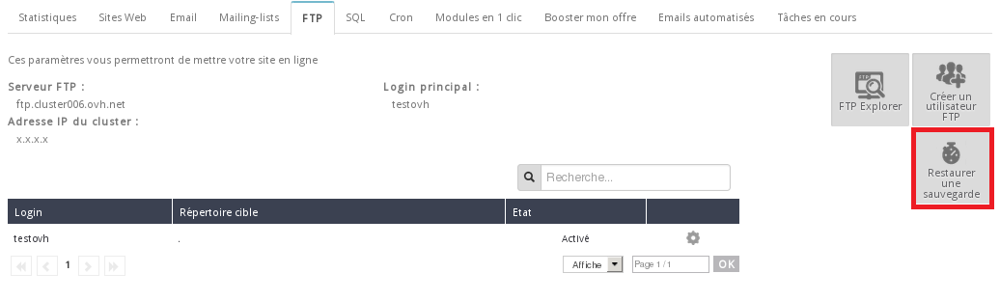

## Informazioni generali
Un sito Internet funziona e viene visualizzato correttamente solo se è collocato nella giusta directory.
Lo standard prevede che i file del tuo sito Internet vengano inseriti nella directory "www" del tuo hosting condiviso. Per farlo, trasferisci i file sul tuo hosting condiviso con un software che utilizza il File Transfert Protocol, come il client gratuito [FileZilla](http://filezilla-project.org/).


## Ripristina un backup del tuo spazio FTP

### Nell'email di installazione del tuo hosting
Al momento dell'ordine del tuo hosting condiviso OVH, ricevi un'email con le informazioni utili per l'installazione dei tuoi servizi.
In questa email trovi anche le credenziali FTP necessarie.
In base all'offerta che hai attivato e al tuo dominio associato all'hosting, l'oggetto dell'email è di questo tipo:


```
/*per un'offerta Personale attivata per il dominio "tuo-dominio.tld" */

[OVH-perso] tuo-dominio.tld installato
```


Contenuto:


```
[...]
I TUOI CODICI FTP
-------------

Questi codici ti permettono di mettere online il tuo sito.
(Attenzione: i tuoi dati devono essere salvati nella directory www)

Server FTP: ftp.tuo-dominio.tld o ftp.cluster0XX.ovh.net
Login o user: loginftp
Password: mDpFtP

[...]
```


Se dopo l'installazione hai modificato la password FTP dal tuo Spazio Cliente OVH, sarà inutile recuperarla in questo file. Il login, invece, non è modificabile: conservalo attentamente!


### Nel tuo Spazio Cliente OVH
Accedi al tuo Spazio Cliente OVH, seleziona il tuo hosting nella sezione Hosting, clicca sul tab FTP-SSH e poi sulla ruota dentata a destra del tuo login. Seleziona Modifica la password.
La nuova password dovrà contenere min. 8 e max. 12 caratteri alfanumerici. Una volta inserita, clicca su Conferma.

La modifica diventerà effettiva dopo alcuni minuti.


### Come funziona FileZilla?

[]({legacy}1380)

Ti serviranno:

- i file del tuo sito Internet
- il file di backup del tuo database (se necessario)

Le tue credenziali FTP:

- Host: ftp.tuo-dominio.tld o ftp.cluster0XX.ovh.net
- Login: il tuo identificativo FTP
- Password: la password FTP associata (vedi sopra)
- Porta: 21 (per connessione SSH: 22, a partire dall'offerta Pro)


{.thumbnail}


## Ripristina un backup del tuo spazio FTP

### Dal tuo Spazio Cliente OVH
Per ripristinare il tuo spazio FTP a uno stato precedente, accedi al tuo Spazio Cliente OVH, seleziona il tuo hosting nella sezione Hosting, clicca sul tab FTP-SSH e poi su Ripristina un backup.

{.thumbnail}
A questo punto, puoi scegliere la data del backup che vuoi ripristinare.

Attenzione: i dati ripristinati sostituiranno quelli attuali.

Clicca su Seguente per confermare l'operazione. Sono necessarie alcune ore prima che i file vengano ripristinati.


- Con questo sistema l'FTP viene ripristinato completamente, diversamente dal recupero di un backup con FileZilla.


### Vuoi recuperare un backup completo o un file specifico in FTP con FileZilla?
Consulta la guida[]({legacy}1380)

## Database 

### Informazioni generali
Un database ti permette di archiviare le informazioni del tuo sito o delle tue applicazioni, come il contenuto, gli URL delle pagine e i dati dei visitatori.

Con l'offerta Web Hosting OVH hai accesso a diversi motori di database: MySQL, PostgreSQL e SQL Server (disponibile per l'offerta Hosting condiviso Windows).


### Crea il tuo database
Il database incluso nella tua offerta di hosting non viene creato automaticamente al momento dell'installazione.
In questa fase, quindi, non ti verrà inviata automaticamente nessuna email con le informazioni relative al tuo database.
Per prima cosa, crea il tuo database.
Accedi al tuo Spazio Cliente OVH, seleziona il tuo hosting nella sezione Hosting, clicca sul tab Database -> Crea un database

{.thumbnail}
Seleziona il motore del database da aggiungere: Mysql o PostgreSQL.

Seleziona il tipo di database e clicca su Seguente.

A questo punto, inserisci le tue credenziali.

Dopo qualche minuto riceverai un'email con le informazioni del tuo database.

{.thumbnail}


### Recupera le tue credenziali SQL

- Attenzione: al momento dell'installazione della tua offerta Hosting, il database non viene creato automaticamente.


Una volta creato, ricevi un'email con le credenziali necessarie per accedere al tuo database.
Puoi recuperare questa email in qualsiasi momento nel tuo Spazio Cliente OVH. Clicca sul tuo nome in alto a destra, seleziona "Il tuo account" -> "Email ricevute".

{.thumbnail}
L'oggetto dell'email è di questo tipo:


```
[MySQL] Database MySQL Nome_BDD
```


Contenuto:


```
[...]

Il tuo database MySQL è stato installato sul nostro server.

Specifiche:
-----------------------------

MySQL:
Server       : mysql51-66.pro
Username     : Nom_de_la_BDD
Nome database: Nom_de_la_BDD
Password     : ************

[...]
```


Puoi modificare la password del tuo database direttamente dal tuo Spazio Cliente OVH.

-Attenzione: la modifica della password del database può causare problemi come l'irraggiungibilità del tuo sito e l'interruzione dei servizi che utilizzano il tuo database.

Accedi al tuo Spazio Cliente OVH, seleziona il tuo hosting, clicca sul tab FTP-SSH e poi sulla ruota dentata a destra del tuo login. Seleziona Modifica la password.

Se al momento della modifica della password era presente un sito sul tuo hosting, verifica l'aggiornamento del file di configurazione del tuo sito affinché si colleghi al database con la nuova password.


### Connessione PhpMyAdmin
Innanzitutto accedi all'interfaccia [PhpMyAdmin](https://phpmyadmin.ovh.net/).

Inserisci le informazioni richieste:


- Server: utente.mysql.db (l'utente è indicato nell'email di creazione del database).

- Nome utente: è indicato nell'email di creazione del database.

- Password: password del tuo database.

- Versione: seleziona se connetterti al database attuale o a un backup di 1 o 7 giorni prima.


Clicca su Esegui per connetterti.

{.thumbnail}

- Per i database MySQL4, clicca sul link in fondo all'interfaccia di connessione.


### Esporta il tuo database
Vuoi esportare o effettuare il backup il tuo database SQL?

Consulta la guida[]({legacy}1394)

{.thumbnail}


### Importa il tuo database
Vuoi importare il backup del tuo database SQL?

Consulta la guida[]({legacy}1393)

{.thumbnail}


### Correggi, ottimizza e analizza le tabelle del tuo database
Puoi correggere, ottimizzare e analizzare le tabelle del tuo database accedendo all'interfaccia [PhpMyAdmin](https://phpmyadmin.ovh.net/).

Seleziona una delle tabelle su cui vuoi eseguire una di queste operazioni e clicca su Operazioni in alto a destra.

Clicca sul tab di manutenzione della tabella per effettuare le operazioni desiderate.

{.thumbnail}


### Utilizza SQL Privato
Vuoi sapere come si usa SQL Privato o come importare ed esportare i tuoi dati?

Consulta la guida[]({legacy}2023)

{.thumbnail}


## Guida di installazione
Vuoi creare velocemente il tuo sito ma non hai conoscenze tecniche? 

Consulta la guida sull'installazione dei moduli in 1 click OVH:[]({legacy}1402)

{.thumbnail}


### Nuova installazione WordPress

WordPress è un CMS che ti permette di creare e gestire facilmente il tuo sito o il tuo blog. È libero e gratuito e può essere personalizzato grazie a molti temi ed estensioni.


- Blog e Sito

Per installare manualmente WordPress, consulta la guida[]({legacy}1375)


{.thumbnail}


### Nuova installazione Joomla!

Joomla è un CMS libero e gratuito che può essere personalizzato grazie a molti temi ed estensioni.
È un software Web che ti permette di gestire online un sito Internet o una Intranet dinamica in tutta semplicità.


- Sito Internet

Per installare manualmente Joomla!, consulta la guida[]({legacy}1375)


{.thumbnail}


### Nuova installazione PrestaShop

PrestaShop è un'applicazione Web open source che ti permette di creare un negozio online e avviare il tuo e-commerce.


- Negozio online

Per installare manualmente PrestaShop, consulta la guida[]({legacy}1375)


{.thumbnail}


## File .ovhconfig
Vuoi modificare la versione PHP del tuo hosting condiviso o attivare PHP-FPM? 

Consulta le nostre guide sull'utilizzo e sulla configurazione del file .ovhconfig:


- []({legacy}1175)

- []({legacy}1207)


{.thumbnail}


## Libreria disponibile sul tuo hosting condiviso
Informazioni sulle librerie disponibili:

|Libreria|Disponibilità|
|---|---|
|ffmepg|non attiva|
|GD|attiva|
|imagemagik|attiva|
|zend (opcache)|attiva|
|PDO|attiva|
|Zip - Gzip|attiva|


{.thumbnail}
Attenzione: se utilizzi PHP-FPM, queste opzioni sono disattivate per ragioni di sicurezza:


- register_globals
- magic_quotes_gpc


## Ottimizza le performance del tuo sito
Noti rallentamenti sul tuo sito o vuoi semplicemente migliorarne le performance?

Consulta la guida[]({legacy}1396)

{.thumbnail}

