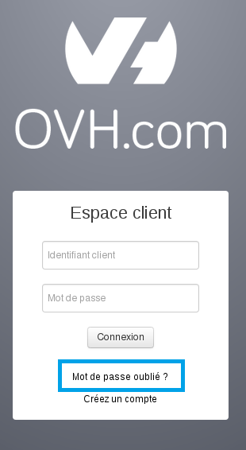
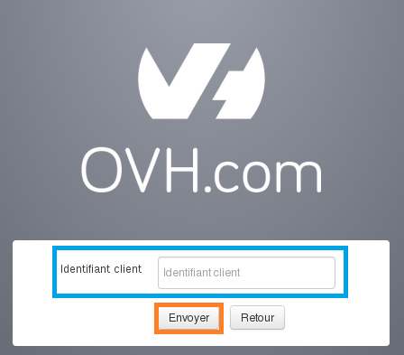
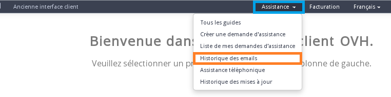
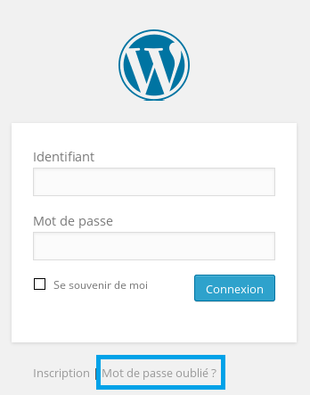
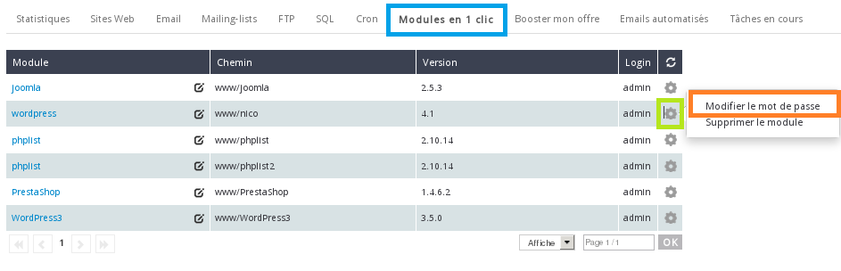

## Acceso al área de cliente de OVH
Se trata de la contraseña asociada a su nombre de usuario* OVH. Su nombre de usuario tiene el siguiente formato: «ab12345-ovh». 
Este identificador se genera automáticamente cuando se registra en el sitio web de [OVH](http://www.ovh.es).

* El nombre de usuario OVH también se conoce como ID de cliente, NIC Handle o NIC.
Usted mismo será el encargado de definir la contraseña asociada a su nombre de usuario. Por razones de seguridad, recibirá dicha contraseña por correo electrónico, ya que puede gestionar todos los servicios (creación, eliminación, modificación) directamente desde el área de cliente.
Si no recuerda su contraseña para acceder al [área de cliente](http://www.ovh.com/manager/web), puede modificarla desde la página de conexión haciendo clic en «Forgotten password?».

{.thumbnail}
A continuación, deberá introducir su ID de cliente (por ejemplo «ab12345-ovh») y hacer clic en «Submit».

{.thumbnail}
Recibirá un mensaje de correo electrónico en la dirección utilizó para registrarse. 
Esta dirección de correo debe ser válida. Si no, será necesario [cambiar la dirección de correo electrónico](https://www.ovh.es/cgi-bin/es/procedure/procedureChangeEmail.cgi) antes de modificar la contraseña.
Si no recuerda su ID de cliente y la dirección de correo electrónico no es válida, contacte con nuestro equipo de Soporte. 
Le solicitarán la confirmación de tres datos específicos. Si la información es correcta, le facilitarán su ID de cliente.

## Conexión FTP
Es necesario tener contratado un plan de web hosting para poder utilizar el protocolo FTP («File Transfert Protocol»).
Tras la instalación de su plan de web hosting, recibirá un mensaje de correo electrónico con su identificador FTP (login) y la contraseña asociada. 

Puede acceder a este mensaje de correo en cualquier momento desde su área de cliente. Para ello, haga clic en «Mi cuenta» >«Mensajes recibidos» > «Soporte > Historial de mensajes de correo».

{.thumbnail}
Todos los mensajes enviados por OVH se almacenan en esta sección por un período de tiempo ilimitado.
Si ha personalizado su contraseña, usted será la única persona que la conozca y no será posible acceder a ella desde el área de cliente, ya que esta información no se almacena en este espacio. Así pues, deberá modificarla desde el área de cliente.

Si necesita información sobre este procedimiento, consulte [nuestra guía](https://www.ovh.es/g1374.publicar-sitio-web-en-internet).

## La contraseña SQL (base de datos)
El plan de alojamiento gratuito Start10M no incluye base de datos.
La base de datos no se crea automáticamente tras la contratación del alojamiento compartido. Para ello, deberá crear la base de datos una vez instalado el alojamiento.

Si necesita información sobre este procedimiento, consulte [nuestra guía](https://www.ovh.es/g1374.publicar-sitio-web-en-internet).
La contraseña se personaliza en el momento de la creación y no se incluye en el mensaje de correo de confirmación que se le envía a continuación. 

Existen dos opciones si olvida la contraseña de su base de datos: 

- Su sitio está en línea y utiliza la base de datos: En este caso, la contraseña de la base de datos se menciona en un archivo incluido en su espacio FTP (por ejemplo, para WordPress este archivo se llama «wp-config.php»). 

- Ningún sitio utiliza la base de datos o, sencillamente, desea modificar la contraseña de la base de datos: En ese caso, será necesario modificar la contraseña desde el área de cliente. 

Si desea acceder a la información disponible sobre el procedimiento de modificación de la contraseña de una base de datos, consulte [nuestra guía](https://www.ovh.es/g1374.publicar-sitio-web-en-internet).
Atención: La modificación de la contraseña de la base de datos puede provocar un corte del sitio o de los servicios que utilizan esta base de datos. 

Si su hosting aloja un sitio web durante la modificación, recuerde actualizar el archivo de configuración de su sitio web para que se conecte a la base de datos con la nueva contraseña.

## Conexión al Webmail
Al crear una dirección de correo, usted mismo definirá su contraseña. Para conectarse al [webmail](https://ssl0.ovh.net), es necesario introducir una dirección de correo completa y una contraseña.
Si ha olvidado la contraseña de su dirección de correo, puede modificarla directamente desde su área de cliente. 

Si desea acceder a la información disponible sobre el procedimiento de modificación de la contraseña, consulte [nuestra guía](https://www.ovh.es/g1343.correo_guia_de_creacion_de_una_direccion_de_correo_electronico).
Para modificar la contraseña de una dirección de correo deberá actualizarla en su cliente de correo.

## Conexión SSH
Para conectarse en SSH («Secure Shell») es necesario contratar un plan de web hosting Profesional o superior. La conexión se realiza con las mismas claves que para la conexión FTP. 

Si desea contratar un plan de web hosting con conexión SSH, consulte nuestros [planes de web hosting](https://www.ovh.es/hosting/).

## Módulos en un clic
Al instalar un módulo en un clic, usted mismo definirá su contraseña de administrador y no la recibirá por correo electrónico.
Si ha olvidado su contraseña, podrá restablecerla desde la página de conexión a su módulo. 

Ejemplo para el módulo de WordPress:

{.thumbnail}
Si el módulo se ha instalado desde la nueva área de cliente, también es posible modificar la contraseña directamente esta plataforma. 

Conéctese a su área de cliente y seleccione su alojamiento en la sección «Alojamientos».

{.thumbnail}
A continuación, acceda al apartado «Módulos en un clic», haga clic en el icono de engranaje a la derecha y seleccione «Cambiar la contraseña».

{.thumbnail}

