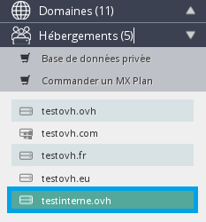

## L'acces au manager d'OVH
Il s'agit du mot de passe lié à votre identifiant* OVH. Votre identifiant est sous la forme "ab12345-ovh". Cet identifiant est généré automatiquement lors de votre inscription depuis le site [OVH](http://www.ovh.com){.external}.

*L'identifiant OVH est aussi appelé nic-handle ou nic.* Vous définissez vous-même le mot de passe lié à cet identifiant. Celui-ci ne vous sera pas transmis par e-mail pour des raisons de sécurité car depuis votre espace client vous pouvez gérer l'ensemble de vos services (création, suppression, modification). Si vous ne vous souvenez plus de votre mot de passe pour l'accès à votre [espace client](http://www.ovh.com/manager/web){.external}, vous pouvez modifier celui- ci depuis la page de connexion au manager OVH.

{.thumbnail}

Vous serez ensuite invité à saisir votre identifiant client (ex:"ab12345-ovh") et cliquer sur "envoyer".

{.thumbnail}

Un e-mail sera ensuite envoyé vers l'adresse e-mail que vous avez utilisée lors de votre inscription. Il est nécessaire que celle-ci soit valide. Dans le cas contraire il faudra réaliser une procédure de [modification d'adresse
e-mail](https://www.ovh.com/fr/cgi-bin/fr/procedure/procedureChangeEmail.cgi){.external} avant de pouvoir modifier le mot de passe. Si vous n'avez ni votre identifiant et que l'adresse e-mail de contact n'est plus valide, veuillez dans ce cas contacter le support. Nous vous demanderons 3 points d'identifications. Si vous pouvez confirmer ces 3 points, votre identifiant vous sera communiqué.

## La connexion FTP
Vous devez posséder une offre d'hébergement mutualisé afin de pouvoir utiliser le protocole FTP ( **F** ile  **T** ansfert  **P** rotocol). Suite à l'installation de votre offre d'hébergement, un e-mail vous sera envoyé. Celui-ci comprend l'identifiant FTP (login) et le mot de passe associé.

Vous pouvez retrouver cet e-mail à tout moment depuis votre espace client dans la section "Assistance" puis "historique des e-mails".

{.thumbnail}

Tous les e-mails transmis par OVH sont stockés sans limite de durée à ce niveau. Si vous avez personnalisé votre mot de passe, vous seul le connaissez. Vous ne pourrez pas le retrouver depuis votre espace client car nous ne stockons pas cette information dans le manager. Il sera alors nécessaire de le modifier depuis votre espace client. La procédure est décrite dans ce [guide](https://docs.ovh.com/fr/hosting/modifier-mot-de-passe-utilisateur-ftp/){.ref}.

## Le mot de passe SQL (base de donnees)

> [!alert]
>
> L'offre d'hébergement gratuit Start10M ne comprend pas de base de données.
> 

La base de données n'est pas crée automatiquement suite à la commande d'un hébergement mutualisé. Vous devez créer celle-ci une fois votre offre installée. La procédure de création d'une base de données est décrite dans ce [guide](https://docs.ovh.com/fr/hosting/creer-base-de-donnees/){.ref}. Le mot de passe est personnalisé dès la création et celui-ci ne sera pas mentionné dans le mail de confirmation transmis suite à la création.

Si vous oubliiez le mot de passe de votre base de données :

- votre site est en ligne, il utilise la base de données : dans ce cas le mot de passe de la base de donnée est mentionné dans un fichier présent sur votre espace FTP (ex: pour WordPress ce fichier est nommé : wp-config.php).
- vous n'avez pas de site utilisant la base de donnée, ou vous souhaitez simplement modifier le mot de passe de la base de données : dans ce cas il faut modifier le mot de passe depuis l'espace client. La procédure de modification du mot de passe d'une base de données est décrite dans ce [guide](https://docs.ovh.com/fr/hosting/modifier-mot-de-passe-base-de-donnees/){.ref} .

> [!alert]
>
> Attention : modifier le mot de passe de la base de données n'est pas anodin.
> Cela peut entrainer une coupure du site ou des services utilisant cette base de
> données.
> Pensez à mettre à jour le fichier de configuration de votre site afin qu'il se
> connecte à la base de données avec le nouveau mot de passe si un site est
> présent sur l'hébergement lors de la modification.
> 

## Connexion au Webmail
Lorsque vous créez une adresse e-mail, vous personnalisez directement le mot de passe. La connexion au [webmail](https://www.ovh.com/fr/mail/){.external} requiert l'adresse e-mail complète et le mot de passe. Si vous avez oublié le mot de passe de votre adresse e-mail, vous pouvez le modifier directement depuis votre espace client. La procédure de modification est décrite dans ce [guide](https://docs.ovh.com/fr/emails/modifier-mot-de-passe-adresse-email/){.ref}

> [!alert]
>
> La modification du mot de passe d'une adresse e-mail necessite sa mise à jour
> dans votre client de messagerie
> 

## La connexion SSH
Se connecter en SSH ( **S** ecure  **S** hell) nécessite de posséder une offre mutualisé  **PRO**  ou supérieure. La connexion se fait avec les mêmes identifiants et mot de passe que pour la connexion FTP.

Pour avoir une offre permettant l'accès via SSH, dirigez vous vers [nos offres](https://www.ovh.com/fr/hebergement-web){.external}

## Les modules en un clic
Lors de l'installation d'un module en un clic, vous personnalisez vous même le mot de passe administrateur. Celui-ci ne sera pas transmis par e-mail. Si vous oubliez le mot de passe, vous pouvez le régénérer depuis la page de connexion à votre module. Un lien est présent en cas de mot de passe oublié.

Un exemple pour le module WordPress :

{.thumbnail}

Si le module a été installé depuis le nouvel espace client, il est aussi possible de modifier le mot de passe depuis celui-ci.

Une fois connecté à votre espace client, il faut sélectionner l'hébergement concerné dans la section Hébergement.

{.thumbnail}

Vous devez ensuite sélectionner la section Modules en 1 clic puis cliquer sur la roue crantée de droite et Modifier le mot de passe

{.thumbnail}