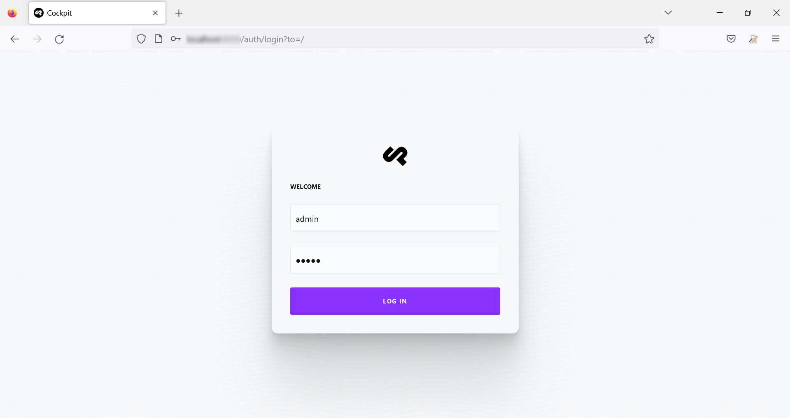
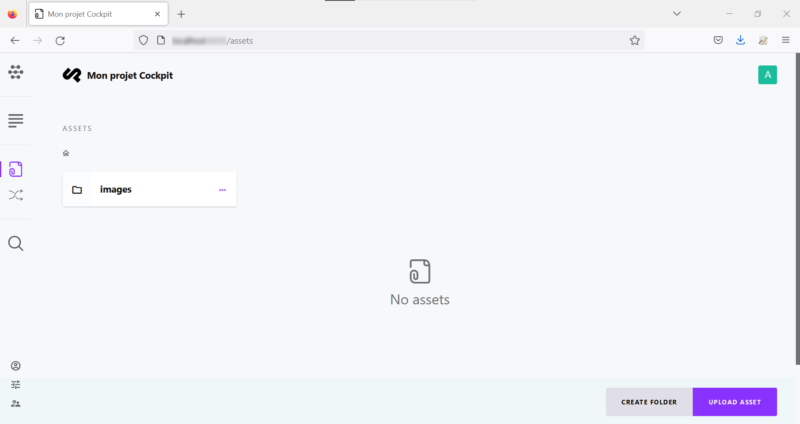

**Dernière mise à jour le 13/01/2023**

## Objectif

Ce guide a pour objectif de vous permettre d'installer le CMS (Content Management System) Headless [Cockpit](https://getcockpit.com/) sur votre [Hébergement Performance](https://www.ovhcloud.com/fr/web-hosting/performance-offer/) et de le configurer.
Cockpit va vous permettre de créer et structurer votre contenu, qui sera accessible via des API.

## Prérequis

Pour avoir des performances optimales, nous préconisons notre [Hébergement Performance](https://www.ovhcloud.com/fr/web-hosting/performance-offer/). Cette solution inclut, entre autres, un accès SSH qui va vous permettre d'installer une ou plusieurs solutions alternatives à celles proposées dans l'offre.

Pour mettre en place Cockpit, vous devrez intégrer les éléments suivants :
- être familier de la ligne de commande et de l'utilisation d'un terminal
- avoir paramétré votre zone DNS pour faire pointer votre nom de domaine (ou votre sous-domaine) sur votre serveur.

Cockpit utilise soit une base de données [MongoDB](https://www.mongodb.com/), soit la base de donnée [SQLite](https://www.sqlite.org/) intégrée à PHP.
Ce guide a été élaboré avec SQLite.

## En pratique

### Installer Cockpit

#### Préparer votre serveur

Dans votre Manager, configurez le pointage de votre nom de domaine vers le répertoire `cockpit`.
Votre hébergement dispose de toutes les extensions requises pour installer votre solution.

#### Téléchargez Cockpit

À la racine de votre serveur, créez un répertoire `cockpit` :

```sh
mkdir cockpit
```

Allez dans ce répertoire :

```sh
cd cockpit
```

Clonez les fichiers depuis le dépôt GitHub du projet Cockpit :

```sh
git clone https://github.com/Cockpit-HQ/Cockpit.git .
```

#### Installez Cockpit

L'installation se fait par votre navigateur en saisissant le nom de domaine que vous avez configuré suivi de `/install` : https://monsite.ovh/install (en remplaçant `monsite.ovh` par votre domaine).


### Accédez à l'interface d'administration

Revenez sur votre nom de domaine et saisissez les login et mot de passe par défaut (admin/admin) :



### Changer le mot de passe du compte admin

Pour des raisons évidentes de sécurité, changez le mot de passe `admin` du compte administrateur.

Cliquez sur l'icône en bas à gauche (Users) :


Cliquez ensuite sur le compte 'Admin' et modifiez les informations de ce compte via la formulaire affiché. Changez alors votre adresse mail, votre mot de passe et pensez à générer un token dans la rubrique « API Key » en cliquant sur le cercle terminé par une flèche. Si vous le souhaitez, vous pouvez également activer un second facteur d'authentification (2FA) :


N'oubliez pas de valider en cliquant sur « Update » en bas et à droite de la page.

### Configurer votre application

Les éléments de configuration se trouvent dans le fichier `config.php` situé dans le répertoire `/config/`.
À la racine de votre application, éditez ce fichier de configuration :

```sh
nano config/config.php
```

Le fichier sera vide par défaut :

```php
return [

];
```

Pour changer le nom de votre application, ajoutez la propriété `app.name` : 

```php
return [
    'app.name' => 'Mon projet Cockpit',
     'site_url' => 'https://monsite.ovh',
];
```

Vous trouverez plus de détail sur la [documentation](https://getcockpit.com/documentation/core/quickstart/configuration) relative à la configuration de Cockpit.

### Ajoutez des contenus

L'interface de Cockpit vous permet de créer des contenus en utilisant des modèles :


#### Contenus

Vous avez la possibilité de créer des Collections, qui seront des structures de données réutilisables, et des Singletons, réservés à des pages uniques. 
L'option Tree vous permettra d'organiser l'arborescence qui contiendra vos Collections et Singletons.

##### **Singleton**

##### **Collection**

##### **Tree**

#### Assets

Le menu « Assets » vous permet de gérer vos contenus. Créez des répertoires pour organiser vos contenus et uploadez vos images et illustrations :



Uploadez maintenant une image dans votre répertoire :


## Aller plus loin
