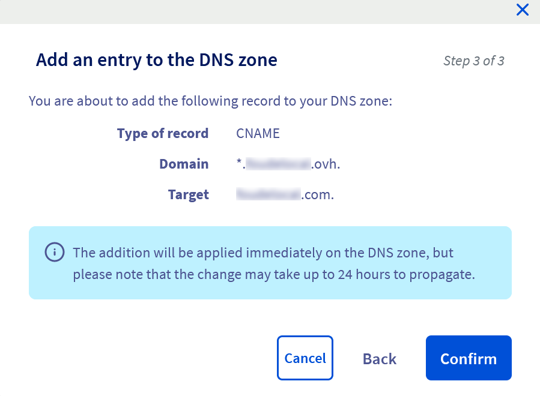
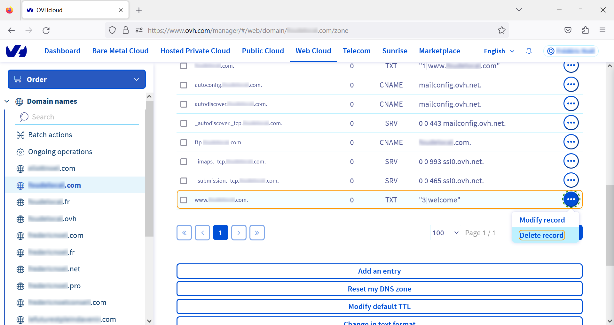

**Dernière mise à jour le 28/02/2023**

Ce guide a pour objectif de vous permettre de configurer la redirection de noms de domaines alternatifs vers votre nom de domaine principal.

> [!warning]
>
> OVHcloud met à votre disposition des services dont la configuration, la gestion et la responsabilité vous incombent. Il vous revient de ce fait d'en assurer le bon fonctionnement.
> 
> Plus d'informations dans la section [« Aller plus loin »](#go-further) de ce tutoriel.
>

## Prérequis

Vous devez disposer de plusieurs [noms de domaine](https://www.ovhcloud.com/fr/domains/) et d'un [hébergement web](https://www.ovhcloud.com/fr/web-hosting/) sur lequel les faire pointer.

Vous devez également avoir les accès à votre [manager OVH](https://www.ovh.com/manager/).

## En pratique

### Protéger son nom de domaine 

Vous disposez d'un nom de domaine pour votre site lié à votre activité avec une extension. Il est recommandé d'acheter plusieurs déclinaisons de votre nom de domaines (extensions comprises) pour les raisons suivantes :

- les internautes venant sur votre site sont susceptibles de faire une erreur de saisie. Acheter des noms de domaine comportant des orthographes différentes mais proches permettra à vos visiteurs ne saisissant pas correctement votre nom de domaine de venir sur votre site ;
- un concurrent peut acheter un nom de domaine semblable au votre ou avec une extension différente du votre ;
- si votre entreprise change de nom ou a utilisé un autre nom, il est recommandé de conserver les noms de domaines précédents ;
- le nom de votre entreprise ne correspond pas nécessairement à votre marque ou à vos produits ;
- les noms de domaines de premier niveau (`.com`, `.net`) évoluent et de nouveaux sont disponibles (`.click`, `.website`, `.agency`, `.beer`).

Enregistrer plusieurs noms de domaine peut aussi vous éviter le [cybersquatting](https://fr.wikipedia.org/wiki/Cybersquattage) de certains noms de domaine. Cette pratique peut vous contraindre à racheter votre nom de domaine à prix plus élevé ou vous exposer à une perte de trafic.

### Rediriger votre domaine vers un autre domaine

Rendez vous sur votre Manager :

{.thumbnail}

Cliquez sur `Web Cloud`{.action} puis `Noms de domaine`{.action} pour afficher la liste des noms de domaines gérés par votre compte OVH :

{.thumbnail}

Sélectionnez le nom de domaine que vous souhaitez rediriger vers un autre :

{.thumbnail}

Puis allez sur l'onglet `Redirection`{.action} :

{.thumbnail}

Et cliquez sur `Ajouter une redirection`{.action}. Une fenêtre modale s'ouvre dans laquelle vous serez invité à préciser sur la direction concerne votre nom de domaine ou un sous-domaine particulier :

{.thumbnail}

Choisissez ensuite l'option `vers une adresse web` :

{.thumbnail}

Puis `avec une redirection visible` :

{.thumbnail}

Vous pouvez préciser que la redirection sera permanente et rentrez l'URL vers laquelle pointer :

{.thumbnail}

Un fenêtre récapitulative vous permettra de vérifier vos informations avant validation :

{.thumbnail}

### Rediriger vos sous-domaines vers un autre domaine

Sur votre manager, dans `Web Cloud` et `Noms de domaine`, cliquez sur l'onglet `Zone DNS`{.action} :

{.thumbnail}

La méthode la plus simple consiste à ajouter une entrée `CNAME` pour faire pointer votre nom de domaine vers un autre (`.ovh` vers `.com` dans notre exemple).

Cliquez sur `Ajouter une entrée`{.action} :

{.thumbnail}

Dans la fenêtre modale qui s'ouvre, sélectionnez `CNAME` pour ajouter une nouvelle entrée dans votre zone DNS :

{.thumbnail}

Dans la fenêtre suivante, vous avez plusieurs champs à renseigner :

- sous-domaine, dans lequel vous saisirez le caractère `*` (pour tous les sous-domaines)
- TTL, **Time To Live** (à laisser par défaut)
- Cible, qui est le domaine sur lequel vous voulez pointer.

{.thumbnail}

La fenêtre finale récapitule la demande. Cliquez sur `Confirmer`{.action} pour valider :

{.thumbnail}

> [!warning]
>
> Par défaut, il existe un enregistrement TXT avec une cible `"3|welcome"`.
> Pour permettre au sous-domaine `www` d'être redirigée comme tous les autres sous-domaines, supprimez cette entrée.
>

Supprimez l'entrée TXT `"3|welcome"` :

{.thumbnail}

## Aller plus loin

- acheter un ou plusieurs [noms de domaine](https://www.ovhcloud.com/en-gb/domains/) chez OVH
- nos guides sur la gestion des [domaines et DNS](https://docs.ovh.com/gb/en/domains/)
- nos offres d'[hébergement web](https://www.ovhcloud.com/en-gb/web-hosting/).