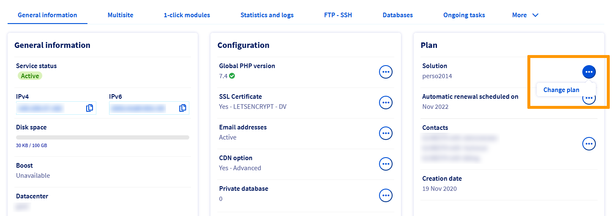
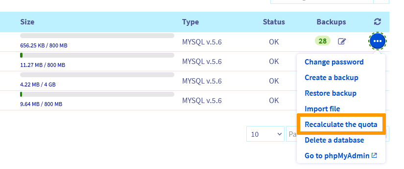
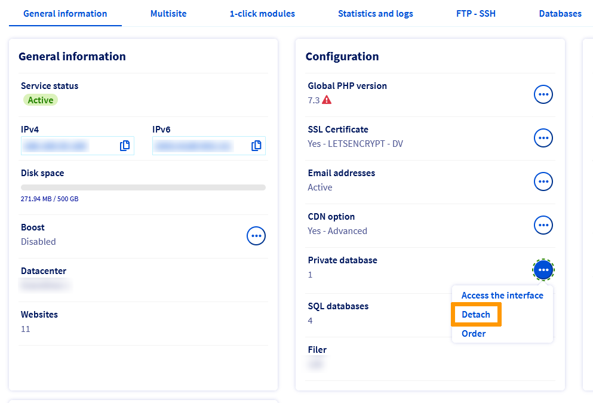
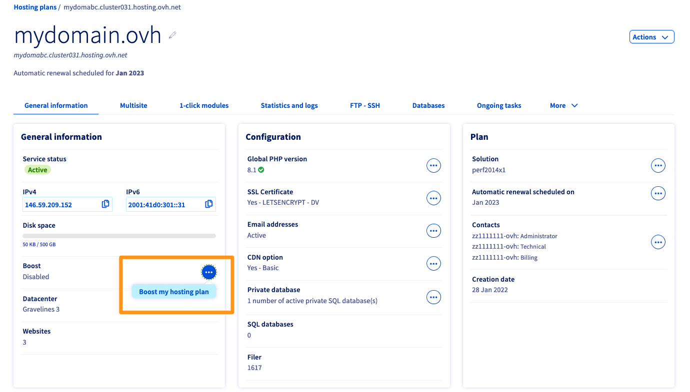
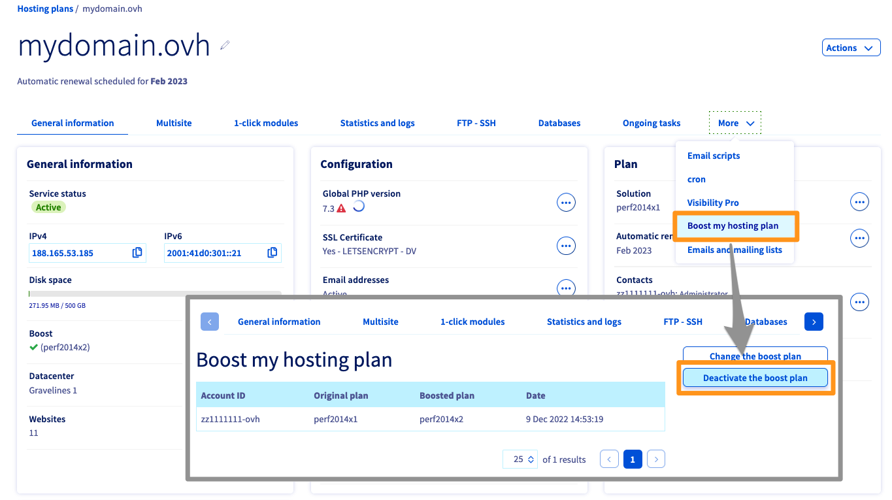

**Last updated 3rd January 2023**

## Objective

In your [OVHcloud Control Panel](https://ca.ovh.com/auth/?action=gotomanager&from=https://www.ovh.com/world/&ovhSubsidiary=we), you can increase the capacity of your [web hosting offers](https://www.ovhcloud.com/en-us/web-hosting/) to have more compute resources, storage space, databases or email accounts. Additional features such as [mailing lists](https://ovhcloud.com/en-us/emails/guide-dutilisation-mailing-list/) (from the [Professional plan](https://www.ovhcloud.com/en-us/web-hosting/professional-offer/)) or [Private SQL](https://www.ovhcloud.com/en-us/web-hosting/options/private-sql/) (included with the offers of the [Performance range](https://www.ovhcloud.com/en-us/web-hosting/performance-offer/)) will also become available with a subscription upgrade.

**Find out how to scale your OVHcloud hosting plan without any service interruptions.**

## Requirements

- An [OVHcloud web hosting plan](https://www.ovhcloud.com/en-us/web-hosting/)
- Access to the [OVHcloud Control Panel](https://ca.ovh.com/auth/?action=gotomanager&from=https://www.ovh.com/world/&ovhSubsidiary=we)

## Instructions

> [!warning]
>
> **Before** you make any changes to your current subscription, check to see if you have any of these questions:
>
> - [How do I get a temporary performance boost on my Performance hosting plan?](#boost)
> - [Will I waste the time remaining on my current hosting plan when I change plans?](#billing)
> - [Can I upgrade my current plan to a lower plan?](#checks)
>

### Modifying your hosting plan 

To change your subscription, go to your [OVHcloud Control Panel](https://ca.ovh.com/auth/?action=gotomanager&from=https://www.ovh.com/world/&ovhSubsidiary=we) in the `Web Cloud`{.action} section. Click `Hosting plans`{.action} and select the plan concerned.

In the `Plan` box, click the `...`{.action} button to the right of `Solution`, then `Change plan`{.action}.

{.thumbnail}

Then select your new subscription and its duration. Confirm the corresponding contracts, then click `Send`{.action}.

### Checking that your hosting plan is compatible with a lower plan 

> [!warning]
>
> You can only change your subscription to a lower range plan if it is the **immediate lower range** plan.
> For example, you cannot switch from *Performance 2* to *Professional* in a single operation.
> You will **first** need to downgrade your web hosting plan from the *Performance 2* plan to the *Performance 1* plan, **and then** to the *Professional* plan.

Before you make your switch to a lower range, check the following 6 items:

#### 1 - Number of sites

With the [Kimsufi Web](https://www.ovhcloud.com/en-us/web-hosting/old-web-hosting-offers/) solution, you cannot have more than one domain name on your hosting plan’s [multisite](https://ovhcloud.com/en-us/hosting/multisites-configuring-multiple-websites/).

Before you switch from the [Personal](https://www.ovhcloud.com/en-us/web-hosting/personal-offer/) solution to the [Kimsufi Web](https://www.ovhcloud.com/en-us/web-hosting/old-web-hosting-offers/) solution, please check that your web hosting plan only has one website.

#### 2 - Start SQL databases

Before moving your hosting to a lower plan, please ensure that the new plan has enough [databases](https://www.ovhcloud.com/en-us/web-hosting/options/start-sql/). Also make sure they are of sufficient size.

Otherwise, delete unused databases and reduce the amount of data they contain, if necessary. This quantity must not exceed the maximum size of the databases in the new solution (for any requests for assistance with the operations to be carried out, contact the [OVHcloud partners](https://partner.ovhcloud.com/en-us/directory/)).

If you have deleted data from your databases, you can recalculate the quota from the `Databases`{.action} tab in the `Hosting plans`{.action} section of the OVHcloud Control Panel. Click on the `...`{.action} button to the right of the database concerned, then `Recalculate the quota`{.action}.

{.thumbnail}

#### 3 - CloudDB

If you are using the [CloudDB](https://ovhcloud.com/en-us/hosting/getting-started-with-clouddb/#clouddb-server-activation-included-with-your-web-hosting-plan) solution included with your [Performance](https://www.ovhcloud.com/en-us/web-hosting/performance-offer/) hosting plan, and you wish to switch your hosting plan to a [Professional](https://www.ovhcloud.com/en-us/web-hosting/professional-offer/) solution, go to the `Hosting plans`{.action} section in your Control Panel. 
Click the `...`{.action} button in the `Private database`{.action} section, then `Detach`{.action}.

{.thumbnail}

With this action, you can order a CloudDB solution independent of your *Performance* subscription. Your server data will be stored.

If you do not want to keep this data, you can also delete your Private SQL before going to the *Professional* offer: 

1. Back up your data by following the instructions in this [guide](https://ovhcloud.com/en-us/hosting/backup-export-database-server/). 
2. Delete your CloudDB server via your [OVHcloud Control Panel](https://ca.ovh.com/auth/?action=gotomanager&from=https://www.ovh.com/world/&ovhSubsidiary=we). To do this, click on your name in the top right-hand corner, then `Service management`{.action}. Then click on the `...`{.action} button to the right of the row concerned, then `Delete my Private SQL hosting service`{.action}.

#### 4 - FTP space

Before switching your hosting plan to a lower plan, please ensure that the new plan includes enough [FTP storage space](https://ovhcloud.com/en-us/hosting/log-in-to-storage-ftp-web-hosting/) so that you can import files from your current hosting plan.

The quota used on your FTP hosting plan is visible in the `Hosting plans`{.action} section of the OVHcloud Control Panel. Click on the `General information`{.action} tab, and you will see the quota under `Disk space`.

{.thumbnail}

#### 5 - Email accounts

Please also check that your new solution has a sufficient number of available email accounts. Otherwise, delete the extra accounts, after you have [backed up](https://ovhcloud.com/en-us/emails/migrate-email-addresses-manually/) the contents if necessary.

If you would like to keep the same number of email accounts, before moving your web hosting to a lower plan, you can also order a new **MX Plan** email solution. In the `Emails`{.action} section of the OVHcloud Control Panel, click on the solution concerned, then on the `...`{.action} button to the right of `Solution`. Next, click `Change solution`{.action}.

{.thumbnail}

#### 6 - Mailing lists

The [Mailing lists](https://ovhcloud.com/en-us/emails/guide-dutilisation-mailing-list/) feature is optional on [Personal](https://www.ovhcloud.com/en-us/web-hosting/personal-offer/) and [Kimsufi Web](https://www.ovhcloud.com/en-us/web-hosting/old-web-hosting-offers/) hosting plans.

To set up your hosting plan on a [Personal](https://www.ovhcloud.com/en-us/web-hosting/personal-offer/) solution, you will need to delete the mailing lists first, or order an email solution with this feature (**MX Plan 100** or **MX Plan Full**) from your [OVHcloud Control Panel](https://ca.ovh.com/auth/?action=gotomanager&from=https://www.ovh.com/world/&ovhSubsidiary=we).

In the `Emails`{.action} section of your Control Panel, select the solution concerned, then click on `...`{.action} to the right of `Solution`{.action}. Next, click `Change solution`{.action}.

#### Completion

Once you have checked these 6 elements, you can [change your plan](#modify).

### Special cases

#### Boost your Performance web hosting plan temporarily 

With the [Boost option](https://www.ovhcloud.com/en-us/web-hosting/options/boost/), available on our *Performance* plans, you can temporarily increase your hosting system’s CPU and RAM resources to absorb seasonal traffic spikes. If this increase is prolonged over time, you can also [switch to a higher-level Performance plan](#modify) to have these resources permanently.

> [!warning]
>
> When you choose to enable the Boost option, the option remains active and is billed **until you disable it**.

If the **Boost** option suits your needs, below are the instructions for **enabling** or **disabling** this option on your web hosting plan.

> [!tabs]
> **Enable the Boost option**
>>
>> In the `General information` section of your Web Hosting plan, click on the `...`{.action} button to the right of `Boost`, then `Boost my plan`{.action}.  
>> {.thumbnail} 
>>
> **Disable the Boost option**
>>
>> In the `More` tab of your web hosting plan, click `Boost my plan`{.action}. 
>> The Boost option usage table will appear, click `Disable boost plan`{.action}.  
>> {.thumbnail} 

#### Billing in case of a change of offer 

When you upgrade your original plan to a higher plan, a *prorata temporis* calculation will be applied until the next renewal date for your original plan.
This calculation corresponds to the price difference between your initial solution and your new solution.

> **Example:** 
>
> You subscribed to a [Personal Hosting](https://www.ovhcloud.com/en-us/web-hosting/personal-offer/) subscription on January 1, 2022.
>
> On October 31, 2022, you upgrade from this **Personal** plan to a [Professional plan](https://www.ovhcloud.com/en-us/web-hosting/professional-offer/). 
>
> Therefore, the amount corresponding to the remaining duration on the **Personal** subscription (2 months, from November 1, 2022 to January 1, 2023) is automatically deducted from the cost of the new **Professional** subscription, until January 1, 2023. You will only pay the difference.
> From 1st January 2023, you will then be billed for your Professional subscription at its current price.

Please follow [these instructions](#modify) to change your plan.

## Go further 

[Accessing a website’s logs and statistics on a web hosting](https://ovhcloud.com/en-us/hosting/shared_view_my_websites_logs_and_statistics/)

[Optimising your website’s performance](https://ovhcloud.com/en-us/hosting/web_hosting_optimise_your_website_performance/)

For specialised services (SEO, development, etc.), contact [OVHcloud partners](https://partner.ovhcloud.com/en-us/directory/).

If you would like assistance using and configuring your OVHcloud solutions, please refer to our [support offers](https://www.ovhcloud.com/en-us/support-levels/).

Join our community of users on <https://community.ovh.com/en/>.
