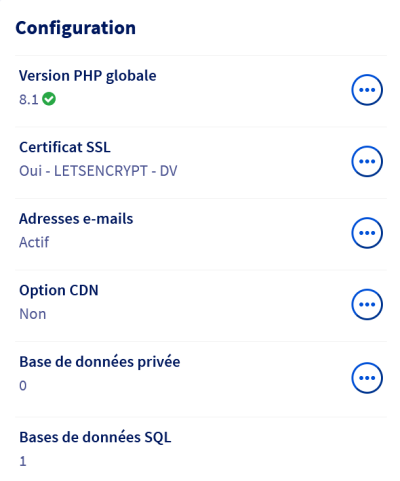

**Dernière mise à jour le 03/10/2022**

## Objectif

Configurer le comportement de votre serveur avec un ou des fichiers _.htaccess_ pour modifier le comportement de votre site (redirections, interdictions d'accès ou autorisations restreintes).

## Prérequis

Vous devez avoir soucrit à une de nos offres [Hébergement web](https://www.ovhcloud.com/fr/web-hosting/).

Vos fichiers étant placés sur votre serveur (ou devant y être copiés), vous devrez utiliser un client FTP tel que [FileZilla](https://filezilla-project.org/). Vous pouvez vous reporter à notre guide « [Utiliser FileZilla pour récupérer et déposer vos données](https://docs.ovh.com/fr/dedicated/deposer-et-recuperer-donnees-via-sftp/#utiliser-filezilla-pour-recuperer-et-deposer-vos-donnees) ». Ces fichiers peut être créés et modifiés avec n'importe quel éditeur de texte : le [bloc-note](https://support.microsoft.com/fr-fr/windows/aide-de-bloc-notes-windows-4d68c388-2ff2-0e7f-b706-35fb2ab88a8c) de Windows, [TextEdit](https://support.apple.com/fr-fr/guide/textedit/welcome/mac) sur macOS, [Notepad++](https://notepad-plus-plus.org/), _etc._
## En pratique

### Quelques définitions

#### Qu'est-ce qu'un fichier _.htaccess_ ?

Un fichier _.htaccess_ est un fichier permettant de configurer un serveur web Apache. Une des particularités de ces fichiers est qu'ils sont situés dans les répertoires des sites web sur le serveur. Un fichier _.htaccess_ aura des effets sur le répertoire dans lequel il est présent ainsi que dans tous les sous-répertoires qui le composent.

Ils sont modifiables par des utilisateurs ayant des droits limités et qui n'ont pas la main sur les fichiers de configuration du serveur web. Autre avantage : il n'est pas nécessaire de redémarrer le serveur Apache pour que soient prises en compte les indications et modifications écrites dans le fichier _.htaccess_. Toutes nos offres d'[Hébergement web](https://www.ovhcloud.com/fr/web-hosting/) vous permettent de configurer vos propres fichiers _.htaccess_.

Le point devant le nom du fichier (qui n'a pas d'extension) désigne un fichier caché.

#### Qu'est-ce qu'un serveur web ?

Un serveur web est un logiciel qui permet d'échanger des informations sur un réseau en utilisant le protocole HTTP.
Il en existe plusieurs, parmi lesquels Apache, Nginx, Tomcat ou encore le module http compris dans NodeJS.

### Créer un fichier _.htaccess_

#### Quelques précautions prendre

Une mauvaise configuration de votre fichier _.htaccess_ pourrait être à l'origine d'une erreur sur votre serveur (comme une erreur 500), voire même en rendre l'accès impossible, y compris pour vous. Vous devez donc prendre l'habitude de faire des sauvegardes systématiques des versions de vos fichiers fonctionnels, de manière à pouvoir revenir à un état antérieur en cas de problème suite à une modification.

De la même façon, si vous n'avez pas l'habitude de manipuler ce type de fichier, faites un essai à chaque élément que vous modifiez, vous éviterez ainsi de perdre du temps pour retrouver la ou les lignes à l'origine du dysfonctionnement de votre serveur. Une erreur de configuration ou une simple faute de frappe peut compromettre la configuration de votre serveur et donc son fonctionnement.

#### Quels outils utiliser ?

- un client FTP pour récupérer vos fichiers (FileZilla, Cyberduck)
- un éditeur de texte.

### Où sont situés les fichiers _.htaccess_ dans WordPress ?

Comme il a été précisé en introduction, il est possible d'avoir plusieurs fichier _.htaccess_ sur un même serveur, chacun de ces fichiers définissant les règles pour le répertoire où il se situe, ainsi que les sous-répertoires.

#### À la racine du site

C'est à ce niveau que se feront la majorité des modifications. Installé par défaut, le fichier _.htaccess_ placé à la racine du site contient les lignes suivantes :

```

# BEGIN WordPress
# Les directives (lignes) entre « BEGIN WordPress » et « END WordPress » sont générées
# dynamiquement, et doivent être modifiées uniquement via les filtres WordPress.
# Toute modification des directives situées entre ces marqueurs sera surchargée.
<IfModule mod_rewrite.c>
RewriteEngine On
RewriteRule .* - [E=HTTP_AUTHORIZATION:%{HTTP:Authorization}]
RewriteBase /
RewriteRule ^index\.php$ - [L]
RewriteCond %{REQUEST_FILENAME} !-f
RewriteCond %{REQUEST_FILENAME} !-d
RewriteRule . /index.php [L]
</IfModule>

# END WordPress
```

##### **Quelques explications&hellip;**

###### **\#**

C'est le caractère utilisé pour mettre une ligne en commentaire.

###### **RewriteEngine On**

Active le module Apache _mod_rewrite_, permettant la réécriture d'URL à la volée (permet également de rediriger une URL vers une autre URL).

###### **RewriteRule**

Cette syntaxe s'écrit selon le schéma `RewriteRule Modèle Substitution`. L'écriture peut être présente plusieurs dois dans le fichier _.htaccess_ (ce qui est le cas dans le fichier par défaut que vous trouvez à la racine de l'installation de votre WordPress). L'ordre d'écriture dans le fichier a son importance.

###### **RewriteBase**

Indique que la racine du site est « / ».

###### **RewriteCond**

Il s'agit de préconditions pour la règle qui suit directement. Dans notre cas, la première précondition exclut les URL contenant un chemin vers un fichier réel, tandis que la deuxième exclut, elle, les sous-répertoires.

##### **Que rajouter dans un fichier _.htaccess_ avec WordPress ?**

Il existe plusieurs façons de définir et modifier des paramètres qui changeront le comportement du serveur (avec, toutefois, certaines limitations fonction de l'hébergement)&nbsp;: modifier les fichiers de configuration de votre serveur, ajouter ou modifier des directives dans le fichier de configuration _wp-config.php_ à la racine de votre site et, enfin, modifier ou ajouter des directives dans le fichier _.htaccess_ à la racine.

###### **Rediriger de HTTP vers HTTPS**

Pour faire la direction de toutes vos URL de HTTP vers HTTPS, vous devez tout d'abord générer votre certificat SSL dans votre manager OVH :



N'hésitez pas à vous référez à notre guide [Passer son site internet en HTTPS grâce au SSL](https://docs.ovh.com/fr/hosting/passer-site-internet-https-ssl/#etape-1-activer-le-certificat-ssl-sur-lhebergement).

###### **Empêcher l'affichage des répertoires et sous-répertoires**

Pour éviter de permettre à n'importe quel visiteur de votre site d'afficher le contenu des sous-répertoires (et accessoirement donner des informations à des pirates sur les thèmes ou extensions utilisés), vous pouvez bloquer la visualisation du contenu en ajoutant cette ligne :

```Options All -Indexes```

###### **Protéger votre fichier de configuration**

Votre fichier _wp-config.php_, à la racine de votre site, contient des informations de configuration, comme son nom l'indique. Vous pouvez empêcher l'accès à ce fichier avec ces quelques lignes :

```
<Files ~ "^.*\.([Hh][Tt][AaPp])">
    order allow,deny
    deny from all
    satisfy all
</Files>
```

###### **Bloquer une adresse IP**

Si vous avez identifié l'adresse IP d'un visiteur indésirable, voici la ligne à mentionner dans votre fichier _.htaccess_ :

```
<Limit GET POST>
    order allow,deny deny from xxx.xxx.xxx.xxx
    allow from all
</Limit>
```

Où xxx.xxx.xxx.xxx désigne l'adresse IP à bloquer.

#### Dans le répertoire wp-admin (ou dans les autres répertoires)

Ce répertoire est celui qui va vous permettre de vous connecter à votre interface d'administration (la méthode fonctionne également avec les autres répertoires, mais ils correspondent à des URL qui n'aboutissent pas à une interface particulière). Un des moyens de protéger ce répertoire, est d'autoriser spécifiquement l'accès à une adresse IP (ou à plusieurs) :

```
<Limit GET POST PUT>
    order deny,allow deny from all
    allow from xxx.xxx.xxx.xxx
    allow from xxx.xxx.xxx.xxx
</Limit>
```

### Ce que vous devez retenir

- Pensez à garder une version fonctionnelle de votre fichier .htaccess avant toute manipulation
- Si les modifications que vous avez faites provoquent une erreur, remplacer (via votre client FTP) le fichier en ligne par la version précédente
- Vous pouvez gérer certains paramètres dans votre fichier _wp-config.php_
- Bien configurés, les fichiers _.htaccess_ sont particulièrement efficaces (gestion des URL, redirection, sécurité).

## Aller plus loin

Vous pouvez consulter le [tutoriel disponible sur le site de la Fondation Apache](https://httpd.apache.org/docs/2.4/fr/howto/htaccess.html).