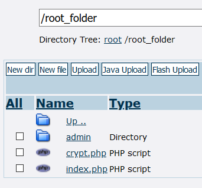

**Dernière mise à jour le 20/09/2021**

## Objectif

Il peut parfois être nécessaire de protéger l'accès à une partie de votre site par des identifiants. Vous pourrez notamment mettre en place un fichier « .htaccess » afin de protéger l'accès à son interface d'administration.

**Découvrez comment protéger l'accès à la partie administrateur de votre site via une authentification par un fichier « .htaccess ».**

> [!warning]
>
> OVHcloud met à votre disposition des services dont la configuration, la gestion et la responsabilité vous incombent. Il vous revient de ce fait d'en assurer le bon fonctionnement.
>
> Nous mettons à votre disposition ce guide afin de vous accompagner au mieux sur des tâches courantes. Néanmoins, nous vous recommandons de faire appel à un [prestataire spécialisé](https://partner.ovhcloud.com/fr/) et/ou de contacter l'éditeur du service si vous éprouvez des difficultés. En effet, nous ne serons pas en mesure de vous fournir une assistance. Plus d'informations dans la section [Aller plus loin](#aller-plus-loin) de ce guide.
>

## Prérequis

- Disposer d'une [offre d'hébergement web](https://www.ovhcloud.com/fr/web-hosting/).
- Être connecté à votre [espace client OVHcloud](https://www.ovh.com/auth/?action=gotomanager&from=https://www.ovh.com/fr/&ovhSubsidiary=fr).
- Être en possession des identifiants permettant de se connecter à [l'espace de stockage de votre hébergement](../connexion-espace-stockage-ftp-hebergement-web/).

## En pratique

> [!primary]
>
> La solution proposée ici n'est qu'une possibilité technique parmi d'autres pour mettre en place un espace administrateur sur votre site. Vous pouvez également utiliser la fonctionnalité [Module en 1 clic](../modules-en-1-clic/) proposée par [OVHcloud](https://www.ovhcloud.com/fr/).
>
> Pour toute demande sur la création ou la programmation de votre site, contactez notre [communauté d'utilisateurs](https://community.ovh.com) ou les [partenaires OVHcloud](https://partner.ovhcloud.com/fr/directory/). En effet, nous ne serons pas en mesure de vous fournir une assistance sur ces sujets.
>

### Etape 1 : créer l'arborescence

Connectez-vous à [l'espace de stockage](../connexion-espace-stockage-ftp-hebergement-web/) de votre hébergement. Ouvrez le [« dossier racine »](../multisites-configurer-un-multisite-sur-mon-hebergement-web/#etape-21-ajouter-un-domaine-enregistre-chez-ovhcloud) de votre site.<br>
Créez un fichier « crypter.php ».

{.thumbnail}

Ouvrez ou créez le dossier destiné à contenir la partie « admin » de votre site. Créez dans ce répertoire un fichier « .htpasswd » et un fichier « .htaccess ».

{.thumbnail}

> [!primary]
>
> Les fichiers « .htpasswd » et « .htaccess » peuvent être dans des dossiers différents. Un seul fichier « .htpasswd » peut être utilisé pour plusieurs « .htaccess ».
>
> Les paramètres définis par un fichier « .htaccess » s'appliquent au répertoire où il est installé ainsi qu'à tous ses sous-répertoires.
>

### Etape 2 : compléter le fichier « crypter.php »

Inscrivez, dans le fichier « crypter.php » créé précédemment, les lignes suivantes (à répéter selon le nombre de mots de passe à générer):

```php
<?php
$string_1 = crypt('motdepasse_en_clair_1');
$string_2 = crypt('motdepasse_en_clair_2');
$string_3 = crypt('motdepasse_en_clair_3');
echo nl2br("$string_1 \n $string_2 \n $string_3");
 ?>
```

Si vous disposez d'un hébergement [Pro](https://www.ovhcloud.com/fr/web-hosting/professional-offer/) ou [Performance](https://www.ovhcloud.com/fr/web-hosting/performance-offer/), connectez-vous ensuite en [SSH](../mutualise-le-ssh-sur-les-hebergements-mutualises/) à votre hébergement. Exécutez la commande suivante :

```bash
php crypt.php
```

> [!warning]
>
> Pour des raisons de sécurité, l'utilisation du SSH est recommandée. Toutefois, si vous disposez d'une offre [Kimsufi Web](https://www.kimsufi.com/fr/hosting.xml) ou [Perso](https://www.ovhcloud.com/fr/web-hosting/personal-offer/) et que vous ne souhaitez pas passer sur une offre [Pro](https://www.ovhcloud.com/fr/web-hosting/professional-offer/) ou [Performance](https://www.ovhcloud.com/fr/web-hosting/performance-offer/), vous pouvez aussi exécuter le fichier « crypter.php » par le biais de votre navigateur Web (En allant sur une URL du type https://votre-domaine.ovh/crypter.php).
>
> Pour toute question complémentaire sur la méthode à utiliser pour chiffrer vos mots de passe, contactez notre [communauté d'utilisateurs](https://community.ovh.com) ou les [partenaires OVHcloud](https://partner.ovhcloud.com/fr/directory/). Nous ne serons pas en mesure de vous fournir une assistance sur ce sujet.
>

Récupérez les mots de passe chiffrés (Ne copiez pas le « &#60;br /> » si vous exécutez la commande « php crypter.php » en SSH) :

```bash
motdepasse_chiffré1
motdepasse_chiffré2
motdepasse_chiffré3
```

### Etape 3 : compléter le fichier « .htpasswd »

Le fichier « .htpasswd » contient la liste des utilisateurs autorisés à se connecter à l'interface d'administration de votre site et leur mot de passe chiffré.

Inscrivez dans ce fichier pour **chaque utilisateur** une ligne indiquant son identifiant et son mot de passe chiffré :

```bash
utilisateur1:motdepasse_chiffré1
utilisateur2:motdepasse_chiffré2
utilisateur3:motdepasse_chiffré3
```

### Etape 4 : compléter le fichier « .htaccess »

#### Bloquer l'accès à un répertoire complet

Dans le répertoire à protéger, créez un fichier « .htaccess » avec le code suivant :

```bash
AuthName "Indiquez votre identifiant administrateur et son mot de passe"
AuthType Basic
AuthUserFile "/home/votre_login_ftp/dossier_racine/admin/.htpasswd"
Require valid-user
```

> [!warning]
>
> Dans cet exemple, il faut remplacer « votre_login_ftp » par votre [identifiant FTP](../connexion-espace-stockage-ftp-hebergement-web/#etape-1-recuperer-les-informations-necessaires-pour-se-connecter). Dans la rubrique `Hébergements`{.action}, vous le trouverez dans l'onglet `FTP-SSH`{.action} de l'hébergement concerné.
>
> Remplacez si besoin dans l'exemple ci-dessous « dossier_racine » par le nom du [dossier contenant les fichiers de votre site](../multisites-configurer-un-multisite-sur-mon-hebergement-web/#etape-21-ajouter-un-domaine-enregistre-chez-ovhcloud).
>

#### Bloquer l'accès à un ou plusieurs fichiers

Pour bloquer l'accès à un ou plusieurs fichiers précis, ajoutez une [directive « Files »](https://httpd.apache.org/docs/2.4/fr/mod/core.html#files){.external} dans le fichier « .htaccess » :

```bash
<Files test.php>

AuthName "Indiquez vos identifiants"
AuthType Basic
AuthUserFile "/home/votre_login_ftp/dossier_racine/admin/.htpasswd"
Require valid-user

</Files>
```

> [!warning]
>
> Vous devrez indiquer une [directive « Files »](https://httpd.apache.org/docs/2.4/fr/mod/core.html#files){.external} pour **chaque fichier** à protéger.
>
> Les directives « Files » s'appliquent à l'ensemble des fichiers du même nom ou se terminant par le nom spécifié. Ceci à condition qu'ils soient contenus dans le même répertoire que le « .htaccess » ou dans l'un de ses sous-répertoires (Dans la configuration indiquée ici, la directive « Files » s'appliquerait par exemple sur un fichier « nouveau_test.php » contenu dans un sous-répertoire du dossier « admin »).
>

## Aller plus loin <a name="aller-plus-loin"></a>

[Tout sur le fichier .htaccess](../mutualise-tout-sur-le-fichier-htaccess/)

Pour des prestations spécialisées (référencement, développement, etc), contactez les [partenaires OVHcloud](https://partner.ovhcloud.com/fr/directory/).

Échangez avec notre communauté d'utilisateurs sur <https://community.ovh.com/>.
