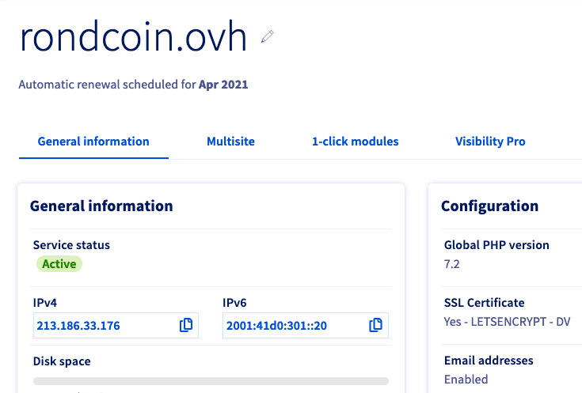

**Dernière mise à jour le 25 novembre 2020**

## Objectif

Ce guide est destiné aux clients souhaitant rendre disponible leur site web en IPv6.

> [!warning]
> Ce cas d’application vous montrera comment utiliser une ou plusieurs solutions OVHcloud avec des outils externes. Il décrit les mesures à appliquer dans un contexte précis. Veuillez noter que ces mesures doivent être adaptées à votre cas particulier. Si vous éprouvez des difficultés à appliquer ces mesures, veuillez contacter un prestataire de services spécialisés et/ou posez la question à notre communauté sur <https://community.ovh.com/en/>. OVHcloud ne peut pas vous fournir d’assistance technique à ce sujet.

## Prérequis

- Un [hébergement web OVHcloud](https://www.ovh.com/fr/hebergement-web/){.external}
- Un [nom de domaine](https://www.ovh.com/fr/domaines/){.external} lié à votre hébergement web;

## C'est quoi IPv6 ?

Afin de trouver les sites web, nous utilisons des urls composés des noms de domaines. Il s'agit d'un nommage *logique* permettant aux humains de retenir facilement la correspondance entre un nom et un site web. Les noms de domaines permettent ensuite à votre navigateur web de trouver l'**adresse IP** qui est une adresse physique du serveur hébergeant le site web sur le réseau Internet.

Si vous souhaitez une métaphore avec le *monde réel*, vous pouvez comparer le nom de domaine avec les adresses postales et les adresses IP avec des coordonnées GPS. Vous ne connaissez probablement pas les coordonnées GPS de votre domicile, pourtant, c'est le moyen le plus précis de représenter un emplacement précis. Pour que nous retenions plus facilement les emplacements, nous avons créé un référenciel d'adresse *logique*: les adresses postales. Votre adresse postale désigne en réalité une coordonnée GPS.

## Mais pourquoi v6 ?

Le réseau Internet fonctionne depuis le début des années 1990 en suivant la norme IPv4. Cette norme permet de fournir une adresse IP à chaque machine reliée au réseau internet : serveurs, mais aussi ordinateurs, smartphones, tablettes et tout autre appareil relié à Internet. Cette norme comporte une limite importante : elle permet d'identifier un peu plus de 4 Milliards d'appareil différent. Soit un appareil pour deux personnes sur Terre.

Un nouveau protocol a rapidement été proposé : **IPv6**. Il permet d'identier plus de 340 sextillions d'adresses différentes. Son déploiement prend du temps en raison de changements important sur l'ensemble du réseau Internet. L'article de [wikipédia](https://fr.wikipedia.org/wiki/IPv6) est un bon premier point d'entrée si vous souhaitez en savoir plus sur ce protocole.

## Pourquoi rendre son site compatible IPv6 ?

Le nombre d'IPv4 étant rare, il devient de plus en plus difficile d'ajouter de nouvelles ressources au réseau Internet. Les connexions en IPv6 ne sont utiles que si le contenu est aussi disponible sur ce protocole. Ainsi, plus il y aura de sites web en IPv6 et plus il deviendra important pour chaque acteur du réseau de migrer sur ce protocole.

Nos hébergements web sont compatible IPv6 depuis 2011. Mais l'activation de ce protocole est resté jusqu'à récemment une option facultative de la configuration. Ce guide vous indique comment vérifier si votre site est compatible en IPv6 et, si ce n'est pas le cas, comment le configurer pour qu'il le soit.

## Vérifier que son site est compatible IPv6

Pour tester si votre site web est compatible avec IPv6, vous pouvez utiliser le site [ipv6-test.com](https://ipv6-test.com/validate.php). Ce dernier vous indiquera si votre site répond sur ce nouveau protocole IP.

## Configurer son site en IPv6

Si votre site n'est pas configuré pour IPv6, vous pouvez le faire en ajoutant l'information dans la zone DNS de votre nom de domaine. Il s'agit de permettre aux navigateurs web de trouver une adresse IPv6 lorsqu'ils demandent l'emplacement de votre site web via le nom de domaine.

### Étape 1 : Trouver la bonne adresse IPv6

Les adresses IPv4 et IPv6 sont disponible au sein de votre espace client.

- Cliquez sur votre domaine dans la section `Hébergement`{.action} ;

- Dans la rubrique `Ìnformations générale`, vous pouvez copier votre adresse IPv6

{.thumbnail}

### Étape 2 : Configurer la zone dns

> [!warning]
> Notre option CDN n'est pas encore compatible IPv6. Si vous configurez une adresse IPv6 sur votre site web, vos visiteurs ne bénéficieront pas du CDN.

Afin que votre navigateur trouve l'adresse IPv6 avec votre nom de domaine, vous devez modifier la zone DNS qui y est associée. Un [guide](../editer-ma-zone-dns/#etape-2-editer-la-zone-dns-ovh-de-votre-domaine){.externe}) est dédié au sujet.

Vous devez y insérer l'adresse IPv6 en utilisant le type d'enregistrement **AAAA** et l'IPv6 récupérée précédemment au sein de votre espace client.

Échangez avec notre communauté d'utilisateurs sur <https://community.ovh.com/en/>.
