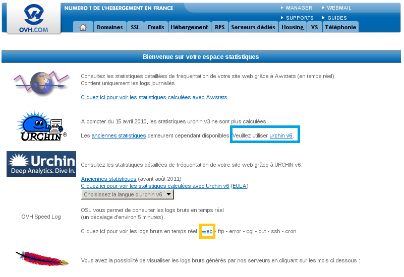

## Log in to your customer account
Log in to your [Manager](https://www.ovh.com/manager/web/) with your username (nic-handle) and password.

Once logged on, select the "hosting" platform that you want to view the statistics for in the left-hand menu.

{.thumbnail}
In the general information tab click on the link: Website visit statistics.

{.thumbnail}

## Access to the Statistics & Logs page
You can access your website statistics by going to:

- https://logs.ovh.net/nomdevotredomaine

You log on with your OVH username and password. 

Statistics are simple to use and view. With a few clicks, you can analyse your site without having to provide additional statistical calculations.

Click on the link automatically generated in the Manager to access statistics and logs.  

You need to identify yourself with your customer ID (Nic-handle) and your password.

## Statistical area
Once you are logged on to the statistics area, this page will appear (see capture opposite).

Two options are available:

- Go to your website statistics via urchin v6. (see green box).

- Consult the raw logs of your website in real time or on an earlier period (see orange box).

{.thumbnail}

## Urchin v6
These statistics provide information on :

 The traffic on your site 

- The number of visitors
- The number of pages viewed,
- The "size" of pages viewed,
- The number of http requests.

 This data can be displayed by hour, day, week, month or year, to help you better understand the evolution of your website. 

 Pages 

- The average time it takes to connect to your entire website or to a specific page

 Follow your SEO 

- How did your visitors find you?
- What search engines did they use to find your website? 
- What keywords did they use in their search?

Manage your website pages better, find out what pages your visitors are most interested in

- Which pages on your website have been the most visited?
- For how long?
- Which pages contain errors and what are the types of errors encountered?

 Monitoring 

- Which pages on your website are viewed first by your visitors?
- Which pages are viewed last on your site?
- What is the average time spent per page?
- What is the number of pages viewed per visit?

{.thumbnail}

## Raw logs
You can view your website logs virtually and practically live. Logs of your site are available in under 15 minutes, allowing you to check that your website is working correctly or to calculate your website logs in almost real time.

Different types of logs are available :

- Web Logs: here you can find different website consultation logs, as well as the different actions performed from your website. This could help you identify hacking attempts.

-FTP Logs: different FTP connections will be recorded and stored in the raw logs .

-Error logs error: different errors generated by your site.

-cgi logs: different calls to cgi.bin scripts that have been made.

- Logs out: hosting statistics on various external calls made .

- Ssh Logs: These logs show the different connections made with the SSH protocol.

- Cron logs: the results of planned task execution

{.thumbnail}

## Is it possible to change the language of the statistical software Urchin?
You can choose the language used by Urchin on its interface: click Preferences and then from the menu, choose the language and confirm (click on 'submit'). Urchin will remember your preferences.

