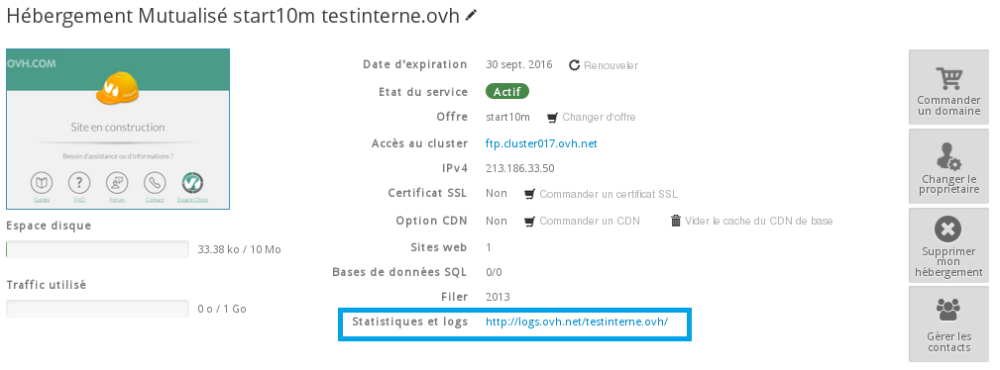
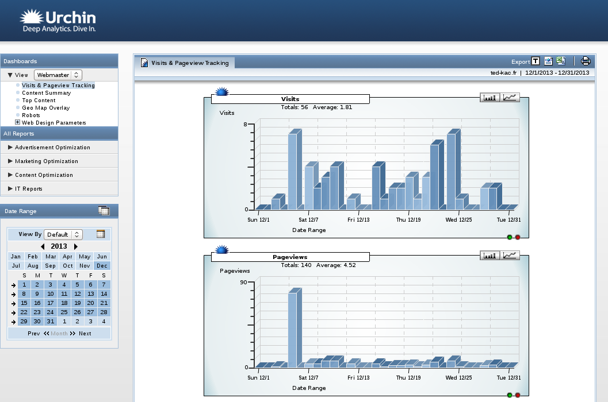
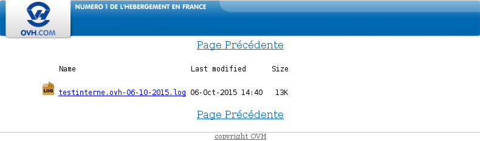

L'accès aux statistiques de votre site est compris dans votre hébergement. Vous n'avez pas besoin de souscrire à un autre abonnement pour bénéficier de ce service.

Cliquez [ici](http://www.ovh.com/fr/hebergement-web/faq){.external} pour retrouver nos différents guides des offres mutualisées.

> [!warning]
>
> L'interprétation des logs et des statistiques d'un site internet peut se révéler complexe. Nous vous recommandons de faire appel à un prestataire spécialisé si vous éprouvez des difficultés pour les interpréter. En effet, nous ne serons pas en mesure de vous fournir une assistance à ce propos.
>

## Consulter les statistiques et les logs

### Connexion a l'espace client
Connectez-vous dans le [Manager](https://www.ovh.com/manager/web/){.external} à l'aide de votre couple identifiant (nic-handle) - mot de passe.

Une fois connecté, sélectionner l'hébergement pour lequel vous souhaitez consulter les statistiques dans le menu de gauche.

{.thumbnail}

Dans le récapitulatif général, cliquer sur le lien d'accès : "Statistiques et logs".

{.thumbnail}

### Acces a la page Statistiques &amp; logs
Vous pouvez accéder aux statistiques de votre site, simplement en vous rendant sur :

- [https://logs.ovh.net/nomdevotredomaine](https://logs.ovh.net/nomdevotredomaine){.external}

La connexion se fait via votre identifiant OVH et le mot de passe associé.

Elles sont simples à utiliser et à visualiser. En quelques clics, vous pouvez analyser votre site sans avoir à fournir d'autres calculs statistiques.

Cliquez sur le lien généré automatiquement dans le Manager pour accéder aux statistiques et aux logs.

*Vous devrez vous identifiez avec votre référence client (Nic-handle) et votre mot de passe.*

### Espace statistiques
Une fois connecté à l'espace de statistiques, voici la page qui apparaît (cf capture ci-contre).

Deux possibilités s'offrent à vous :

- Accéder aux statistiques de votre site via urchin v6. (cf encadré vert).
- Consulter les logs bruts de votre site en temps réel ou sur une période antérieure (cf encadré orange).

{.thumbnail}

### Urchin v6
Ces statistiques donnent des renseignements sur :

Le trafic de votre site

- Le nombre de visiteurs,
- Le nombre de pages visualisées,
- Le "poids" des pages visualisées,
- Le nombre de requêtes http.
- Les durées moyennes de connexion à l'ensemble de votre site ou une page particulière
- Comment les visiteurs de votre site l'ont-ils connu ?
- Par quels moteurs de recherche ont-ils trouvé l'URL de votre site ?
- Quels mots-clés ont-ils utilisé lors de leur recherche ?

Quelles pages de votre site ont été les plus visitées ? Le suivi

{.thumbnail}

### Logs bruts
Vous avez la possibilité de visualiser les logs de votre site pratiquement en direct. Les logs de votre site sont disponibles en moins de 15 minutes, ce qui vous permet de vérifier le bon fonctionnement de votre site ou de calculer les logs de votre site presque en temps réel.

Différents type de logs sont à votre disposition :

- Logs Web : trouvez ici les différents logs de consultation de votre site, ainsi que les différentes actions réalisées à partir de votre site. Cela vous permet par exemple de repérer des tentatives de hacks.
- Logs FTP : les différentes connexions FTP seront enregistrées et conservées dans ces logs.
- Logs erreur : les différentes erreurs générées par votre site.
- Logs CGI : les différents appels aux scripts cgi.bin qui ont été réalisés.
- Logs out : les statistiques de votre hébergement sur les différents appels externes réalisés.
- Logs SSH : ces logs indiquent les différentes connexions réalisées avec le protocole SSH.
- Logs cron : le résultat de l'exécution de vos tâches planifiées ([http://guides.ovh.com/MutualiseCron](http://guides.ovh.com/MutualiseCron){.external})

{.thumbnail}

## Aide

### Est-il possible d'utiliser le logiciel de statistiques Urchin en francais ?
Vous pouvez choisir la langue utilisée par Urchin sur son interface : cliquez sur préférences dans le menu, choisissez la langue, puis validez (cliquez sur 'submit'). Urchin se rappellera de vos préférences.