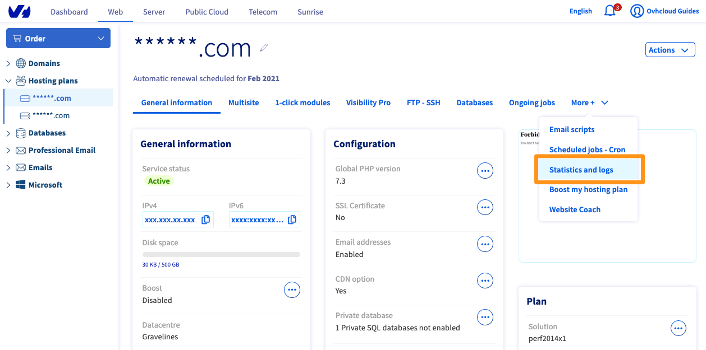
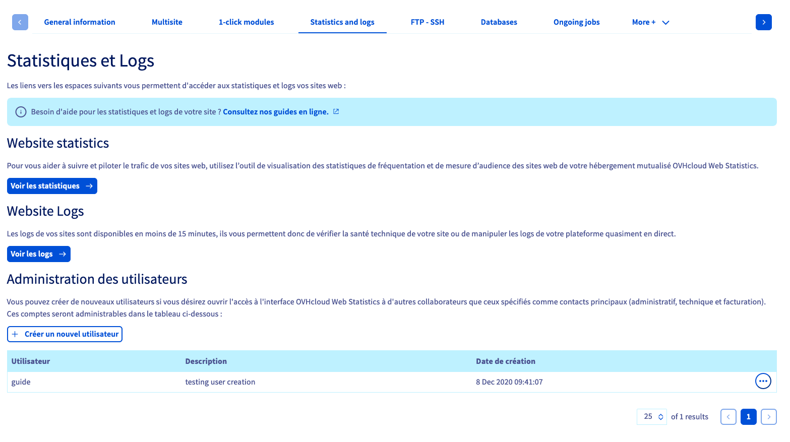
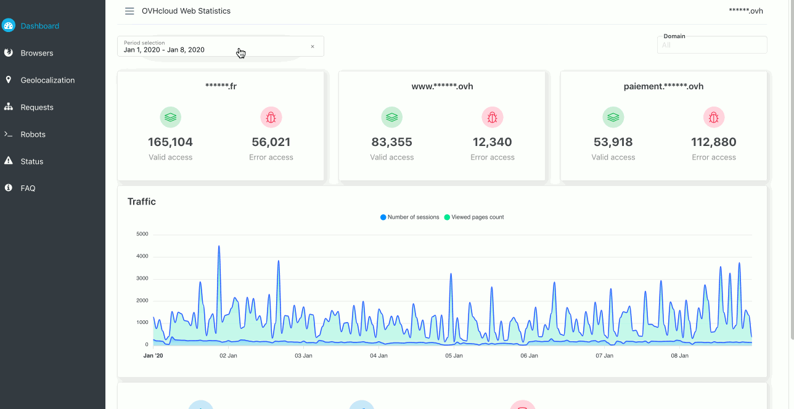

> [!primary]
> Esta tradução foi automaticamente gerada pelo nosso parceiro SYSTRAN. Em certos casos, poderão ocorrer formulações imprecisas, como por exemplo nomes de botões ou detalhes técnicos. Recomendamos que consulte a versão inglesa ou francesa do manual, caso tenha alguma dúvida. Se nos quiser ajudar a melhorar esta tradução, clique em "Contribuir" nesta página.
>

**Última atualização: 05/01/2021**

## Objetivo

O acesso aos logs e às estatísticas do seu site está incluído no seu plano de alojamento web, acessível através da Área de Cliente OVHcloud.

**Saiba como consultar as estatísticas e logs do seu website.**

## Requisitos

- Ter um serviço [de alojamento web](https://www.ovhcloud.com/pt/web-hosting/){.external} compatível.
- Ter acesso à [Área de Cliente OVHcloud](https://www.ovh.com/auth/?action=gotomanager&from=https://www.ovh.pt/&ovhSubsidiary=pt){.external}.

## Instruções

Aceda à [Área de Cliente OVHcloud](https://www.ovh.com/auth/?action=gotomanager&from=https://www.ovh.pt/&ovhSubsidiary=pt){.external}. Clique no separador `Web Cloud`{.action} e, a seguir, em `Alojamentos`{.action}.

Selecione o alojamento correspondente e clique no separador `Estatísticas e logs`{.action}

{.thumbnail}

A janela que se apresenta é composta por 3 secções. A primeira apresenta as **estatísticas**, a segunda os **logs** brutos do seu alojamento, a última é dedicada à administração **dos utilizadores** autorizados a aceder às estatísticas.

{.thumbnail}

### Administração dos utilizadores

A criação de um utilizador permitirá a uma pessoa aceder às estatísticas do seu alojamento sem ter acesso à sua Área de Cliente OVHcloud. 

Clique no botão `Criar um novo utilizador`{.action} na secção `Administração dos utilizadores` e siga as instruções abaixo.  

{.thumbnail}

> [!warning] 
>
> Se ativou os logs separados numa [entrada multi-site](../multisites-configurar-um-multisite-no-meu-alojamento-web/#2-adicionar-um-dominio-ou-subdominio), os utilizadores criados aqui não podem aceder às estatísticas desta entrada multi-site.
>

### Estatísticas das visitas

Para o ajudar a seguir e controlar melhor o tráfego dos seus websites, dispõe de uma ferramenta de estatísticas de visitas e de medição de audiência dos seus websites alojados no seu alojamento partilhado, **OVHcloud Web Statistics**.

{.thumbnail}

O painel de controlo das OVHcloud Web Statistics encontra-se em 6 secções no painel de esquerda.

- Dashboard: visualização do tráfego nos sites do seu alojamento.
- Browsers: classificação dos browsers mais utilizados para visualizar os seus websites.
- Geolocalization:  proporção de visitantes em função da sua localização.
- Pedidos: classificação das páginas mais consultadas nos seus websites.
- Robôs: visualização dos robôs que passam pelos seus websites.
- Estado: estatísticas de falhas e sucessos encontrados em função dos códigos HTTP devolvidos.
- FAQ: secção dedicada às questões mais frequentes

O quadro `Period selection` no canto superior direito permite-lhe selecionar um período preciso.

### Logs

Tem a possibilidade de visualizar os logs brutos do seu site com um atraso de cerca de 5 minutos.

{.thumbnail}

Tem à sua disposição diferentes tipos de logs:

- Logs Web: veja aqui os diferentes logs de consulta do seu site, assim como as diferentes ações realizadas a partir do seu site. Isto permite-lhe, por exemplo, detetar tentativas de ações maliciosas.
- Logs FTP: as diferentes ligações FTP serão registadas e conservadas nestes logs.
- Logs erro: os diferentes erros gerados pelo seu site.
- Logs CGI: as várias chamadas para os scripts cgi.bin que foram feitas.
- Logs out: as estatísticas do seu alojamento sobre as diferentes chamadas externas efetuadas.
- Logs SSH: estes logs indicam as diferentes ligações realizadas com o protocolo SSH.
- Logs CRON: o resultado da execução das tarefas planeadas ([As tarefas automatizadas (CRON) no seu alojamento](../alojamento_partilhado_tarefas_agendadas_cron/)).

### Atividades do alojamento

Encontre nesta secção a atividade da infraestrutura do seu alojamento, de forma a visualizar o consumo dos recursos colocados à sua disposição.

Clique no separador `Informações gerais`{.action} e, a seguir, desça na parte inferior da página.

{.thumbnail}

É possível apresentar diferentes tipos de gráficos a partir do menu pendente no canto superior esquerdo:

- Ligações de saída: pedidos enviados do seu site para um site externo.
- Utilização do CPU: nível de consumo do processador na instância de alojamento.
- Superação do limite máximo dos recursos: indica os momentos em que o seu alojamento ultrapassa a sua quota de recursos.
- Pedidos SQL: quantidade de pedidos para as bases de dados do seu alojamento.
- Tempo de resposta SQL: tempo de resposta dos pedidos enviados para as bases de dados do seu alojamento.

## Quer saber mais?

Fale com a nossa comunidade de utilizadores em <https://community.ovh.com/en/>.
