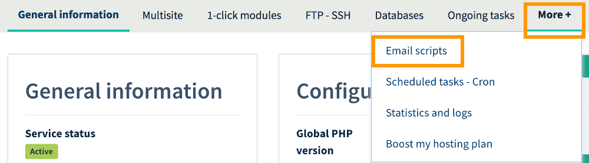

**Last updated May 25th, 2018**

## Objective

Automated emails are messages that are sent via scripts. For example, they are used in contact forms on your website, and allow your web users to send you emails.

**Find out how to monitor and manage automated emails sent from your OVH Web Hosting plan.**

## Requirements

- You must have an[OVH Web Hosting plan](https://www.ovh.co.uk/web-hosting/){.external}.
- You must be logged in to your [OVH Control Panel](https://www.ovh.com/auth/?action=gotomanager){.external}.

> [!primary]
>
> This guide is only relevant for emails sent using scripts located on your OVH Web Hosting plan.
>
> Are you looking to manage email addresses included in your MX Plan solution, or in your [OVH Web Hosting plan](https://www.ovh.co.uk/web-hosting/){.external}? Go to the `Emails`{.action} section of your [OVH Control Panel](https://www.ovh.com/auth/?action=gotomanager){.external}.
>

## Instructions

In your [OVH Control Panel](https://www.ovh.com/auth/?action=gotomanager){.external}, you can monitor and manage automated emails sent from your OVH Web Hosting plan. To do this, log in to your Control Panel, click `Web hosting`{.action} in the services bar on the left-hand side, then choose the Web Hosting plan concerned from the list. Next, click `More +`{.action}, then `Email scripts`{.action}.

On the page that opens at this stage, you can monitor and manage automated emails sent from your OVH Web Hosting plan.

{.thumbnail}

### Monitor automated emails being sent

The `Email scripts`{.action} page provides several different types of information, which you can use to view script-generated automated email activity at a glance.

|Information|Details|
|---|---|
|Service status|Shows the current status of a service that sends automated emails from your Web Hosting plan. A status in a green box means that email sending is operational, whilst a status in a red box means that emails are no longer being sent. Depending on this status, the way that email sending is managed will vary. For more information on this, please refer to the [Managing send statuses for automated emails](https://docs.ovh.com/gb/en/hosting/web_hosting_monitoring_automatic_emails/#managing-send-statuses-for-automated-emails){.external} section of this guide.|
|Send error reports to|Receive daily error reports on an email address of your choice. You can define an email address for this by clicking the `Change recipient`{.action} button. This report will contain emails sent from your Web Hosting plan that bounced back to OVH with errors, because they could not reach a recipient. By clicking the `Emails with errors`{.action} button, you can read reports on such emails at any time, via your OVH Control Panel.|
|Total number of emails sent|Shows the total number of automated emails sent since you ordered your OVH Web Hosting plan.|
|Emails sent today|Shows the total number of automated emails sent today only.|
|Total number of emails with errors|Shows the total number of automated emails sent since you ordered your Web Hosting plan that bounced back to OVH with errors because they could not reach recipients.|
|Log of emails sent|Shows a graph representing the log of emails sent from your Web Hosting plan over the course of previous days.|

> [!primary]
>
> To stop your Web Hosting plan’s automated email system from being abused, we strongly recommend setting up a security system (e.g. a captcha test) for the forms on your website that are used to send emails (contact forms, for example).
>

{.thumbnail}

If you notice that your script-generated emails are no longer being sent, but the service status still enables email sending, we advise:

- **Checking the email sending scripts.** The scripts may not be able to send the emails due to a syntax error. Check the content of your scripts, correct them if required, then try again.

- **Testing email sending via a test script.** Write a test script that sends an email to your personal email address. If you are able to receive the email, it will mean that your email sending scripts contain errors. If your scriptwriting knowledge is basic, you can find test scripts available on the internet.

- **Sending emails without using the SMTP server.** Don’t specify a SMTP server in your script parameters. If you have an interface for managing email sending from your website, you need to ensure that this parameter can be modified in your website’s configuration.

### Managing send statuses for automated emails

On the `Email scripts`{.action} page, there are several buttons you can use to manage automated emails sent from your Web Hosting plan. Depending on the service status, some options may not be available.

|Actions|Details|
|---|---|
|Block sending|Blocks automated emails from being sent from your Web Hosting plan. Once you have blocked sending, script-generated emails will not be sent, and will be stored in a 'pending' queue for a maximum of 72 hours.|
|Unblock sending|Unblocks automated emails from being sent from your Web Hosting plan. This will also cause any emails stored in the 'pending' queue to be sent out to recipients.|
|Purge emails|Deletes the emails stored in the 'pending' queue, and unblocks emails from being sent.|

To perform any of these actions, click the corresponding button, then `Confirm`{.action}. In some cases, the action you want to perform will take several minutes to become fully effective.

{.thumbnail}

## Go further

Join our community of users on <https://community.ovh.com/en/>.