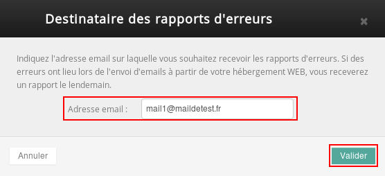

## Aceder à secção "Mais" e, de seguida, "Scripts-email", no separador "alojamento partilhado", depois de ter clicado no nome de domínio em questão

## Manipulações

- Ligar-se ao seu [Espaço Cliente](https://www.ovh.com/auth/?action=gotomanager&from=https://www.ovh.pt/&ovhSubsidiary=pt);
Se não tem acesso ao seu Espaço Cliente, pode seguir o [seguinte guia](https://www.ovh.com/fr/g1909.mutualise_gerer_et_acceder_a_ses_mots_de_passe#les_differents_mots_de_passe_lies_au_service_mutualise_dovh_lacces_au_manager_dovh) para definir uma nova palavra-passe;
- Na secção "Alojamentos", clique no nome de domínio associado ao seu alojamento;
- Clique, de seguida, em "Mais +" "Scripts e-mails".

{.thumbnail}

## Bloquear o envio de emails a partir do seu site
Por vezes, é necessário bloquear o envio de emails a partir do seu website.

## Em que situações?

- Quando está a efetuar testes, por exemplo;
- Quando o seu site é usado por um hacker para enviar spam, por exemplo;
- Quando o seu site não vai necessitar de enviar emails e deseja, por precaução, desativar a funcionalidade;

## Nota:
Nenhum email será eliminado. Eles serão colocados em espera durante 72 horas. Poderá, durante esse período, ou desbloquear o envio, ou efetuar uma "purga" à fila de emails em espera.
1. Clique no botão "Bloquear o envio".

{.thumbnail}
2. Clique no botão "Validar".

{.thumbnail}
3. A seguinte janela de confirmação aparecerá.

{.thumbnail}

## Nota:
Poderá constatar que o estado do serviço passará para "Inativo".

{.thumbnail}

## Purgar a fila de envio de mensagens
É, por vezes, necessário purgar a fila de envio a fim de evitar um novo bloqueio. Para ter a possibilidade de purgar a fila de envio de emails, deverá previamente bloquear o envio como é explicado neste guia de exemplo.

## Nota:
A sua conta será de seguida desbloqueada. A operação levará entre 5 a 10 minutos a ser tomada em consideração.
1. Clique no botão "Bloquear os e-mails".

{.thumbnail}
2. Clique no botão "Validar".

{.thumbnail}
3. A seguinte janela de confirmação aparecerá.

{.thumbnail}

## Nota:
Poderá constatar que o estado do serviço passará para "Purga".

{.thumbnail}

## Desbloquear o envio
O envio dos emails será retomado quando solicitar o envio do próximo email. Os emails que estavem em espera passarão a ser enviados.
1. Clique no botão "Desbloquear o envio".

{.thumbnail}
2. Clique no botão "Validar".

{.thumbnail}
3. A seguinte janela de confirmação aparecerá.

{.thumbnail}

## Modificar o destinatário dos relatórios de erro
Se ocorreram erros no envio dos emails a partir do seu alojamento Web, receberá no dia seguinte o relatório de erros.
1. Clique, num primeiro tempo, em "Alterar o destinatário".

{.thumbnail}
2. Introduza, de seguida, o endereço de email e clique, por fim, em "Validar".

{.thumbnail}
3. Poderá constatar que o novo endereço de email já aparece no painel de cliente.

{.thumbnail}

