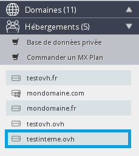
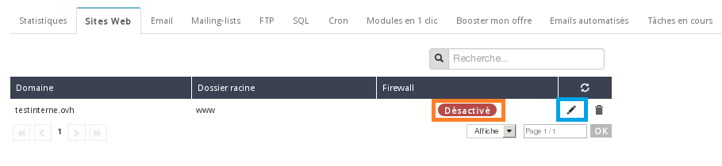

**Dernière mise à jour le 05/05/2020**

## Le mod_security
Ce module complémentaire d'Apache filtre toutes les requêtes entrantes sur vos serveurs web. Pour plus de sécurité, il les intercepte et les vérifie avant même qu'elles ne soient traitées par les scripts.

En activant Mod Security en un clic depuis votre manager, vous bénéficiez d'une protection renforcée.

Grâce au Core Rule Set (CRS), vous profitez d'emblée d'une pré-configuration optimale de votre Mod Security qui vous prémunit contre les attaques les plus courantes :

- Trojan,
- Injections d'emails,
- Faille des fichiers PDF,
- Injection de fichiers sur votre hébergement,
- injection de type SQL ou XSS,
- etc.

## Activation du pare-feu applicatif
Connectez-vous à votre [espace client OVHcloud](https://www.ovh.com/auth/?action=gotomanager){.external} à l'aide de votre couple identifiant (nic-handle) - mot de passe.

{.thumbnail}

Sélectionnez votre hébergement dans la section "Hébergements"

{.thumbnail}

Cliquez sur l'onglet "Site Web".

{.thumbnail}

Par défaut le pare-feu applicatif est Désactivé. Cliquer sur le stylo noir de droite afin d'accéder aux options de votre hébergement mutualisé.

{.thumbnail}

Cochez uniquement la case "Activer le firewall puis suivant.

{.thumbnail}

Un récapitulatif des modifications vous sera alors affiché, on remarque que l'état du pare-feu (firewall) est bien activé. Cliquez sur valider pour terminer l'opération.

{.thumbnail}

Le pare-feu est maintenant bien activé au niveau de votre hébergement mutualisé.

{.thumbnail}
