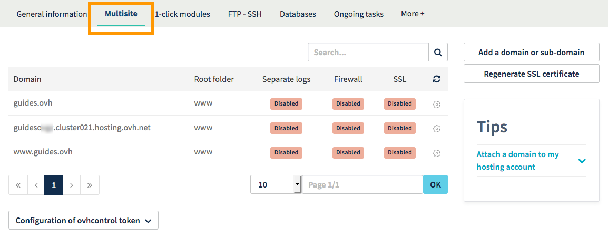
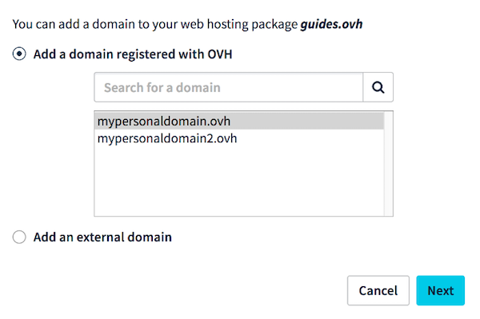
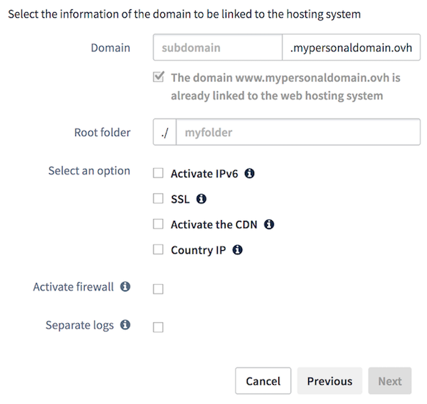
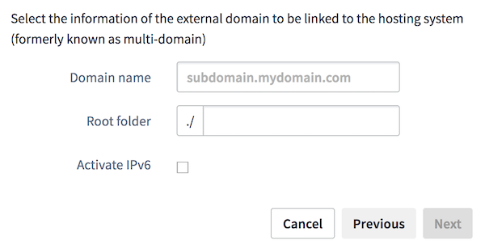

**Last updated 12th September 2018**

## Objective

You can host several websites on a single Web Hosting plan, and you can do this with both OVH-registered and non-OVH registered domains.

**Find out how to host several websites on your Web Hosting plan.**

## Requirements

- a compatible [OVH Web Hosting plan](https://www.ovh.co.uk/web-hosting/){.external}
- one or more [domain names](https://www.ovh.co.uk/domains/){.external}
- the rights to modify configuration for the domains (via their DNS zones)
- access to the [OVH Control Panel](https://www.ovh.com/auth/?action=gotomanager){.external}

## Instructions

### Step 1: Access the Multisite management section.

First of all, log in to the [OVH Control Panel](https://www.ovh.com/auth/?action=gotomanager){.external}, click `Web Hosting`{.action} in the services bar on the left-hand side, then select the plan concerned. Go to the `Multisite`{.action} tab.

The table displayed will contain all of the domain names that have been added to your Web Hosting plan. Some of these will have been created automatically, when your Web Hosting plan was set up.

> [!primary]
>
> If you are migrating your website and would like to avoid any service interruptions, you can follow [Step 4: Put your website online](https://docs.ovh.com/gb/en/hosting/multisites-configuring-multiple-websites/#step-4-put-your-website-online){.external}.
>

{.thumbnail}

### Step 2: Add a domain or subdomain.

To add a new domain to your Web Hosting plan, click on the `Add a domain or sub-domain`{.action} button, and then select your domain in the window that appears.

- **Adding an OVH-registered domain**

Only the domains that use the OVH configuration and are listed as contacts in your NIC handle will appear. Choose one from the list, then click `Next`{.action}. Then follow [Step 3.1: Add an OVH-registered domain](https://docs.ovh.com/gb/en/hosting/multisites-configuring-multiple-websites/#step-31-add-an-ovh-registered-domain){.external}.

- **Adding a non-OVH registered domain**

If the domain name does not appear in the list, it is considered external (to your NIC handle or to OVH). If this is the case, select `Add an external domain`{.action}, then click `Next`{.action}. Then follow [Step 3.2: Add a non-OVH registered domain name](https://docs.ovh.com/gb/en/hosting/multisites-configuring-multiple-websites/#step-32-add-a-non-ovh-registered-domain-name){.external}.

{.thumbnail}

### Step 3.1: Add an OVH-registered domain.

> [!primary]
>
> This step only applies if you have selected “Add an OVH-registered domain”. For non-OVH registered domain names, go to [Step 3.2: Add a non-OVH registered domain name](https://docs.ovh.com/gb/en/hosting/multisites-configuring-multiple-websites/#step-32-add-an-non-ovh-registered-domain){.external}.
>

You will now need to customise the way you add your domain. Depending on the [OVH Web Hosting plan](https://www.ovh.co.uk/web-hosting/){.external} you have purchased, some options may not be available.

|Information|Description|
|---|---|
|Domain|The domain that you have selected will be automatically entered by default. You can also add subdomains (e.g. blog.mypersonaldomain.ovh), and create the corresponding www subdomain at the same time (e.g. www.mypersonaldomain.ovh). This domain will be the website that you want to put online.|
|Root directory|Defines the directory where the domain will be hosted on your storage space. This space is where the website files will be put online. For example, for blog.mypersonaldomain.ovh, the root directory will be ‘blog’. If the directory does not exist, it will be created automatically.|
|Enable IPv6|Enables IPv6 protocol on the selected domain. Find out more about this on [our IP page](https://www.ovh.co.uk/web-hosting/ip.xml){.external}.|
|SSL|Provides you with a secure connection (HTTPS://) on the selected domain. Find out more about this on [our SSL page](https://www.ovh.co.uk/ssl/){.external}. By enabling SSL and the CDN (Content Delivery Network), you can also benefit from **HTTP2** protocol (HTTP2 enabled by default on Gravelines).|
|Enable CDN|Enables the CDN (which replicates and caches your website’s static elements, e.g. images) on the selected domain. To find out more about this, go to [our CDN page](https://www.ovh.co.uk/web-hosting/cdn.xml){.external}. By enabling SSL and the CDN, you can also benefit from **HTTP2** protocol (HTTP2 enabled by default on Gravelines).|
|Geolocated IP|Provides you with a geolocated IP address (from a country list) for the selected domain. To find out more about this, go to [our IP page](https://www.ovh.co.uk/web-hosting/ip.xml){.external}.|
|Enable firewall|Enables a firewall (request analysis) for the selected domain. To find out more about this, go to [our ModSecurity page](https://www.ovh.co.uk/web-hosting/mod_security.xml){.external}.|
|Separate logs|Activates a new space for logs on the selected domain. You will need to choose a domain name from the list. The selected domain will be used as an access name for this new space.  To find out more about this, go to [our Web Statistics page](https://www.ovh.co.uk/web-hosting/website_statistics.xml){.external}.|

Once you have entered this information, click `Next`{.action}. Then check the summary that pops up.

{.thumbnail}

Once you have selected an OVH-registered domain, you can also configure its DNS zone automatically or manually.

- **For automatic DNS configuration:** tick the `Automatic configuration (recommended)`{.action} box.
- **For manual DNS configuration:** untick the `Automatic configuration (recommended)`{.action}, then note down the information that needs to be modified. If you want to configure your DNS zone manually, you can use our guide on [Editing an OVH DNS zone](https://docs.ovh.com/gb/en/domains/web_hosting_how_to_edit_my_dns_zone/){.external}.

Click `Confirm`{.action} to start adding the domain. This may take up to an hour. Changes made to a domain name’s configuration can take between 4 and a maximum of 24 hours to propagate fully.

Now that you have added the domain name, go to [Step 4: Put your website online](https://docs.ovh.com/gb/en/hosting/multisites-configuring-multiple-websites/#step-4-put-your-website-online){.external}.

### Step 3.2: Add an non-OVH registered domain.

> [!primary]
>
> You will only need to follow this step if you have selected “Add a non-OVH registered domain name” (domains registered with a domain registrar other than OVH, which you cannot manage from the OVH Control Panel). For an OVH-registered domain, go back to [Step 3.1: Add an OVH-registered domain](https://docs.ovh.com/gb/en/hosting/multisites-configuring-multiple-websites/#step-31-add-an-ovh-registered-domain){.external}.
>

You will now need to customise the way you add your domain. Please note that some of the options included in your [OVH Web Hosting plan](https://www.ovh.co.uk/web-hosting/){.external} cannot be enabled during this process. You will need to finalise this operation in order to activate the options, by changing the Multisite configuration when it is added.

|Information|Description|
|---|---|
|Domain|Enter the domain name you want to use. Add subdomains (e.g. blog.mypersonaldomain.ovh) if required, and create the corresponding www subdomain at the same time (e.g. www.mypersonaldomain.ovh). This domain will correspond to the website that you want to put online. As a reminder, you must have the appropriate rights to modify the domain’s configuration (its DNS zone) to finalise this addition.|
|Root directory|Define the directory which the domain will be hosted in on your storage space. This space is where the website files will be put online. For example, for blog.mypersonaldomain.ovh, the root directory will be ‘blog’. If the directory does not exist, it will be created automatically.|
|Enable IPv6|Enables IPv6 protocol on the selected domain. To find out more about this, go to [our IP page](https://www.ovh.co.uk/web-hosting/ip.xml){.external}.|

Once you have entered this information, click `Next`{.action}. Then check the summary that pops up.

{.thumbnail}

By selecting a non-OVH domain name, you will need to go through a specific confirmation step so that we can ensure that the addition is legitimate. As a result, you will receive a message prompting you to modify the domain name’s DNS configuration. 

Check through the information displayed, then click `Confirm`{.action}. Once you have done this, the domain name is temporarily added, and you can then modify its DNS configuration.

> [!warning]
>
> You will need to carry out these modifications for your domain to be added successfully. If you do not do this, your domain addition will be cancelled.
>

To modify the domain name’s configuration (its DNS zone), you will need to use the interface provided by the service provider managing it. If you are doing this for a domain name registered with OVH, please use our guide on [Editing an OVH DNS zone](https://docs.ovh.com/gb/en/domains/web_hosting_how_to_edit_my_dns_zone/){.external}. Once you have configured your domain, you will need to allow between 4 and 24 hours for the changes to propagate fully.

If you would like to find the elements that need to be changed in your domain name’s DNS configuration:

|Record|Where to find this information|Description|
|---|---|---|
|TXT|Go to the `Multisite`{.action} tab, then click **ovhcontrol token configuration**|Allows OVH to ensure that you have the appropriate rights to add any non-OVH registered domain names. Ensure that you create the TXT record with the subdomain **ovhcontrol** (e.g. ovhcontrol.mypersonaldomain.ovh). You have to validate only the main domain, not every subdomains.|
|A and AAAA|In the `General information`{.action} tab, next to **IPv4** and **IPv6**|Makes your domain display the website you will put online using your Web Hosting plan.|

### Step 4: Put your website online.

Once you have added your domain name, you just need to put your website online. As a reminder, you will need to make this change in the root directory, which you defined in the previous step.

To help you with this, you can use OVH 1-click modules, which provide you with a ready-to-use website structure. The website will then be set up automatically in the root directory you configured earlier. You can find out more about this option by referring to our guide on [Setting up your website with 1-click modules](https://docs.ovh.com/gb/en/hosting/web_hosting_web_hosting_modules/){.external}. 

However, if you would like to set up your website manually, you can put it online by moving all of your website files into the right root directory on your storage space. You can find out more about this option by referring to our guide on [Publishing a website on your Web Hosting space](https://docs.ovh.com/gb/en/hosting/web_hosting_how_to_get_my_website_online/){.external}.

> [!primary]
>
> If you would like to add several websites, you will need to repeat this step as required.
>
> We recommend taking care with the number of websites you host on your Web Hosting plan. The more websites you host, the higher the demand will be on your allocated resources. [Our Web Hosting page](https://www.ovh.co.uk/web-hosting/){.external} shows the number of websites you can host on your plan.
>

## Go further

[Setting up your website with 1-click modules](https://docs.ovh.com/gb/en/hosting/web_hosting_web_hosting_modules/){.external}.

[Editing an OVH DNS zone](https://docs.ovh.com/gb/en/domains/web_hosting_how_to_edit_my_dns_zone/){.external}.

[Publishing a website on your Web Hosting space](https://docs.ovh.com/gb/en/hosting/web_hosting_how_to_get_my_website_online/){.external}.

Join our community of users on [https://community.ovh.com/en/](https://community.ovh.com/en/){.external}.
