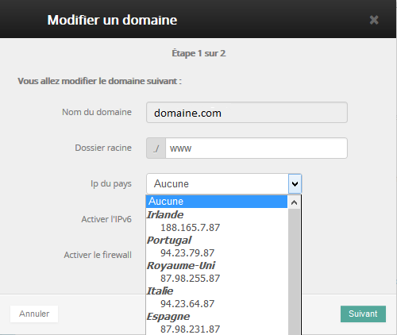

Si vous créez des sites à vocation internationale, vous vous intéressez fortement à leur référencement dans les moteurs de recherche des pays ciblés. Le positionnement dans beaucoup de moteurs de recherche dépend du pays d'hébergement de l'IP du site.

## Utilisation
La mise en place de la géolocalisation se fait à partir de votre [Espace
Client](https://www.ovh.com/manager/web/login/){.external}.

Une fois connecté, il faut que vous cliquiez sur le nom de votre site principal se trouvant à gauche dans la partie Hébergement

{.thumbnail}

Une fois dans le menu, il faut sélectionner l'onglet Sites Web. Puis cliquer sur le stylo à droite de la ligne du site que vous voulez géolocaliser.

{.thumbnail}

Vous pourrez alors choisir alors l'ip correspondante au pays. *OVH propose 12 pays différents*

{.thumbnail}

Il faut patienter jusqu'à 24H pour que le changement soit répliqué sur Internet