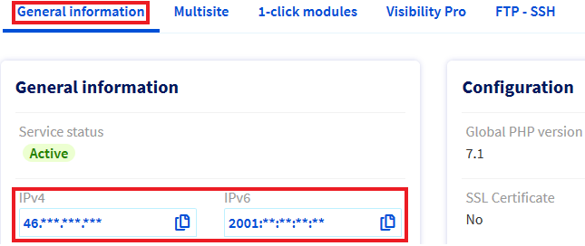
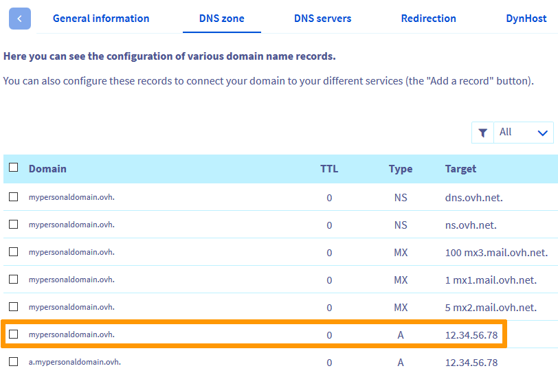
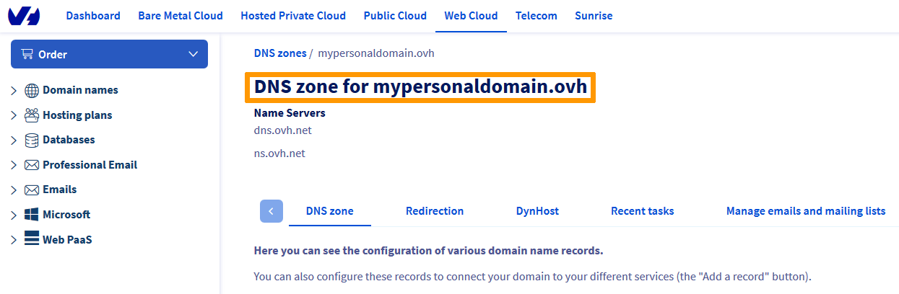
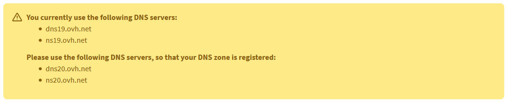

> [!primary]
> Diese Übersetzung wurde durch unseren Partner SYSTRAN automatisch erstellt. In manchen Fällen können ungenaue Formulierungen verwendet worden sein, z.B. bei der Beschriftung von Schaltflächen oder technischen Details. Bitte ziehen Sie beim geringsten Zweifel die englische oder französische Fassung der Anleitung zu Rate. Möchten Sie mithelfen, diese Übersetzung zu verbessern? Dann nutzen Sie dazu bitte den Button «Mitmachen» auf dieser Seite.
>

**Letzte Aktualisierung am 18.05.2021**

## Ziel 

Die Fehlermeldung `Seite nicht installiert` bedeutet entweder, dass die DNS-Zone Ihrer Domain nicht die korrekten Werte enthält oder dass die Konfiguration des Webhostings noch angepasst werden muss.

{.thumbnail}

**Diese Anleitung erklärt, wie Sie die Ursachen dieses Fehlers ermitteln und beheben.**

> [!warning]
> OVHcloud stellt Ihnen Dienstleistungen zur Verfügung, für deren Konfiguration und Verwaltung Sie die alleinige Verantwortung tragen. Es liegt somit bei Ihnen, sicherzustellen, dass diese ordnungsgemäß funktionieren.
>
> Diese Anleitung soll Sie bei allgemeinen Aufgaben so weit wie möglich unterstützen Bei Schwierigkeiten kontaktieren Sie bitte einen [spezialisierten Dienstleister](https://partner.ovhcloud.com/de/directory/) und/oder stellen Ihre Fragen in der OVHcloud Community. Weitere Informationen finden Sie am [Ende dieser Anleitung](#gofurther).
>

## Voraussetzungen

- Sie haben ein [OVHcloud Webhosting](https://www.ovhcloud.com/de/web-hosting/) in Ihrem Kunden-Account.
- Sie haben Zugriff auf Ihr [OVHcloud Kundencenter](https://www.ovh.com/auth/?action=gotomanager&from=https://www.ovh.de/&ovhSubsidiary=de).
- Sie verfügen über die erforderlichen Berechtigungen zum Verwalten der [DNS-Zone](../../domains/webhosting_bearbeiten_der_dns_zone/) des Domainnamens.

## In der praktischen Anwendung

Die Fehlermeldung `Seite nicht installiert` wird in zwei Situationen angezeigt:

1. Ihre Domain ist nicht im Bereich [Multisite](../multisites-mehrere-websites-konfigurieren/#schritt-1-auf-die-multisite-verwaltung-zugreifen) Ihres Hostings hinzugefügt.

2. Ihre Domain ist nicht korrekt über die `DNS-Zone`{.action} mit Ihrem Hosting verbunden.

Die folgenden Schritte helfen Ihnen, den Fehler `Seite nicht installiert` in diesen beiden Situationen zu beheben.

### Schritt 1: Den Multisite-Bereich Ihres Hostings überprüfen

Klicken Sie in Ihrem [OVHcloud Kundencenter](https://www.ovh.com/auth/?action=gotomanager&from=https://www.ovh.de/&ovhSubsidiary=de) auf `Web Cloud`{.action} und dann auf `Hosting-Pakete`{.action}.

Wählen Sie das betreffende Hosting aus der Liste aus und klicken Sie dann auf den Tab `Multisite`{.action}.

|Szenario|Erforderliche Maßnahme|
|---|---|
|Der Name Ihrer Website erscheint in der Tabelle.|Wenn Sie den Namen Ihrer Website gerade im Multisite-Bereich Ihres Hostings hinzugefügt haben, warten Sie etwa 20 Minuten und leeren Sie den Cache Ihres Browsers. Wenn die Nachricht `Seite nicht installiert` noch besteht, gehen Sie zu [Schritt 2](#checkdomainlink).|
|Die Domain oder Subdomain Ihrer Website wird nicht in der Tabelle angezeigt.|Fügen Sie Ihre Domain zu `Multisite`{.action} hinzu, indem Sie der Anleitung "[Mehrere Websites auf einem Webhosting einrichten](../multisites-mehrere-websites-konfigurieren/#schritt-2-eine-domain-oder-subdomain-hinzufugen)" folgen.|
|Die Domain wurde ohne Aktion Ihrerseits als Multisite entfernt.|Ihr Domainname oder die DNS-Zone wird wahrscheinlich über einen anderen Account verwaltet. Fügen Sie Ihre Domain als Multisite hinzu, indem Sie der Anleitung "[Mehrere Websites auf einem Webhosting einrichten](../multisites-mehrere-websites-konfigurieren/#schritt-22-eine-externe-domain-hinzufugen)" folgen.|

### Schritt 2: Die DNS-Zone Ihrer Domain überprüfen 

> [!primary]
> Mit diesem Schritt wird überprüft, ob Ihre Domain über die zugehörige `DNS-Zone`{.action} mit dem richtigen Webhosting verbunden ist.
> Mehr Informationen zu DNS finden Sie in unserer Anleitung "[Bearbeiten der OVHcloud DNS-Zone](../../domains/webhosting_bearbeiten_der_dns_zone/#dns-konzept-verstehen)".

#### 2\.1 Die IP-Adresse Ihres OVHcloud Hostings identifizieren

Um die korrekte IP-Adresse herauszufinden, klicken Sie in Ihrem [OVHcloud Kundencenter](https://www.ovh.com/auth/?action=gotomanager&from=https://www.ovh.de/&ovhSubsidiary=de) auf `Hosting-Pakete`{.action} und wählen Sie das betreffende Hosting aus.

{.thumbnail}

#### 2\.2 Überprüfen Sie die in der DNS-Zone Ihrer Domain eingetragene IP-Adresse

Überprüfen Sie nun, dass die IP-Adresse Ihres Hostings mit der in der aktiven DNS-Zone hinterlegten übereinstimmt.

Gehen Sie hierzu in den Bereich `Domainnamen`{.action}, wählen Sie Ihre Domain aus und gehen Sie dann in den Tab `DNS-Zone`{.action}.

|Szenario|Erforderliche Maßnahme|
|---|---|
|In der DNS-Zone ist Ihre Domain mit der IP-Adresse Ihres Hostings über einen Eintrag vom Typ A (für IPv4) oder AAAA (für IPv6) verbunden.  {.thumbnail}|In diesem Fall ist die Konfiguration Ihrer Domain korrekt.  Nach den letzten DNS-Änderungen wird Ihre Website innerhalb von maximal 48 Stunden verfügbar sein.  Zusätzlich können Sie Ihre Geräte (PC, Mobiltelefon, Modem usw.) neu starten und den Cache Ihres Browsers leeren.|
|Ihre DNS-Zone verfügt nicht über einen A- oder AAAA-Eintrag, der Ihren Domainnamen mit der IP-Adresse Ihres Hostings verbindet, oder einer dieser Einträge zeigt auf eine andere IP-Adresse.|Fügen Sie einen neuen A- oder AAAA-Eintrag hinzu oder ändern Sie den vorhandenen, indem Sie [dieser Anleitung](../../domains/webhosting_bearbeiten_der_dns_zone/) folgen.|
|Ihre Domain erscheint nicht im Bereich `Domainnamen`{.action} Ihres Kundencenters oder der Tab `DNS-Zone`{.action} sieht aus wie in diesem Screenshot:  {.thumbnail}|Der Domainname wird nicht über Ihren OVHcloud Kunden-Account verwaltet.  Finden Sie über unser [WHOIS-Tool](https://www.ovh.de/support/werkzeuge/check_whois.pl) den Registrar und die aktuell verwendeten DNS Server heraus.  Verwenden Sie [diese Anleitung](../multisites-mehrere-websites-konfigurieren/#schritt-22-eine-externe-domain-hinzufugen) um die zugehörige `DNS-Zone` entsprechend anzupassen.|
|Die folgende Warnmeldung bezüglich der DNS-Server erscheint im Tab `DNS-Zone`{.action}:  {.thumbnail}|Ändern Sie entsprechend die DNS-Server mithilfe [dieser Anleitung](../../domains/webhosting_allgemeine_informationen_zu_den_dns_servern/).|

## Weiterführende Informationen 

[Verzeichnis von IP-Adressen für die Webhosting Cluster](../verzeichnis-der-ip-adressen-web-hosting-cluster/)

Wenn Sie Hilfe bei der Nutzung und Konfiguration Ihrer OVHcloud Lösungen benötigen, können Sie unsere [Support-Angebote](https://www.ovhcloud.com/de/support-levels/) einsehen.

Für den Austausch mit unserer User Community gehen Sie auf <https://community.ovh.com/en/>.
