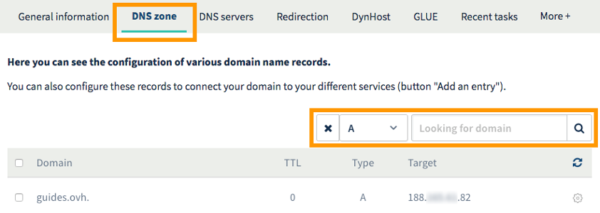

**Last updated 21st March 2018**

## Objective

The “Website not installed” warning page is designed to flag that your domain name’s DNS zone is incorrectly configured, or that the domain name used by your website has been incorrectly configured on your OVH Web Hosting plan.

**Find out how to resolve a “Website not installed” error.**

## Requirements

- You must have an [OVH Web Hosting plan](https://www.ovh.co.uk/web-hosting/){.external}.
- You must have the appropriate rights to manage the [OVH Web Hosting plan](https://www.ovh.co.uk/web-hosting/){.external} that your website is hosted on.
- You must have the appropriate rights to manage the configuration for the domain name concerned (i.e. its DNS zone).
- You must be logged in to your [OVH Control Panel](https://www.ovh.com/auth/?action=gotomanager){.external}.

## Instructions

The “Website not installed” page will only appear if:

- Your website’s domain name is incorrectly added as a  **Multisite** in your OVH Web Hosting plan’s configuration.
- Your website’s domain name has not been linked correctly to your OVH Web Hosting plan, as it doesn’t have the correct IP address added in its DNS zone configuration.

By following the two steps listed below, you can check these two configurations and resolve the “Website not installed” error.

{.thumbnail}

### Step 1: Check your Web Hosting plan’s configuration (Multisite)

To check that the domain name has been correctly added as a multisite in your Web Hosting plan, go to your [OVH Control Panel](https://www.ovh.com/auth/?action=gotomanager){.external}, then click `Web hosting`{.action} in the left-hand services bar. In the Web Hosting plan list, click on the one hosting the website for which the “Website not installed” page appears. Go to the `Multisite`{.action} tab.

The table that opens will contain all of the domain names added to your Web Hosting plan as multisites. You can use the search bar to find for the domain name concerned.

Once you have followed the instructions above and found the domain name concerned, there may be several outcomes:

|Possible outcomes|What to do|
|---|---|
|The domain appears in the table|This shows that the domain name has been correctly added to your Web Hosting plan as a multisite. If you have added it within the last 15 minutes, please wait a few moments for the “Website not installed” page to close. If the page stays open, go to [Step 2: Check the domain name’s DNS configuration](https://docs.ovh.com/gb/en/hosting/web_hosting_error_-_website_not_installed/#step-2-check-your-domain-names-dns-configuration){.external}.|
|The domain no longer appears in the table|If you added the domain name but it is no longer listed in the table, you may not have completed all the steps required to add it to your Web Hosting plan, or you may have accidentally deleted it. If this is the case, we recommend referring to our guide to [Hosting multiple websites on your web hosting plan](https://docs.ovh.com/gb/en/hosting/multisites-configuring-multiple-websites/){.external}, to ensure that you followed all of the steps when you added your domain name.|
|The domain does not appear in the table|You have not yet added this domain name as a multisite on your OVH Web Hosting plan. To add it, please follow our guide to [Hosting multiple websites on your web hosting plan](https://docs.ovh.com/gb/en/hosting/multisites-configuring-multiple-websites/){.external}.|

If you have completed all of the actions listed above, but the “Website not installed” page still appears, please move on to the step below.

### Step 2: Check your domain name’s DNS configuration

First of all, you will need to check the DNS configuration to use. To do this, stay in the section for the Web Hosting plan concerned, go to the `General information`{.action} tab, then note down the addresses that appear next to **IPv4** and **IPv6**.

{.thumbnail}

You can now check your domain name’s DNS configuration. You will need to do this using the interface provided by the registrar that manages its configuration.

> [!primary]
>
> If your domain name is registered with OVH, you can check if it uses our configuration. To do this, stay in your [OVH Control Panel](https://www.ovh.com/auth/?action=gotomanager){.external}, click `Domains`{.action} in the services bar on the left-hand side, then click on the domain name concerned. Next, go to the `DNS servers`{.action} tab.
>

There are two areas where you can check this, depending on your domain name’s configuration:

- **If your domain name does not use the OVH configuration:** you will need to check the configuration using the interface provided by the registrar that manages your domain name configuration.

- **If your domain name uses the OVH configuration:** you will need to check the configuration from your [OVH Control Panel](https://www.ovh.com/auth/?action=gotomanager){.external}. Once you have clicked on the domain name concerned, go to the `DNS zone`{.action} tab. The DNS configuration will open in a table, with each line representing a different DNS record. You can filter the table content by DNS record type, or by domain name.

{.thumbnail}

Using the interface that manages your domain name configuration for the website with the “Website not installed” page, ensure that the DNS records below are correctly configured.

|Record|Target|
|---|---|
|A|The target must be the **IPv4** address you noted down earlier.|
|AAAA|The target must be the **IPv6** address you noted down earlier.|

When you check these records, there are two possible outcomes:

|Possible outcomes|What to do|
|---|---|
|The targets are correct|This means your domain name has been correctly configured. If you have modified its DNS configuration, please allow 24 hours for the changes to fully propagate.|
|The targets are incorrect|Your domain name’s configuration needs to be modified. If it uses the OVH configuration, please follow the steps provided in our guide to [Editing your DNS zone](https://docs.ovh.com/gb/en/domains/web_hosting_how_to_edit_my_dns_zone/){.external}. If it doesn’t use the OVH configuration, follow the instructions provided in your registrar’s interface. Once you have modified the DNS zone configuration, you will need to allow 24 hours for the changes to fully propagate.|

If you have made all the changes required in steps 1 and 2, and taken into account the time required for changes to take effect, the “Website not installed” error page should no longer appear.

## Go further 

[Hosting multiple websites on your web hosting plan](https://docs.ovh.com/gb/en/hosting/multisites-configuring-multiple-websites/){.external}.

[Web hosting: How to edit your DNS zone](https://docs.ovh.com/gb/en/domains/web_hosting_how_to_edit_my_dns_zone/){.external}.

Join our community of users on [https://community.ovh.com/en/](https://community.ovh.com/en/){.external}.