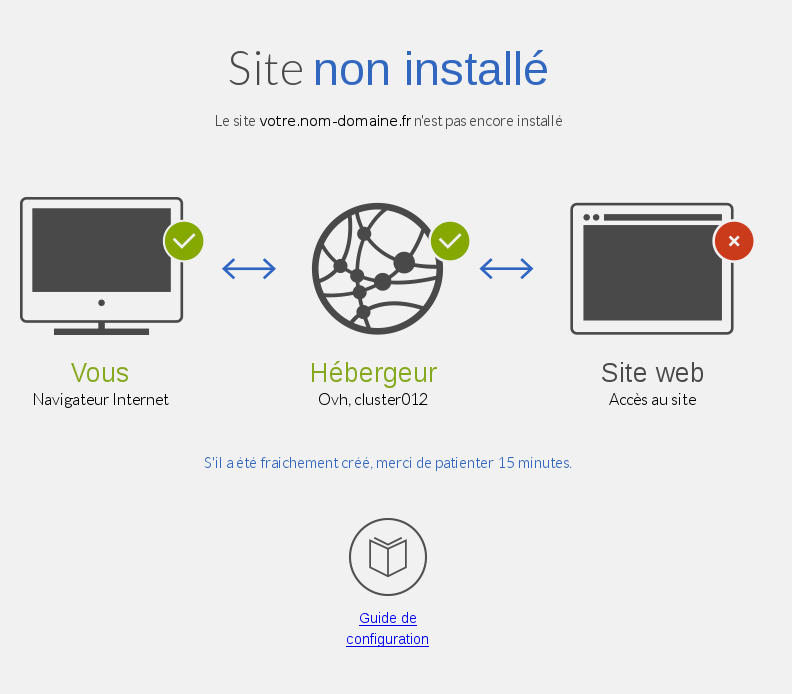
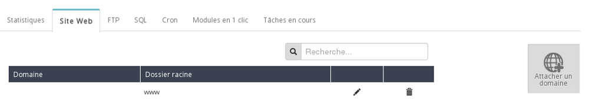

## Introducción
La página «Sitio no instalado» se muestra cuando hay un error de punteo o cuando el dominio no está correctamente declarado en el servidor.

Puede deberse a distintas causas:

- La redirección web está mal configurada.

- El dominio o subdominio no está asociado al alojamiento. 

- La IP hacia la que apunta el dominio es errónea.

{.thumbnail}
Información útil:

- Al cambiar una dirección IP, el tiempo de propagación oscila entre 4 y 24 horas. Es posible que aparezca esta página hasta que finalice la propagación.

## Error de configuración de una redirección web
Una de las razones por las que puede aparecer esta página es que la redirección web esté solo parcialmente añadida. 

Por ejemplo, puede haber configurado su dominio o subdominio para que apunten hacia la IP del servidor de redirección (213.186.33.5), pero sin crear la redirección en el [área de cliente](https://www.ovh.com/manager/web), o a la inversa.

Compruebe que ha creado correctamente la redirección web tanto para el dominio principal como para el subdominio «www» y que la IP a la que apuntan sea correcta (la IP del servidor de redirección es 213.186.33.5).

Para más información sobre la creación de redirecciones, consulte esta guía:

- .

{.thumbnail}

## Error de instalación en el alojamiento de alguno de los dominios o subdominios
Otra de las razones por las que puede aparecer esta página es que uno de los dominios o subdominios no esté correctamente instalado.

Por ejemplo, puede haber configurado su dominio o subdominio para que apunten hacia la IP del servidor web (cluster), pero sin haberlos vinculado en el [área de cliente](https://www.ovh.com/manager/web).

{.thumbnail}
Compruebe que ha añadido correctamente su dominio o subdominio desde el área de cliente con el botón «Asociar un dominio». No olvide hacer lo mismo con el subdominio «www».

También hay que comprobar que la IP hacia la que apuntan es correcta (la IP del alojamiento se indica en el [área de cliente](https://www.ovh.com/manager/web)).

Para más información sobre la instalación de multidominios, consulte esta guía: 

- 

{.thumbnail}

## Error en la IP hacia la que apunta el dominio
Otro error posible es que el dominio no apunte hacia la IP adecuada o apunte hacia la IP de un alojamiento web en el que no esté instalado el dominio.

Por ejemplo, usted puede tener el hosting para su dominio en el cluster12 y que la IP esté apuntando al cluster14.

[Consultar la dirección IP de mi alojamiento web](https://www.ovh.es/g1290.cdn-geocache#acciones_desde_el_manager_v3_desactivar_el_acelerador_geocache).

{.thumbnail}

