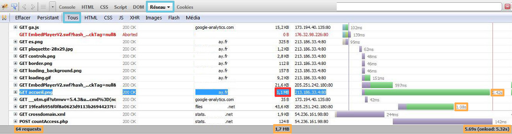
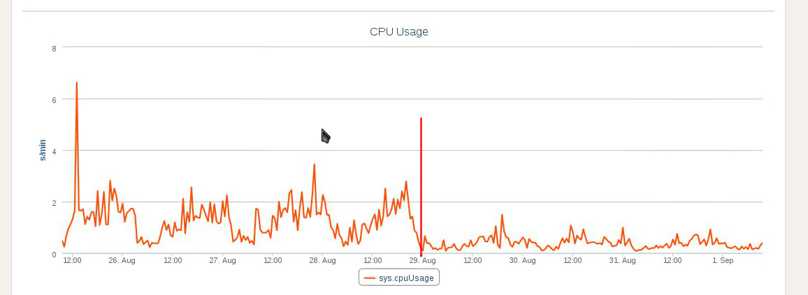

## Overview

## Questions to ask yourself:
If your website is slow, ask yourself the following questions:


- When did your website start being slow?

This way you can identify if the latency is caused by a recent website modification, such as an incorrectly optimised new plugin or a new theme, which would send a lot of outgoing queries and slow down your website.

- Is it a one-off or is the slow speed permanent?

It may be useful to check when in the day website is slow, then identify if it's caused by a spike in traffic, or if other tasks began running on the hosting package at the same time.

- Is it affecting your entire website or just part of it?

If only one web page is affected and not the entire website, it's useful to analyse this page in particular, and to check which request or script could be causing the latency.

- Do you get an error page? If yes, which type?

Check if errors are generated in order to identify the source of the latency. This guide contains various types of errors and their main causes.


{.thumbnail}


## Firebug
One useful tool for analysis is [Firebug](https://addons.mozilla.org/firefox/addon/firebug/). 

It's a module for the Mozilla Firefox browser.

One of the things it lets you do is analyse your web page's loading time in detail.

To do this, go to the "Network" tab.

In the example opposite we can see that the page takes 5.6 seconds to load. Thanks to Firebug, we can see that one of the images: "accueil.png" takes 2.42 seconds to download because it is over 1 MB. Optimising the image will therefore improve the website loading time.

{.thumbnail}


## Your website's statistics

## Data reading
You can now access new stats from the new [customer account.](https://www.ovh.com/manager/web/login.html)


- HTTP queries: Indicate the average number of website hits. Hits are classed by HTTP status 2xx/3xx - 4xx - 5xx

- Average response time: Refers to the average page response time. We differentiate between Dynamic and Static pages. 

- Exceeding the resource threshold: This graphic shows the PHP Workers usage, in order to steer you towards a different web hosting package if needed. Using PHP-FPM could help you to reduce the use of PHP workers. 

- CPU usage: Shows your website's CPU usage. This might help you to spot a possible CPU overload.

- Outgoing connections: This lets you see outgoing connections made by the servers, for example if your website is hacked, the server could be used to attack other external websites. You can also check external calls made by modules such as Facebook, Twitter etc. This might be one of the reasons why the website is slow.


{.thumbnail}

- In the screenshot, the website was hacked on the 11th of July, following this, its loading time and the outgoing connections severely increased. After the security vulnerability was fixed, response times, outgoing connections and CPU usage returned to normal.


## PHP-FPM
We have adapted PHP-FPM to our web infrastructure, in order to speed up PHP responses.

Tests have shown that performance is up to 7 times faster compared with the older mechanism.

A guide on PHP-FPM usage is available:


- []({legacy}1175)


Some server variables are changed via PHP-FPM usage:

|Variable|without PHP-FPM|with PHP-FPM|
|max_execution_time|120s|300s|
|max_input_vars|2000|16000|
|memory_limit|128M|512M|


{.thumbnail}

- The .ovhconfig file works at the root of the hosting package or in a level 1 sub-directory (ex: /www/) but not in level two or higher directories (ex : /www/test/ , /www/test/test2/)


Here is an image showing an example of PHP-FPM usage.

After it has been set up, the CPU load is radically reduced and the site performance is therefore increased.

{.thumbnail}


## Plugins

## Using a cache plugin
Using a CMS calls upon several libraries, so that one single web page can deal with an enormous amount of elements.

In order to optimise your CMS, you should use several cache plugins to avoid regenerating all of your website content each time a page loads.

We recommend that you search for cache plugins on the community websites relating to the CMS that you use (Joomla! - PrestaShop - WordPress) in order to optimise your website.

{.thumbnail}

## Deactivation - deleting unused plugins
It might be a good idea to deactivate or even delete unused plugins to improve website performance. This will prevent useless elements being downloaded.


## CDN
In order to improve website access website downloads and get naturally optimised ranking you could use an OVH CDN (Content Delivery Network) to store your files, applications and websites closer to your end users.

As a result you will improve response times for visitors all over the world because the static parts of your website will be downloaded directly by your visitor in the point of presence which is closest to them. 

Discover our [CDN solutions](https://www.ovh.co.uk/cdn/)

{.thumbnail}


## SQL

## Why optimise a database?
You have to maintain a database to make sure it performs well.
In other words, the information contained in the database should be returned to the script that requested it as soon as possible.

{.thumbnail}
To achieve this, a database has to be well structured and optimised, we will look at how to best optimise your database.

## 1. On the database

- Index the database:


To increase the speed of searches during a query, you must index fields which are used in WHERE clauses. 

Example:

```
For example: You often search for a person by town. You have to index the field "town" with the following request:

ALTER TABLE `test` ADD INDEX (`town`);
```


- Purge the database:


If there is some data which you no longer use, why not archive it? Your tables won't be as full and it will take less time to query the database.

## 2. In your scripts

- Display limit:


Limit the number of records displayed (eg 10 per page) with the LIMIT part of your SQL query.


- Order your requests:


Group your requests at the beginning of the script in this way: 


```
open_connection
request1
request2
...
close_connection

Display...
Treat data
Loop through data...
Display...
...
```


- Optimise your database by using cache


 If there are elements in your database which do not change, you should cache them.

Following this tip will drastically diminish the need to access your database and speed up your site's load time.

You can also perform session cache.
Put query results into a session variable. This means that you do not need to run an identical query next time, you can just retrieve the session variables instead.
Only recover the data which is used
In your SQL requests, make sure you select only what you need, and that you have not forgotten the links between the tables.

Example:


```
(where table1.champs = table2.champs2)
```


- Avoid resource intensive options:


Avoid using the "HAVING" clause which can slow down queries. You should also avoid using "GROUP BY", unless strictly necessary.

