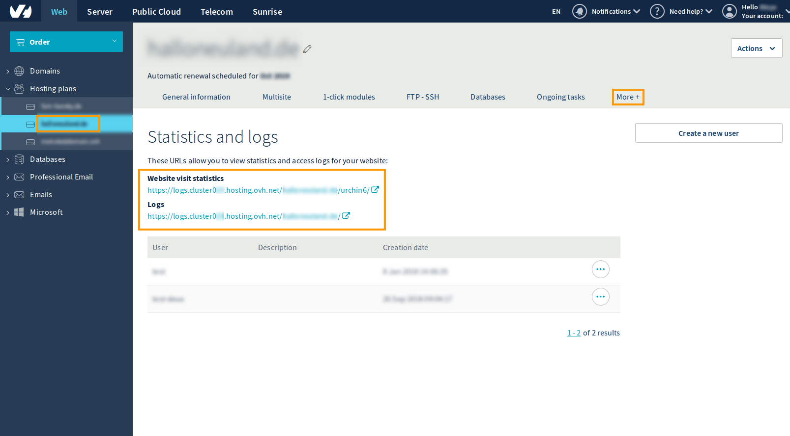
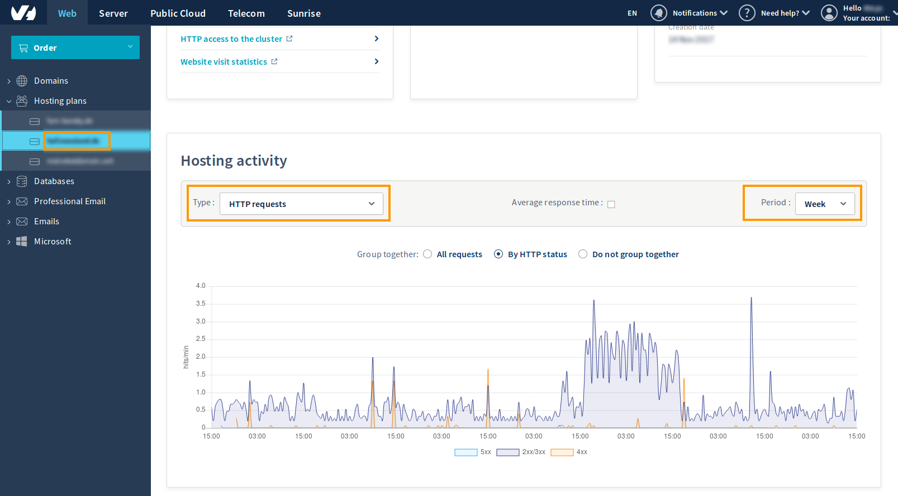

**Last updated 5th February 2020**

## Objective
This guide is designed for customers who wish to improve the performance of their website.
This guide will help you get a basic understanding on what points can affect performance on websites.

**Find out how to improve the performance of your website.**

> [!warning]
> This use case will show you how to use one or more OVHcloud solutions with external tools, and will describe the actions to be carried out in a specific context. Please remember to adapt these actions to fit your situation. If you encounter any difficulties performing these actions, please contact a specialised service provider and/or discuss the issue with our community on <https://community.ovh.com/en/>. OVHcloud cannot provide you with technical support in this regard.

## Requirements
- an [OVHcloud Web Hosting plan](https://www.ovh.co.uk/web-hosting)
- an email confirming that your Web Hosting plan has been set up
- a [domain name](https://www.ovh.co.uk/domains/) that can be used to access your website
- access to the [OVHcloud Control Panel](https://www.ovh.com/auth/?action=gotomanager)

## Instructions

### Step 1: Define the scope

#### Questions to ask yourself:
If your website is slow, it can be helpful to ask yourself the questions below to help narrow down the scope of investigation.

1. **When did your website start being slow?**
This way you can identify if the latency is caused by a recent website modification, such as an incorrectly optimised new plugin or a new theme, which would send a lot of outgoing queries and slow down your website.
2. **Is it a one-off or is the slow speed permanent?**
It may be useful to check when in the day website is slow, then identify if it's caused by a spike in traffic, or if other tasks began running on the hosting package at the same time.
3. **Is it affecting your entire website or just part of it?**
If only one web page is affected and not the entire website, it's useful to analyse this page in particular, and to check which request or script could be causing the latency.
4. **Do you get an error page? If yes, which type?**
Check if errors are generated in order to identify the source of the latency. To get a better overview of occurring errors on your hosting, please consult the logs.

Answering those questions can help to focus on specific points and diagnose areas for improvement.

The use of CMS such as WordPress, PrestaShop, Drupal or Joomla! requires many libraries, so that a single web page can handle a lot of elements.
Internet browsers must load and read all of these elements.
We provide recommendations on what web hosting offer to use for the above listed CMS on [the product page](https://www.ovh.co.uk/web-hosting/){.external}.

You can find more informations regarding which plan to choose from on [this page](https://www.ovh.co.uk/web-hosting/what_web_hosting_choice.xml){.external}.


### Step 2: Checking the PHP version
Using the latest php version compatible with your site can impact performance significantly.
To check if your website is compatible with the latest PHP version, you can consult [the official documentation of PHP](https://php.net/eol.php){.external}.

**PHP-FPM**

We have adapted PHP-FPM to our web infrastructure, in order to speed up PHP responses and radically reduce CPU load.
Tests have shown that performance is up to **7 times faster** compared with the older mechanism.

Some server variables are changed via PHP-FPM usage:

|Variable|without PHP-FPM|with PHP-FPM|
| ------------- |:-------------:| -----:|
|max_execution_time|120s|300s|
|max_input_vars|2000|16000|
|memory_limit|128M|512M|

You can find out how to update PHP in [this guide](https://docs.ovh.com/gb/en/hosting/how_to_configure_php_on_your_ovh_web_hosting_package_2014/){.external}.

To switch to use PHP-FPM in the _stable_ version or to get details on more advanced options of your webhosting, please consult [this guide](https://docs.ovh.com/gb/en/hosting/modify_your_web_hosting_systems_runtime_environment/){.external}.

The _.ovhconfig_ file works at the root of the hosting package or in a level 1 sub-directory (ex.: _/www/_) but not in level two or higher directories (ex.: _/www/test/_ , _/www/test/test2/_)


### Step 3: Checking the media content (images, videos, ...)
When accessing a website all content has to be downloaded by the browser.

This can especially be problematic when accessing an non-optimised website via a mobile device.

Using compressed images and videos is a good way to reduce the loading time.
Several algorithms and tools can be used to optimise your content. Plugins also exist for the most common CMS.
It's up to you to choose the ones fitting your specific needs.

You can find more details on this topic in the Step 5 below.

### Step 4: Optimising your scripts
Correlate the graphs of resource usage of your hosting (more information below) to find the origin of the delays and consult the logs at the dates of these peaks.

You can access your logs, statistics and graphs directly from the [OVHcloud Control Panel](https://www.ovh.com/manager/web/login.html){.external}.

How to access the logs:
- Click on the domain in the `Hosting`{.action} section,
- Click on the `More +`{.action} tab then select `Statistics and logs`{.action}.
- Then click on the links displayed to access either the _Website visit statistics_ or the _Logs_.
{.thumbnail}


How to access the graphs:
- Click on the domain in the `Hosting`{.action} section,
- Once in the `General information`{.action} section, scroll down to the very bottom of the page, there you can consult the graphs of your hosting usage.
- There you will be able to select the type of information as well as the time period for the data to be visualised.
{.thumbnail}

What are the different types of information that can be displayed?

- **HTTP requests**: Indicate the average number of website hits. Hits are classed by HTTP status 2xx/3xx/4xx/5xx.

- **Average response time**: Refers to the average page response time. Dynamic and static pages are differentiated.

- **Exceeding the resource threshold**: This graphic shows the PHP workers usage, in order to steer you towards a different web hosting package if needed. Using PHP-FPM could help you to reduce the use of PHP workers.

- **CPU usage**: Shows your website's CPU usage. This might help you to spot a possible CPU overload.

- **Outgoing connections**: This lets you see outgoing TCP request made by the server, for example if your website is hacked, the server could be used to attack other external websites. You can also check external calls made by modules such as Facebook, Twitter etc. Reducing the number of outgoing TCP requests is a good way to reduce load time because if the server which you are requesting content from is taking time to answer, the delay to load your website will increase.

- **FTP commands**: Displays the different FTP commands that have been used on the hosting. For example successful and unsuccessful login attempts, download, upload and deletion of files, ...

The two following categories are only displayed if you currently use a database on your hosting offer.
Don't forget to select the name of your database and the desired period.

- **SQL response time**: Displays the response time of the queries.

- **SQL requests**: Displays the amount of requests.

### Step 5: Checking network requests
One useful tool for analysis is the [Network Monitor](https://developer.mozilla.org/en-US/docs/Tools/Network_Monitor){.external} which is directly integrated in the Mozilla Firefox browser and allows to analyze a web page's loading time in detail.

With it you can check which elements of your site have the slowest loading/heaviest load.
It can help to narrow down which images and which content is increasing the website loading time and to prioritise where optimisations should be made .

You can access this tool by pressing the F12 key on your keyboard (via Firefox or Chrome),

Reducing the number of outgoing TCP requests is also a good way to reduce load time because if the server which you are requesting content from is taking time to answer, the delay to load your website will increase as well.

**CDN**

In order to improve website access website downloads and get naturally optimised ranking you could use the OVHcloud CDN (Content Delivery Network) to store your files, applications and websites closer to your end users.

As a result you will improve response times for visitors all over the world because the static parts of your website will be downloaded directly by your visitor in the point of presence which is closest to them.

Discover our [CDN solution here](https://www.ovh.co.uk/cdn/){.external}.


### Step 6: Checking the Content Management System (CMS) and plugins used

_This step is optional if you are not using a CMS._

To ensure that your hosting offer is adapted to the needs of your CMS, you can find a comparison of our services on [the product page](https://www.ovh.co.uk/web-hosting/){.external}.

- **Using a cache plugin:** Using a CMS calls upon several libraries, so that one single web page can deal with an enormous amount of elements. In order to optimise your CMS, you should use several cache plugins to avoid regenerating all of your website content each time a page loads. We recommend that you search for cache plugins on the community websites relating to the CMS that you use (Joomla! - PrestaShop - WordPress) in order to avoid regenerating the entire content of your website each time you load the web page.

- **Deactivation of unused plugins:** It might be a good idea to deactivate or even delete unused plugins to improve website performance. This will prevent useless elements from being downloaded.

### Step 7: Optimise your database

_This step is optional if you are not using a database._
You can access your database using PHPMyAdmin; instructions on how to use PHPMyAdmin would go beyond the scope of this guide, therefore it won't be furtherly detailed.
However, lots of external guides exist on this matter.

**How to access the database via phpMyAdmin:** To access your database via phpMyAdmin, here is the procedure to follow via the [OVHcloud Control Panel](https://www.ovh.com/auth/?action=gotomanager){.external}:

- Click on your domain under the `Hosting plans`{.action} section.
- Go to the `Database`{.action} tab.
- Click on `...`{.action} to the right of your database to find the access link to phpMyAdmin.

**Why optimise a database?** You have to maintain a database to make sure it performs well. In other words, the information contained in the database should be returned to the script that requested it as soon as possible. To achieve this, a database has to be well structured and optimised. We will look at how to best optimise your database.

#### On the database

- **Index the database:** To increase the speed of searches during a query, you must index fields which are used in WHERE clauses. Example: You often search for a person by town. You have to index the field "town" with the following request:

```
ALTER TABLE `test` ADD INDEX (`town`);
```

- **Purge the database:** If there is some data which you no longer use, why not archive it? Your tables won't be as full and it will take less time to query the database.

#### In your scripts

- **Display limit:** Limit the number of records displayed (e.g. 10 per page) with the LIMIT part of your SQL query.


- **Order your requests:** Group your requests at the beginning of the script in this way:

```
open_connection
request1
request2
...
close_connection

Display...
Treat data
Loop through data...
Display...
...
```

Closing the connection after the request allows the database server to be immediately available for other requests (and avoids producing the "User already has more than 'max_user_connections' active connections" error).

#### Optimise your database by using cache

- If there are elements in your database which do not change, you should cache them. Following this tip will drastically diminish the need to access your database and speed up your site's load time.

- You can also perform session cache, meaning you put query results into a session variable. This way, you do not need to run an identical query next time, you can just retrieve the session variables instead.

- Only recover the data which is used: In your SQL requests, make sure you select only what you need, and that you have not forgotten the links between the tables.

Example:

```
(where table1.champs = table2.champs2)
```

#### Avoid resource intensive options:
Avoid using the "HAVING" clause which can slow down queries. You should also avoid using "GROUP BY", unless strictly necessary.


#### Private SQL
If despite all the changes and optimisations you did undertake the database is slow, or if a large number of queries are made to the database, you may want to switch to our Private SQL offer to have more resources available.
A comparison of our offers can be found [on the product page](https://www.ovh.co.uk/web-hosting/sql-options.xml).

## Go further

[Modifying the configuration of a Web Hosting plan](https://docs.ovh.com/gb/en/hosting/modify_your_web_hosting_systems_runtime_environment)

[Creating and managing a database in your Web Hosting plan](https://docs.ovh.com/gb/en/hosting/creating-database)

[Getting started with the Private SQL service](https://docs.ovh.com/gb/en/hosting/getting-started-with-private-sql)

Join our community of users on <https://community.ovh.com/en/>.