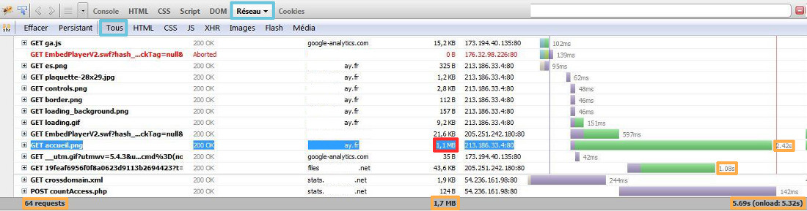
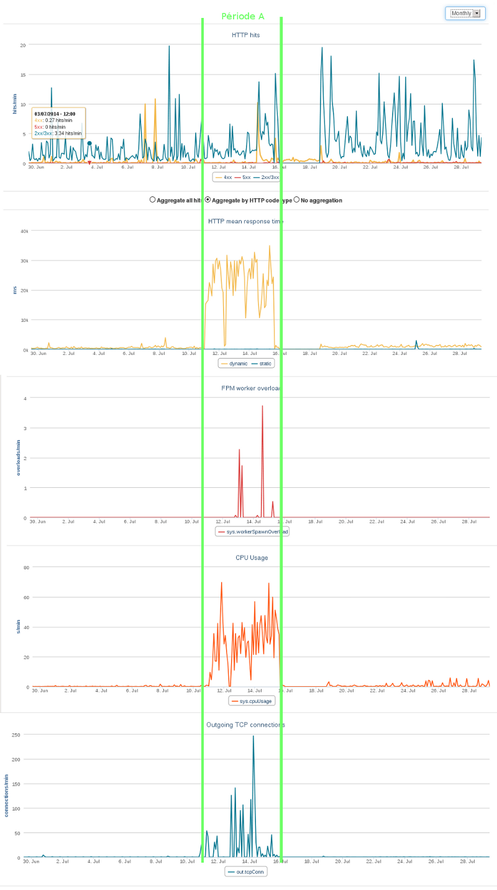
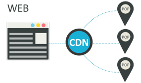

**Dernière mise à jour le 05/05/2020**

> [!warning]
>
> OVHcloud met à votre disposition des services dont la configuration, la gestion et la responsabilité vous incombent. Il vous revient de ce fait d'en assurer le bon fonctionnement.
> 
> Nous mettons à votre disposition ce guide afin de vous accompagner au mieux sur des tâches courantes. Néanmoins, nous vous recommandons de faire appel à un prestataire spécialisé et/ou de contacter l'éditeur du service si vous éprouvez des difficultés. En effet, nous ne serons pas en mesure de vous fournir une assistance. Plus d'informations dans la section « Aller plus loin » de ce guide.
> 

## Analyse

### Généralités
En cas de lenteur rencontrée voici quelques questions à se poser :

- Depuis quand le souci de lenteur est-il rencontré ?
- Est-ce aléatoire ou la lenteur du site est-elle permanente ?
- Sur la totalité ou une partie de votre site ?
- Obtenez-vous une erreur ? Si oui de quel type ?


{.thumbnail}


### Firebug
Un outil d'analyse qu'il peut être intéressant d'utiliser est [Firebug](https://addons.mozilla.org/fr/firefox/addon/firebug/){.external}.

C'est un module  **pour le navigateur Mozilla Firefox** .

Il vous permet, entre autres, d'analyser en détail les temps de chargement de votre page.

Pour cela vous devez accéder à l'onglet "Réseau".

*Dans l'exemple ci-contre, on constate que la page met 5,6 secondes à charger. Grâce à Firebug, on se rend compte qu'une des images chargées "accueil.png" prend 2,42 secondes à être téléchargée car elle pèse plus de 1 Mo. On peut ainsi optimiser l'image afin d'améliorer le temps d'accès au site web.*


{.thumbnail}


### Statistiques de votre site
Il vous est maintenant possible depuis le nouvel [espace client OVHcloud](https://www.ovh.com/auth/?action=gotomanager){.external} d'accéder à des nouvelles statistiques de votre site.

- Requêtes HTTP : Indique le nombre de hits moyen sur le site. (Hit : Requête de demande d'accès à un fichier (quelle que soit sa nature, texte, image, etc.) formée lors de l'appel d'une page web par votre navigateur).

Les hits sont classés par code http : 2xx/3xx - 4xx - 5xx

- Temps moyen de réponse : Correspond au temps moyen de réponse des pages. On différenciera les pages de type Dynamic et Static.
- Dépassements du plafond de ressources : Ce graphique vous montre l'utilisation faite des Workers PHP, cela peut vous aiguiller sur une possible bascule d'offre d'hébergement. L'utilisation de PHP-FPM peut vous aidez à réduire l'utilisation des Workers PHP.
- Utilisation du CPU : Indique l'utilisation du CPU par votre site. Cela peut vous aiguiller à repérer de possible surcharge.
- Connexions sortantes : Permet de voir les connexions sortantes réalisés par le serveurs, par exemples en cas de hack le serveur pourrait servir à attaquer d'autres sites web externes. Il vous est aussi possible de vérifier les appels externes réalisés par des modules de type Facebook, Twitter...etc. Cela peut être l'une des raisons de lenteurs d'un site web.


{.thumbnail}


> [!success]
>
> - Dans le cas visible sur l'imprime écran, le site web a été hacké le
> 11 juillet, suite à cela le temps de chargement de son site, et les
> connexions sortantes explosent. Suite à la correction de la faille de
> sécurité, les temps de réponses, connexions sortantes et utilisation
> du CPU sont à nouveau normaux.
>

## Optimisation

### PHP-FPM
Nous avons adapté PHP-FPM à notre infrastructure Web, dans le but d'accélérer les réponses PHP.

Dans nos laboratoires de tests, nous obtenons ainsi des performances jusqu'à 7 fois plus rapides que l'ancien mécanisme.

*Un guide est disponible concernant l'utilisation de PHP-FPM:** *

- []({legacy}1175){.ref}

*Certaines variables serveurs sont modifiées via l'utilisation de PHP-FPM :*


|Variable|sans PHP-FPM|avec PHP-FPM|
|max_execution_time|120s|300s|
|max_input_vars|2000|16000|
|memory_limit|128M|512M|

sans PHP-FPM120s2000128M


{.thumbnail}


> [!success]
>
> - Le fichier .ovhconfig est fonctionnel à la racine de l'hébergement ou
> dans un sous-répertoire de niveau 1 (ex : /www/) mais pas dans les
> répertoires de niveau 2 ou plus (ex : /www/test/ , /www/test/test2/)
>
Voici un graphique d'exemple d'utilisation de  **PHP-FPM** .

On remarque que suite à la mise en place de celui-ci, la charge CPU baisse radicalement, les performances du site sont donc accrues.


{.thumbnail}


### Plugins
L'utilisation des CMS fait appel à beaucoup de librairies, de sorte qu'une seule page web peut traiter énormément d'éléments. Les navigateurs Internet de vos visiteurs doivent charger et lire la totalité de ces éléments.

*Afin d'optimiser l'utilisation de votre CMS, il est conseillé d'utiliser des plugins de cache qui vous permettent d'éviter de régénérer la totalité du contenu de votre site web à chaque chargement de la page web.*

Nous vous conseillons de rechercher un plugin de cache sur les sites communautaires du CMS que vous utilisez ( **Joomla!**  -  **PrestaShop**  - **WordPress** ), dans l'optique d'optimiser votre site web.


{.thumbnail}

Toujours dans l'optique d'améliorer les performances de votre CMS, il peut être intéressant de désactiver, voire de supprimer complètement, les plugins non utilisés. Cela évitera ainsi le chargement d'éléments inutiles pour le navigateur.


### CDN
*Afin d'améliorer les performances d'accès à vos sites, de téléchargement, et de bénéficier d'un référencement naturel optimisé, il vous est possible d'utiliser le CDN (Content Delivery Network) OVHcloud pour stocker vos fichiers, vos applications, vos sites web, au plus près des utilisateurs finaux.*

De cette manière vous améliorez les temps de réponses pour vos utilisateurs finaux partout dans le monde, car les parties statiques de votre site seront chargées directement par votre visiteur dans le point de présence le plus proche de lui.

Retrouver nos offres commerciales concernant le CDN : [Offre Commercial CDN](https://www.ovh.com/ca/fr/cdn/){.external}


{.thumbnail}


### SQL
Il faut entretenir sa base de données pour qu'elle soit toujours performante. Ce que l'on entend par performante, c'est le fait que les informations contenues dans la base soient le plus rapidement retournées au script qui les demande.


{.thumbnail}

Pour cela, il faut une base bien structurée et optimisée, nous allons voir comment optimiser au mieux votre base.

- Indexer la base de données :

Pour augmenter la rapidité des recherches lors d'une requête, il faut mettre un index sur les champs qui sont utilisés dans les clauses WHERE.

Exemple :


```bash
Vous faites régulièrement une recherche de personne par rapport à la ville. Il faut indexer le champ "ville" avec la requête suivante :

ALTER TABLE `test` ADD INDEX ( `ville` );
```

- Purger la base de données :

Certaines de vos données ne sont plus consultées. Pourquoi ne pas les archiver ? Vos tables seront moins pleines et les recherches iront plus vite.

- Limitation d'affichage :

Limiter l'affichage des enregistrements à un nombre restreint (par exemple 10 par page) avec la partie LIMIT de votre requête SQL.

- Regroupement des requêtes :

Regrouper vos requêtes en début de script de cette manière :


```bash
connexion_base
requete1
requete2
...
déconnexion_base

Affichage ...
Traitement des données
Boucles ...
Affichage ...
...
```

- Optimiser via l'utilisation du cache :

Si vous avez des éléments qui sont récupérés de la base de données et qui ne changent pas, mettez-les en cache.

Ce type d'astuce diminuera drastiquement vos accès à la base de données et accélérera le chargement de votre site.

Vous pouvez aussi réaliser du cache de session. Mettre les résultats des requêtes en variable de session, puis concernant une requête identique vous ne l'exécutez plus, vous récupérez les variables de session à la place.

- Récupérer uniquement les données utiles :

Dans vos requêtes SQL vérifiez que vous ne sélectionnez que ce dont vous avez besoin, et surtout que vous n'avez pas oublié les liaisons entre les tables.

Exemple :


```bash
(where table1.champs = table2.champs2)
```

- Éviter les options très gourmandes en ressources :

Évitez d'utiliser "HAVING" par exemple qui alourdit vos requêtes , de la même manière évitez d'utiliser "GROUP BY" sauf si cela s'avère strictement nécessaire.

## Aller plus loin

Échangez avec notre communauté d'utilisateurs sur <https://community.ovh.com>.
