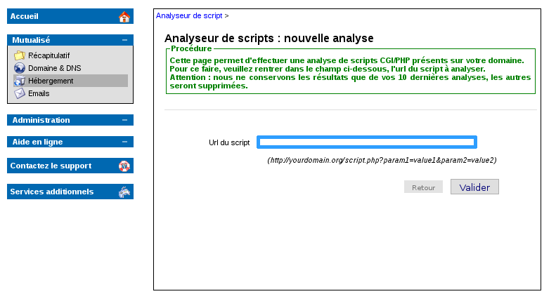
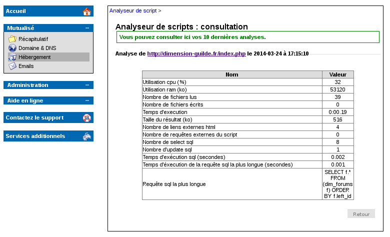
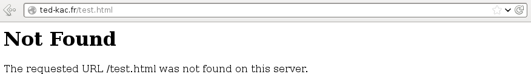
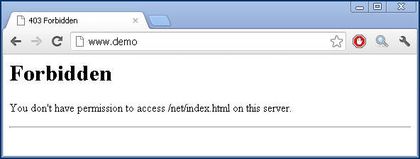
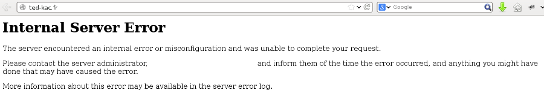
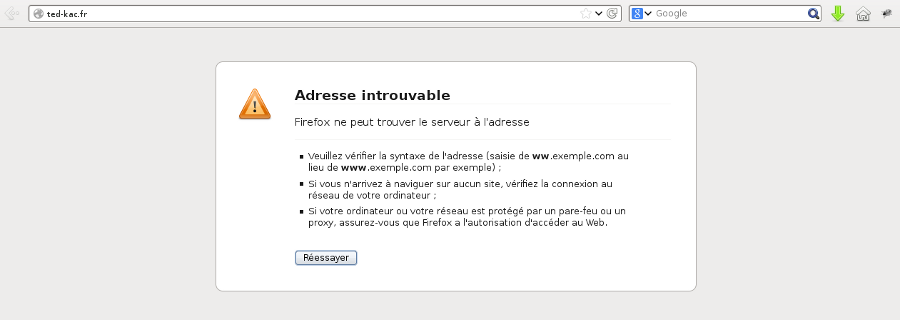
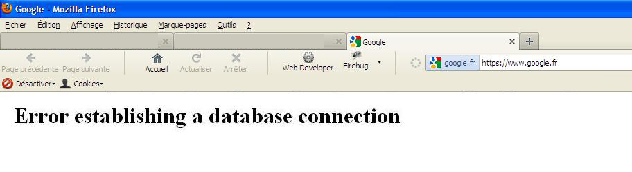

## In het algemeen

## Wat u kunt nagaan:
In het geval van vertraging, kunt u de volgende vragen doorlopen: 


- Sinds wanneer komt de vertraging voor?

Als de oorzaak samenhangt met een recente wijziging van de website, zoals bijvoorbeeld het toevoegen van een nieuwe slecht geoptimaliseerde plugin, of een nieuw thema, dat veel externe oproepen veroorzaakt en dus uw website vertraagt.

- Is het willekeurig of is de traagheid van de site permanent?

Om ook de oorzaak van de vertraging te vinden, kan het interessant zijn om na te gaan op welk tijdstip van de dag u de vertraging ondervindt, en om na te gaan of er dan veel traffic op de site is, of dat er op datzelfde tijdstip andere taken draaien op de hosting.

- Over het geheel of een deel van uw site?

Als een enkele pagina wordt getroffen en niet de totale website, is het interessant om deze pagina in het bijzonder te analyseren, en na te gaan welk verzoek of script de vertraging kan hebben veroorzaakt.

- Heeft u een foutmelding? Zo ja, welke?

Controleer of er fouten worden gegenereerd om een beter zicht te krijgen op het probleem. U vindt in deze handleiding verschillende error types en hun belangrijkste oorzaken.


{.thumbnail}


## Firebug
Een analyse tool dat interessant kan zijn om te gebruiken is [Firebug](https://addons.mozilla.org/fr/firefox/addon/firebug/).

Het is een module voor de Mozilla Firefox browser.

Het kan onder andere, tot in detail, de laadtijd van uw site analyseren.

U heeft toegang via de "Netwerk" tab.

In het onderstaande voorbeeld, ziet men dat de site 5,6 seconden nodig heeft om te laden. Met Firebug, ziet men dat het laden van "accueil.png" images 2,42 seconden duurt om te downloaden, omdat het meer dan 1 MB bedraagt. Men kan een image optimaliseren, om de toegangstijd te verbeteren tot de website.

{.thumbnail}


## Script analyzer

## In het algemeen
De script analyzer is momenteel in beta verkrijgbaar. Hiermee kunt u een analyse van een van de scripts van uw website uitvoeren.

Ga hiervoor naar het control panel.

Selecteer de desbetreffende hosting, dan in "Webhosting" -> "Hosting" -> "Script analyzer (Beta)"


- Om een nieuwe analyse van een van uw scripts te starten, selecteert u "Een nieuwe analyse opstarten"


{.thumbnail}

## Script analyse
Voer het script in, dat u wilt analyseren.

Voer hiervoor het URL script in, dat u wilt analyseren.

{.thumbnail}

## Resultaat
De verificatie van het script kan een paar minuten duren.

Zodra de verificatie is voltooid, ontvangt u een e-mail met het onderwerp:


```
Script analyse is voltooid
```


U moet echter de analyse raadplegen in het control panel.

Een script analyzer handleiding is beschikbaar via : [script analyzer handleiding](http://guides.ovh.com/AnalyseurScript)

{.thumbnail}


## Statistieken van uw site

## Het lezen van de gegevens
Het is nu mogelijk om via het nieuwe [control panel](https://www.ovh.com/manager/web/login.html) toegang te krijgen tot de nieuwe statistieken van uw site.


- HTTP verzoeken: Toont het gemiddelde aantal hits op de site. (Hit: Verzoek om toegang tot een bestand (ongeacht het type, tekst, image, etc.), samengesteld tijdens het oproepen van een webpagina in uw browser).

De hits zijn onderverdeeld per http code: 2xx/3xx - 4xx - 5xx


- Gemiddelde responstijd: Is de gemiddelde responstijd van pagina's. Men onderscheidt dynamische en statische pagina's.

- Overschrijding van het maximum aan resources: Deze grafiek toont het gebruik van de PHP Workers, het kan u helpen bij een mogelijke overschakeling van het hosting pack. Het gebruik van PHP-FPM kan u helpen om het gebruik van de PHP Workers te verminderen.

- CPU gebruik: Toont het CPU-gebruik van uw site. Dit kan wijzen op een mogelijke overload.

- Uitgaande verbindingen: Hiermee ziet u de uitgaande verbindingen uitgevoerd via de servers, bijvoorbeeld in het geval van hacking, kan de server dienen om andere externe websites aan te vallen. Het is ook mogelijk om externes oproepen te checken, die zijn uitgevoerd via module types zoals Facebook, Twitter, etc. Dit kan een van de redenen voor de traagheid van een website zijn.


{.thumbnail}

- In het geval dat zichtbaar is op de schermprint, werd de website gehackt op 11 juli, hierna gingen de laadtijd van de site en de uitgaande verbindingen omlaag. Na correctie van het beveiligingslek, werden de uitgaande verbindingen, de responstijd en het CPU-gebruik weer normaal.


## PHP-FPM
We hebben PHP-FPM op onze Web infrastructuur aangepast, om PHP responses te versnellen.

In onze laboratorium testen, krijgen we prestaties die tot 7 keer sneller zijn dan voorheen.

Een handleiding is beschikbaar over het gebruik van PHP-FPM:


- []({legacy}1175)


Sommige server variabelen worden gewijzigd door het gebruik van PHP-FPM:

|Variabel|zonder PHP-FPM|met PHP-FPM|
|max_execution_time|120s|300s|
|max_input_vars|2000|16000|
|memory_limit|128M|512M|


{.thumbnail}

- Het .ovhconfig bestand is functioneel op de root van de hosting of in een sub-map van niveau 1 (bijv.: /www/) maar niet in mappen van niveau 2 of hoger (bijv.: /www/test/ , /www/test/test2/)


Hier is een grafisch voorbeeld van het PHP-FPM gebruik.

We merken op dat nadat het is ingesteld, de CPU load drastisch omlaag gaat en de prestaties van de site omhoog gaan.

{.thumbnail}


## Plugins

## Het gebruik van cache plugin
Het gebruik van CMS heeft vele "libraries" toepassingen, 
omdat één enkele webpagina vele elementen kan behandelen. De internet browsers van uw bezoekers moeten de totaliteit van deze elementen downloaden en lezen. 

Om het gebruik van uw CMS te optimaliseren, wordt het aangeraden om cache plugins te gebruiken, waarmee de regeneratie van de totale inhoud van uw website vermeden wordt, elke keer dat de website wordt gedownload.

Wij raden u aan om een cache plugin te zoeken op de door u gebruikte CMS community sites, bijv. (Joomla!, PrestaShop, WordPress), met het oog op het optimaliseren van uw website.

{.thumbnail}

## Deactivering/verwijdering van onnodige plugins
Met het oog op het verbeteren van de prestaties van uw CMS, kunt u niet-gebruikte plugins deactiveren of volledig verwijderen. Hierdoor wordt voorkomen dat er onnodige elementen naar de browser worden gedownload.


## CDN
Om de toegang tot uw sites en het downloaden te verbeteren, en om de SEO te optimaliseren, kunt u OVH CDN (Content Delivery Network) gebruiken om uw bestanden, applicaties en websites, dicht bij uw eindgebruikers op te slaan.

Op deze manier verbetert u de responstijd voor uw eindgebruikers wereldwijd, want de statische onderdelen van uw site worden direct gedownload door uw bezoeker in het dichtstbijzijnde point of presence.

U vindt onze CDN packs via: [Commerciële CDN packs](https://www.ovh.com/fr/cdn/)

{.thumbnail}


## SQL

## Waarvoor dient de optimalisatie van een database?
U moet de database onderhouden, zodat deze afdoende blijft presteren.
Wat wordt verstaan onder presteren? Dat de in de database opgenomen gegevens snel worden teruggegeven, aan het script dat hierom vraagt.

{.thumbnail}
Hiervoor hebben we een goed gestructureerde en geoptimaliseerde database, we zullen zien hoe u het beste uw database kunt optimaliseren.

## 1. In de database

- De database indexeren:


Om de snelheid van de zoekopdrachten te verhogen, dient u een index in te stellen op de records die worden gebruikt in de WHERE parameters.

Bijvoorbeeld:

```
U heeft regelmatig een zoekopdracht inzake een persoon in relatie tot de stad. Indexeer: het record "stad" met het volgende verzoek:

ALTER TABLE `test` ADD INDEX ( `stad` );
```


- De database opschonen:


Sommige gegevens worden niet langer geraadpleegd. Waarom archiveert u deze niet? Zoekopdrachten zuller dan sneller verwerkt worden.

## 2. In uw scripts

- Gelimiteerde weergave:


U kunt de indiening van verzoeken beperken via een beperkt aantal (bijvoorbeeld 10 per pagina) met het LIMIT deel van uw SQL verzoek.


- Groepering van de verzoeken:


Groepering van uw verzoeken aan het begin van het script op de volgende wijze:


```
connexion_base
requete1
requete2
...
déconnexion_base

Affichage ...
Traitement des données
Boucles ...
Affichage ...
...
```


- Optimaliseren via het gebruik van de cache:


Zet items die zijn opgehaald uit de database en die niet worden gewijzigd in de cache. 

Dit zal de verzoeken naar uw database beperken en het laden van uw site versnellen.

U kunt ook de cache voor de sessie gebruiken.
De zoekresultaten resulteren in een variabele sessie, in het geval dat identieke verzoeken niet meer goed lopen, roept u de variabelen van de sessie op.


- Roep alleen de bruikbare gegevens op:


Verifieer in uw SQL-verzoeken dat u slechts selecteert wat u nodig heeft, en vergeet vooral niet, de verbindingen tussen de tabellen.  

Bijvoorbeeld:


```
(where table1.champs = table2.champs2)
```


- Vermijd opties die erg veel resources gebruiken:


Vermijd bijvoorbeeld het gebruiken van "HAVING", wat uw verzoeken verhoogt, vermijd op dezelfde wijze het gebruik van "GROUP BY", tenzij het strikt noodzakelijk is.


## Lijst met foutcodes
Hier is een lijst met de verschillende foutcodes en hun mogelijke oorzaken:

## 404
Deze fout treedt op, wanneer u een pagina probeert te raadplegen, die niet of niet meer bestaat op de server.

Het is ook mogelijk dat het herschrijven van de URL slecht werd uitgevoerd, waardoor een oproep naar een niet-bestaande pagina werd geïnitieerd.

{.thumbnail}

## 403
Deze fout is gerelateerd aan de bestandsrechten (CHMOD).

De gebruiker heeft onvoldoende rechten om de gevraagde pagina te bekijken.

Deze rechten kunnen worden gewijzigd door OVH na een hack van de website of door een wijziging van de klant.

{.thumbnail}

## 500
De error 500 kan worden veroorzaakt door:


- Een verkeerd geconfigureerd of slecht gecodeerd .htaccess bestand.

- De bestandsrechten zijn niet correct;

- Een script dat is gestopt door onze robot Okillerd, bijvoorbeeld in het geval van een bestand dat al lang draait, of een niet geautoriseerd commando.


{.thumbnail}

## Adres niet gevonden
Controleer eerst of uw internetverbinding actief is.

Vergeet niet om de browser cache te verwijderen, en zorg ervoor dat er geen firewalls zijn, die uw internetverbinding kunnen storen.

Deze fout kan worden veroorzaakt door een onjuiste DNS-configuratie, of door een niet-bestaande domeinnaam.

{.thumbnail}

## Fout bij het totstandbrengen van een database verbinding
Deze fout is gerelateerd aan de verbinding met de database.

Dit kan gebeuren als de klant zelf bestanden verkeerd heeft geconfigureerd en dus niet over de juiste informatie beschikt om te verbinden met de database.

Het kan ook willekeurig gebeuren als er te veel gelijktijdige verbindingen worden uitgevoerd naar de database.

{.thumbnail}

