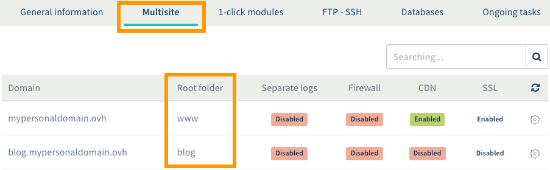

**Last updated 3rd January 2019**

## Objective

For numerous reasons, you may need to modify the configuration of your [Web Hosting plan](https://www.ovh.co.uk/web-hosting/){.external}. For this reason, OVH has implemented a file that allows you to change certain settings: the **.ovhconfig** file.

**This guide explains the.ovhconfig file and how to edit it.**

## Requirements

- a compatible [OVH Web Hosting plan](https://www.ovh.co.uk/web-hosting/){.external} (excluding Cloud Web)
- your FTP user password, which provides you with access to your storage space 

## Instructions

When you edit the .ovhconfig file of your Web Hosting plan, you will change both its configuration and that of your website, due to dependency. Performing an incompatible modification could therefore render your site unreachable. Please ensure that the new configuration is technically compatible with your website.

The .ovhconfig file can be edited in two ways:

- **By manually editing the .ovhconfig file.** This method is technical in nature, and requires you to be connected to your storage space. In this guide, we will focus on this method.

- **Through a configuration wizard in the OVH Control Panel.** This solution is less technical and requires you to be logged in to the OVH Control Panel, where you can select the changes to be made. Please refer to the instructions set out in our guide: [“Modifying the configuration of a Web Hosting plan”](https://docs.ovh.com/gb/en/hosting/modify_your_web_hosting_systems_runtime_environment/){.external}.

Continue reading if you wish to edit the .ovhconfig file manually. 

### Editing the .ovhconfig file

#### Step 1: Log in to your storage space.

Get your main FTP username, its password and the FTP server address. Once you have all these elements, log in to your storage space. If you are unsure how to do this, refer to the following guide: ["Log in to your storage space"](https://docs.ovh.com/gb/en/hosting/web_hosting_how_to_get_my_website_online/#2-log-in-to-your-storage-space){.external}.

**If you no longer have that information**, log in to the [OVH Control Panel](https://www.ovh.com/auth/?action=gotomanager){.external}, then click on `Hosting plans`{.action} in the services bar on the left. Select the name of the hosting plan concerned,and click on the `FTP - SSH`{.action} tab. There you will find the information you need to log in. With regards to the FTP user password, please refer to the instructions set out in our guide to [“Modifying a FTP user password”](https://docs.ovh.com/gb/en/hosting/modify-ftp-user-password/){.external}, if necessary.

{.thumbnail}

#### Step 2: Retrieve or create the .ovhconfig file

Once you are connected to your storage space, you can view all the files that are currently being hosted there. Keep your cursor on the root of your hosting plan (which can be represented with a “ / “). You should find the .ovhconfig file there.

{.thumbnail}

There are now two possibilities:

- **The .ovhconfig file is there.** Bring it over to your own machine. We recommend that you make a copy before editing it. This will allow you to restore the original file, if necessary.
- **The .ovhconfig file isn’t there.** Since the file doesn’t exist, you need to create it on your own machine and name it “.ovhconfig”.

#### Step 3: Edit the .ovhconfig file

Once you have the .ovhconfig file, you can edit it. To do so, you should use a text editor, or similar program. Your .ovhconfig file must contain a code similar to this:

```php
app.engine=php
app.engine.version=7.3

http.firewall=none
environment=production

container.image=stable
```

Customise the values of the variables according to the configuration you wish to use with your hosting plan. 

|Variables|Details|
|---|---|
|app.engine|Allows you to modify the PHP engine used by the hosting plan. Enter “php” to enable the PHP-FPM accelerator and  “phpcgi” to disable it. |
|app.engine.version|Allows you to define the PHP version used by the hosting plan from [the ones proposed by OVH](https://www.ovh.co.uk/web-hosting/php.xml){.external}. Enter the version of your choice.|
|http.firewall|Allows you to enable or disable the  [firewall supplied with all OVH Web Hosting plans](https://www.ovh.co.uk/web-hosting/mod_security.xml){.external}. Enter “security” to enable it or “none” to disable it.|
|environment|Allows you to manage cache behaviour for the static files of your website, as well as PHP error processing. Enter “production” to maximise caching and hide PHP errors or “development”, so that no cache is applied and PHP error are displayed.|
|container.image|Allows you to modify the runtime environment used by the hosting plan. Enter the search engine of your choice. You can find them here: [“View the configurations available”](https://docs.ovh.com/gb/en/hosting/modify_your_web_hosting_systems_runtime_environment/#view-the-configurations-available_1){.external}.|

Below is the full application detail for the .ovhconfig file:

```php
; ovhconfig
;
; this file must be placed in $HOME/.ovhconfig or in $DOCUMENT_ROOT/.ovhconfig

; __app.engine__
;
; values: php (php engine + opcache accelerator)
; notice: if php, a phpcgi engine will be activated as fallback (if previous engine crash)
;
;   php:
;       IMPORTANT: register_globals and magic_quotes_gpc are off for security
;       php optiones .htaccess (like php version) are ignored
;   phpcgi:
;       IMPORTANT this is a fallback to previous system
;       in this case __app.engine.version__ will be considerated as AUTO and php version will be old system
;       (meaning depending .htaccess or .phpX extension)
;
app.engine=php

; __app.engine.version__ specify version of your engine
;
; for php:
;   default: 7.3
; for phpcgi:
;   this options is ignored (= fallback in AUTO)
;
app.engine.version=7.3

; __http.firewall__ used to add application firewall  (filter http requests)
;
; values: none | security
; default: none
;
http.firewall=none

; __environment__
;
; values: production | development
;
Production
;       apache will maximise local cache
;       mod_expires will grow up TTL of js, css, pdf, images, video, audio
;       you can override it changing expiration explicitly in your .htaccess
;       feel free to look on our guide.
;   development:
;       no expiration is added, files are not locally in cache,
;       will speed up tests but decrease performances
;
; choosen environment will also be available in your variable ENVIRONMENT unix env
;
; default: production
;
environment=production

; __container.image__
;
; values: legacy | stable | jessie.i386 | testing
;
container.image=stable
```

#### Step 4: Download the .ovhconfig file to your storage space.

Once the .ovhconfig file has been edited, all you have to do is download it to your storage space. To do this, stay connected, with your cursor placed on the root of your storage space (which can be represented by “ / “). Download the .ovhconfig file you just edited. If a file is already there, replace it.

### Using the .ovhconfig files in advanced mode.

If you host several websites on your hosting space, you have almost certainly configured a few Multisites. There are a number of reasons why you might decide to use a different PHP version on some of your Multisites.

To do this, you must create an .ovhconfig file for the Multisite(s), containing the desired PHP version. You can refer to the instructions set out in the [“Editing the .ovhconfig file”](https://docs.ovh.com/gb/en/hosting/configuring-file-ovhconfig/#editing-the-ovhconfig-file){.external} section of this guide, if necessary. When you download the .ovhconfig file to your storage space, be sure to do so inside the Multisite's root folder. You can access the root folders through the OVH Control Panel, under the`Multisite`{.action} tab of the relevant hosting plan.

> [!warning]
>
> It is not possible to specify a second runtime environment. Only the one listed in the .ovhconfig file located in the root folder of your storage space will be taken into account.
> 

{.thumbnail}

## Go further

Join our community of users on <https://community.ovh.com/en/>.