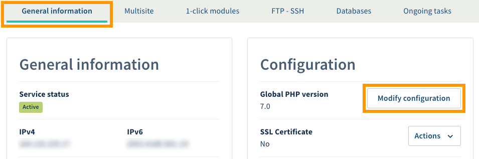
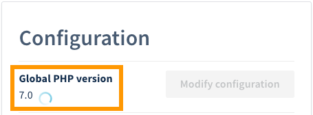
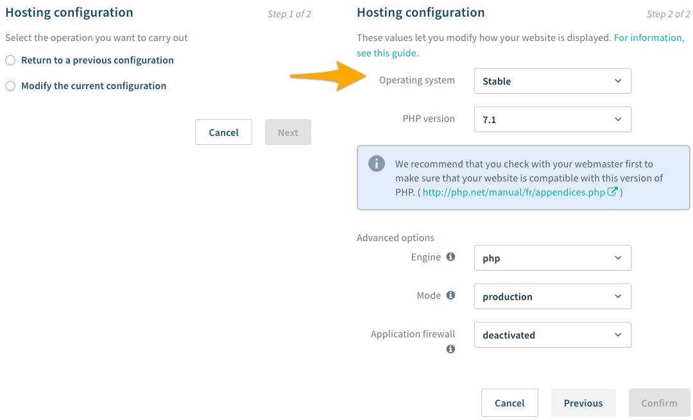

**Última actualización: 05/05/2020**

## Objetivo

Actualmente, hay una ingente cantidad de sitios web en la red. Tanto si quiere crear un blog o una tienda online como compartir una afición o promover una actividad profesional, los [planes de hosting de OVHcloud](https://www.ovh.com/world/es/hosting/){.external} le permiten alojar cualquier sitio web, en la medida en que sea compatible con la [configuración de nuestras infraestructuras](http://pro.ovh.net/infos/){.external}.

**Esta guía explica cómo modificar la configuración de un alojamiento web de OVHcloud desde el área de cliente.**

## Requisitos

- Tener contratado un [plan de hosting de OVHcloud](https://www.ovh.com/world/es/hosting/){.external} (salvo los planes de hosting Cloud Web).
- Estar conectado al [área de cliente de OVHcloud](https://www.ovh.com/auth/?action=gotomanager).

## Procedimiento

**Modificar la configuración de un alojamiento web es una operación delicada**, ya que una manipulación errónea podría deshabilitar el acceso al sitio web. A continuación explicamos lo que ocurre cuando se modifica la configuración de un alojamiento web para que entienda las consecuencias que ello implica.

Al modificar la configuración de un alojamiento, también se modifica la configuración que utiliza su sitio web. Aunque nuestras infraestructuras ponen diversas configuraciones a su disposición, usted debe asegurarse de que la configuración elegida es técnicamente compatible con su sitio web.

> [!warning]
>
> Antes de realizar cualquier cambio, asegúrese de que la modificación no hará que su sitio web deje de estar accesible. Si no está seguro, le recomendamos que contacte con un proveedor especializado. Nosotros no podremos asistirle. Para más información, consulte el apartado «Más información» de esta guía. 
> 

### Modificar la configuración del alojamiento web desde el área de cliente

#### 1. Acceder a la gestión de la configuración del alojamiento

Conéctese al [área de cliente de OVHcloud](https://www.ovh.com/auth/?action=gotomanager){.external}. En la columna izquierda, haga clic en `Alojamientos`{.action} y seleccione el alojamiento correspondiente. En la pestaña `Información general`{.action}, en el recuadro **Configuración**, haga clic en el botón `···`{.action} correspondiente al epígrafe **Versión PHP global** y seleccione `Cambiar la configuración`{.action}.

{.thumbnail}

Si el botón `Cambiar la configuración`{.action} aparece oscurecido, es posible que se esté realizando una comprobación de la **versión PHP global**. En ese caso, aparecerá un círculo de color azul junto a la versión, indicando que se esta realizando una comprobación. Espere unos minutos hasta que el botón `Cambiar la configuración`{.action} vuelva a estar habilitado.

{.thumbnail}

#### 2. Comprobar la configuración del alojamiento web

La ventana ofrece dos opciones posibles. Seleccione la operación que desee realizar y haga clic en `Siguiente`{.action}.

|Operación|Detalle|
|---|---|
|Volver a la configuración anterior|Seleccione la configuración que quiera restaurar en el menú desplegable **Historial**. Si no ha realizado ningún cambio anteriormente, esta opción no estará disponible.|
|Modificar la configuración actual|Seleccione los cambios que quiera realizar en la configuración. Para más información sobre las distintas opciones de configuración, consulte el apartado [Opciones de configuración disponibles](../cambiar_el_entorno_de_ejecucion_de_un_alojamiento/#opciones-de-configuracion-disponibles_1){.external} de esta guía.|

> [!primary]
>
> Al cambiar el entorno de ejecución del alojamiento web, las sesiones PHP se borran automáticamente.
> 

Haga clic en `Aceptar`{.action} para guardar los cambios y espere a que finalice la operación.

{.thumbnail}

### Opciones de configuración disponibles

Al modificar la configuración de un alojamiento web, se ofrecen diversas opciones. Continúe leyendo esta guía en el apartado correspondiente a la opción de la que desee ampliar la información:

- [Entorno de ejecución](../cambiar_el_entorno_de_ejecucion_de_un_alojamiento/#entorno-de-ejecucion){.external}
- [Versión de PHP](../cambiar_el_entorno_de_ejecucion_de_un_alojamiento/#version-de-php){.external}
- [Motor de PHP](../cambiar_el_entorno_de_ejecucion_de_un_alojamiento/#motor-de-php){.external}
- [Modo](../cambiar_el_entorno_de_ejecucion_de_un_alojamiento/#modo){.external}

#### Entorno de ejecución

Cambiar el entorno de ejecución permite modificar determinados valores técnicos del alojamiento web. **Antes de realizar cualquier cambio, asegúrese de que el nuevo entorno es compatible con su sitio web.** 

|Entornos|legacy|stable|testing|jessie.i386|
|---|---|---|---|---|
|Imagen relacionada|legacy|jessie.i386|jessie.i386|jessie.i386|
|Versión de PHP mínima|4.4|5.3|5.3|5.3|
|OpenSSL|0.9.8o|1.0.1k (compatible con TLS 1.2)|1.0.1k (compatible con TLS 1.2)|1.0.1k (compatible con TLS 1.2)|
|Extensión PHP Imagick| - | Sí | Sí | Sí |
|Extensión PHP Memcache (PHP 5.6)| Sí | Sí | Sí | Sí |
|Extensión PHP Memcached (PHP 5.6)| - | Sí | Sí | Sí |
|Extensión PHP Mongo (PHP 5.4, 5.5, 5.6)| - | Sí | Sí | Sí |
|Extensión Mysqlnd (solo en UTF-8)| - | Sí | Sí | Sí |
|Extensión Redis| - | Sí | Sí | Sí |
|OPcache| Sí | Sí | Sí | Sí |
|Python|2.6|2.7 y 3.4|2.7 y 3.4|2.7 y 3.4|
|Ruby|1.8.7|2.1.5|2.1.5|2.1.5|
|Rails|2.3.5|4.1.8|4.1.8|4.1.8|
|Perl|5.10|5.20|5.20|5.20|
|Git|1.7.2.5|2.1.4|2.1.4|2.1.4|

> [!primary]
>
> El entorno «legacy» puede ser útil para sitios web que utilicen versiones antiguas de PHP. Sin embargo, le recomendamos encarecidamente que utilice un entorno «stable» para disfrutar de las últimas actualizaciones. **Antes de realizar cualquier cambio, asegúrese de que el sitio web es compatible.**
> 

Una vez que haya elegido el nuevo entorno, puede realizar el cambio de dos formas distintas:

- **Desde el área de cliente**: Siga los pasos que se describen en el apartado [Modificar la configuración del alojamiento web desde el área de cliente](../cambiar_el_entorno_de_ejecucion_de_un_alojamiento/#modificar-la-configuracion-del-alojamiento-web-desde-el-area-de-cliente){.external} de esta guía.
- **Modificando manualmente el archivo «.ovhconfig»**: Esta opción es más técnica y requiere estar conectado al espacio de almacenamiento. Si quiere editar el archivo **.ovhconfig**, consulte la guía [Configurar el archivo «.ovhconfig» de un alojamiento web](../configurar-archivo-ovhconfig/){.external}.

#### Versión de PHP

Actualmente existen diversas versiones del lenguaje de programación PHP. Las más recientes corrigen bugs de las anteriores, e incorporan o prescinden de determinadas funcionalidades. OVHcloud ofrece las últimas versiones mayores de PHP, que puede consultar en el siguiente enlace: <https://www.ovh.es/hosting/php.xml>. 

Debido a que las nuevas versiones podrían no incluir ciertas funcionalidades, **asegúrese de que la nueva versión de PHP es compatible con su sitio web antes de realizar cualquier cambio.**

Puede modificar la versión de PHP de su alojamiento web de varias formas:

- **Desde el área de cliente**: Siga los pasos que se describen en el apartado [Modificar la configuración del alojamiento web desde el área de cliente](../cambiar_el_entorno_de_ejecucion_de_un_alojamiento/#modificar-la-configuracion-del-alojamiento-web-desde-el-area-de-cliente){.external} de esta guía.
- **Modificando manualmente un archivo en su espacio de almacenamiento**: Esta opción es más técnica y requiere estar conectado al espacio de almacenamiento. 

Si desea más información sobre el cambio de una versión de PHP, consulte nuestra guía [Cambiar la versión de PHP de un alojamiento web](../cambiar-version-php-en-alojamiento-web/){.external}.

#### Motor de PHP

La elección del motor de PHP permite activar o desactivar el acelerador de PHP (PHP-FPM), que ha sido adaptado a nuestra infraestructura para acelerar la velocidad de ejecución de los scripts PHP. El acelerador de PHP (PHP-FPM) permite obtener un rendimiento hasta siete veces más rápido que un motor «phpcgi». 

Puede cambiar el motor de PHP de su alojamiento web de dos formas distintas:

- **Desde el área de cliente**: Siga los pasos que se describen en el apartado [Modificar la configuración del alojamiento web desde el área de cliente](../cambiar_el_entorno_de_ejecucion_de_un_alojamiento/#modificar-la-configuracion-del-alojamiento-web-desde-el-area-de-cliente){.external} de esta guía. Para activar el acelerador de PHP (PHP-FPM), seleccione «php» como motor. Para desactivarlo, seleccione «phpcgi».
- **Modificando manualmente el archivo «.ovhconfig»**: Esta opción es más técnica y requiere estar conectado al espacio de almacenamiento. Si quiere editar el archivo **.ovhconfig**, consulte la guía [Configurar el archivo «.ovhconfig» de un alojamiento web](../configurar-archivo-ovhconfig/){.external}.

#### Modo

El modo permite gestionar el comportamiento del cacheado de los archivos estáticos del sitio web (las imágenes, por ejemplo) y el tratamiento de los errores PHP (que se suelen utilizar cuando un sitio web muestra una página en blanco, por ejemplo). Puede elegir entre dos modos:

|Modo|Almacenamiento en caché de los archivos estáticos|Tratamiento de los errores PHP|
|---|---|---|
|**producción**|Maximiza el almacenamiento en caché de los archivos estáticos en los navegadores web.|Los errores de PHP no se muestran en el sitio web.|
|**desarrollo**|No se almacena ningún archivo en caché.|Los errores de PHP se muestran en el sitio web.|

> [!primary]
>
> En las versiones 7.1 y posteriores de PHP, los errores se mostrarán en el sitio web, independientemente del modo que utilice.
> 

Puede cambiar el modo de su alojamiento web de dos formas distintas:

- **Desde el área de cliente**: Siga los pasos que se describen en el apartado [Modificar la configuración del alojamiento web desde el área de cliente](../cambiar_el_entorno_de_ejecucion_de_un_alojamiento/#modificar-la-configuracion-del-alojamiento-web-desde-el-area-de-cliente){.external} de esta guía.
- **Modificando manualmente el archivo «.ovhconfig»**: Esta opción es más técnica y requiere estar conectado al espacio de almacenamiento. Si quiere editar el archivo **.ovhconfig**, consulte la guía [Configurar el archivo «.ovhconfig» de un alojamiento web](../configurar-archivo-ovhconfig/){.external}.

## Más información

Interactúe con nuestra comunidad de usuarios en [https://community.ovh.com/en/](https://community.ovh.com/en/){.external}.
