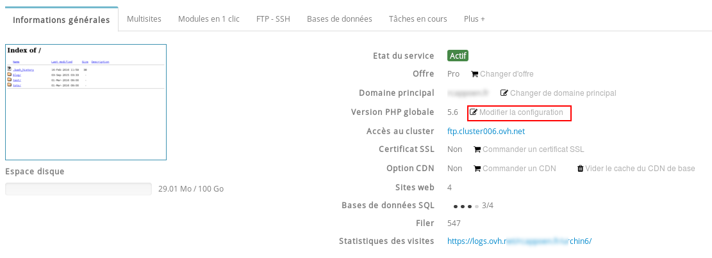
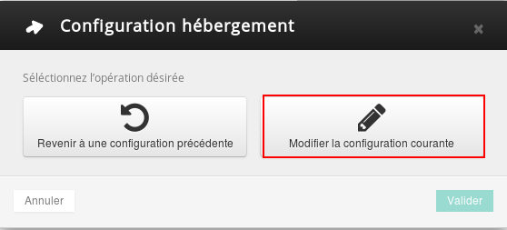

Cela permet soit de bénéficier d'une configuration stable sur le long terme, soit de bénéficier des dernières mises à jour sur les logiciels fournis par OVH.


## Choisir un environnement d'execution

### Comment modifier l'environnement d'execution ?
Vous devez pour cela vous rendre sur votre hébergement et cliquer sur "Modifier la configuration".


{.thumbnail}

Vous devez ensuite modifier la configuration courante.


{.thumbnail}

Il vous suffira ensuite de choisir dans la liste déroulante l'un des environnements d'exécution décrit ci-dessous.


{.thumbnail}

La mise à jour s'effectue au sein du fichier .ovhconfig à la racine de votre hébergement.


> [!success]
>
> Les modifications s'effectuent donc, soit dans l'espace client, soit directement
> dans votre fichier .ovhconfig.
> Vous retrouverez plus d'information sur le fichier .ovhconfig sur ce guide :
> []({legacy}1207)
> 


### Les differents environnements d'execution
Il s'agit de l'environnement historique sur les hébergements web. C'était précédemment la seule configuration disponible.

- Cet environnement est toujours maintenu. Il est cependant conseillé de passer sur un environnement "stable" par la suite afin de bénéficier des dernières mises à jour stables automatiquement. L'environnement "legacy" peut être utile pour d'anciens sites utilisant de vieilles versions de PHP, ou des logiciels qui ne sont plus maintenus (par exemple, un ancien connecteur pour les bases mysql).

*Vous devez ajouter la ligne suivante à votre fichier .ovhconfig* :*


```bash
container.image=legacy
```

Cet environnement vous permet de bénéficier des dernières mises à jour stables automatiquement.

Vous devez ajouter la ligne suivante à votre fichier .ovhconfig* :


```bash
container.image=stable
```

Cet environnement permet de bénéficier de Debian Jessie en base logicielle.

- C'est actuellement la version proposée lorsque vous sélectionnez l'environnement d'exécution "stable".

Vous devez ajouter la ligne suivante à votre fichier .ovhconfig* :


```bash
container.image=jessie.i386
```

Choisir jessie.i386 à la place de stable n'est pas conseillé mais permet de s'assurer que lorsque l'environnement "stable" changera d'image, la mise à jour ne casse pas le site. Ce cas n'arrive que lorsque le site utilise des logiciels externes aux scripts php. Cet environnement permet de bénéficier "d'avant-premières" telles que des patchs, nouvelles images, nouvelles technologies mais cela sans garantie.

Vous devez ajouter la ligne suivante à votre fichier .ovhconfig* :


```bash
container.image=testing
```

** Il s'agit du fichier .ovhconfig présent à la racine de votre hébergement web "/".*


### Differences entre les images
|Environnements|legacy|stable|testing|jessie.i386|
|---|---|---|---|---|
|Image liée|legacy|jessie.i386|jessie.i386|jessie.i386|
|Version PHP minimum|4.4|5.3|5.3|5.3|
|Openssl|0.9.8o|1.0.1k (TLS1.2 compatible)|1.0.1k (TLS1.2 compatible)|1.0.1k (TLS1.2 compatible)|
|Extension php imagick|| Oui | Oui | Oui |
|Extension php memcache (PHP 5.6)| Oui | Oui | Oui | Oui |
|Extension php memcached (PHP 5.6)|| Oui | Oui | Oui |
|Extension php mongo (PHP 5.4, 5.5, 5.6)|| Oui | Oui | Oui |
|Extension mysqlnd (en utf-8 uniquement)|| Oui | Oui | Oui |
|Extension redis|| Oui | Oui | Oui |
|Opcache**| Oui | Oui | Oui | Oui |
|Python|2.6|2.7 et 3.4|2.7 et 3.4|2.7 et 3.4|
|Ruby|1.8.7|2.1.5|2.1.5|2.1.5|
|Rails|2.3.5|4.1.8|4.1.8|4.1.8|
|Perl|5.10|5.20|5.20|5.20|
|git|1.7.2.5|2.1.4|2.1.4|2.1.4|


## FAQ

### La modification de l'environnement d'execution affecte-t-elle tout mon hebergement ?
En effet, la modification de votre environnement d'exécution sera répercutée sur tout votre hébergement. De ce fait, il n'est pas possible d'avoir deux environnement d'exécution différents en même temps.


### Sur quelle offre est-il possible de modifier l'environnement d'execution ?
La modification de l'environnement d'exécution est possible sur toutes les offres d'hébergement Web.


### Est-ce que les sessions PHP sont conservees lors d'un changement d'environnement ?
Le changement d'environnement d'exécution réinitialise automatiquement les sessions PHP.