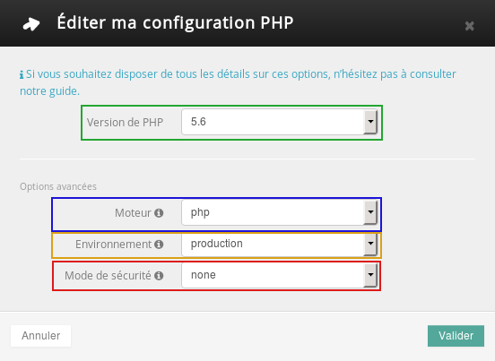

## Informationen zu PHP

## Was ist PHP?
PHP ist eine freie Programmiersprache, die hauptsächlich zur Erstellung dynamischer Webseiten verwendet wird.
Heute ist es die im Internet am häufigsten verwendete Skriptsprache, auf der Content-Management-Systeme wie Wordpress, Joomla! oder Drupal basieren.

## Wozu dient PHP-FPM?
Damit können PHP-Antworten beschleunigt werden; die Zahl der Festplattenzugriffe wird ebenso wie der Aufwand zur Verarbeitung Ihres PHP-Codes minimiert. Dadurch haben wir bei unseren Labortests eine bis zu siebenfache Steigerung der Performance im Vergleich zu dem alten Mechanismus beobachten können.

## Welche Vorteile bietet mir als Nutzer die Umstellung auf eine neue PHP-Version?
Wenn Sie auf die jüngste PHP-Version umstellen, für die der Support garantiert ist, reduzieren Sie einerseits Sicherheitsrisiken (Piraterie) und profitieren andererseits von allen Neuerungen.
Außerdem bietet Ihnen OVH ohne Zusatzkosten die alternative Implementierung PHP-FPM, mit der Sie ab Version 5.3 Ihre Performance optimieren können.

## Meine Webseite oder Teile meiner Webseite verwenden alte PHP-Versionen. Was tun?
Wir empfehlen Ihnen dringend, Ihre Seiten und geplanten Aufgaben ab sofort mit den neuen Versionen zu testen. In dieser Anleitung erfahren Sie mehr darüber.

## Wieso nimmt OVH diese Aktualisierung nicht automatisch vor?
Jede Webseite ist einzigartig. Wir können aber leider keine personalisierten Versionsupdates vornehmen, sodass Sie diese Aufgabe selbst erledigen müssen.

## Ich bin Developer und möchte das Versionsupdate manuell vornehmen.
In diesem Fall hilft Ihnen folgende Anleitung weiter: []({legacy}1207). Dort erfahren Sie alles über die Konfiguration der Datei .ovhconfig.


## Welche Version wird aktuell verwendet?
Wählen Sie in Ihrem Kundencenter unter "Hosting-Pakete" das gewünschte Hosting aus. Dort finden Sie die "Globale PHP Version" (1).

{.thumbnail}
Um die verwendete PHP-Version zu ändern, klicken Sie auf "Die Konfiguration ändern" (2 im Bild).


## Version ändern
Sie haben die Wahl zwischen folgenden PHP-Versionen:

Version:

- 5.4
- 5.5
- 5.6
- 7.0

(standardmäßig sollten Sie die letzte stabile Version 5.6 auswählen)

Engine:

- php (aktiviert PHP-FPM)
- phpcgi (deaktiviert PHP-FPM)

(standardmäßig ist php ausgewählt, sodass Sie von PHP-FPM profitieren; mehr zu FPM im Abschnitt "Allgemeines" weiter oben)

Umwelt :

- Entwicklung: Der Datei-Cache ist hier nicht aktiv, es erscheinen PHP-Logs auf Ihrer Webseite (display_errors=On).
- Produktivbetrieb: Statische Dateien wie Bilder, Videos, Audio, html oder css werden im Cache gespeichert, es erscheinen keine PHP-Logs auf Ihrer Webseite (display_errors=Off).

Application Firewall :
- Deaktiviert
- Atkiviert: Mit dieser Option können Sie eine Firewall Application des Typs mod_security aktivieren.


{.thumbnail}
Für eine Standard-Konfiguration empfehlen wir die in obigem Screenshot angewählten Einstellungen.
Es kann einige Minuten dauern, bis die Änderung wirksam wird.

{.thumbnail}
Danach können Sie die PHP-Version jederzeit erneut ändern: Klicken Sie dafür auf "Die Konfiguration ändern" und anschließend auf "Die derzeitige Konfiguration ändern".

{.thumbnail}


## Zur vorherigen Konfiguration zurückkehren
Wenn es durch die Änderung der PHP-Version zu Problemen auf Ihrer Webseite kommt, können Sie ganz einfach zur vorherigen Konfiguration zurückkehren. Auch hierfür klicken Sie zunächst auf "Die Konfiguration ändern".

{.thumbnail}
Klicken Sie dann auf "Zurück zur vorherigen Konfiguration".

{.thumbnail}
Wenn Sie die PHP-Version mehrfach geändert haben, können Sie nun unter "Ursprüngliche Wahl" die gewünschte Version auswählen. Sollten Sie nur eine einzige Änderung der PHP-Version vorgenommen haben, wird die Auswahl deaktiviert.

{.thumbnail}
Es kann einige Minuten dauern, bis die Änderung wirksam wird.

{.thumbnail}
Wenn Sie aufgrund von Problemen zu einer älteren PHP-Version zurückkehren müssen, empfehlen wir Ihnen den folgenden Abschnitt "Wie kann ich sicherstellen, dass meine Webseite mit einer neuen PHP-Version kompatibel ist?".


## Wie kann ich sicherstellen, dass meine Webseite mit einer neuen PHP-Version kompatibel ist?
1. Wenn Sie ein Content-Management-System wie Wordpress, Joomla! oder Drupal verwenden, sollten Sie in einem ersten Schritt Ihre Seite aktualisieren, wie es in den offiziellen Guides erklärt wird:

- [WordPress](http://blog.wpde.org/category/release)
- [Joomla!](https://docs.joomla.org/Portal:Upgrading_Versions/de)
- [Drupal](http://www.drupalcenter.de/handbuch/update)
- [PrestaShop](http://doc.prestashop.com/display/PS16/Updating+PrestaShop) (English)

2. Wenn Ihre Webseite auf einer personalisierten Lösung basiert, sollten Sie die [offiziellen Guides zur Umstellung der PHP-Version](http://php.net/manual/de/appendices.php) lesen.
Wenn Sie nicht der Entwickler Ihrer Webseite sind, wenden Sie sich an Ihren Webmaster

## Welche PHP-Version wird in einem bestimmten Verzeichnis verwendet?
In Ihrem Kundencenter wird nur die "globale" PHP-Version angezeigt, also diejenige, die in Ihrem Wurzelverzeichnis festgelegt ist. Wenn Sie in einem Unterverzeichnis eine andere Konfiguration vorgenommen haben, die Sie nun überprüfen wollen, laden Sie folgende Datei herunter (Rechtsklick, "Ziel speichern unter"): [info.php](https://www.ovh.com/fr/documents/info.php)
Wenn Sie diese Datei selbst erstellen wollen, erstellen Sie einfach eine Textdatei mit:

```
<?php phpinfo(); ?>
```

Speichern Sie sie anschließend im Format .php unter dem Namen info.php

Veröffentlichen Sie die Datei via FTP ([]({legacy}1380)) im gewünschten Verzeichnis, z. B. /www/meinwordpress/
In Ihrem Webbrowser können Sie jetzt dieses info.php aufrufen, z. B. über www.meine-seite.com/meinwordpress/info.php

{.thumbnail}


## Ich habe über die .htaccess-Datei eine PHP-Version definiert. Was passiert nun damit?
Die in dieser Datei definierte PHP-Version ist gegenüber der in Ihrem Kundencenter festgelegten Version nachrangig und wird daher nicht mehr berücksichtigt. Andere Spezifikationen aus der .htaccess-Datei (URL Rewriting, Umleitungen, etc.) bleiben aber weiterhin aktiv.


## Welche Einschränkungen gibt es bei PHP-FPM?
Aus Sicherheitsgründen sind folgende Optionen deaktiviert ("deprecated"):

```
register_globals
magic_quotes_gpc
```


## Ich habe Probleme bei der Umstellung der PHP-Version. Was nun?
Leider kann unser Support die PHP-Version nicht für Sie umstellen. Wir helfen Ihnen aber gerne bei der Umstellung (über das Kundencenter oder die Bearbeitung der Datei .ovhconfig). Unser Support kann aber keinesfalls für eventuell auftretende Funktionsstörungen haftbar gemacht werden.

## Sie brauchen Hilfe?
In unserem Partnernetzwerk gibt es sicher auch für Sie den passenden Internet-Dienstleister, der Sie bei der Umstellung Ihrer Webseite unterstützt: [http://www.ovh.biz/](http://www.ovh.biz/).

