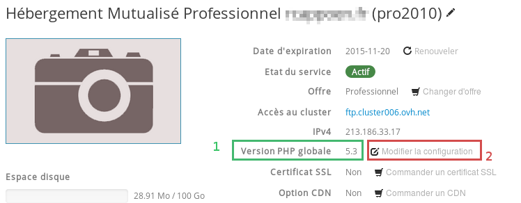
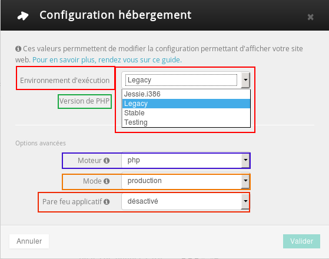
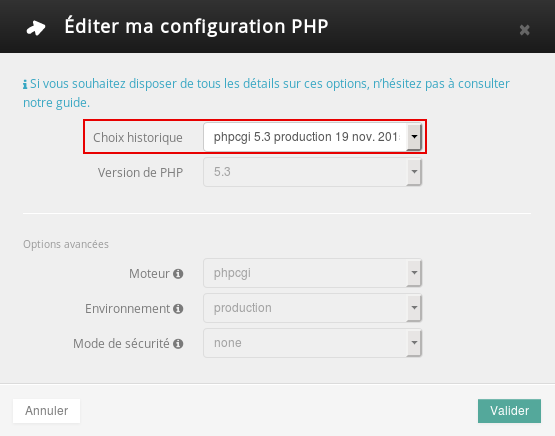
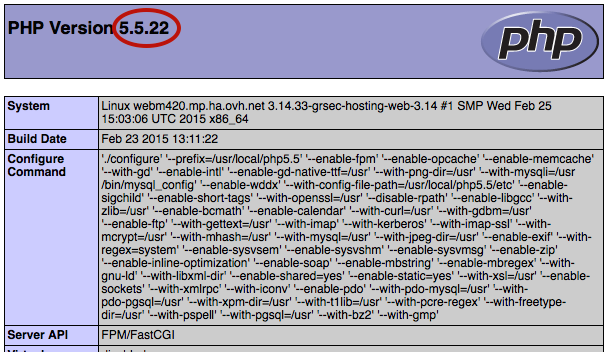

## About PHP

## PHP is an open-source programming language, mainly used to build dynamic web pages.
It is the most widely used language on the internet today, and is used by content management systems such as WordPress, Joomla! and Drupal.

## Why PHP-FPM?
PHP-FPM interprets PHP requests more quickly and speeds up response time. According to our tests, PHP-FPM facilitates site access an average of 7 times faster than an identical hosting system without this optimisation.

## What are the advantages of migrating to a newer version of PHP?
By migrating your site to the latest supported version of PHP, you are much less likely to experience security vulnerabilities and you will also benefit from all the new features of the language. 
OVH also offers free PHP-FPM optimisation (from version 5.3) to boost your website's performance.

## My website, or part of my website, uses old versions of PHP. What should I do?
We urge you to test your websites and scheduled tasks with these new versions as soon as possible. We will explain how to do this further on in the guide.

## Why won't OVH update PHP automatically?
As all websites are different, OVH cannot cater for every customer, so customers will need to migrate their scripts themselves.

## You are a developer?
You can also configure PHP manually by configuring the .ovhconfig file. 

Follow this guide to do so: []({legacy}1207)


## Check your current PHP version
Log in to your customer account, go to the "Hostings" section on the left-hand side and click on the relevant hosting package. You will find the version of PHP which your site is currently running next to the phrase "Global PHP version"(1).

{.thumbnail}
To alter this version, click on "Modify configuration " (2 in the image opposite).


## Modify version
You can choose the following elements:

Runtime environment :
OVH web hosting packages let you change the runtime environment that your website runs in.This means that you can either take advantage of a stable configuration over the long term, or benefit from the latest updates on the software provided by OVH. 

You can choose from the following versions:

Versions of PHP:

- 5.4
- 5.5
- 5.6
- 7.0 

(by default, you can choose the latest stable version of PHP, 5.6)

Engine:

- php (enables PHP FPM)
- phpcgi (disables PHP FPM)

(the engine: php is chosen by default, and you are advised to use it so that you can benefit from PHP-FPM, the advantages of PHP-FPM are described above in the "Overview" section.

Environement:

- In development mode: no cache is stored. PHP logs are displayed on your site (display_errors=On).
- In production mode: static files such as images, videos and audio files have a longer lifespan which maximises file caching on web browsers. PHP logs aren't displayed on your website(display_errors=Off).

Application firewall: 
- deactivated
- activated: This enables a type mod_security application firewall.


{.thumbnail}
We suggest that you choose the options indicated in the screen shot above for default configuration.
There will be a short delay while the modification is taking place.

{.thumbnail}
If you want to modify the PHP version again at a later date, you just have to click on "Modify configuration" and then "Modify current version".

{.thumbnail}


## Restore previous version
If changing your PHP version caused issues on your website you can return to a previous version by clicking on "Modify configuration".

{.thumbnail}
Then click "Return to a previous configuration".

{.thumbnail}
If you have previously modified the version of PHP which your site runs you just have to select the version that you want from the list of "previous choices"

{.thumbnail}
There will be a short delay while the modification is taking place.

{.thumbnail}
If you do want to return to a previous version, we suggest you refer to the paragraph below: "How to make sure that my website is compatible with a new version of PHP?”


## "How to make sure that my website is compatible with a new version of PHP?”
1. If you a use content management system such as WordPress, Joomla! or Dotclear PHPBB, you should first update your site by following their official guides:

- [Wordress](https://codex.wordpress.org/Updating_WordPress)
- [Joomla](https://docs.joomla.org/J3.x:Updating_from_an_existing_version)
- [Drupal](https://www.drupal.org/documentation)
- [Prestashop](http://doc.prestashop.com/display/PS15/Updating+PrestaShop)

2. If your site is based on a custom solution, you should refer to [url="http://php.net/manual/en/appendices.php"]the official PHP documentation

If you are not the developer, contact your webmaster.

## Check the version of PHP which is used in a specific directory
Your customer account displays the "global" PHP version. If you have a particular configuration in a subdirectory, you can verify the PHP version used by downloading the info.php file 
If you want to create this file yourself, just create a text file and include:

```
<?php phpinfo(); ?>
```

Then save this file in .php format and call it
info.php

Publish the file via FTP to the desired folder, eg. /www/mywordpress/
Then go to this info.php file in your web browser. For example www.your-site.com/mywordpress/info.php

{.thumbnail}


## I configured a .htaccess file to force a specific version of PHP.
The PHP version defined in this file will no longer be taken into account because the version defined in your customer account takes precedent. If your .htaccess file contains other directives (URL rewriting, redirection,), these will still be active.


## What are the restrictions of PHP-FPM?
For security reasons, the following actions are disabled:

```
register_globals
magic_quotes_gpc
```


## I am having trouble migrating, what should I do?
Our customer support team cannot migrate your version of PHP for your, however they can guide you with your update (whether you are doing it via the customer account or via the .ovhconfig file). Our support team cannot be held accountable for any malfunctions.

## Need help?
Find a web provider among our partners who will be able to help you with your site migration: [http://www.ovh.biz/](http://www.ovh.biz/).

