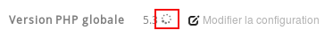
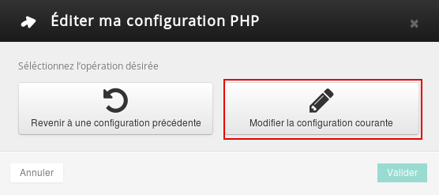
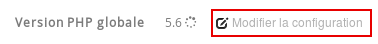

## Généralités

### Informations liées a PHP
PHP est un langage de programmation libre, essentiellement utilisé pour produire des pages Web dynamiques. C'est le langage le plus utilisé sur Internet aujourd'hui, sur lequel s'appuient des gestionnaires de contenus comme Wordpress, Joomla, Drupal ... Cela permet d'accélérer les réponses PHP, il minimise les appels disques ainsi que le traitement nécessaire de votre code PHP. Nous obtenons ainsi des performances jusqu'à 7 fois plus rapides dans nos laboratoires de tests, par rapport à l'ancien mécanisme.

En migrant votre site sur les dernières versions de PHP, qui sont maintenues, vous vous exposez beaucoup moins aux failles de sécurité (piratage) tout en profitant de nouveautés. De plus OVH vous propose l'optimisation gratuite PHP-FPM pour booster vos performances à partir de la version 5.3. Nous vous conseillons vivement de tester vos sites et tâches planifiées avec ces nouvelles versions dès maintenant. Nous expliquons dans la suite de ce guide comment faire.

Tous les sites étant uniques, nous ne pouvons malheureusement pas faire de mise à jour personnalisée, vous devez donc réaliser ces opérations de votre côté.

Vous pouvez dans ce cas vous rendre sur le guide suivant qui détaille comment configurer le fichier .ovhconfig : [Configurer le PHP sur son hébergement web (Mutu 2014)](https://docs.ovh.com/fr/hosting/configurer-le-php-sur-son-hebergement-web-mutu-2014/){.external}.


## Modifier la version de PHP

### Connaitre la version actuelle
Il faut vous rendre dans votre espace client dans la rubrique "Plateforme" et cliquer sur l'hébergement concerné. Vous retrouver à la ligne "Version PHP globale" la version utilisée par votre site (1).


{.thumbnail}

Pour modifier cette version, vous devez cliquer sur le lien "Modifier la configuration" (2 sur l'image ci-dessus).


### Modifier la version
Vous pouvez choisir les éléments suivants :

Version :

- 5.4
- 5.5
- 5.6
- 7.0
- 7.1
- 7.2

Moteur :

- php (active le PHP FPM)
- phpcgi (désactive le PHP FPM)
- development : aucun cache n'est appliqué et les logs PHP apparaissent sur votre site (display_errors=On).
- production : les fichiers statiques tels que images, vidéo, audio, html, css ont une expiration plus grande ce qui maximise la mise en cache des fichiers sur les navigateurs et les logs PHP n'apparaissent pas sur votre site (display_errors=Off).
- none
- security : Cela permet d'activer un firewall applicatif de type mod_security.


{.thumbnail}


> [!success]
>
> Nous vous conseillons donc pour une configuration par défaut de choisir les
> options indiquées dans la capture d'écran ci-dessus.
> 

Il y aura ensuite un délai de quelques minutes pour que la modification soit effective.


{.thumbnail}


> [!success]
>
> Vous pourrez par la suite modifier à nouveau la version PHP en cliquant sur
> "Modifier la configuration" puis "Modifier la configuration courante".
> 


{.thumbnail}


### Revenir a la version precedente
Si la modification de la version PHP génère des problèmes sur votre site, vous pouvez dans ce cas "revenir en arrière" sur la configuration de PHP, vous pouvez pour cela cliquer à nouveau sur le bouton "Modifier la configuration".


{.thumbnail}

Cliquer ensuite sur "Revenir à une configuration précédente".


{.thumbnail}

Si vous n'avez pas réalisé différentes modifications de la version PHP, le cadre suivant apparaîtra. Dans le cas contraire, il vous suffira de choisir dans "Choix historique" la version souhaitée.


{.thumbnail}

Il y aura ensuite un délai de quelques minutes pour que la modification soit effective.


{.thumbnail}


> [!alert]
>
> Si vous devez effectuer ce retour en arrière pour la version php, nous vous
> suggérons de consulter le paragraphe "Comment m'assurer que mon site est
> compatible avec une nouvelle version de PHP ?" ci-dessous.
> 


## FAQ

### Connaitre la version de PHP utilisee dans un repertoire specifique ?
Votre espace client affiche la version PHP "globale", c'est à dire celle qui est définie à la racine de votre hébergement. Si vous avez une configuration particulière dans un sous-répertoire, vous devrez créer un fichier texte et y inclure:


```php
1. <?php phpinfo(); ?>
```

Ensuite, enregistrez le au format .php : nommez le info.php

Publiez via FTP le fichier dans le dossier souhaité (le guide intitulé "[Utilisation logiciel FileZilla avec votre hebergement](https://docs.ovh.com/fr/hosting/mutualise-guide-utilisation-filezilla/){.external}" peut vous y aider), par exemple /www/monwordpress/ Avec votre navigateur Web, rendez-vous ensuite sur ce info.php. Par exemple www.votre-site.com/monwordpress/info.php


{.thumbnail}


### J'ai configure un fichier .htaccess pour forcer une version de PHP, qu'en adviendra t-il ?
La version PHP définie dans ce fichier ne sera plus pris en compte car la version définie dans votre espace client est prioritaire. Si votre fichier .htaccess contient d'autres directives (URL rewriting, redirection, ...), celles-ci seront toujours actives.


### Quelles sont les restrictions du PHP FPM ?
Pour des raisons de sécurité, les options suivantes sont désactivées (dépréciées par PHP) :


```bash
register_globals
magic_quotes_gpc
```


### Je rencontre des difficultes pendant la migration, comment puis-je proceder ?
Notre support client ne pourra pas migrer votre version php à votre place, cependant il peut vous guider pour mettre à jour votre version de PHP (par l'espace client ou via le fichier .ovhconfig). Notre support ne peux être tenu pour responsable des potentiels dysfonctionnements. Trouvez un prestataire Web dans notre réseau de partenaires agréés qui vous accompagnera dans la migration de votre site : [http://www.ovh.biz/](http://www.ovh.biz/){.external}.