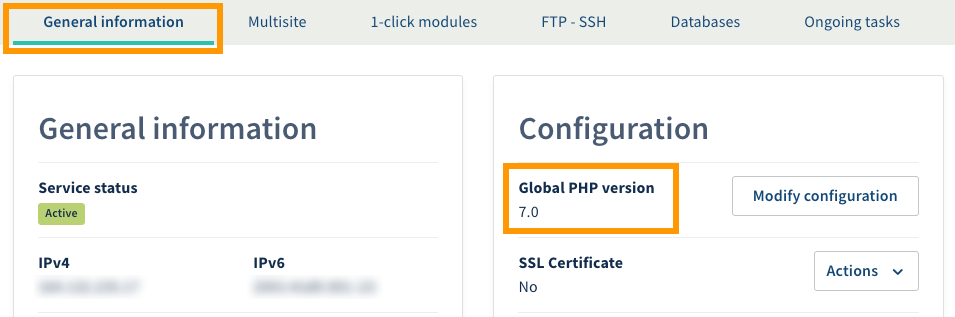

**Last updated 23rd October 2018**

## Objective

There are many different types of website published online. With an [OVH Web Hosting plan](https://www.ovh.co.uk/web-hosting/){.external}, you can host whatever kind of website you want, provided it is compatible with [our infrastructures’ configuration](http://pro.ovh.net/infos/){.external}. As a result, you may find that you want to modify the PHP version used by your Web Hosting plan.

**Find out how to change the PHP version on an OVH Web Hosting plan.**

## Requirements

- a compatible [OVH Web Hosting plan](https://www.ovh.co.uk/web-hosting/){.external} (excluding Cloud Web)
- the ability to manage the Web Hosting plan from the [OVH Control Panel](https://www.ovh.com/auth/?action=gotomanager), or access to the information you need to connect to the storage space 

## Instructions

There are now several versions of PHP programming language. As usual, version developments include different patches, and also add or remove features. OVH offers the very latest PHP versions, a list of which can be found here: <https://www.ovh.co.uk/web-hosting/php.xml>. 

Because some features cannot be maintained in newer versions, **please ensure that the new PHP version you want to use is compatible with your website before you start making any changes.**

### Step 1: Ensure that your website is compatible.

Although OVH manages setup for the latest PHP versions on its servers, as a webmaster, you are responsible for ensuring that your website is up-to-date and compatible with the latest PHP versions. There are two ways of doing this, depending on the type of website you are using.

**If you are using a turn-key website, based on a CMS (e.g. WordPress or Joomla!):** 

- Check the official documentation released by your CMS' publisher. 
- Note down the information concerning essential technical requirements for your CMS to work, as well as the changes you need to make in order to update your CMS.
- If necessary, update your CMS and check that the new version is compatible with your OVH Web Hosting plan.

**If you are using a website based on a custom solution:** 

- Get in touch with the webmaster who built the website.
- Check the official PHP documentation, which provides more information on the version migrations. The official documentation is available here: <http://php.net/manual/en/appendices.php>.
- If necessary, update your website’s code and check that it remains compatible with your OVH Web Hosting plan.

If you need to see which PHP version is currently used by your OVH Web Hosting plan, there are two ways of doing so: 

|Method|Description|
|---|---|
|Via the OVH Control Panel|Log in to the [OVH Control Panel](https://www.ovh.com/auth/?action=gotomanager){.external}, click `Web hosting`{.action} in the services bar on the left-hand side, then choose the Web Hosting plan concerned. In the `General information`{.action} tab, note down the version listed below **Global PHP version**. If a blue circle appears instead, please wait a few moments for the version to load.|
|Via a script|Create a **.php** script, containing only the code `<?php phpinfo(); ?>`. You need to put the script online on your storage space, then run it by accessing its full URL. |

{.thumbnail}

If you are unable to ensure that your website is compatible with the new PHP version, you can try to change the current version and undo your changes if necessary. **Please note, however, we strongly advise against adopting this method.** By doing this, you run the risk of your website experiencing some technical issues. It is also important to keep in mind that even if the website displays properly once you have changed the PHP version, specific features may be affected, and may no longer work properly. 

Once you are ready to change the PHP version, please move to the next step.

### Step 2: Change the PHP version on your Web Hosting plan.

There are several ways you can modify your Web Hosting plan’s PHP version:

- **Through a configuration wizard in the OVH Control Panel.** This solution is less technical, and you will need to be logged in to the OVH Control Panel, where you can choose the new PHP version along with other settings. Please refer to the instructions set out in this guide if you would like to use this method: [Modifying the configuration of a Web Hosting plan](https://docs.ovh.com/gb/en/hosting/modify_your_web_hosting_systems_runtime_environment/){.external}.

- **By manually modifying a file in your storage space.** This solution is more technical, and you will need to be logged in to your storage space, so that you can modify the .ovhconfig file. Please refer to the instructions set out in this guide if you would like to use this method: [Configuring the .ovhconfig file of your Web Hosting plan](https://docs.ovh.com/gb/en/hosting/configuring-file-ovhconfig/){.external}.

If you are more technically experienced, please note that you can no longer modify the PHP version via an .htaccess file on the latest [OVH Web Hosting plans](https://www.ovh.co.uk/web-hosting/){.external}. The command that changes the PHP version in .htaccess files cannot be used to switch to the latest PHP versions on our infrastructures. Instead, you will need to edit the .ovhconfig file, which you can do by following this guide: [Configuring the .ovhconfig file of your Web Hosting plan](https://docs.ovh.com/gb/en/hosting/configuring-file-ovhconfig/){.external}.

## Go further

[Modifying the configuration of a Web Hosting plan](https://docs.ovh.com/gb/en/hosting/modify_your_web_hosting_systems_runtime_environment/){.external}

[Configuring the .ovhconfig file of your Web Hosting plan](https://docs.ovh.com/gb/en/hosting/configuring-file-ovhconfig/){.external}

Join our community of users on <https://community.ovh.com/en/>.