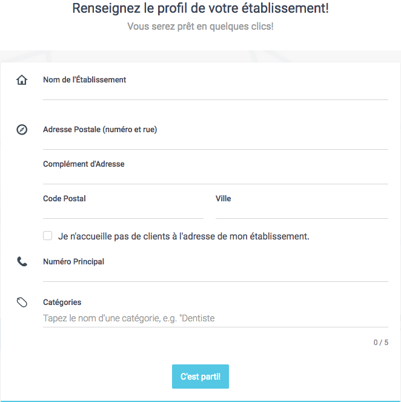
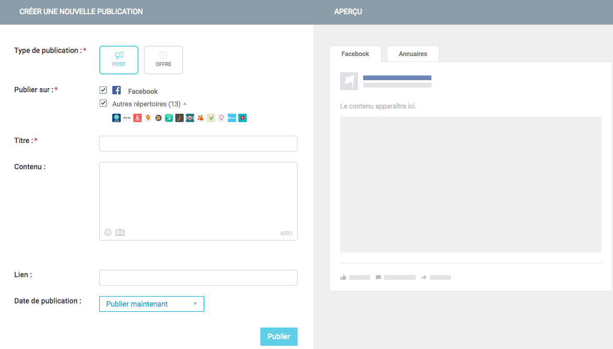

**Dernière mise à jour le 19/09/2018**

## Objectif

Visibilité Pro est une solution de référencement local vous permettant de gérer les informations et coordonnées de votre entreprise dans plusieurs annuaires en ligne, mais aussi d'interagir avec vos clients via la publication de contenus leur étant destinés ou la réponse à des avis. Cette gestion s'effectue via une interface unique et intuitive. 

**Découvrez comment bien débuter avec la solution Visibilité Pro.**

## Prérequis

- Disposer d’une offre d’[hébergement web OVHcloud](https://www.ovhcloud.com/fr/web-hosting/){.external}.
- Disposer d’une offre [Visibilité Pro](https://www.ovhcloud.com/fr/web-hosting/options/pro-visibility/){.external}.
- Être connecté à votre [espace client OVHcloud](https://www.ovh.com/auth/?action=gotomanager&from=https://www.ovh.com/fr/&ovhSubsidiary=fr).

## En pratique

### Étape 1 : accéder à la gestion de la solution Visibilité Pro

Pour débuter la manipulation, connectez-vous à votre [espace client OVHcloud](https://www.ovh.com/auth/?action=gotomanager&from=https://www.ovh.com/fr/&ovhSubsidiary=fr){.external} et assurez-vous de vous situer dans la section « Web ». Cliquez sur `Hébergements`{.action}, puis sélectionnez l'hébergement auquel la solution Visibilité Pro a été liée. 

Positionnez-vous ensuite sur l'onglet `Visibilité Pro`{.action}.

{.thumbnail}

Le tableau qui apparaît affiche les solutions Visibilité Pro commandées et liées à votre offre d'hébergement web. Chaque ligne correspond à une solution Visibilité Pro permettant de gérer le référencement local d'un seul établissement.

Si vous possédez plusieurs établissements et souhaitez gérer leur référencement local de la même manière, nous vous recommandons d'effectuer un test de référencement local depuis la page : <https://www.ovhcloud.com/fr/web-hosting/options/pro-visibility/>, puis de souscrire une solution Visibilité Pro pour chacun d'entre eux.

Pour accéder à l'interface de gestion de la solution Visibilité Pro, cliquez sur le bouton représentant trois points à droite de la ligne concernée, puis sur `Accéder à l'interface`{.action}.

{.thumbnail}

### Étape 2 : renseignez le profil de votre établissement

Sur la page qui s'affiche, vous êtes invité à renseigner le profil de votre établissement. Pour cela, complétez les informations demandées :

|Informations|Description|
|---|---|
|Nom de l'établissement|Renseignez le nom exact de votre établissement. Celui-ci peut reprendre le nom de votre entreprise ou différer si vous possédez plusieurs points de vente, par exemple.|
|Adresse postale|Indiquez l'adresse postale complète de votre établissement.|
|Je n'accueille pas de clients à l'adresse de mon établissement|Cochez impérativement cette case si vous n'accueillez pas de clients à l'adresse postale que vous venez de renseigner. Ceci masquera votre adresse postale dans les annuaires en ligne.|
|Numéro principal|Indiquez le numéro de téléphone sur lequel vos clients peuvent vous contacter.|
|Catégories|Sélectionnez cinq catégories qui définissent votre activité. Débutez par la catégorie la plus importante.|

Une fois les informations complétées, cliquez sur le bouton `C'est parti !`{.action}. Si l'outil nécessite de mieux localiser votre établissement, vous pourrez être amené à préciser son emplacement.

{.thumbnail}

Vous êtes ensuite invité à renseigner d'autres informations liées à votre établissement :

|Informations|Description|
|---|---|
|Site web|Renseignez le site internet de votre établissement ou celui de votre groupe.|
|Adresse e-mail|Indiquez une adresse e-mail valide grâce à laquelle vos clients peuvent vous contacter.|
|Horaires|Renseignez les horaires de votre établissement. Vous pourrez préciser des fermetures exceptionnelles une fois votre profil complété.|

Une fois les informations complétées, cliquez sur le bouton `Vous y êtes presque !`{.action}. 

{.thumbnail}

Si vous disposez d'un profil Google My Business ou Facebook, vous avez la possibilité de lier ces derniers à votre profil Visibilité Pro et de les gérer depuis l'interface de gestion Visibilité Pro. 

Pour relier votre profil Google My Business, cliquez sur le bouton `Connecter Google`{.action}. Pour relier votre compte Facebook, cliquez sur le bouton `Connecter Facebook`{.action}. Vous serez ensuite invité à vous connecter à votre compte Google ou Facebook. Suivez les étapes qui apparaissent.

Si vous ne souhaitez pas relier votre profil Google My Business et/ou votre compte Facebook, cliquez sur `Sauter cette étape`{.action}. Ce choix n'est pas définitif, vous pourrez réaliser cette manipulation une fois votre profil complété si vous le souhaitez.

{.thumbnail}

Une page vous informe que les informations de votre établissement vont être transmises aux annuaires en ligne et plateformes. Ceci indique que vous avez terminé la complétion des informations de base de votre profil.

Cliquez alors sur le bouton `C'est parti !`{.action}.

{.thumbnail}

### Étape 3 : modifier et enrichir les informations de votre établissement

Une fois connecté à l'interface de gestion Visibilité Pro, nous vous recommandons vivement d'enrichir les informations du profil de votre établissement. Pour cela, positionnez-vous sur l'onglet `Profil`{.action}.

{.thumbnail}

Les informations que vous pouvez compléter sont réparties en trois sous-onglets :

|Sous-onglets|Description|
|---|---|
|Infos générales|Il s'agit des informations générales de votre établissement. Vous pouvez y renseigner des informations de contact, ainsi que des descriptions et mots-clés qui aideront à vous identifier plus facilement en ligne.|
|Infos supplémentaires|Vous pouvez par exemple y renseigner les URL de vos réseaux sociaux, les modes de paiement que votre établissement accepte ainsi que la ou les langues dans lesquelles vous pouvez servir vos clients.|
|Photos et vidéos|Vous pouvez par exemple envoyer le logo de votre établissement, ainsi que des photos de ce dernier dans le but de le mettre en avant et de vous démarquer de vos concurrents.|

Une fois que vous avez terminé de modifier ces informations, cliquez sur le bouton `Enregistrer les modifications`{.action} en bas de la fenêtre. 

Si vous souhaitez que ces modifications soient envoyées automatiquement vers les différents annuaires en ligne, assurez-vous que l'`Auto-sync`{.action} est bien activé. Dans le cas contraire, vous devrez lancer manuellement une sycnhronisation ou activer l'auto-synchronisation. 

> [!primary]
>
> Sachez que la mise à jour de vos informations dans les différents annuaires et plateformes peut nécessiter plusieurs heures avant d'apparaître en ligne.
>

{.thumbnail}

### Étape 4 : commencer à interagir avec vos clients

Une fois votre profil complété, vous pouvez à présent vous familiariser avec les autres fonctionnalités à votre disposition dans l'interface de gestion Visibilité Pro. 

#### Publier vos premiers contenus

Positionnez-vous sur l'onglet `Publier`{.action}, puis cliquez sur `Créer votre première publication`{.action}.

{.thumbnail}

Choisissez le type de publication, l'endroit où vous souhaitez la publier, puis définissez son contenu. Vous pouvez vous aider de la fenêtre d'aperçu vous permettant de mieux visualiser le rendu final qu'aura votre publication une fois en ligne.

Sélectionnez enfin la date de publication, puis cliquez sur le bouton `Publier`{.action} une fois que vous êtes prêt. 

Revenez autant de fois que nécessaire dans l'onglet `Publier`{.action} pour continuer de communiquer avec vos clients en créant de nouvelles publications ou en suivant celles déjà publiées ou programmées.

{.thumbnail}

#### Répondre aux avis de vos clients

Positionnez-vous sur l'onglet `Avis clients`{.action} pour afficher ces derniers. Si aucun avis ne s'affiche, c'est qu'aucun de vos clients ne vous a encore laissé d'avis en ligne sur l'ensemble des annuaires dans lesquels votre établissement est inscrit. 

Dès qu'un avis est disponible, vous pourrez alors le visionner et y répondre directement depuis l'interface Visibilité Pro. Utilisez les outils de filtrage et de recherche en cas de nécessité. 

Nous vous recommandons vivement de répondre à tous les avis que vous recevrez, qu'ils soient positifs ou négatifs !

{.thumbnail}

#### Piloter la performance de votre visibilité en ligne

Positionnez-vous sur l'onglet `Tableau de bord`{.action} pour avoir accès à différents indicateurs vous permettant de piloter la performance de la visibilité de votre établissement en ligne. Nous vous conseillons de revenir régulièrement sur cet onglet afin de visionner en un coup d'œil cette performance. 

{.thumbnail}

## Aller plus loin

Échangez avec notre communauté d'utilisateurs sur <https://community.ovh.com>.