**Dernière mise à jour le 02/01/2023**

## Objectif

Ce tutoriel a pour objectif de vous permettre de créer votre propre site de vente en ligne avec le Prestashop. Sans connaissances particulières en programmation, vous serez en mesure d'installer votre soulution e-commerce et de la configurer pour commencer à vendre vos produits sur le web.

## Prérequis

Vous venez de souscrire à une offre «&nbsp;Hébergement Web&nbsp;» comprenant un nom de domaine et vous permettant d'installer un CMS en un clic, vous pouvez alors suivre ce tutoriel pour mettre en ligne rapidement vos premiers contenus et exploiter votre site.

Si vous ne disposez pas encore d'un hébergement, vous pouvez choisir une de notre offres Hébergement web parmi celles incluant la fonctionnalité «&nbsp;CMS en 1-clic&nbsp;». Au moment de l'installation, choisissez «&nbsp;Prestashop&nbsp;» parmi les solutions proposées.

Enfin, dans le cas où vous auriez déjà souscrit à une offre mais pas installé WordPress, reportez-vous au guide [Installer son site avec les modules en 1 clic](https://docs.ovh.com/fr/hosting/modules-en-1-clic/).

## En pratique

### Prérequis et configurations

Le présent document fait référence à la version 1.7 de Prestashop. Le CMS fonctionne sur les versions de PHP allant de la 7.1 à la 7.4. Il est recommandé d'utiliser cette dernière version pour un fonctionnement optimal. Vous trouverez plus de détails sur la page des [prérequis techniques](https://devdocs.prestashop-project.org/1.7/basics/installation/system-requirements/).

Sur votre Manager OVH, rendez-vous sur sur l'inglet «&nbsp;Web Cloud&nbsp;», puis sélectionnez le nom de domaine sur lequel vous souhaitez installer votre solution Prestashop&nbsp;:

{.thumbnail}

Dans «&nbsp;Configuration&nbsp;», changez la version de PHP pour la passer en 7.4&nbsp;:

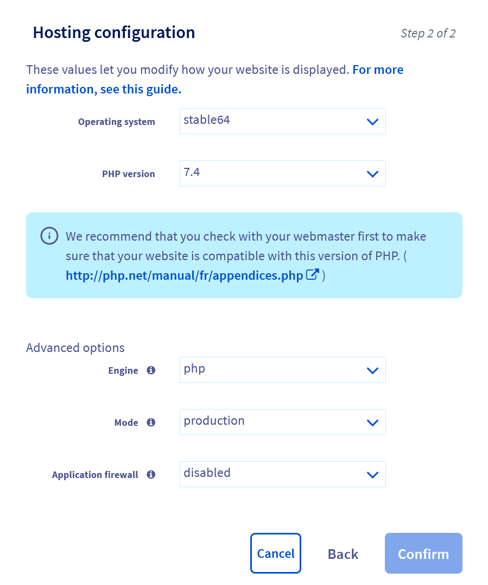{.thumbnail}

Installez également un certificat SSL. Vous pouvez vous reporter à notre guide [Gérer un certificat SSL sur son hébergement web](https://docs.ovh.com/fr/hosting/les-certificats-ssl-sur-les-hebergements-web/).

Pensez à mettre en place la redirection de votre nom de domaine en HTTP vers HTTPS. Vous trouverez les différentes méthodes sur ce guide [Comprendre la redirection d'un nom de domaine](https://docs.ovh.com/fr/domains/redirection-nom-de-domaine/#comprendre-la-redirection-dun-nom-de-domaine).

### Installation en 1-click

> [!warning]
>
> Lors de l'installation, par défaut ou en mode avancé, il est possible qu'une erreur se produise au cas où le répertoire de destination de vos fichier (`./www/` par défaut) ne serait pas vide.
> Vous serez notifié du problème par mail. Le module est automatiquement désinstallé.
>
> Pour corriger le problème, connectez-vous à votre serveur en SSH et videz ou effacez le répertoire dans lequel s'est faire l'installation.
>

Cliquez sur l'onglet «&nbsp;Modules en 1 clic&nbsp;»&nbsp;:

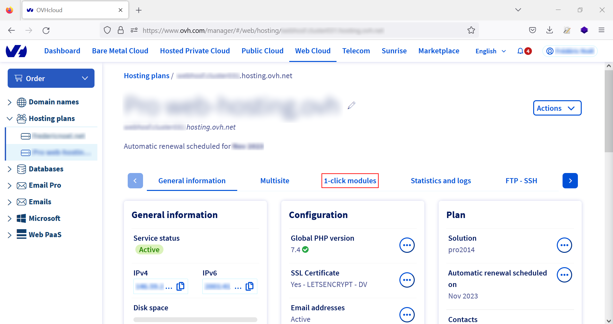{.thumbnail}

Sélectionnez «&nbsp;Ajouter un module&nbsp;» et choisissez **Prestashop**&nbsp;:

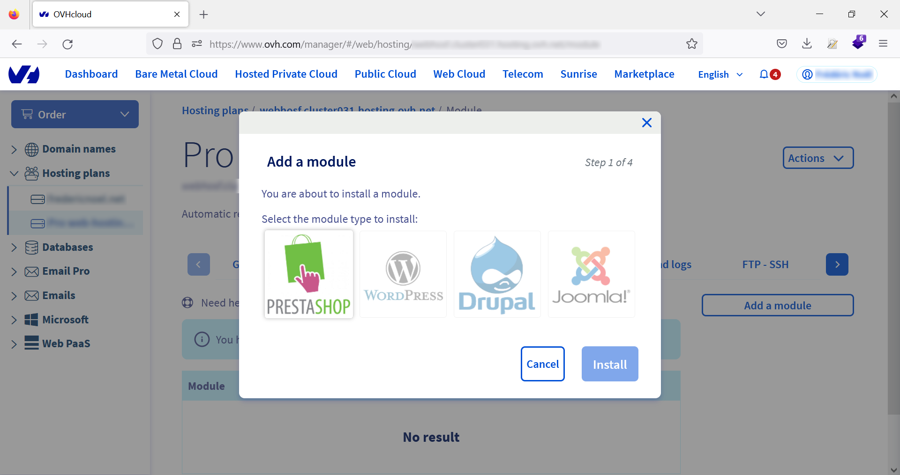{.thumbnail}

Vous aurez alors le choix entre l'installation normale (par défaut) et l'installation en mode avancé.

#### Installation par défaut

Dans ce mode, vous n'avez qu'à choisir quel nom de domaine pointera sur votre installation. Par défaut, les fichiers de Prestashop seront disponibles dans le répertoire `./www/` de votre serveur.

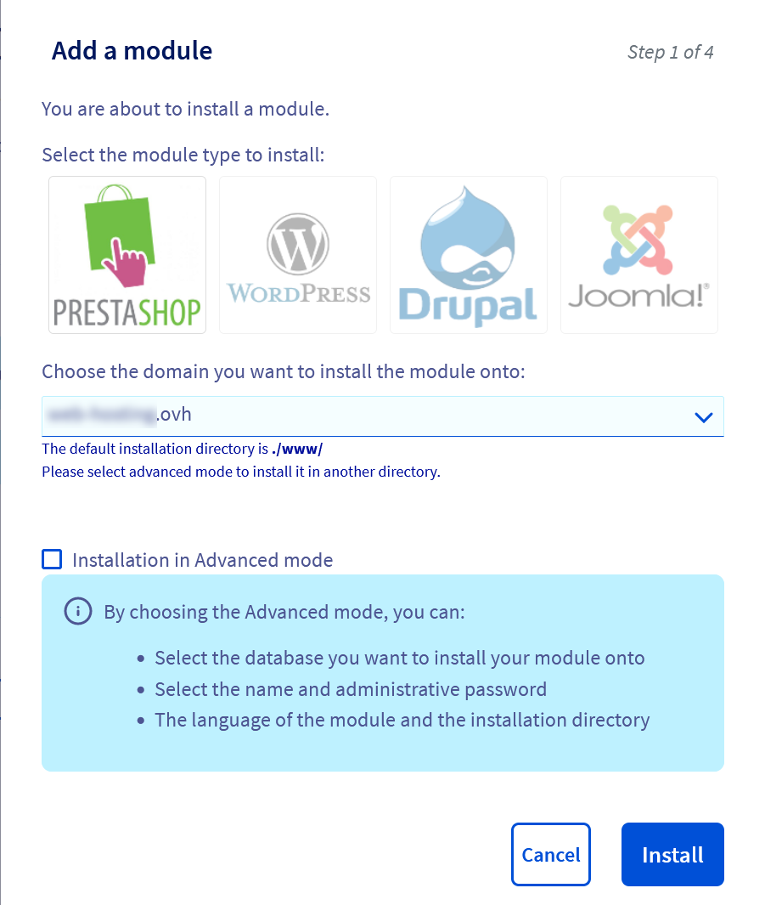{.thumbnail}

Validez en cliquant sur «&nbsp;Installer&nbsp;». Votre module s'installe, vous serez notifié par mail à l'issue du processus.

Une fois déployé, le module figurera dans la liste des modules installés sur votre serveur&nbsp;:

{.thumbnail}

#### Installation en mode avancé

L'installation avancée vous permet de choisir la base de données qui sera utilisée avec Prestashop. Lors de l'ajour du module Prestashop, cochez l'option «&nbsp;Installation en mode avancé&nbsp;»&nbsp;:

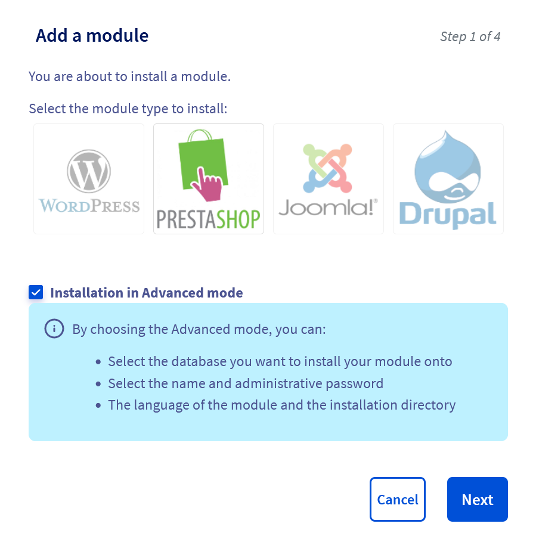{.thumbnail}

Vous serez invité à sélectionner une base de données parmi celles que vous avez déjà configurées, ou bien à vous connecter à une base de données distante en renseignant le formulaire avec les informations suivantes&nbsp;:

- l'adresse du serveur (nom de domaine ou adresse IP)
- le nom de la base de données
- le port utilisé (par défaut, MySQL utilise le port 3306)
- le nom de l'utilisateur (login)
- le mot de passe lié au compte.

{.thumbnail}

**Éléments à vérifier - Les données saisies dans le formulaire n'apparaissent pas dans la base de données**<br />
Dans le formulaire suivant, vous serez invité à renseigner l'adresse mail et le mot de passe de connexion

{.thumbnail}

Enfin, vérifiez et confirmez les informations relatives à votre installation&nbsp;:

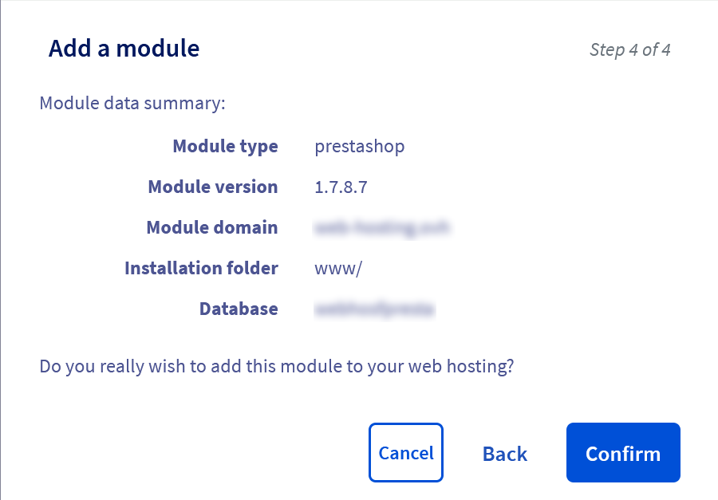{.thumbnail}

#### Fin de l'installation

À la fin de l'installation, vous recevrez un mail comportant différentes informations&nbsp;:

- l'URL pour accéder à l'interface publique de votre site e-commerce
- le lien pour accéder à l'interface d'administration
- le `login` administrateur
- un lien pour récupérer votre mot de passe administrateur.

Votre site e-commerce est en ligne avec des données par défaut&nbsp;:

{.thumbnail}

### Installation manuelle

Dans le cas d'une installation manuelle, vous devez :

- vous connectez en SSH sur votre serveur et créer un répertoire dans lequel seront les fichiers Prestashop (`www/` dans l'exemple)
- configurer votre nom de domaine pour qu'il pointe dans ce répertoire particulier
- disposer d'une base de données.

#### Récupérer les fichiers d'installation

Rendez vous sur le site de [Prestashop](https://www.prestashop.com/en/download) pour télécharger la dernière version de l'application. La création d'un compte est nécessaire.

Décompressez le fichier ZIP sur votre ordinateur et copiez son contenu sur votre serveur à l'aide d'un client FTP (FileZilla) :

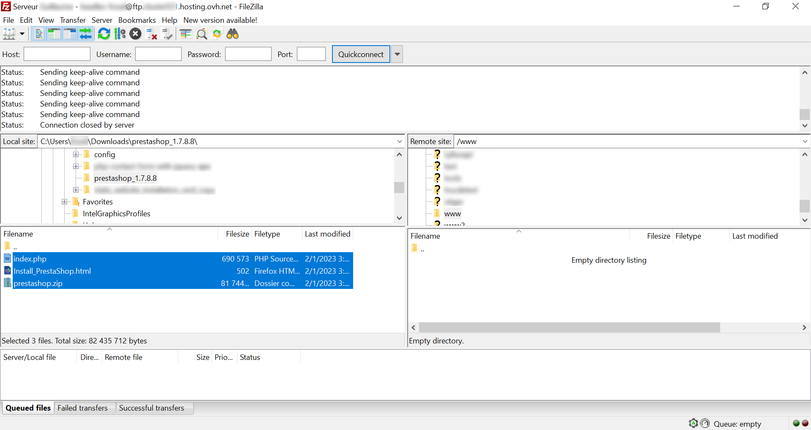{.thumbnail}

Tapez le nom de domaine que vous avez configuré dans votre navigateur pour procéder à l'installation.

Si vous utilisez la version 1.7.×, vous aurez le message suivant vous proposant la mise à jour vers la branche 8.× du CMS. Cliquez sur le bouton "Yes please!" :

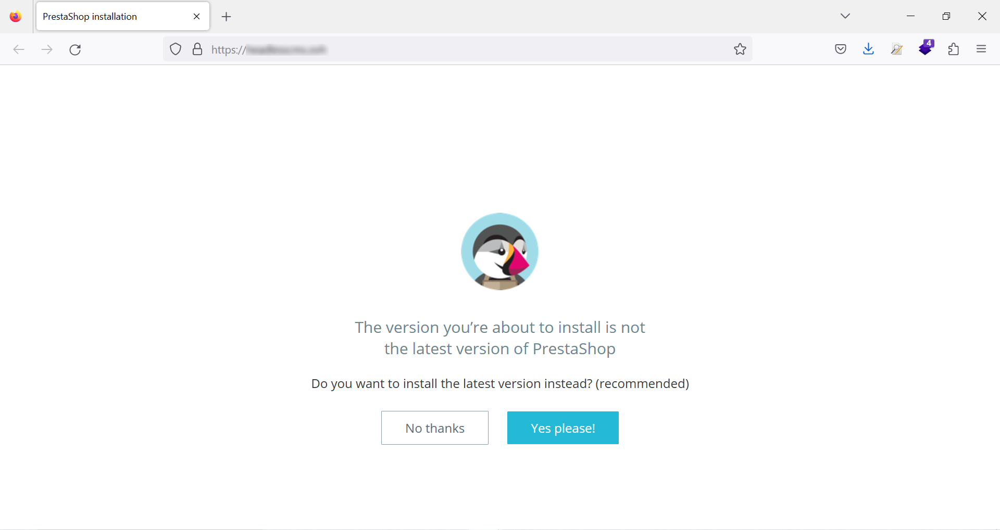{.thumbnail}

Choisissez la langue de votre application et procédez à l'installation en cliquand sur le bouton "Suivant" :

{.thumbnail}

Validez les conditions générales d'utilisation pour pouvoir passer à l'étape suivante :

{.thumbnail}

L'outil d'installation vérifie alors si votre hébergement est compatible. Cette page n'est pas nécessairement visible si les conditions pour poursuivre le processus de déploiement sont remplies :

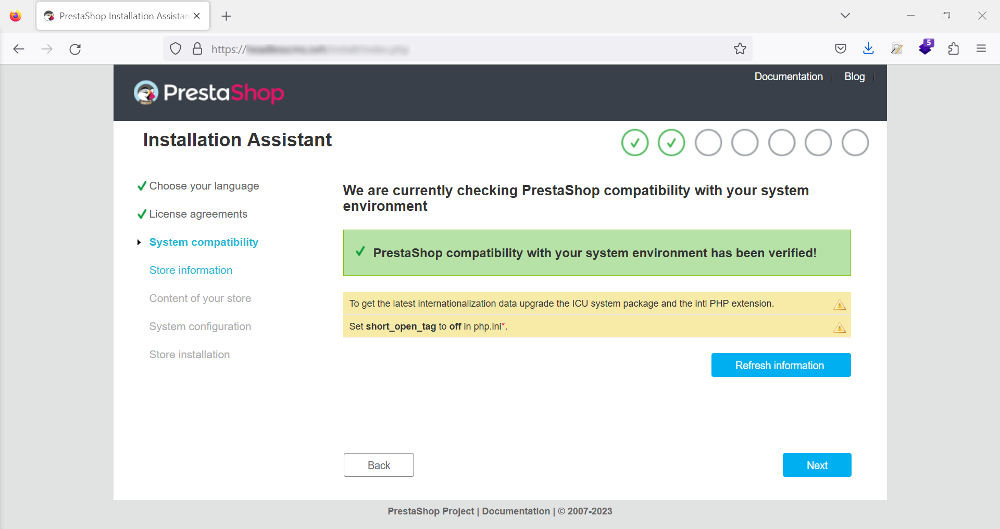{.thumbnail}

L'assistant d'installation vous demander de renseigner quelques informations :

- le nom de votre site ou boutique en ligne
- votre domaine d'activité
- le pays où se situe votre entreprise
- l'activation ou non du SSL (nous vous conseillons de l'activer, pensez à générer votre certificat avant l'installation)
- votre nom, prénom, adresse mail et mot de passe pour accéder à l'interface d'administation.

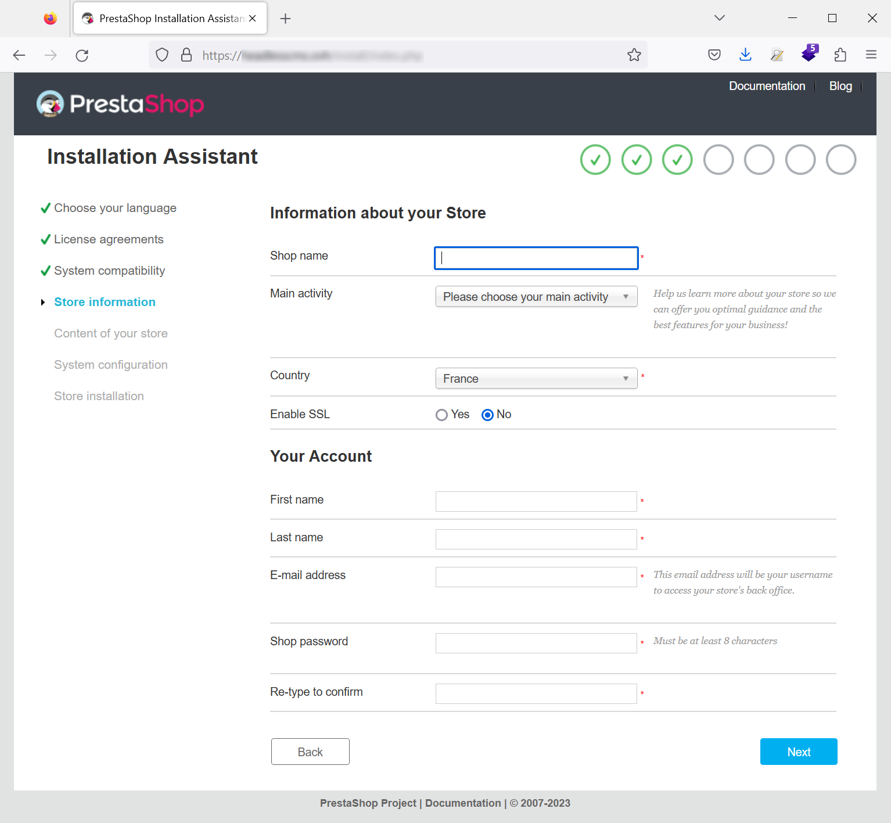{.thumbnail}

Sur la page suivante, vous avez la possibilité de faire l'installation avec des données de démonstration et de choisir les modules de Prestashop à installer :

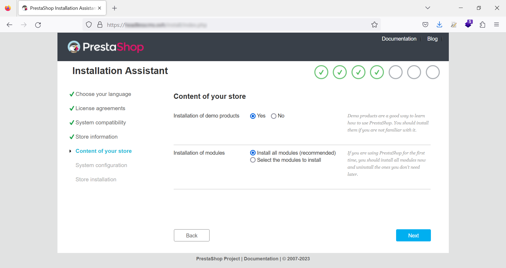{.thumbnail}

Renseignez sur la page qui suit les informations relatives à votre base de données :

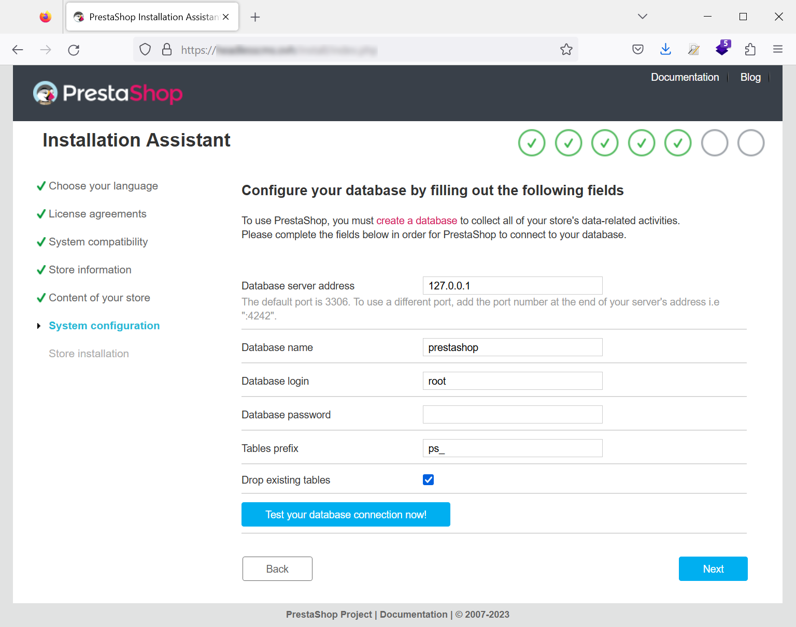{.thumbnail}

Avant de passer à l'étape suivante, vous pouvez tester si les informations que vous avez saisies sont correctes :

{.thumbnail}

L'installation de votre boutique en ligne démarre :

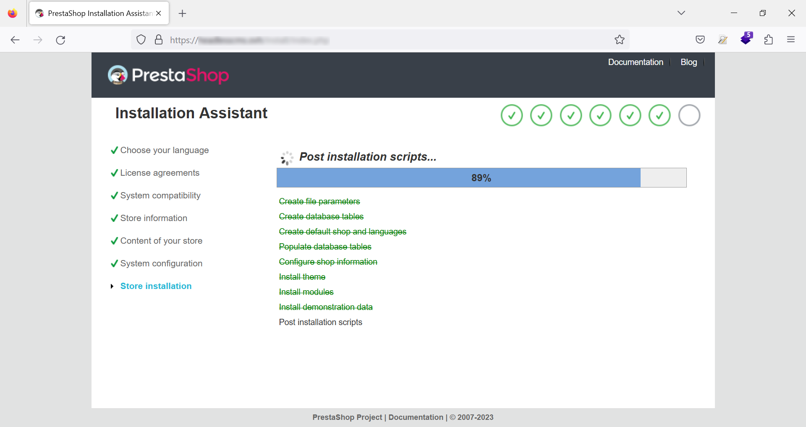{.thumbnail}

À la fin de l'installation, vous êtes invité à récupérer vos accès de connexion (le login et mot de passe que vous avez saisi précédemment).

Vous devez impérativement supprimer le répertoire d'installation sur votre serveur. Vous pouvez le faire en utilisant votre client FTP ou bien dans votre terminal, dans le répertoire qui contient les fichiers Prestashop :

```sh
 rm -rf install/
```

Votre installation est terminée, vous pouvez allez sur votre site ou sur votre interface d'administation :

{.thumbnail}

## Aller plus loin

- le site officiel de [Prestashop](https://www.prestashop.com/)
- notre guide sur les [certificats SSL](https://docs.ovh.com/fr/hosting/les-certificats-ssl-sur-les-hebergements-web/)
- créer et gérer vos [bases de données](https://docs.ovh.com/fr/hosting/creer-base-de-donnees/) sur votre hébergement web