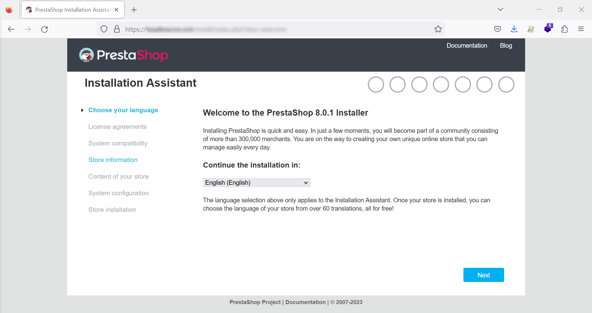
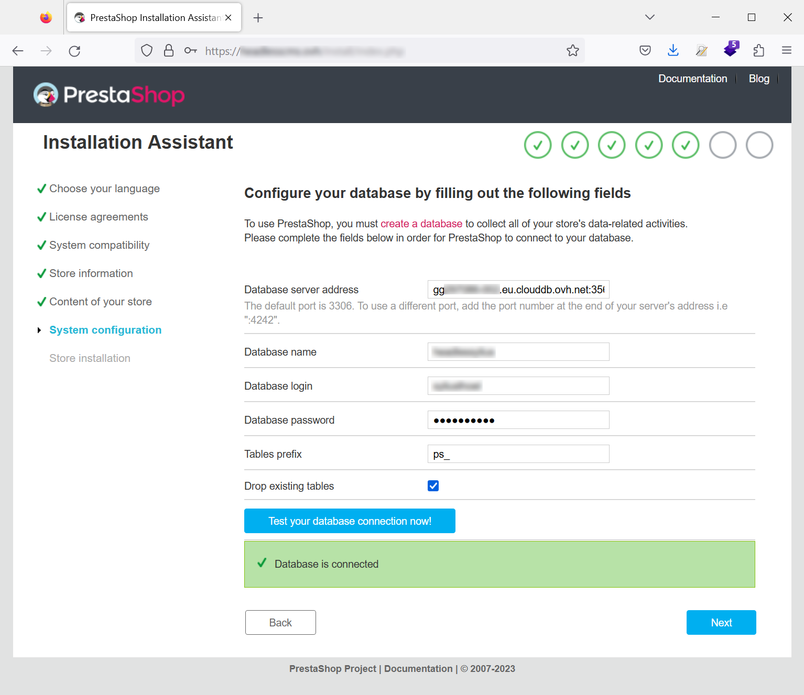
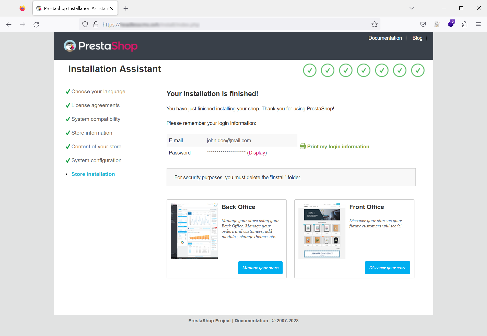
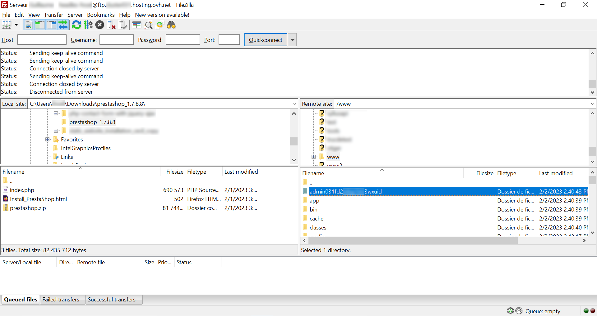

**Dernière mise à jour le 09/02/2023**

## Objectif

Ce guide a pour objectif de vous permettre d'installer manuellement le CMS Prestashop sur votre hébergement web.

> [!warning]
>
> OVHcloud met à votre disposition des services dont la configuration, la gestion et la responsabilité vous incombent. Il vous revient de ce fait d'en assurer le bon fonctionnement.
> 
> Si vous éprouvez des difficultés à suivre les étapes de ce tutoriel, nous vous recommandons de faire appel à un [prestataire spécialisé](https://partner.ovhcloud.com/fr/) . En effet, nous ne serons pas en mesure de vous fournir une assistance. Plus d'informations dans la section [« Aller plus loin »](#go-further) de ce guide.
>

## Prérequis

Afin d'effectuer l'installation, vous devez :
- disposer d'un [hébergement web](https://www.ovhcloud.com/fr/web-hosting/) et d'un nom de domaine
- avoir généré un certificat SSL pour ce nom de domaine
- vous connectez en SSH sur votre serveur et créer un répertoire dans lequel seront les fichiers Prestashop (`www/` dans l'exemple)
- avoir configuré le pointage de votre nom de domaine vers le répertoire vide
- disposez d'une base de données.

## En pratique

### Prérequis et configurations

Le présent guide fait référence à la version 1.7 de Prestashop. Le CMS fonctionne sur les versions de PHP allant de la 7.1 à la 7.4. Il est recommandé d'utiliser cette dernière version pour un fonctionnement et des performances optimales. Vous trouverez plus de détails sur la page des [prérequis techniques](https://devdocs.prestashop-project.org/1.7/basics/installation/system-requirements/).

Sur votre Manager OVH, rendez-vous sur sur l'inglet « Web Cloud », puis sélectionnez le nom de domaine sur lequel vous souhaitez installer votre solution Prestashop :


Dans « Configuration », changez la version de PHP pour la passer en 7.4 :


Installez également un certificat SSL. Vous pouvez vous reporter à notre guide [Gérer un certificat SSL sur son hébergement web](https://docs.ovh.com/fr/hosting/les-certificats-ssl-sur-les-hebergements-web/).

Pensez à mettre en place la redirection de votre nom de domaine en HTTP vers HTTPS. Vous trouverez les différentes méthodes sur ce guide [Comprendre la redirection d'un nom de domaine](https://docs.ovh.com/fr/domains/redirection-nom-de-domaine/#comprendre-la-redirection-dun-nom-de-domaine).

### Récupérer les fichiers d'installation

Rendez vous sur le site de [Prestashop](https://www.prestashop.com/en/download) pour télécharger la dernière version de l'application. La création d'un compte est nécessaire.

Décompressez le fichier ZIP sur votre ordinateur et copiez son contenu sur votre serveur à l'aide d'un client FTP (FileZilla) :


Tapez le nom de domaine que vous avez configuré dans votre navigateur pour procéder à l'installation.

Si vous utilisez la version 1.7.×, vous aurez le message suivant vous proposant la mise à jour vers la branche 8.× du CMS. Cliquez sur le bouton "Yes please!" :


Choisissez la langue de votre application et procédez à l'installation en cliquand sur le bouton "Suivant" :



Validez les conditions générales d'utilisation pour pouvoir passer à l'étape suivante :


L'outil d'installation vérifie alors si votre hébergement est compatible. Cette page n'est pas nécessairement visible si les conditions pour poursuivre le processus de déploiement sont remplies :


L'assistant d'installation vous demande de renseigner quelques informations :

- le nom de votre site ou boutique en ligne
- votre domaine d'activité
- le pays où se situe votre entreprise
- l'activation ou non du SSL (nous vous conseillons de l'activer, pensez à générer votre certificat avant l'installation)
- votre nom, prénom, adresse mail et mot de passe pour accéder à l'interface d'administation.


Sur la page suivante, vous avez la possibilité de faire l'installation avec des données de démonstration et de choisir les modules de Prestashop à installer :


Renseignez sur la page qui suit les informations relatives à votre base de données :


Avant de passer à l'étape suivante, vous pouvez tester si les informations que vous avez saisies sont correctes :



L'installation de votre boutique en ligne démarre :


À la fin de l'installation, vous êtes invité à récupérer vos accès de connexion (le login et mot de passe que vous avez saisi précédemment).

Vous devez impérativement supprimer le répertoire d'installation sur votre serveur. Vous pouvez le faire en utilisant votre client FTP ou bien dans votre terminal, dans le répertoire qui contient les fichiers Prestashop :

```sh
 rm -rf install/
```

Votre installation est terminée, vous pouvez allez sur votre site ou sur votre interface d'administation :



### Accéder à l'interface d'administration

L'accès à l'interface d'administration se fait en tapant votre nom de domaine suivi du nom du dosier commençant par `admin` et suivi d'une chaîne de caractères générée à l'installation. Vous trouverez le nom de ce dossier à la racine du répertoire dans lequel vous avez transféré les fichiers d'installation :



## Aller plus loin

- le site officiel de [Prestashop](https://www.prestashop.com/)
- notre guide sur les [certificats SSL](https://docs.ovh.com/fr/hosting/les-certificats-ssl-sur-les-hebergements-web/)
- créer et gérer vos [bases de données](https://docs.ovh.com/fr/hosting/creer-base-de-donnees/) sur votre hébergement web