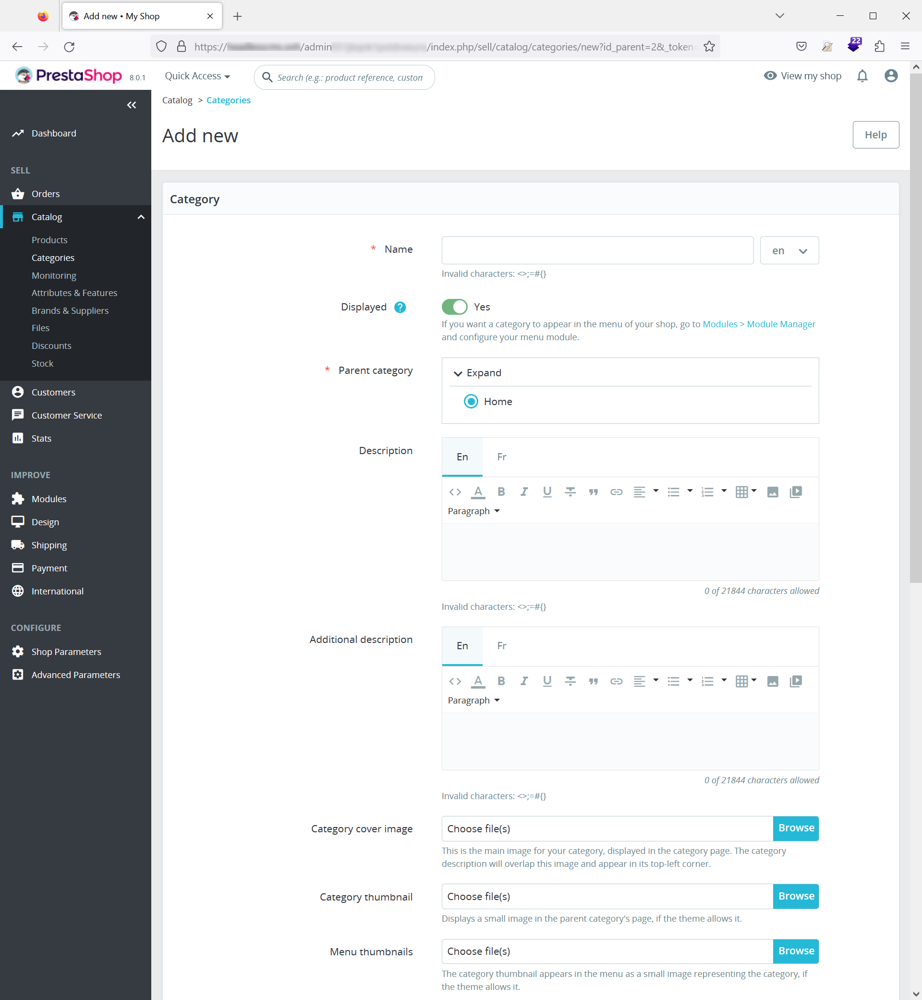
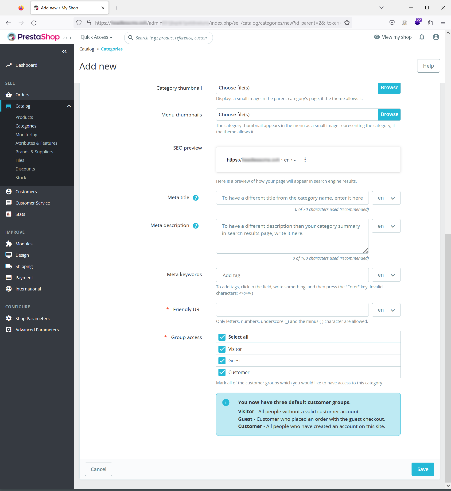
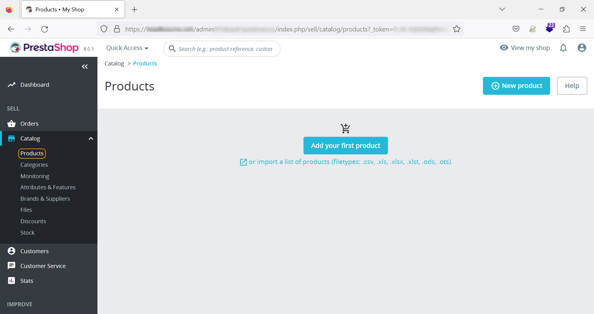
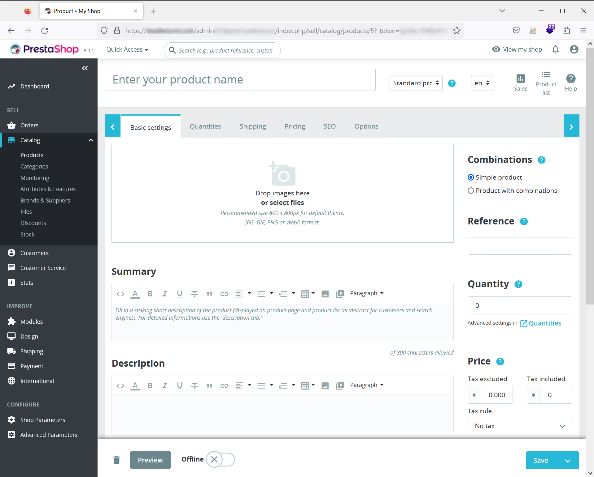
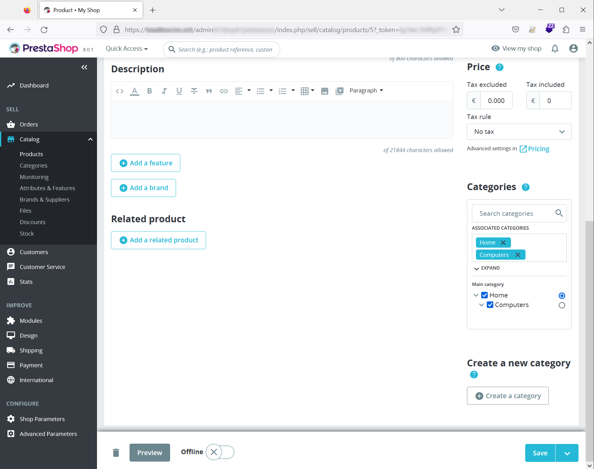

**Dernière mise à jour le 13/01/2023**

## Objectif

Ce tutoriel a pour objectif de vous permettre de configurer rapidement votre CMS Prestashop.

> [!warning]
>
> OVHcloud met à votre disposition des services dont la configuration, la gestion et la responsabilité vous incombent. Il vous revient de ce fait d'en assurer le bon fonctionnement.
> 
> Si vous éprouvez des difficultés à suivre les étapes de ce tutoriel, nous vous recommandons de faire appel à un [prestataire spécialisé](https://partner.ovhcloud.com/fr/) . En effet, nous ne serons pas en mesure de vous fournir une assistance. Plus d'informations dans la section [« Aller plus loin »](#go-further) de ce guide.
>

## Prérequis

Vous devez :

- disposer d'un [nom de domaine](https://www.ovhcloud.com/en-gb/domains/) et d'un [hébergement web](https://www.ovhcloud.com/en-gb/web-hosting/)
- avoir installé le CMS Prestashop avec l'installation en 1-clik ou manuellement(reportez-vous à notre guide ×××)
- accéder à l'interface d'administration.

## En pratique

Si vous avez une installation de Prestashop qui a été effectuée avec les données de démonstration (produits, catégories, photos), vous pouvez soit les supprimer manuellement, soit les renommer.

### Accéder à l'interface d'administration

Si vous avez opté pour l'installation du module Prestashop en 1-click, les informations de connexion à votre interface d'administation vous ont été communiquées par mail.

Si votre CMS a été installé manuellement, l'URL vous permettant d'accéder à cette interface sera votre nom de domaine, suivi du nom du dossier `admin` que vous trouverez en vous connectant sur votre serveur avec un client FTP (FileZilla).

Une fois connecté, vous arrivez sur votre Dashbord :

> [!warning]
>
> Vous avez la possibilité de d'utiliser des données fictives pour vous familiariser avec la Dashboard en cliquant sur le **Mode démo** en haut à droite.
>

Le menu sur la gauche comprend les éléments suivants :

- **Tableau de bord**, vous permettant de revenir à la page d'accueil du back office
- **Vendre**, regroupant les éléments tels que les commandes, le catalogue de produits et les clients
- **Personnaliser**, intégrant la possibilité d'ajouter des modules, de modifier l'apparence du site, gérer les moyens de paiement et les modes de livraison
- **Configurer**, concerne tous les réglages simples et avancés possibles sur l'outil.

### Ajouter des catégories

Dans le menu, cliquez sur **Vendre**, **Catalogue** puis **Catégories** :

Ajoutez une catégorie en cliquant sur le bouton **Ajouter une nouvelle catégorie** en haut et à droite de la page :

Vous serez invité à renseigner les éléments sur cette nouvelle catégorie, parmi lesquels :

- le nom de la catégorie (que vous pouvez préciser dans plusieurs langues)
- l'affichage ou non de cette catégorie
- la catégorie parent (si nécessaire)
- la description de la catégorie
- en option, des informations complétementaire à cette description
- l'image illustrant la catégorie
- la vignette de la catégorie
- la vignette du menu
- la balise titre qui peut être renseignée si vous voulez un autre contenu que le nom de la catégorie
- la meta description est optionnelle est a pour but de remplacer la description de la catégorie renseignée au début
- une URL simplifiée (utile pour le référencement)
- la limitation ou non à des groupes d'utilisateurs de votre site, vous permettant, par exemple, de définir si une catégorie est visible lorsque l'on n'est pas connecté.

À noter que l'élément "Prévisualisation SEO" est une indication des informations qui seront affichées dans les moteurs de recherches.

### Ajouter des produits

Dans le menu, cliquez sur **Vendre**, **Catalogue** puis **Produits** :

> [!warning]
>
> Vous avez la possibilité d'importer massivement des produits depuis un fichier de tableur type CSV, Excel ou LibreOffice.
> 
> Reportez-vous au lien dans la rubrique [« Aller plus loin »](#go-further) de ce guide.
>

Cliquez sur "Nouveau produit".

La page "Produits" comprend 6 onglets :

- les informations basiques de votre produit
- les données liées aux quantités (quantités minimales vendues, stock réel, stock de sécurité, emplacement)
- tout ce qui concerne les expéditions (dimensions des colis, délais d'expédition)
- les prix des articles et les taux de TVA appliqués
- la possibilité de renseigner des données meta pour optimiser le référencement
- des options diverses telles qu'un code-barre, un numéro d'ISBN ou encore un champ personnalisé.

Le premier onglet, par défaut, vous permet de définir les informations strictement nécessaires :

- la ou les photos ou images de votre produit
- la possibilité de préciser si votre produit comprend des déclinaisons (comme des tailles et des couleurs pour des vêtements)
- la référence de votre produit
- un texte succint sur le produit
- une description plus longue
- la quantité disponible
- le prix hors taxe et toutes taxes comprises, ainsi que le taux de TVA
- la ou les catégories du produit, les produits associés
- la possibilité d'ajouter des champs personnalisés (caractéristiques et marque).

> [!warning]
>
> Passer d'un "produit simple" à un "produits avec déclinaisons" aura pour effet de modifier l'onglet "quantité" qui deviendra "Déclinaisons"
>

### Pour conclure

Vous pouvez installer rapidement, en 1-click ou manuellement, votre CMS e-commerce et être rapidement opérationnel en configurant catégories et produits.

Prestashop vous permet de régler finalement les détails de chaque produits. 

Vous avez également la possibilité de modifier l'interface (templates, thèmes, logos) dans le menu "Personnaliser".

## Aller plus loin

- le site de [Prestashop](https://www.prestashop.com/)
- la documentation relative à l'[import des produits](https://docs.prestashop-project.org/1.7-documentation/user-guide/configuring-shop/advanced-parameters/import).

Pour des prestations spécialisées (référencement, développement, etc), contactez les [partenaires OVHcloud](https://partner.ovhcloud.com/fr/).

Si vous souhaitez bénéficier d'une assistance à l'usage et à la configuration de vos solutions OVHcloud, nous vous proposons de consulter nos différentes [offres de support](https://www.ovhcloud.com/fr/support-levels/).

Échangez avec notre communauté d'utilisateurs sur [https://community.ovh.com](https://community.ovh.com/).