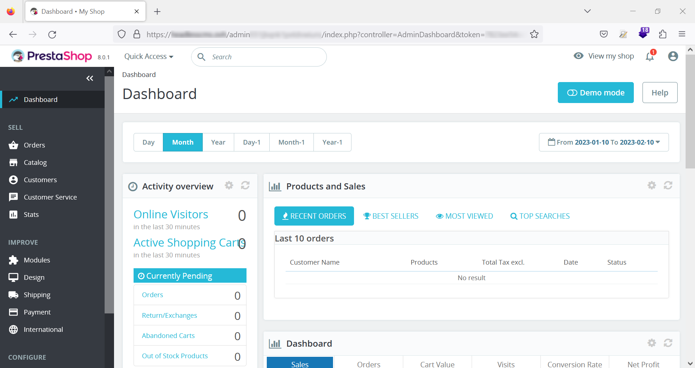
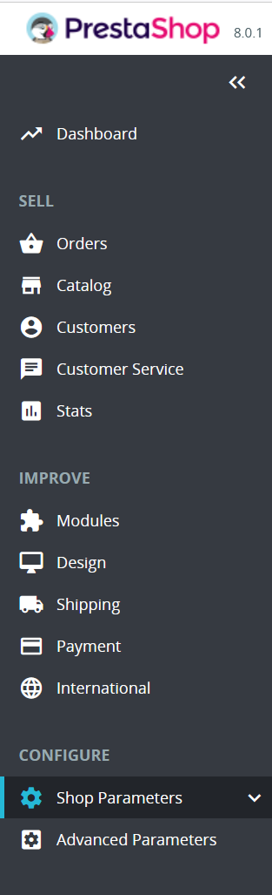
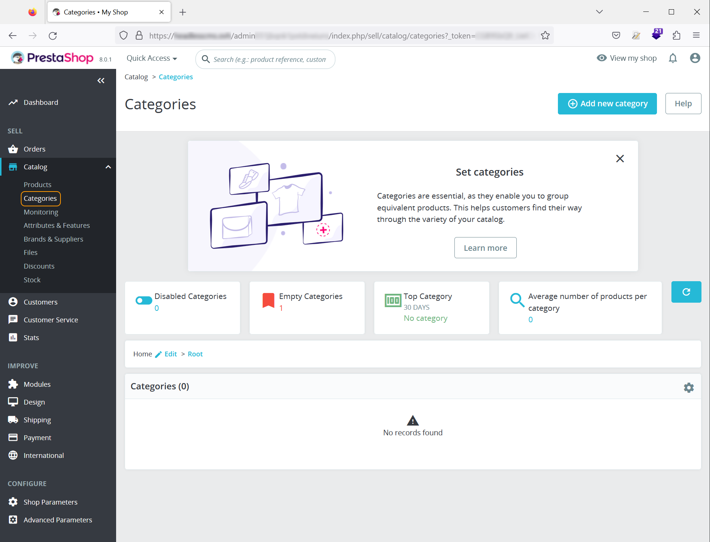

**Dernière mise à jour le 10/01/2023**

## Objectif

Ce tutoriel a pour objectif de vous permettre de configurer rapidement votre CMS Prestashop.

## Prérequis

Vous devez :

- disposer d'un [nom de domaine](https://www.ovhcloud.com/en-gb/domains/) et d'un [hébergement web](https://www.ovhcloud.com/en-gb/web-hosting/)
- avoir installé le CMS Prestashop avec l'installation en 1-clik ou manuellement(reportez-vous à notre guide ×××)
- accéder à l'interface d'administration.

## En pratique

Si vous avez une installation de Prestashop qui a été effectuée avec les données de démonstration (produits, catégories, photos), vous pouvez soit les supprimer manuellement, soit les renommer.

### Accéder à l'interface d'administration

Si vous avez opté pour l'installation du module Prestashop en 1-click, les informations de connexion à votre interface d'administation vous ont été communiquées par mail.

Si votre CMS a été installé manuellement, l'URL vous permettant d'accéder à cette interface sera votre nom de domaine, suivi du nom du dossier `admin` que vous trouverez en vous connectant sur votre serveur avec un client FTP (FileZilla).

Une fois connecté, vous arrivez sur votre Dashbord :

Le menu sur la gauche comprend les éléments suivants :

- **Tableau de bord**, vous permettant de revenir à la page d'accueil du back office
- **Vendre**, regroupant les éléments tels que les commandes, le catalogue de produits et les clients
- **Personnaliser**, intégrant la possibilité d'ajouter des modules, de modifier l'apparence du site, gérer les moyens de paiement et les modes de livraison
- **Configurer**, concerne tous les réglages simples et avancés possibles sur l'outil.

### Ajouter des catégories et des produits

Dans le menu de gauche, cliquez sur **Vendre**, puis **Catégories** :

## Aller plus loin
