**Last updated 4th January 2018**

## Objective

With the Private SQL service, you can get an SQL instance that works hand-in-hand with an OVH web hosting plan, with dedicated, guaranteed resources. You can get even higher performance and flexibility on the database systems that are available, as well as those that you can create. This service is generally designed for customers with more specific requirements.

**Learn how to get started with a Private SQL service.**

## Requirements

- You must have a Private SQL instance (included in [web hosting plans](https://www.ovh.co.uk/web-hosting/){.external}, or available to order as an [SQL option](https://www.ovh.co.uk/web-hosting/sql-options.xml){.external}).
- You must have a [web hosting plan](https://www.ovh.co.uk/web-hosting/){.external} hosted in the same datacentre as your Private SQL instance (you can view this information in your OVH Control Panel).
- You must be logged in to your [OVH Control Panel](https://www.ovh.com/auth/?action=gotomanager){.external}.

## Instructions

### View general information on the instance

In the services bar on the left-hand side of your [OVH Control Panel](https://www.ovh.com/auth/?action=gotomanager){.external}, go to the `Databases`{.action} section, then to the SQL instance concerned. Click on the `General information`{.action} tab.

> [!primary]
>
> The name of the Private SQL service may be displayed in two ways in the OVH Control Panel:
>
> - it either contains a part of your NIC handle and ends with three figures (001 for the first Private SQL service installed, 002 for the second, etc.)
> - or it starts with *privatesql-*, then contains a part of your NIC handle, and ends with three figures (001 for the first Private SQL service installed, 002 for the second, etc.).
>

You can also view important information on your SQL instance. Please take a few moments to ensure that the information displayed is correct, and corresponds to the instructions below.

|Information|Details|
|---|---|
|Service status|Mainly shows if the instance has been rebooted, is in the process of rebooting, or is suspended. Your instance must be rebooted if you need to carry out any actions. |
|Type|Shows the database system used by the server. If you are unsure if the correct type is being used, please note that the most recent version is “MySQL”, but other versions also exist (PostgreSQL, MariaDB). For example, if you are using WordPress for your website, a MySQL system is perfect for it.|
|Version|Shows the database system version used by the server. Check that your website is compatible with the version you have chosen.|
|RAM|Shows the RAM available for your instance, also shows if you are close to exceeding the RAM limit. Your Private SQL instance uses dedicated, guaranteed resources: its RAM. If required, you can scale the RAM, and receive warnings if you are consuming all of your instance’s RAM resources.|
|Infrastructure|Shows the infrastructure used by your instance. This information is inherent to the OVH infrastructure.|
|Datacentre|Shows the datacentre in which the instance has been created. Checks that your instance is hosted in is the same datacentre as the OVH web hosting plan that your website is based (or will be based) on.|
|Host|Shows the OVH server your instance has been created in. This information is inherent to the OVH infrastructure, and can be used in our communications on [OVH incidents](http://status.ovh.net/){.external}.|

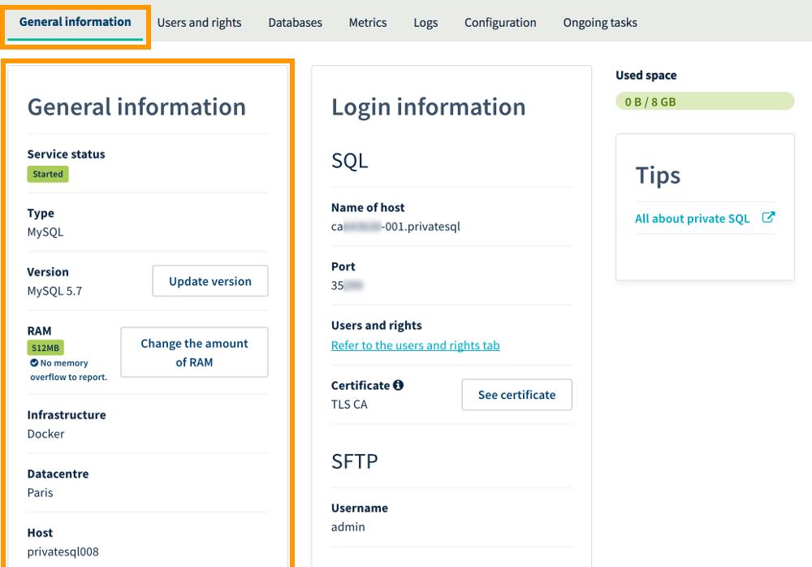{.thumbnail}

### Create a database

The database will store all of the data related to your website (e.g. for a blog, comments).

To create your first database, click on the `Databases`{.action} tab, then on the `Add a database`{.action} button.

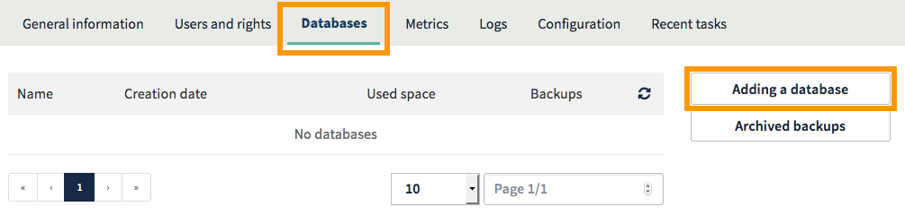{.thumbnail}

When the window opens, you can create a user. You will need to create a user, as they will be able to log in to your instance - and with the permissions that are attributed to them, they can carry out requests on your database (like reading, inserting or deleting data).

You can create a user as you create your database, by ticking the `Create User`{.action} box - or you can create a user separately, and leave this box unticked. Tick the box for a quick, simple solution.

Enter the information requested now, following the instructions in the information boxes - then click `Confirm`{.action}.

- **Database name** (obligatory): this will be your database’s name.
- **Username** (optional if the box is unticked): the user that can log in to your database and perform requests.
- **Rights** (optional if the box is unticked): the permissions that will be associated with the user on the database. For standard usage, select `Administrator`{.action}. The permissions can be modified as follows.
- **Password**/**Confirm password** (optional if the box is unticked): select a password, then confirm it.

> [!warning]
>
> For security reasons, please follow the conditions required when you enter information.
>

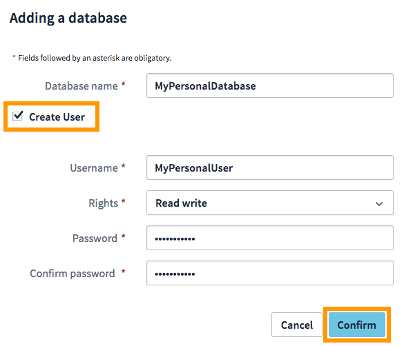{.thumbnail}

### Create a user (optional)

This stage is optional if you have created a user whilst creating a database in the previous step. For standard usage, you will only need a single user. However, for more specific projects, you may need several users to access your database. For example, one user associated with a database can have read and write permissions, whilst another only has read permissions.

If you have already created your first user and the project doesn’t require any additional users, you can move to the following step. To create a user, you can also click on the `Users and rights`{.action} tab, then on the `Add user`{.action} button.

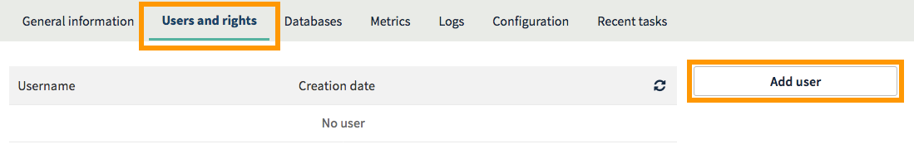{.thumbnail}

In the window that appears, enter the information requested now, following  the instructions in the information boxes - then click `Confirm`{.action}.

- **Username**: the user that can log in to your instance. You can give them permissions on your database in the next step.
- **Password**/**Confirm password**: select a password, then confirm it.

> [!warning]
>
> For security reasons, please follow the conditions required when you enter information.
>

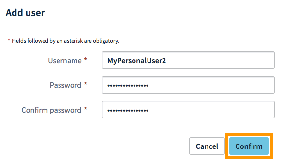{.thumbnail}

Once you have created a user, you will need to attribute permissions that allow them to perform actions on your database (like reading, inserting or deleting data). To do this, click on the cog wheel icon, then `Manage rights`{.action}.

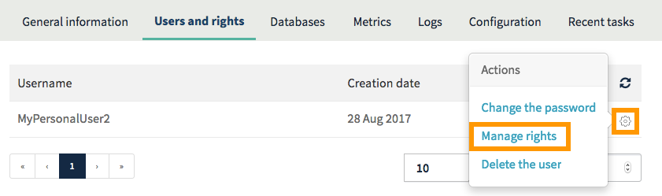{.thumbnail}

On the new page, select the permission by clicking on it. For standard usage, select `Administrator`{.action}.

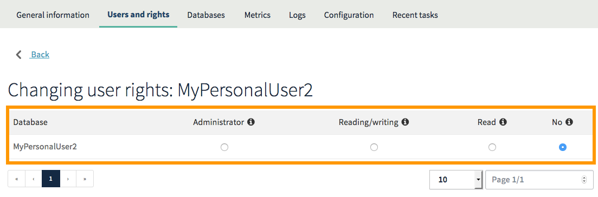{.thumbnail}

### Importing a database (optional)

This step only applies if you want to import a backup of a database that already exists (which is essential if you are migrating your website to OVH, or if you are migrating your databases to your new Private SQL instance). If you do not need to import any databases, you can move to the next step.

There are several techniques you can choose from to import a database. OVH offers a tool for this in its Control Panel. We will focus on this tool. To use another import method, please refer to our documentation.

#### Step 1: access a database import

Go to the `Databases`{.action} tab, click on the cog wheel icon, then `Upload a file`{.action}.

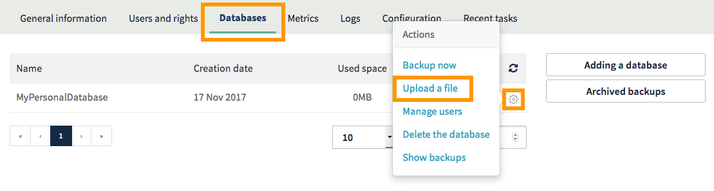{.thumbnail}

On the window that opens, tick the `Import a new file`{.action} box, then click `Next`{.action}.

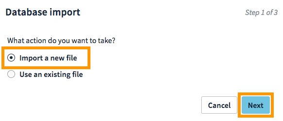{.thumbnail}

#### Step 2: select and send the backup file

Enter a filename (which you can use to identify this backup at a later date if you wish to restore it again), then next to **File (.gz)**, select the database backup file on your computer, then click `Send`{.action}.

Wait until the interface confirms that the file has been sent successfully, then click `Next`{.action}.

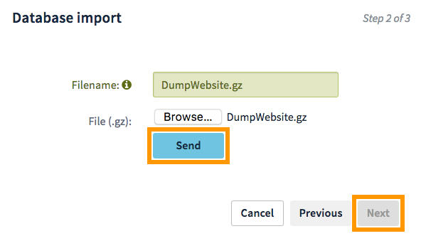{.thumbnail}

#### Step 3: launch the database importation

Finally, you can choose whether or not to apply the additional options displayed:

- **Clear the current database**: by ticking this box, the content currently stored in the database will be completely deleted, then replaced by your backup. In this case, assuming that the database is already empty, you can leave this box unticked.
- **Send an email when the import is complete**: by ticking this box, you will be sent an email notification when the database import is complete.

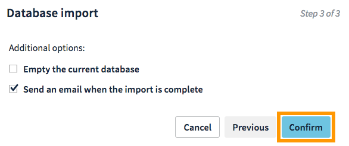{.thumbnail}

### Link your website to the database

Now that you have created your database and created one or several users with access to it, you simply need to link your website to the database. You can use several methods to do this, depending on your website, the CMS you are using (WordPress, Joomla! etc.), or the stage you are at if you are setting up a website.

No matter which method you choose to follow, you must have the following 5 pieces of information to hand to ensure that you do this successfully:

- **the database name**: the name you entered when you created your database
- **the username**: the name of the user you entered when you created the database, or the name of an additional user that you created at a later stage
- **the user password**: the password associated with the user, which was defined during the previous steps
- **server host name**: the server that needs to be entered for your website to be connected to your database. You can access this information in your Control Panel by going to the **Connections** section, then the `General information`{.action} tab
- **server port**: the port for connecting to your Private SQL instance, so that your website can connect to your database. You can access this information in your Control Panel by going to the **Connections** section, then the `General information`{.action} tab.

> [!warning]
>
> In some rare cases, the `port`{.action} field may not be available in your website’s configuration. If this is the case, you will need to add this field after your server’s host name, separating them with a *:* (e.g.: hostname:port).
>

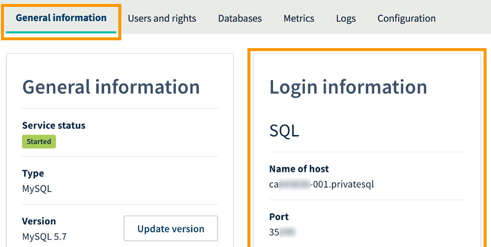{.thumbnail}

At this stage, you can finalise your website setup or database migration on your new SQL instance.

## Go further

Join our community of users on [https://community.ovh.com/en/](https://community.ovh.com/en/){.external}