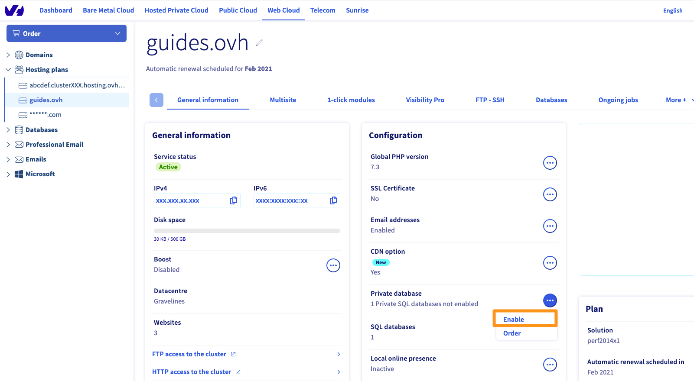

**Ostatnia aktualizacja dnia 2018-01-18**

## Wprowadzenie

Rozwiązanie Private SQL umożliwia korzystanie z instancji SQL, posiadającej dedykowane i zabezpieczone zasoby, która działa razem z hostingiem OVH. Usługa ta zapewnia większą wydajność i elastyczność zarządzania bazami danych. Skierowana jest ona do klientów mających szczególne wymagania.

**Zobacz, jak właściwie rozpocząć korzystanie z Private SQL.**

## Wymagania początkowe

- Posiadanie usługi Private SQL (zawartego w ofercie [pakiecie hostingowym](https://www.ovhcloud.com/pl/web-hosting/){.external} lub zakupionego w ramach [opcji SQL](https://www.ovhcloud.com/pl/web-hosting/options/start-sql/){.external}).
- Posiadanie [hostingu](https://www.ovhcloud.com/pl/web-hosting/){.external} znajdującego się w tym samym centrum danych co instancja Private SQL (informacja ta widoczna jest w Panelu klienta OVH).
- Dostęp do [Panelu klienta OVH](https://www.ovh.com/auth/?action=gotomanager&from=https://www.ovh.pl/&ovhSubsidiary=pl){.external}.

## W praktyce

### Włączenie prywatnego serwera SQL zawartego w ofercie hostingu

Jeśli Twój hosting zawiera opcję prywatnego serwera SQL, przejdź do [Panelu klienta OVHcloud](https://www.ovh.com/auth/?action=gotomanager&from=https://www.ovh.pl/&ovhSubsidiary=pl){.external}. W sekcji `Web Cloud`{.action} kliknij `Hosting`{.action} w kolumnie z lewej strony.

W zakładce `Informacje ogólne` w ramce `Konfiguracja` kliknij przycisk `...`{.action} po prawej stronie prywatnej **bazy danych**. Następnie kliknij przycisk `Aktywuj`{.action}, aby rozpocząć proces aktywacji.

{.thumbnail}

Aby sfinalizować operację, postępuj zgodnie z instrukcjami podanymi poniżej, aby określić typ i wersję Twojego prywatnego serwera SQL. Będzie on dostępny w kolumnie po lewej stronie w `bazie danych`{.action}.

### Ogólne informacje o instancji

Na pasku usług po lewej stronie [Panelu klienta](https://www.ovh.com/auth/?action=gotomanager&from=https://www.ovh.pl/&ovhSubsidiary=pl){.external} wybierz sekcję `Bazy danych`{.action}, a następnie określoną instancję SQL. Następnie wybierz zakładkę `Informacje ogólne`{.action}.

> [!primary]
>
> Nazwa Private SQL w Panelu klienta OVH może zostać wyświetlona na dwa sposoby:
>
> - albo zawiera ona część Twojego identyfikatora klienta i kończy się trzema cyframi (001 dla pierwszej zainstalowanej usługi Private SQL, 002 dla drugiej, itp.);
> - albo rozpoczyna się od *sqlprive-*, następnie zawiera część Twojego identyfikatora klienta i kończy się trzema cyframi (001 dla pierwszej zainstalowanej usługi SQL, 002 dla drugiej, itp.).
>

W Panelu klienta znajdują się ważne informacje dotyczące Twojej instancji SQL. Warto poświęcić kilka chwil, by upewnić się, że wyświetlane informacje są poprawne i odpowiadają poniższym wskazówkom.

|Informacje|Szczegóły|
|---|---|
|Status usługi| Pokazuje, czy instancja jest już uruchomiona, jest ponownie uruchamiana lub została zawieszona. Aby wykonywanie działań było możliwe, instancja musi być uruchomiona.|
|Typ| Pokazuje rodzaj systemu bazy danych wykorzystywanej przez serwer. Warto wiedzieć, że najczęściej wykorzystywanym typem jest „MySQL”, jednak istnieją również inne rodzaje systemów (PostgreSQL, MariaDB). Na przykład typ MySQL jest idealny dla stron opartych na systemie WordPress.|
|Wersja| Pokazuje wersję systemu bazy danych wykorzystywanej przez serwer. Należy sprawdzić kompatybilność strony internetowej z wybraną wersją.|
|RAM| Pokazuje dostępną pamięć RAM, którą dysponuje Twoja instancja, a także ewentualne przepełnienia pamięci. Twoja instancja Private SQL posiada dedykowane i zabezpieczone zasoby, które stanowią pamięć RAM. Jeżeli zachodzi taka potrzeba, możesz rozbudowywać tę pamięć i otrzymywać powiadomienia w przypadku wykorzystania wszystkich zasobów pamięci Twojej instancji.|
|Infrastruktura| Pokazuje infrastrukturę wykorzystywaną przez Twoją instancję. Jest to rodzaj technologii wykorzystanej w infrastrukturze OVH.|
|Data center| Pokazuje centrum danych, w którym została utworzona instancja. Upewnij się, że instancja i hosting, na którym znajduje się lub będzie się znajdować Twoja strona, mają to samo centrum danych.|
|Host| Pokazuje serwer OVH, na którym została utworzona Twoja instancja. Jest to informacja powiązaną z infrastrukturą OVH i może ona być wykorzystywana w naszych powiadomieniach związanych z [prowadzonymi pracami konserwacyjnymi i modernizacyjnymi](http://travaux.ovh.net/){.external}.|

{.thumbnail}

### Tworzenie bazy danych

Wszelkie dane dotyczące Twojej strony internetowej (np. blog, komentarze) będą przechowywane w bazie danych.

Aby stworzyć swoją pierwszą bazę danych, wybierz zakładkę `Bazy danych`{.action}, a następnie opcję `Dodaj bazę danych`{.action}.

{.thumbnail}

W oknie, które się wyświetla możesz utworzyć użytkownika. Jest to konieczne, ponieważ użytkownik ten będzie mógł zalogować się do Twojej instancji, a dzięki uprawnieniom, które posiada będzie mógł wykonywać działania w Twojej bazie danych (np. odczytywać, wprowadzać lub usuwać dane).

Możesz więc utworzyć użytkownika w trakcie zakładania bazy danych poprzez zaznaczenie pola `Stwórz użytkownika`{.action}. Możesz też nie zaznaczać tego pola i utworzyć użytkownika w osobnym procesie. Zaznacz to pole, aby uzyskać łatwe i szybkie rozwiązanie.

Uzupełnij teraz wymagane informacje zgodnie z podanymi wskazówkami, a następnie kliknij `Zatwierdź`{.action}.

- **Nazwa bazy** (obowiązkowa): nazwa Twojej przyszłej bazy danych.
- **Nazwa użytkownika** (jeżeli nie zaznaczyłeś odpowiedniego pola, możesz pominąć ten etap): nazwa użytkownika, który będzie mógł zalogować się do twojej bazy danych i wykonywać działania.
- **Uprawnienia** (jeżeli nie zaznaczyłeś odpowiedniego pola, możesz pominąć ten etap): uprawnienia, które będzie posiadał użytkownik bazy danych. W przypadku standardowego użytkownika wybierz opcję `Administrator`{.action}. Istnieje możliwość zmiany uprawnień na późniejszym etapie.
- **Hasło**/**Potwierdź hasło** (jeżeli nie zaznaczyłeś odpowiedniego pola, możesz pominąć ten etap): wprowadź, a następnie potwierdź hasło.

> [!warning]
>
> Ze względów bezpieczeństwa zalecamy, by przestrzegać wyświetlonych zasad tworzenia nazw użytkowników i haseł
>

{.thumbnail}

### Tworzenie użytkownika(opcjonalnie)

Etap ten jest opcjonalny, jeżeli utworzono użytkownika w trakcie zakładania bazy danych w poprzednim procesie. W przypadku standardowego użytkowania wystarczy utworzyć jednego użytkownika. Jednak w przypadku bardziej specjalistycznego projektu może okazać się, że konieczne będzie utworzenie wielu użytkowników uprawnionych do korzystania z bazy danych. Na przykład jeden z użytkowników może być uprawniony do odczytywania i zapisywania danych, podczas gdy inny będzie mógł jedynie odczytywać informacje.

Jeżeli utworzyłeś już pierwszego użytkownika i jest on wystarczający dla Twojego projektu, możesz przejść do wykonania kolejnej czynności. Aby utworzyć użytkownika, kliknij zakładkę `Użytkownicy i uprawnienia`{.action}, a następnie przycisk `Dodaj użytkownika`{.action}.

{.thumbnail}

W oknie, które się wyświetla należy uzupełnić wymagane informacje zgodnie z podanymi wskazówkami, a następnie kliknąć `Zatwierdź`{.action}.

- **Nazwa użytkownika**: nazwa użytkownika, który będzie mógł się zalogować do Twojej instancji. Na kolejnym etapie możesz nadać mu uprawnienia do korzystania z Twojej bazy danych.
- **Hasło**/**Potwierdź hasło**: Wprowadź, a następnie potwierdź hasło.

> [!warning]
>
> Ze względów bezpieczeństwa zalecamy, by przestrzegać wyświetlonych zasad tworzenia nazw użytkowników i haseł.
>

{.thumbnail}

Po utworzeniu użytkownika, należy nadać mu uprawnienia umożliwiające przeprowadzanie działań w twojej bazie danych (np. odczytywanie, wprowadzanie lub usuwanie danych). W tym celu kliknij ikonę koła zębatego, a następnie `Zarządzanie uprawnieniami`{.action}.

{.thumbnail}

Na nowej stronie wybierz dane uprawnienia za pomocą kliknięcia. W przypadku standardowego użytkownika wybierz opcję `Administrator`{.action}.

{.thumbnail}

### Importowanie bazy danych (opcjonalnie)

Proces ten odbywa się wyłącznie w przypadku importowania kopii zapasowej istniejącej już bazy danych (jest on niezbędny, gdy przenosisz stronę na serwer OVH lub gdy przenosisz bazę danych do Twojej nowej instancji SQL). Jeżeli nie chcesz importować żadnej bazy danych, przejdź do następnego etapu.

Istnieje kilka sposobów na zaimportowanie bazy danych. Serwer OVH udostępnia w Panelu klienta narzędzie umożliwiające import. Skupimy się szczególnie na tym narzędziu. Aby zastosować inną metodę importu, zapoznaj się z następującymi dokumentami: dla [bazy danych MySQL lub MariaDB](https://docs.ovh.com/pl/hosting/prywatny_sql/){.external}; dla [bazy danych PostgreSQL](https://docs.ovh.com/pl/hosting/prywatny_sql/){.external}.

#### Etap 1: dostęp do opcji importowania bazy danych

Wybierz zakładkę `Bazy danych`{.action}, kliknij ikonę koła zębatego, a następnie `Zaimportuj plik`{.action}. 

{.thumbnail}

W oknie, które się wyświetla należy zaznaczyć pole `Zaimportuj nowy plik`{.action}, a następnie kliknąć `Dalej`{.action}.

{.thumbnail}

#### Etap 2: wybór i wysłanie kopii zapasowej

Wpisz nazwę pliku (która umożliwi później zidentyfikowanie kopii zapasowej, jeżeli będziesz chciał ją przywrócić), a następnie wybierz kopię zapasową bazy danych na swoim komputerze, znajdującą się obok **Plik (.gz)**, i kliknij `Wyślij`{.action}.

Zaczekaj aż pojawi się informacja, że plik został pomyślnie wysłany, następnie kliknij przycisk `Dalej`{.action}.

{.thumbnail}

#### Etap 3: rozpoczęcie importowania bazy danych

Na koniec zdecyduj czy chcesz wybrać dodatkowe opcje, które pojawią się na ekranie:

- **Usuń aktualną zawartość bazy danych**: zaznaczenie tego pola powoduje całkowite usunięcie aktualnej zawartości bazy danych, a następnie zastąpienie jej zawartością kopii zapasowej. Biorąc pod uwagę, że baza danych jest obecnie pusta, możesz nie zaznaczać tego pola;
- **Wyślij wiadomość e-mail po zakończeniu importu**: zaznaczenie tego pola spowoduje, że otrzymasz powiadomienie mailem po zakończeniu importu bazy danych.

{.thumbnail}

### Połączenie strony internetowej z bazą danych

Gdy baza danych jest już utworzona, a uprawnienia do niej przypisano jednemu lub wielu użytkownikom, musisz jedynie połączyć swoją stronę z bazą danych. Etap ten można przeprowadzić na wiele sposobów w zależności od strony internetowej lub systemu CMS, z którego korzystasz (WordPress, Joomla, itp.) lub od etapu, na którym się znajdujesz, w przypadku gdy tworzysz stronę internetową.

Aby wykonać tę czynność, musisz posiadać pięć wymienionych poniżej informacji:

- **nazwa bazy danych**: nazwa, która została nadana podczas tworzenia bazy danych;
- **nazwa użytkownika**: nazwa użytkownika, która została nadana podczas tworzenia bazy danych lub nazwa ewentualnego użytkownika dodatkowego;
- **hasło użytkownika**: hasło przypisane użytkownikowi, nadane podczas przeprowadzania ostatnich działań;
- **nazwa serwera**: nazwa serwera umożliwiającego Twojej stronie internetowej dostęp do bazy danych. Informacja ta znajduje się w Panelu klienta w rubryce **Połączenia**, dostępnej z poziomu zakładki `Informacje ogólne`{.action};
- **port serwera**: port połączenia z instancją prywatnego serwera SQL, umożliwiający dostęp twojej strony do bazy danych. Informacja ta znajduje się w panelu klienta w rubryce **Połączenia**, dostępnej z poziomu zakładki `Informacje ogólne`{.action}.

> [!warning]
>
> W rzadkich przypadkach może się zdarzyć, że konfiguracja Twojej strony nie zawiera pola **port**. W takim przypadku należy dodać to pole po nazwie serwera i oddzielić je za pomocą *:* (na przykład: nazwaserwera:port).
>

{.thumbnail}

Możesz dokończyć instalację swojej strony internetowej lub migrację bazy danych do nowej instancji SQL.

## Sprawdź również

[Wszystko o prywatnym serwerze SQL](https://docs.ovh.com/pl/hosting/prywatny_sql/){.external}

Przyłącz się do społeczności naszych użytkowników na stronie <https://community.ovh.com/en/>.
